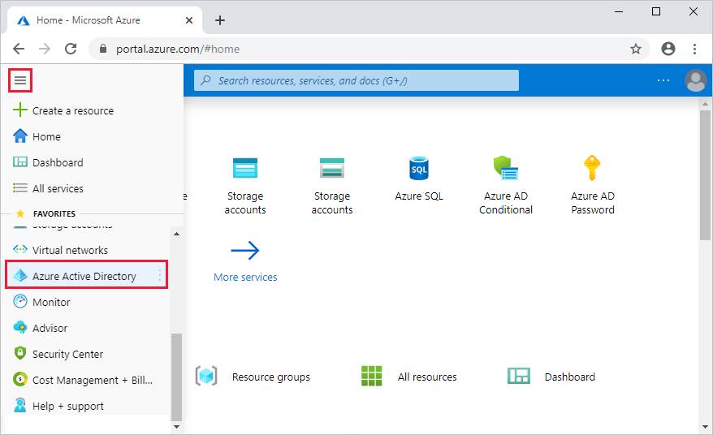
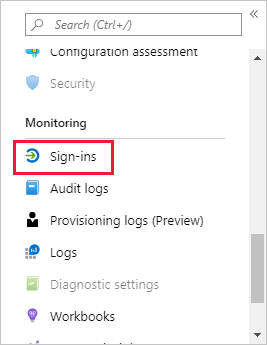
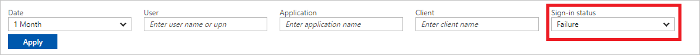
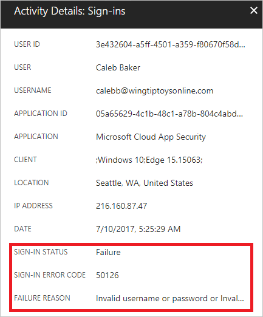

# Sign-in activity report error codes 

With the information provided by the [user sign-ins report](concept-sign-ins.md), you find answers to questions such as:

- Who signed in to my application?
- Which applications were signed in to?
- Which sign-ins failed and why?

When a sign-in fails, you will see an error code corresponding to the failure. This article lists the error codes and their descriptions, along with a suggested course of action where applicable. 

## How can I display failed sign-ins? 

On the [Azure portal](https://portal.azure.com) menu, select **Azure Active Directory**, or search for and select **Azure Active Directory** from any page.

Under **Monitoring**, select **Sign-ins** to open the [Sign-ins report](https://portal.azure.com/#blade/Microsoft_AAD_IAM/ActiveDirectoryMenuBlade/SignIns).

Filter the report to display all failed sign-ins by selecting **Failure** from the **Sign-in status** drop-down box.

Selecting an item from the filtered list opens the **Activity Details: Sign-ins** blade. This view provides you with additional information about the failed sign-in event, including the **sign-in error code** and **failure reason**.

You can also programmatically access the sign-in data using the [reporting API](concept-reporting-api.md).

## Error codes

|Error|Description|
|---|---|
|16000|This is an internal implementation detail and not an error condition. You can safely ignore this reference.|
|20001|There is an issue with your federated Identity Provider. Contact your IDP to resolve this issue.|
|20012|There is an issue with your federated Identity Provider. Contact your IDP to resolve this issue.|
|20033|There is an issue with your federated Identity Provider. Contact your IDP to resolve this issue.|
|40008|There is an issue with your federated Identity Provider. Contact your IDP to resolve this issue.|
|40009|There is an issue with your federated Identity Provider. Contact your IDP to resolve this issue.|
|40014|There is an issue with your federated Identity Provider. Contact your IDP to resolve this issue.|
|50000|There is an issue with our sign-in service. [Open a support ticket](../fundamentals/active-directory-troubleshooting-support-howto.md) to resolve this issue.|
|50001|The service principal name was not found in this tenant. This can happen if the application has not been installed by the administrator of the tenant, or if the resource principal was not found in the directory or is invalid.|
|50002|Sign-in failed due to restricted proxy access on tenant. If it's your own tenant policy, you can change your restricted tenant settings to fix this issue.|
|50003|Sign-in failed due to missing signing key or certificate. This might be because there was no signing key configured in the application. Check out the resolutions outlined at [https://docs.microsoft.com/azure/active-directory/application-sign-in-problem-federated-sso-gallery#certificate-or-key-not-configured](https://docs.microsoft.com/azure/active-directory/application-sign-in-problem-federated-sso-gallery#certificate-or-key-not-configured). If the issue persists, contact the application owner or the application administrator.|
|50005|User tried to login to a device from a platform that's currently not supported through Conditional Access policy.|
|50006| Signature verification failed due to invalid signature. Check out the resolution outlined at [https://docs.microsoft.com/azure/active-directory/application-sign-in-problem-federated-sso-gallery](https://docs.microsoft.com/azure/active-directory/application-sign-in-problem-federated-sso-gallery). If the issue persists, contact the application owner or application administrator.|
|50007|Partner encryption certificate was not found for this application. [Open a support ticket](../fundamentals/active-directory-troubleshooting-support-howto.md) with Microsoft to get this fixed.|
|50008|SAML assertion is missing or misconfigured in the token. Contact your federation provider.|
|50010|Audience URI validation for the application failed since no token audiences were configured. Contact the application owner for resolution.|
|50011|The reply address is missing, misconfigured, or does not match reply addresses configured for the application. Try the resolution listed at [https://docs.microsoft.com/azure/active-directory/application-sign-in-problem-federated-sso-gallery#the-reply-address-does-not-match-the-reply-addresses-configured-for-the-application](https://docs.microsoft.com/azure/active-directory/application-sign-in-problem-federated-sso-gallery#the-reply-address-does-not-match-the-reply-addresses-configured-for-the-application). If the issue persists, contact the application owner or application administrator.|
|50012| This is a generic error message that indicates that authentication failed. This can happen for reasons such as missing or invalid credentials or claims in the request. Ensure that the request is sent with the correct credentials and claims. |
|50013|Assertion is invalid because of various reasons. For instance, the token issuer doesn't match the api version within its valid time range, the token is expired or malformed, or the refresh token in the assertion is not a primary refresh token.|
|50017|Certification validation failed, reasons for the following reasons:<ul><li>Cannot find issuing certificate in trusted certificates list</li><li>Unable to find expected CrlSegment</li><li>Cannot find issuing certificate in trusted certificates list</li><li>Delta CRL distribution point is configured without a corresponding CRL distribution point</li><li>Unable to retrieve valid CRL segments due to timeout issue</li><li>Unable to download CRL</li></ul>Contact the tenant administrator.|
|50020|The user is unauthorized for one of the following reasons.<ul><li>The user is attempting to login with an MSA account with the v1 endpoint</li><li>The user doesn't exist in the tenant.</li></ul> Contact the application owner.|
|50027|Invalid JWT token due to the following reasons:<ul><li>doesn't contain nonce claim, sub claim</li><li>subject identifier mismatch</li><li>duplicate claim in idToken claims</li><li>unexpected issuer</li><li>unexpected audience</li><li>not within its valid time range </li><li>token format is not proper</li><li>External ID token from issuer failed signature verification.</li></ul>Contact the application owner|
|50029|Invalid URI - domain name contains invalid characters. Contact the tenant administrator.|
|50034|User does not exist in directory. Contact your tenant administrator.|
|50042|The salt required to generate a pairwise identifier is missing in principle. Contact the tenant administrator.|
|50048|Subject mismatches Issuer claim in the client assertion. Contact the tenant administrator.|
|50050|Request is malformed. Contact the application owner.|
|50053|Account is locked because the user tried to sign in too many times with an incorrect user ID or password.|
|50055|Invalid password, entered expired password.|
|50056|Invalid or null password - Password does not exist in store for this user.|
|50057|User account is disabled. The account has been disabled by an administrator.|
|50058|The application tried to perform a silent sign in and the user could not be silently signed in. The application needs to start an interactive flow giving users an option to sign-in. Contact application owner.|
|50059|User does not exist in directory. Contact your tenant administrator.|
|50061|Sign-out request is invalid. Contact the application owner.|
|50072|User needs to enroll for two-factor authentication (interactive).|
|50074|User did not pass the MFA challenge.|
|50076|User did not pass the MFA challenge (non interactive).|
|50078|The presented multi-factor authentication has expired, you must refresh your multi-factor authentication to access.|
|50079|User needs to enroll for two factor authentication (non-interactive logins).|
|50085|Refresh token needs social IDP login. Have user try signing-in again with their username and password.|
|50089|Flow token expired - Authentication failed. Have user try signing-in again with their username and password|
|50097|Device Authentication Required. This could occur because the DeviceId or DeviceAltSecId claims are **null**, or if no device corresponding to the device identifier exists.|
|50099|JWT signature is invalid. Contact the application owner.|
|50105|The signed in user is not assigned to a role for the signed in application. Assign the user to the application. For more information: [https://docs.microsoft.com/azure/active-directory/application-sign-in-problem-federated-sso-gallery#user-not-assigned-a-role](https://docs.microsoft.com/azure/active-directory/application-sign-in-problem-federated-sso-gallery#user-not-assigned-a-role)|
|50107|Requested federation realm object does not exist. Contact the tenant administrator.|
|50120|Issue with JWT header. Contact the tenant administrator.|
|50124|Claims Transformation contains invalid input parameter. Contact the tenant administrator to update the policy.|
|50125|Sign-in was interrupted due to a password reset or password registration entry.|
|50126|Invalid username or password, or invalid on-premises username or password.|
|50127|User needs to install a broker application to gain access to this content.|
|50128|Invalid domain name - No tenant-identifying information found in either the request or implied by any provided credentials.|
|50129|Device is not workplace joined - **Workplace join** is required to register the device.|
|50130|Claim value cannot be interpreted as known auth method.|
|50131|Used in various Conditional Access errors. E.g. Bad Windows device state, request blocked due to suspicious activity, access policy, and security policy decisions.|
|50132|Credentials have been revoked due to the following reasons:<ul><li>SSO Artifact is invalid or expired</li><li>Session not fresh enough for application</li><li>A silent sign-in request was sent but the user's session with Azure AD is invalid or has expired.</li></ul>|
|50133|Session is invalid due to expiration or recent password change.|
|50135|Password change is required due to account risk.|
|50136|Redirect MSA session to application - Single MSA session detected. |
|50140|This error occurred due to "Keep me signed in" interrupt when the user was signing-in. [Open a support ticket](../fundamentals/active-directory-troubleshooting-support-howto.md) with Correlation ID, Request ID, and Error code to get more details. |
|50143|Session mismatch - Session is invalid because user tenant does not match the domain hint due to different resource. [Open a support ticket](../fundamentals/active-directory-troubleshooting-support-howto.md) with Correlation ID, Request ID, and Error code to get more details.|
|50144|User's Active Directory password has expired. Generate a new password for the user or have the end user using self-service reset tool.|
|50146|This application is required to be configured with an application-specific signing key. It is either not configured with one, or the key has expired or is not yet valid. Contact the application owner.|
|50148|The code_verifier does not match the code_challenge supplied in the authorization request for PKCE. Contact the application developer. |
|50155|Device authentication failed for this user.|
|50158|External security challenge was not satisfied.|
|50161|Claims sent by external provider is not sufficient, or missing claim requested to external provider.|
|50166|Failed to send request to claims provider.|
|50169|The realm is not a configured realm of the current service namespace.|
|50172|External claims provider is not approved. Contact the tenant administrator|
|50173|Fresh auth token is needed. Have the user sign-in again using fresh credentials.|
|50177|External challenge is not supported for passthrough users.|
|50178|Session Control  is not supported for passthrough users.|
|50180|Windows Integrated authentication is needed. Enable the tenant for Seamless SSO.|
|50181|OTP related failure during sign-in. |
|50201|This message prompt interrupt will be shown to the user during login when additional information should be provided to user.|
|51001|Domain Hint is not present with On-Premises Security Identifier - On-Premises UPN.|
|51004|User account doesn’t exist in the directory.|
|51006|Windows Integrated authentication is needed. User logged in using session token that is missing via claim. Request the  user to re-login.|
|52004|User has not provided consent for access to LinkedIn resources. |
|53000|Conditional Access policy requires a compliant device, and the device is not compliant. Have the user enroll their device with an approved MDM provider like Intune.|
|53001|Conditional Access policy requires a domain joined device, and the device is not domain joined. Have the user use a domain joined device.|
|53002|Application used is not an approved application for Conditional Access. User needs to use one of the apps from the list of approved applications to use in order to get access.|
|53003|Access has been blocked due to Conditional Access policies.|
|53004|User needs to complete Multi-factor authentication registration process before accessing this content. User should register for multi-factor authentication.|
|65001|Application X doesn't have permission to access application Y or the permission has been revoked. Or The user or administrator has not consented to use the application with ID X. Send an interactive authorization request for this user and resource. Or The user or administrator has not consented to use the application with ID X. Send an authorization request to your tenant admin to act on behalf of the App : Y for Resource : Z.|
|65004|User declined to consent to access the app. Have the user retry the sign-in and consent to the app|
|65005|The application required resource access list does not contain applications discoverable by the resource or The client application has requested access to resource, which was not specified in its required resource access list or Graph service returned bad request or resource not found. If the application supports SAML, you may have configured the application with the wrong Identifier (Entity). Try out the resolution listed for SAML using the link below: [https://docs.microsoft.com/azure/active-directory/application-sign-in-problem-federated-sso-gallery?/?WT.mc_id=DMC_AAD_Manage_Apps_Troubleshooting_Nav#no-resource-in-requiredresourceaccess-list](https://docs.microsoft.com/azure/active-directory/application-sign-in-problem-federated-sso-gallery?/?WT.mc_id=DMC_AAD_Manage_Apps_Troubleshooting_Nav)|
|70000|Invalid grant due to the following reasons:<ul><li>Requested SAML 2.0 assertion has invalid Subject Confirmation Method</li><li>App OnBehalfOf flow is not supported on V2</li><li>Primary refresh token is not signed with session key</li><li>Invalid external refresh token</li><li>The access grant was obtained for a different tenant.</li></ul>|
|70001|The application named X was not found in the tenant named Y. This can happen if the application with identifier X has not been installed by the administrator of the tenant or consented to by any user in the tenant. You might have misconfigured the Identifier value for the application or sent your authentication request to the wrong tenant.|
|70002|The application returned invalid client credentials. Contact the application owner.|
|70003|The application returned an unsupported grant type. Contact the application owner.|
|70004|The application returned an invalid redirect URI. The redirect address specified by the client does not match any configured addresses or any addresses on the OIDC approve list. Contact the application owner.|
|70005|The application returned an unsupported response type due to the following reasons:<ul><li>response type 'token' is not enabled for the application</li><li>response type 'id_token' requires the 'OpenID' scope -contains an unsupported OAuth parameter value in the encoded wctx</li></ul>Contact the application owner.|
|70007|The application returned an unsupported value of 'response_mode' when requesting a token. Contact the application owner.|
|70008|The provided authorization code or refresh token is expired or has been revoked. Have the user retry signing in.|
|70011|The scope requested by the application is invalid. Contact the application owner.|
|70012|A server error occurred while authenticating an MSA (consumer) user. Retry the sign-in, and if the issue persists, [open a support ticket](../fundamentals/active-directory-troubleshooting-support-howto.md) |
|70018|Invalid verification code due to User typing in wrong user code for device code flow. Authorization is not approved.|
|70019|Verification code expired. Have the user retry the sign-in.|
|70037|Incorrect challenge response provided. Remote auth session denied.|
|70043|Azure Conditional Access session management forces the session to expire|
|70044|Azure Conditional Access session management forces the session to expire|
|75001|An error occurred during SAML message binding.|
|75003|The application returned an error related to unsupported Binding (SAML protocol response cannot be sent via bindings other than HTTP POST). Contact the application owner.|
|75005|Azure AD doesn’t support the SAML Request sent by the application for Single Sign-on. Contact the application owner.|
|75008|The request from the application was denied since the SAML request had an unexpected destination. Contact the application owner.|
|75011|Authentication method by which the user authenticated with the service doesn't match requested authentication method. Contact the application owner.|
|75016|SAML2 Authentication Request has invalid NameIdPolicy. Contact the application owner.|
|80001|Authentication Agent unable to connect to Active Directory. Make sure the authentication agent is installed on a domain-joined machine that has line of sight to a DC that can serve the user's login request.|
|80002|Internal error. Password validation request timed out. We were unable to either send the authentication request to the internal Hybrid Identity Service. [Open a support ticket](../fundamentals/active-directory-troubleshooting-support-howto.md) to get more details on the error.|
|80003|Invalid response received by Authentication Agent. An unknown error occurred while attempting to authentication against Active Directory on-premises. [Open a support ticket](../fundamentals/active-directory-troubleshooting-support-howto.md) to get more details on the error.|
|80005|Authentication Agent: An unknown error occurred while processing the response from the Authentication Agent. [Open a support ticket](../fundamentals/active-directory-troubleshooting-support-howto.md) to get more details on the error.|
|80007|Authentication Agent unable to validate user's password.|
|80010|Authentication Agent unable to decrypt password. |
|80011|Authentication Agent unable to retrieve encryption key.|
|80012|The users attempted to log on outside of the allowed hours (this is specified in AD).|
|80013|The authentication attempt could not be completed due to time skew between the machine running the authentication agent and AD. Fix time sync issues|
|80014|Authentication agent timed out. [Open a support ticket](../fundamentals/active-directory-troubleshooting-support-howto.md) with the error code, correlation ID, and Datetime to get more details on this error.|
|81001|User's Kerberos ticket is too large. This can happen if the user is in too many groups and thus the Kerberos ticket contains too many group memberships. Reduce the user's group memberships and try again.|
|81005|Authentication Package Not Supported.|
|81007|Tenant is not enabled for Seamless SSO.|
|81012|This is not an error condition. It indicates that user trying to sign in to Azure AD is different from the user signed into the device. You can safely ignore this code in the logs.|
|90010|The request is not supported for various reasons. For example, the request is made using an unsupported request method (only POST method is supported) or the token signing algorithm that was requested is not supported. Contact the application developer.|
|90014| A required field for a protocol message was missing, contact the application owner. If you are the application owner, ensure that you have all the necessary parameters for the login request. |
|90051|	Invalid Delegation Token. Invalid national Cloud ID ({cloudId}) is specified.|
|90072| The account needs to be added as an external user in the tenant first. Sign-out and sign-in again with a different Azure AD account.|
|90094| The app has requested permissions which the signed-in user is not allowed to consent to, and the user was blocked. |
|90095| The app has requested permissions which the signed-in user is not allowed to consent to, and the user was shown the [admin consent request](../manage-apps/configure-admin-consent-workflow.md) form. |
|500011| The resource principal named <site address> was not found in the tenant named <tenant ID>. This can happen if the application has not been installed by the administrator of the tenant or consented to by any user in the tenant. You might have sent your authentication request to the wrong tenant.|
|500021| Tenant is restricted by company proxy. Denying the resource access.|
|500121| Authentication failed during strong authentication request.|
|500133| The assertion is not within its valid time range. Ensure that the access token is not expired before using it for user assertion, or request a new token.|
|530021|Application does not meet the Conditional Access approved app requirements.|
|530032|Blocked by security policy.| 
|700016|Application with identifier '{appIdentifier}' was not found in the directory '{tenantName}'. This can happen if the application has not been installed by the administrator of the tenant or consented to by any user in the tenant. You may have sent your authentication request to the wrong tenant.|
|900432|Confidential Client is not supported in Cross Cloud request.|
|5000811|Unable to verify SAML token signature. The signing key identifier does not match any valid registered keys.|
|7000215|Invalid client secret was provided.|
|7000218|The request body must contain the following parameter: 'client_assertion' or 'client_secret'.|

## Next steps

* [Sign-ins reports overview](concept-sign-ins.md)
* [Programmatic access to Azure AD reports](concept-reporting-api.md)
