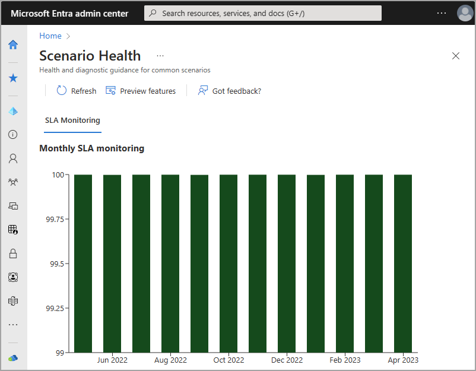

# Microsoft Entra SLA performance 

As an identity admin, you may need to track the Microsoft Entra service-level agreement (SLA) performance to make sure Microsoft Entra ID can support your vital apps. This article shows how the Microsoft Entra service has performed according to the [SLA for Microsoft Entra ID](https://azure.microsoft.com/support/legal/sla/active-directory/v1_1/). 

You can use this article in discussions with app or business owners to help them understand the performance they can expect from Microsoft Entra ID. 

## Service availability commitment 

Microsoft offers Premium Microsoft Entra customers the opportunity to get a service credit if Microsoft Entra ID fails to meet the documented SLA. When you request a service credit, Microsoft evaluates the SLA for your specific tenant; however, this global SLA can give you an indication of the general health of Microsoft Entra ID over time. 

The SLA covers the following scenarios that are vital to businesses:

- **User authentication:** Users are able to sign in to the Microsoft Entra service.

- **App access:** Microsoft Entra ID successfully emits the authentication and authorization tokens required for users to sign in to applications connected to the service.

For full details on SLA coverage and instructions on requesting a service credit, see the [SLA for Microsoft Entra ID](https://azure.microsoft.com/support/legal/sla/active-directory/v1_1/).

## No planned downtime 

You rely on Microsoft Entra ID to provide identity and access management for your vital systems. To ensure Microsoft Entra ID is available when business operations require it, Microsoft doesn't plan downtime for Microsoft Entra system maintenance. Instead, maintenance is performed as the service runs, without customer impact. 

## Recent worldwide SLA performance 

To help you plan for moving workloads to Microsoft Entra ID, we publish past SLA performance. These numbers show the level at which Microsoft Entra ID met the requirements in the [SLA for Microsoft Entra ID](https://azure.microsoft.com/support/legal/sla/active-directory/v1_1/), for all tenants. 

The SLA attainment is truncated at three places after the decimal. Numbers aren't rounded up, so actual SLA attainment is higher than indicated. 

| Month     | 2021    | 2022    | 2023    |
| ---       | ---     | ---     | ---     |
| January   |         | 99.998% | 99.998% |
| February  | 99.999% | 99.999% | 99.999% |
| March     | 99.568% | 99.998% | 99.999% |
| April     | 99.999% | 99.999% | 99.999% |
| May       | 99.999% | 99.999% | 99.999% |
| June      | 99.999% | 99.999% | 99.999% |
| July      | 99.999% | 99.999% | 99.999% |
| August    | 99.999% | 99.999% | 99.999% |
| September | 99.999% | 99.998% | 99.999%|
| October   | 99.999% | 99.999% | |
| November  | 99.998% | 99.999% | |
| December  | 99.978% | 99.999% | |

### How is Microsoft Entra SLA measured? 

The Microsoft Entra SLA is measured in a way that reflects customer authentication experience, rather than simply reporting on whether the system is available to outside connections. This distinction means that the calculation is based on if:

- Users can authenticate 
- Microsoft Entra ID successfully issues tokens for target apps after authentication
  
The numbers in the table are a global total of Microsoft Entra authentications across all customers and geographies. 
  
## Incident history 

All incidents that seriously impact Microsoft Entra performance are documented in the [Azure status history](https://azure.status.microsoft/status/history/). Not all events documented in Azure status history are serious enough to cause Microsoft Entra ID to go below its SLA. You can view information about the impact of incidents, and a root cause analysis of what caused the incident and what steps Microsoft took to prevent future incidents. 

## Tenant-level SLA (preview)

In addition to providing global SLA performance, Microsoft Entra ID now provides tenant-level SLA performance. This feature is currently in preview.

To access your tenant-level SLA performance:

1. Navigate to the [Microsoft Entra admin center](https://entra.microsoft.com) using the Reports Reader role (or higher).
1. Browse to **Identity** > **Monitoring & health** > **Scenario Health** from the side menu.
1. Select the **SLA Monitoring** tab.
1. Hover over the graph to see the SLA performance for that month.

## Next steps

* [Microsoft Entra monitoring and health overview](overview-monitoring-health.md)
* [Programmatic access to Microsoft Entra reports](./howto-configure-prerequisites-for-reporting-api.md)
* [Microsoft Entra ID risk detections](../identity-protection/overview-identity-protection.md)

