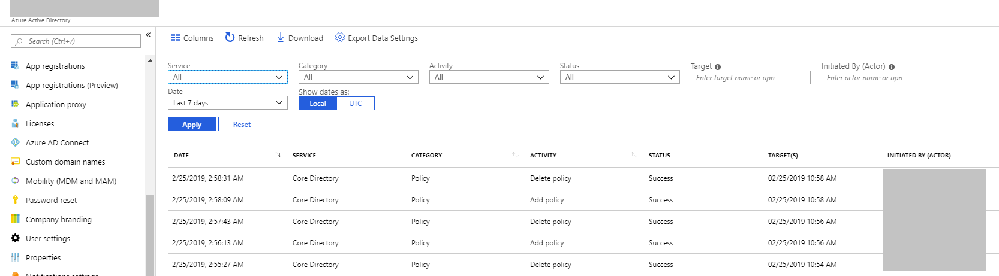
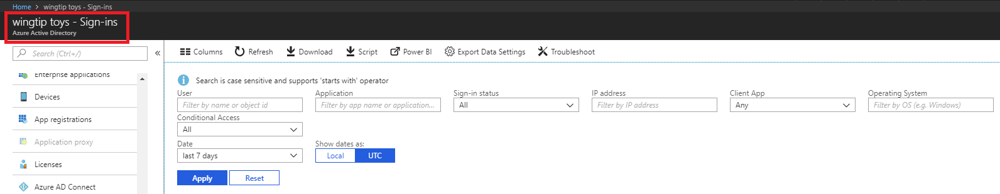
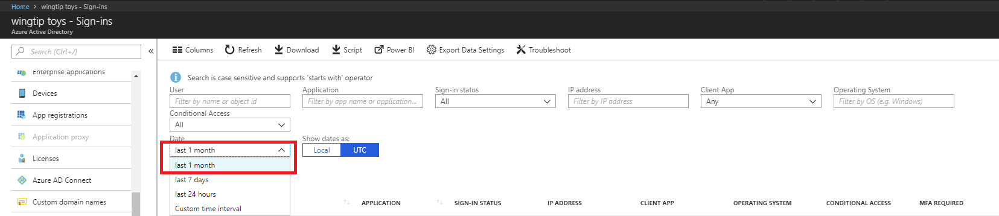

---

title: 'Troubleshoot Missing data in activity logs  | Microsoft Docs'
description: Provides you with a resolution to missing data in Azure Active Directory activity logs.
services: active-directory
documentationcenter: ''
author: MarkusVi
manager: daveba
editor: ''

ms.assetid: 7cbe4337-bb77-4ee0-b254-3e368be06db7
ms.service: active-directory
ms.devlang: na
ms.topic: conceptual
ms.tgt_pltfrm: na
ms.workload: identity
ms.subservice: report-monitor
ms.date: 01/15/2018
ms.author: markvi
ms.reviewer: dhanyahk

ms.collection: M365-identity-device-management
---

# Troubleshoot: Missing data in the Azure Active Directory activity logs 

## I can't find audit logs for recent actions in the Azure portal

### Symptoms

I performed some actions in the Azure portal and expected to see the audit logs for those actions in the `Activity logs > Audit Logs` blade, but I can’t find them.

 
 
### Cause

Actions don’t appear immediately in the activity logs. The table below enumerates our latency numbers for activity logs. 

| Report | &nbsp; | Latency (P95) | Latency (P99) |
|--------|--------|---------------|---------------|
| Directory audit | &nbsp; | 2 mins | 5 mins |
| Sign-in activity | &nbsp; | 2 mins | 5 mins | 

### Resolution

Wait for 15 minutes to two hours and see if the actions appear in the log. If you don’t see the logs even after two hours, please [file a support ticket](https://portal.azure.com/#blade/Microsoft_Azure_Support/HelpAndSupportBlade/newsupportrequest) and we will look into it.

## I can’t find recent user sign-ins in the Azure Active Directory sign-ins activity log

### Symptoms

I recently signed into the Azure portal and expected to see the sign-in logs for those actions in the `Activity logs > Sign-ins` blade, but I can’t find them.

 
 
### Cause

Actions don’t appear immediately in the activity logs. The table below enumerates our latency numbers for activity logs. 

| Report | &nbsp; | Latency (P95) | Latency (P99) |
|--------|--------|---------------|---------------|
| Directory audit | &nbsp; | 2 mins | 5 mins |
| Sign-in activity | &nbsp; | 2 mins | 5 mins | 

### Resolution

Wait for 15 minutes to two hours and see if the actions appear in the log. If you don’t see the logs even after two hours, please [file a support ticket](https://portal.azure.com/#blade/Microsoft_Azure_Support/HelpAndSupportBlade/newsupportrequest) and we will look into it.

## I can't view more than 30 days of report data in the Azure portal

### Symptoms

I can't view more than 30 days of sign-in and audit data from the Azure portal. Why? 

 

### Cause

Depending on your license, Azure Active Directory Actions stores activity reports for the following durations:

| Report           | &nbsp; |  Azure AD Free | Azure AD Premium P1 | Azure AD Premium P2 |
| ---              | ----   |  ---           | ---                 | ---                 |
| Directory Audit  | &nbsp; |	7 days	   | 30 days             | 30 days             |
| Sign-in Activity | &nbsp; | Not available. You can access your own sign-ins for 7 days from the individual user profile blade | 30 days | 30 days             |

For more information, see [Azure Active Directory report retention policies](reference-reports-data-retention.md).  

### Resolution

You have two options to retain the data for longer than 30 days. You can use the [Azure AD Reporting APIs](concept-reporting-api.md) to retrieve the data programmatically and store it in a database. Alternatively, you can integrate audit logs into a third party SIEM system like Splunk or SumoLogic.

## Next steps

* [Azure AD reporting retention](reference-reports-data-retention.md).
* [Azure Active Directory reporting latencies](reference-reports-latencies.md).
* [Azure Active Directory reporting FAQ](reports-faq.md).

