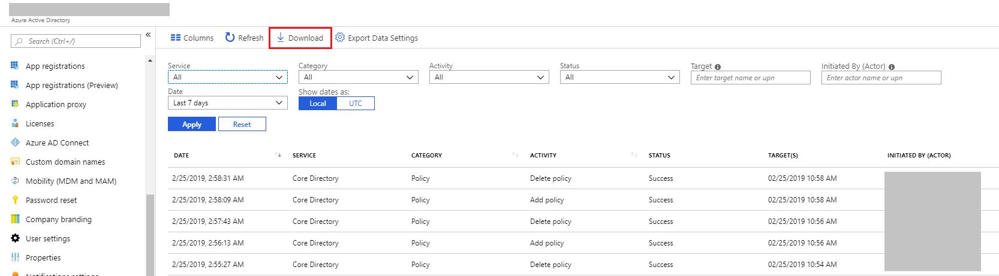

---

title: 'Troubleshooting: Missing data in the downloaded activity logs | Microsoft Docs'
description: Provides you with a resolution to missing data in downloaded Azure Active Directory activity logs.
services: active-directory
documentationcenter: ''
author: MarkusVi
manager: daveba
editor: ''

ms.assetid: ffce7eb1-99da-4ea7-9c4d-2322b755c8ce
ms.service: active-directory
ms.devlang: na
ms.topic: troubleshooting
ms.tgt_pltfrm: na
ms.workload: identity
ms.subservice: report-monitor
ms.date: 11/13/2018
ms.author: markvi
ms.reviewer: dhanyahk

ms.collection: M365-identity-device-management
---

# I can’t find all the data in the Azure Active Directory activity logs I downloaded

## Symptoms

I downloaded the activity logs (audit or sign-ins) and I don’t see all the records for the time I chose. Why? 

 
 
## Cause

When you download activity logs in the Azure portal, we limit the scale to 250,000 records, sorted by most recent first. 

## Resolution

You can leverage [Azure AD Reporting APIs](concept-reporting-api.md) to fetch up to a million records at any given point.

## Next steps

* [Azure Active Directory reports FAQ](reports-faq.md)

