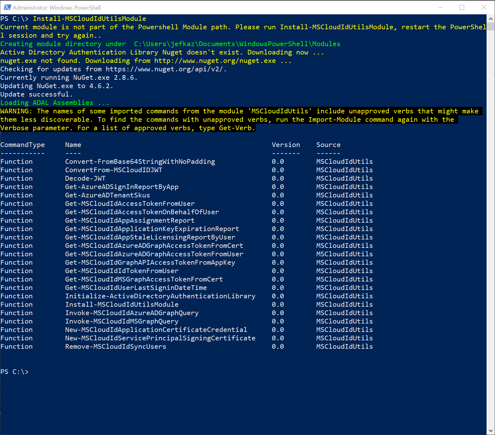
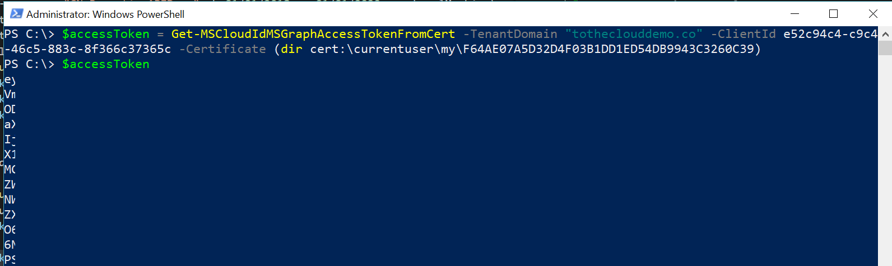
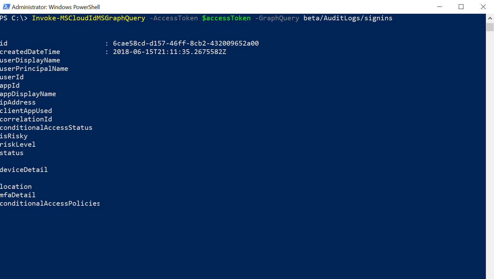

# Tutorial: Get data using the Azure Active Directory reporting API with certificates

The [Azure Active Directory (Azure AD) reporting APIs](concept-reporting-api.md) provide you with programmatic access to the data through a set of REST-based APIs. You can call these APIs from a variety of programming languages and tools. If you want to access the Azure AD Reporting API without user intervention, you must configure your access to use certificates.

In this tutorial, you learn how to use a test certificate to access the MS Graph API for reporting. We don't recommend using test certificates in a production environment. 

## Prerequisites

1. To access sign-in data, make sure you have an Azure Active Directory tenant with a premium (P1/P2) license. See [Getting started with Azure Active Directory Premium](../fundamentals/active-directory-get-started-premium.md) to upgrade your Azure Active Directory edition. Note that if you did not have any activities data prior to the upgrade, it will take a couple of days for the data to show up in the reports after you upgrade to a premium license. 

2. Create or switch to a user account in the **global administrator**, **security administrator**, **security reader** or **report reader** role for the tenant. 

3. Complete the [prerequisites to access the Azure Active Directory reporting API](howto-configure-prerequisites-for-reporting-api.md). 

4. Download and install [Azure AD PowerShell V2](https://github.com/Azure/azure-docs-powershell-azuread/blob/master/docs-conceptual/azureadps-2.0/install-adv2.md).

5. Install [MSCloudIdUtils](https://www.powershellgallery.com/packages/MSCloudIdUtils/). This module provides several utility cmdlets including:
    - The ADAL libraries needed for authentication
    - Access tokens from user, application keys, and certificates using ADAL
    - Graph API handling paged results

6. If it's your first time using the module run **Install-MSCloudIdUtilsModule**, otherwise import it using the **Import-Module** PowerShell command. Your session should look similar to this screen:
    
  
7. Use the **New-SelfSignedCertificate** PowerShell commandlet to create a test certificate.

   ```
   $cert = New-SelfSignedCertificate -Subject "CN=MSGraph_ReportingAPI" -CertStoreLocation "Cert:\CurrentUser\My" -KeyExportPolicy Exportable -KeySpec Signature -KeyLength 2048 -KeyAlgorithm RSA -HashAlgorithm SHA256
   ```

8. Use the **Export-Certificate** commandlet to export it to a certificate file.

   ```
   Export-Certificate -Cert $cert -FilePath "C:\Reporting\MSGraph_ReportingAPI.cer"

   ```

## Get data using the Azure Active Directory reporting API with certificates

1. Navigate to the [Azure portal](https://portal.azure.com), select **Azure Active Directory**, then select **App registrations** and choose your application from the list. 

2. Select **Certificates & secrets** under **Manage** section on Application registration blade and select **Upload Certificate**.

3. Select the certificate file from the previous step and select **Add**. 

4. Note the Application ID, and the thumbprint of the certificate you just registered with your application. To find the thumbprint, from your application page in the portal, go to **Certificates & secrets** under **Manage** section. The thumbprint will be under the **Certificates** list.

5. Open the application manifest in the inline manifest editor and verify the *keyCredentials* property is updated with your new certificate information as shown below - 

   ```
   "keyCredentials": [
        {
            "customKeyIdentifier": "$base64Thumbprint", //base64 encoding of the certificate hash
            "keyId": "$keyid", //GUID to identify the key in the manifest
            "type": "AsymmetricX509Cert",
            "usage": "Verify",
            "value":  "$base64Value" //base64 encoding of the certificate raw data
        }
    ]
   ``` 
6. Now, you can get an access token for the MS Graph API using this certificate. Use the **Get-MSCloudIdMSGraphAccessTokenFromCert** cmdlet from the MSCloudIdUtils PowerShell module, passing in the Application ID and the thumbprint you obtained from the previous step. 

   

7. Use the access token in your PowerShell script to query the Graph API. Use the **Invoke-MSCloudIdMSGraphQuery** cmdlet from the MSCloudIDUtils to enumerate the signins and directoryAudits endpoint. This cmdlet handles multi-paged results, and sends those results to the PowerShell pipeline.

8. Query the directoryAudits endpoint to retrieve the audit logs. 
   

9. Query the signins endpoint to retrieve the sign-in logs.
    

10. You can now choose to export this data to a CSV and save to a SIEM system. You can also wrap your script in a scheduled task to get Azure AD data from your tenant periodically without having to store application keys in the source code. 

## Next steps

* [Get a first impression of the reporting APIs](concept-reporting-api.md)
* [Audit API reference](https://developer.microsoft.com/graph/docs/api-reference/beta/resources/directoryaudit) 
* [Sign-in activity report API reference](https://developer.microsoft.com/graph/docs/api-reference/beta/resources/signin)
