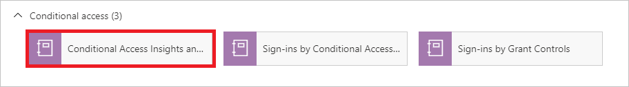

# Tutorial: Configure a log analytics workspace

In this tutorial, you learn how to:

> [!div class="checklist"]
> * Configure a Log Analytics workspace for your audit and sign-in logs
> * Run queries using the Kusto Query Language (KQL)
> * Create a custom workbook using the quickstart template
> * Add a query to an existing workbook template

## Prerequisites

To analyze activity logs with Log Analytics, you need:

- A Microsoft Entra tenant with a [Premium P1 license](../fundamentals/get-started-premium.md)
- A Log Analytics workspace *and* access to that workspace
- The appropriate roles for Azure Monitor *and* Microsoft Entra ID

Familiarize yourself with these articles:

- [Tutorial: Collect and analyze resource logs from an Azure resource](/azure/azure-monitor/essentials/tutorial-resource-logs)

- [How to integrate activity logs with Log Analytics](./howto-integrate-activity-logs-with-azure-monitor-logs.md)

- [Manage emergency access account in Microsoft Entra ID](../roles/security-emergency-access.md)

- [KQL quick reference](/azure/data-explorer/kusto/query/kql-quick-reference)

- [Azure Monitor Workbooks](/azure/azure-monitor/visualize/workbooks-overview)

## Configure Log Analytics

[!INCLUDE [portal updates](~/articles/active-directory/includes/portal-update.md)]

This procedure outlines how to configure a Log Analytics workspace for your audit and sign-in logs.
To configure a Log Analytics workspace you need to **create the workspace** and then **configure Diagnostic settings**.

### Create the workspace

1. Sign in to the [Azure portal](https://portal.azure.com) as at least a [Security Administrator](../roles/permissions-reference.md#security-administrator)

2. Browse to **Log Analytics workspaces**.

3. Select **Create**.

    

4.  On the **Create Log Analytics workspace** page, perform the following steps:

    1. Select your subscription.

    2. Select a resource group.
 
    3. Give your workspace a name.

    4. Select your region.

    

5. Select **Review + Create**.

    

6. Select **Create** and wait for the deployment. You may need to refresh the page to see the new workspace.

    

### Configure Diagnostic settings

To configure Diagnostic settings, you need switch to the Microsoft Entra admin center to send your identity log information to your new workspace.

1. Sign in to the [Microsoft Entra admin center](https://entra.microsoft.com) as at least a [Security Administrator](../roles/permissions-reference.md#security-administrator).

1. Browse to **Identity** > **Monitoring & health** > **Diagnostic settings**.

1. Select **Add diagnostic setting**.

    

1. On the **Diagnostic setting** page, perform the following steps:

    1. Under **Category details**, select **AuditLogs** and **SigninLogs**.

    1. Under **Destination details**, select **Send to Log Analytics**, and then select your new log analytics workspace. 
   
    3. Select **Save**. 

    

Your logs can now be queried using the Kusto Query Language (KQL) in Log Analytics. You may need to wait around 15 minutes for the logs to populate.

## Run queries in Log Analytics

This procedure shows how to run queries using the **Kusto Query Language (KQL)**.

### Run a query

1. Sign in to the [Microsoft Entra admin center](https://entra.microsoft.com) as at least a [Reports Reader](../roles/permissions-reference.md#reports-reader). 

1. Browse to **Identity** > **Monitoring & health** > **Log Analytics**.

1. In the **Search** textbox, type your query, and select **Run**. 

### KQL query examples

Take 10 random entries from the input data:

- `SigninLogs | take 10`

Look at the sign-ins where the Conditional Access was a success

- `SigninLogs | where ConditionalAccessStatus == "success" | project UserDisplayName, ConditionalAccessStatus` 

Count how many successes there have been

- `SigninLogs | where ConditionalAccessStatus == "success" | project UserDisplayName, ConditionalAccessStatus | count`

Aggregate count of successful sign-ins by user by day:

- `SigninLogs | where ConditionalAccessStatus == "success" | summarize SuccessfulSign-ins = count() by UserDisplayName, bin(TimeGenerated, 1d)` 

View how many times a user does a certain operation in specific time period:

- `AuditLogs | where TimeGenerated > ago(30d) | where OperationName contains "Add member to role" | summarize count() by OperationName, Identity`

Pivot the results on operation name

- `AuditLogs | where TimeGenerated > ago(30d) | where OperationName contains "Add member to role" | project OperationName, Identity | evaluate pivot(OperationName)`

Merge together Audit and Sign in Logs using an inner join:

- `AuditLogs |where OperationName contains "Add User" |extend UserPrincipalName = tostring(TargetResources[0].userPrincipalName) | |project TimeGenerated, UserPrincipalName |join kind = inner (SigninLogs) on UserPrincipalName |summarize arg_min(TimeGenerated, *) by UserPrincipalName |extend SigninDate = TimeGenerated` 

View number of signs ins by client app type:

- `SigninLogs | summarize count() by ClientAppUsed`

Count the sign ins by day:

- `SigninLogs | summarize NumberOfEntries=count() by bin(TimeGenerated, 1d)`

Take 5 random entries and project the columns you wish to see in the results:

- `SigninLogs | take 5 | project ClientAppUsed, Identity, ConditionalAccessStatus, Status, TimeGenerated `

Take the top 5 in descending order and project the columns you wish to see

- `SigninLogs | take 5 | project ClientAppUsed, Identity, ConditionalAccessStatus, Status, TimeGenerated `

Create a new column by combining the values to two other columns:

- `SigninLogs | limit 10 | extend RiskUser = strcat(RiskDetail, "-", Identity) | project RiskUser, ClientAppUsed`

## Create a custom workbook

This procedure shows how to create a new workbook using the quickstart template.

1. Sign in to the [Microsoft Entra admin center](https://entra.microsoft.com) as at least a [Reports Reader](../roles/permissions-reference.md#reports-reader).

1. Browse to **Identity** > **Monitoring & health** > **Workbooks**. 

1. In the **Quickstart** section, select **Empty**.

    

1. From the **Add** menu, select **Add text**.

    

1. In the textbox, enter `# Client apps used in the past week` and select **Done Editing**.

    

1. Below the text window, open the **Add** menu and select **Add query**.

    

1. In the query textbox, enter: `SigninLogs | where TimeGenerated > ago(7d) | project TimeGenerated, UserDisplayName, ClientAppUsed | summarize count() by ClientAppUsed`

1. Select **Run Query**.

    

1. In the toolbar, from the **Visualization** menu select **Pie chart**.

    

1. Select **Done Editing** at the top of the page.

1. Select the **Save** icon to save your workbook.

1. In the dialog box that appears, enter a title, select a Resource group, and select **Apply**.

## Add a query to a workbook template

This procedure shows how to add a query to an existing workbook template. The example is based on a query that shows the distribution of conditional access success to failures.

1. Sign in to the [Microsoft Entra admin center](https://entra.microsoft.com) as at least a [Reports Reader](../roles/permissions-reference.md#reports-reader).

1. Browse to **Identity** > **Monitoring & health** > **Workbooks**. 

1. In the **Conditional Access** section, select **Conditional Access Insights and Reporting**.

    

1. In the toolbar, select **Edit**.

    

1. In the toolbar, select the three dots next to the Edit button, then **Add**, and then **Add query**.

    

1. In the query textbox, enter: `SigninLogs | where TimeGenerated > ago(20d) | where ConditionalAccessPolicies != "[]" | summarize dcount(UserDisplayName) by bin(TimeGenerated, 1d), ConditionalAccessStatus`

1. Select **Run Query**.

    

1. From the **Time Range** menu, select **Set in query**.

1. From the **Visualization** menu, select **Bar chart**. 

1. Open the **Advanced Settings**.

1.  In the **Chart title** field, enter `Conditional Access status over the last 20 days`  and select **Done Editing**. 

    

Your Conditional Access success and failure chart displays a color-coded snapshot of your tenant.

## Next step

> [!div class="nextstepaction"]
> [Stream logs to an event hub](howto-stream-logs-to-event-hub.md)
