# Tutorial: Configure a log analytics workspace

In this tutorial, you learn how to:

> [!div class="checklist"]
> * Configure a log analytics workspace for your audit and sign-in logs
> * Run queries using the Kusto Query Language (KQL)
> * Create an alert rule that sends alerts when a specific account is used
> * Create a custom workbook using the quickstart template
> * Add a query to an existing workbook template

## Prerequisites

- An Azure subscription with at least one P1 licensed admin. If you don't have an Azure subscription, you can [sign up for a free trial](https://azure.microsoft.com/free/).

- An Azure Active Directory (Azure AD) tenant.

- A user who's a Global Administrator or Security Administrator for the Azure AD tenant.

Familiarize yourself with these articles:

- [Tutorial: Collect and analyze resource logs from an Azure resource](../../azure-monitor/essentials/tutorial-resource-logs.md)

- [How to integrate activity logs with Log Analytics](./howto-integrate-activity-logs-with-log-analytics.md)

- [Manage emergency access account in Azure AD](../roles/security-emergency-access.md)

- [KQL quick reference](/azure/data-explorer/kql-quick-reference)

- [Azure Monitor Workbooks](../../azure-monitor/visualize/workbooks-overview.md)

## Configure a workspace 

[!INCLUDE [portal updates](~/articles/active-directory/includes/portal-update.md)]

This procedure outlines how to configure a log analytics workspace for your audit and sign-in logs.
Configuring a log analytics workspace consists of two main steps:
 
1. Creating a log analytics workspace
2. Setting diagnostic settings

**To configure a workspace:** 

1. Sign in to the [Azure portal](https://portal.azure.com) as a global administrator.

2. Search for **log analytics workspaces**.

    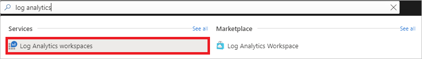

3. On the log analytics workspaces page, click **Add**.

    

4.  On the **Create Log Analytics workspace** page, perform the following steps:

    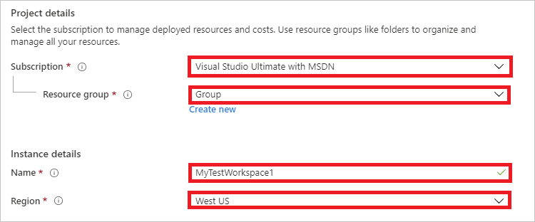

    1. Select your subscription.

    2. Select a resource group.
 
    3. In the **Name** textbox, type a name (e.g.: MytestWorkspace1).

    4. Select your region.

5. Click **Review + Create**.

    

6. Click **Create** and wait for the deployment to be succeeded. You may need to refresh the page to see the new workspace.

    

7. Search for **Azure Active Directory**.

    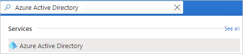

8. In **Monitoring** section, click **Diagnostic setting**.

    

9. On the **Diagnostic settings** page, click **Add diagnostic setting**.

    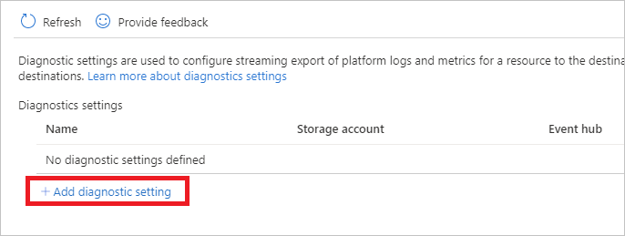

10. On the **Diagnostic setting** page, perform the following steps:

    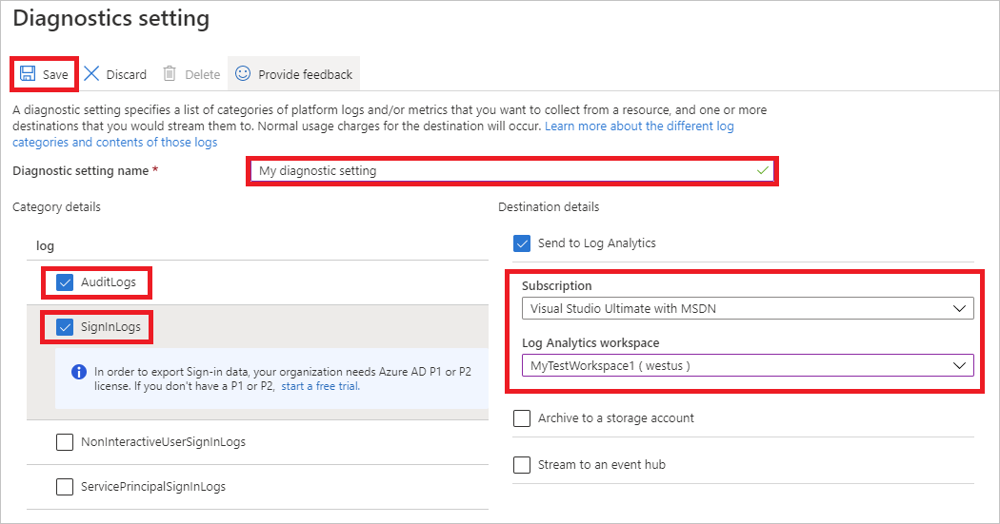

    1. Under **Category details**, select **AuditLogs** and **SigninLogs**.

    2. Under **Destination details**, select **Send to Log Analytics**, and then select your new log analytics workspace. 
   
    3. Click **Save**. 

## Run queries  

This procedure shows how to run queries using the **Kusto Query Language (KQL)**.

**To run a query:**

1. Sign in to the [Azure portal](https://portal.azure.com) as a global administrator.

2. Search for **Azure Active Directory**.

    

3. In the **Monitoring** section, click **Logs**.

4. On the **Logs** page, click **Get Started**.

5. In the **Search* textbox, type your query.

6. Click **Run**.  

### KQL query examples

Take 10 random entries from the input data:

`SigninLogs | take 10`

Look at the sign-ins where the Conditional Access was a success

`SigninLogs | where ConditionalAccessStatus == "success" | project UserDisplayName, ConditionalAccessStatus` 

Count how many successes there have been

`SigninLogs | where ConditionalAccessStatus == "success" | project UserDisplayName, ConditionalAccessStatus | count`

Aggregate count of successful sign-ins by user by day:

`SigninLogs | where ConditionalAccessStatus == "success" | summarize SuccessfulSign-ins = count() by UserDisplayName, bin(TimeGenerated, 1d)` 

View how many times a user does a certain operation in specific time period:

`AuditLogs | where TimeGenerated > ago(30d) | where OperationName contains "Add member to role" | summarize count() by OperationName, Identity`

Pivot the results on operation name

`AuditLogs | where TimeGenerated > ago(30d) | where OperationName contains "Add member to role" | project OperationName, Identity | evaluate pivot(OperationName)`

Merge together Audit and Sign in Logs using an inner join:

`AuditLogs |where OperationName contains "Add User" |extend UserPrincipalName = tostring(TargetResources[0].userPrincipalName) | |project TimeGenerated, UserPrincipalName |join kind = inner (SigninLogs) on UserPrincipalName |summarize arg_min(TimeGenerated, *) by UserPrincipalName |extend SigninDate = TimeGenerated` 

View number of signs ins by client app type:

`SigninLogs | summarize count() by ClientAppUsed`

Count the sign ins by day:

`SigninLogs | summarize NumberOfEntries=count() by bin(TimeGenerated, 1d)`

Take 5 random entries and project the columns you wish to see in the results:

`SigninLogs | take 5 | project ClientAppUsed, Identity, ConditionalAccessStatus, Status, TimeGenerated `

Take the top 5 in descending order and project the columns you wish to see

`SigninLogs | take 5 | project ClientAppUsed, Identity, ConditionalAccessStatus, Status, TimeGenerated `

Create a new column by combining the values to two other columns:

`SigninLogs | limit 10 | extend RiskUser = strcat(RiskDetail, "-", Identity) | project RiskUser, ClientAppUsed`

## Create an alert rule

This procedure shows how to send alerts when the breakglass account is used.

**To create an alert rule:**

1. Sign in to the [Azure portal](https://portal.azure.com) as a global administrator.

2. Search for **Azure Active Directory**.

    

3. In the **Monitoring** section, click **Logs**.

4. On the **Logs** page, click **Get Started**.

5. In the **Search** textbox, type: `SigninLogs |where UserDisplayName contains "BreakGlass" | project UserDisplayName`

6. Click **Run**.  

7. In the toolbar, click **New alert rule**.

    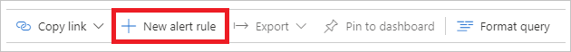

8. On the **Create alert rule** page, verify that the scope is correct.

9. Under **Condition**, click: **Whenever the average custom log search is greater than `logic undefined` count**

    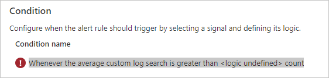

10. On the **Configure signal logic** page, in the **Alert logic** section, perform the following steps:

    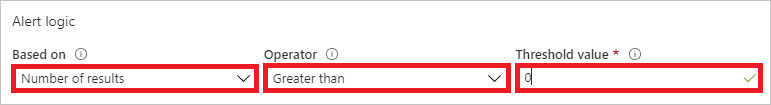

    1. As **Based on**, select **Number of results**.

    2. As **Operator**, select **Greater than**.

    3. As **Threshold value**, select **0**. 

11. On the **Configure signal logic** page, in the **Evaluated based on** section, perform the following steps:

    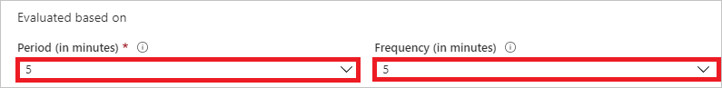

    1. As **Period (in minutes)**, select **5**.

    2. As **Frequency (in minutes)**, select **5**.

    3. Click **Done**. 

12. Under **Action group**, click **Select action group**. 

    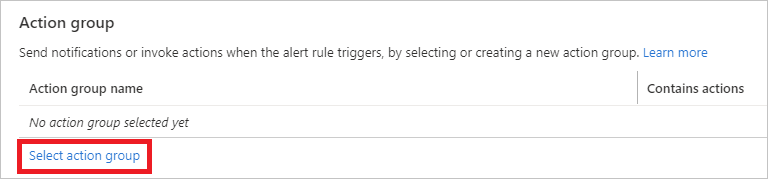

13. On the **Select an action group to attach to this alert rule**, click **Create action group**. 

    

14. On the **Create action group** page, perform the following steps:

    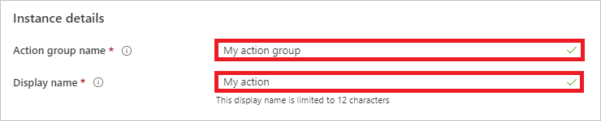

    1. In the **Action group name** textbox, type **My action group**.

    2. In the **Display name** textbox, type **My action**.

    3. Click **Review + create**. 

    4. Click **Create**.

15. Under **Customize action**, perform the following steps:

    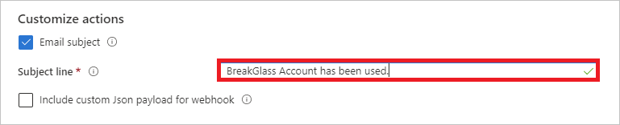

    1. Select **Email subject**.

    2. In the **Subject line** textbox, type: `Breakglass account has been used`

16. Under **Alert rule details**, perform the following steps:

    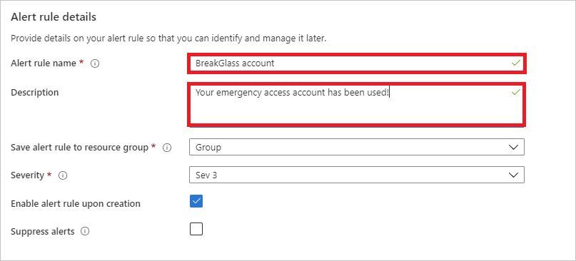

    1. In the **Alert rule name** textbox, type: `Breakglass account`

    2. In the **Description** textbox, type: `Your emergency access account has been used`

17. Click **Create alert rule**.   

## Create a custom workbook

This procedure shows how to create a new workbook using the quickstart template.

1. Sign in to the [Azure portal](https://portal.azure.com) as a global administrator.

2. Search for **Azure Active Directory**.

    

3. In the **Monitoring** section, click **Workbooks**.

    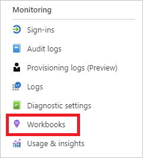

4. In the **Quickstart** section, click **Empty**.

    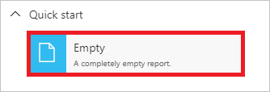

5. Click **Add**.

    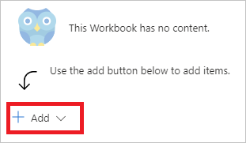

6. Click **Add text**.

    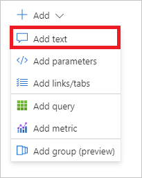

7. In the textbox, type: `# Client apps used in the past week`, and then click **Done Editing**.

    

8. In the new workbook, click **Add**, and then click **Add query**.

    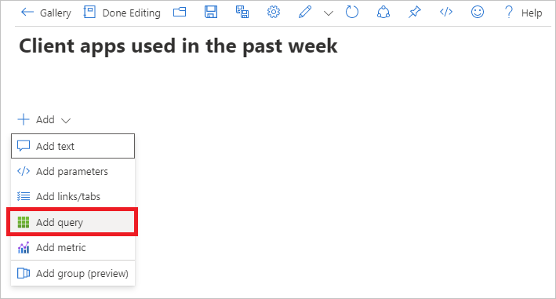

9. In the query textbox, type: `SigninLogs | where TimeGenerated > ago(7d) | project TimeGenerated, UserDisplayName, ClientAppUsed | summarize count() by ClientAppUsed`

10. Click **Run Query**.

    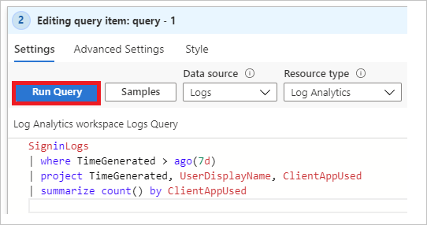

11. In the toolbar, under **Visualization**, click **Pie chart**.

    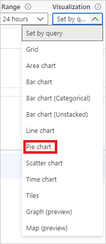

12. Click **Done Editing**.

    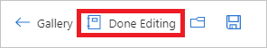

## Add a query to a workbook template

This procedure shows how to add a query to an existing workbook template. The example is based on a query that shows the distribution of Conditional Access success to failures.

1. Sign in to the [Azure portal](https://portal.azure.com) as a global administrator.

2. Search for **Azure Active Directory**.

    

3. In the **Monitoring** section, click **Workbooks**.

    

4. In the **Conditional Access** section, click **Conditional Access Insights and Reporting**.

    

5. In the toolbar, click **Edit**.

    

6. In the toolbar, click the three dots, then **Add**, and then **Add query**.

    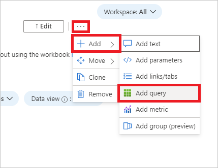

7. In the query textbox, type: `SigninLogs | where TimeGenerated > ago(20d) | where ConditionalAccessPolicies != "[]" | summarize dcount(UserDisplayName) by bin(TimeGenerated, 1d), ConditionalAccessStatus`

8. Click **Run Query**.

    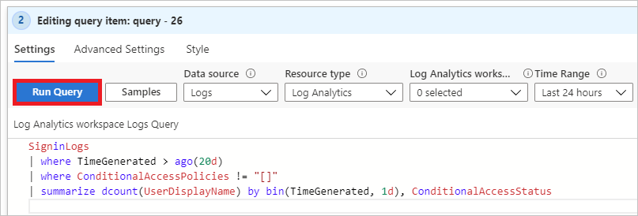

9. Click **Time Range**, and then select **Set in query**.

10. Click **Visualization**, and then select **Bar chart**. 

11. Click **Advanced Settings**, as chart title, type `Conditional Access status over the last 20 days`, and then click **Done Editing**. 

    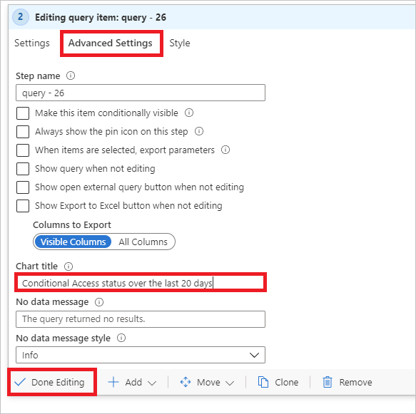

## Next steps

Advance to the next article to learn how to manage device identities by using the Azure portal.
> [!div class="nextstepaction"]
> [Monitoring](overview-monitoring.md)
