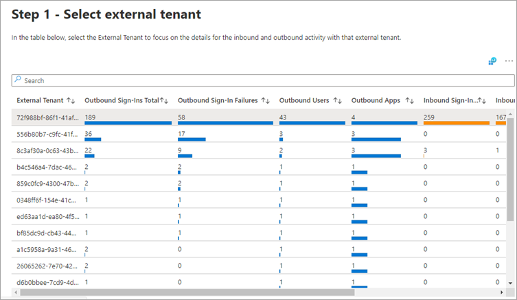

---

title: Cross-tenant access activity workbook in Azure AD | Microsoft Docs
description: Learn how to use the cross-tenant access activity workbook.
services: active-directory
documentationcenter: ''
author: MarkusVi
manager: karenho
editor: ''

ms.service: active-directory
ms.topic: reference
ms.workload: identity
ms.subservice: report-monitor
ms.date: 02/04/2022
ms.author: markvi
ms.reviewer: sarbar 

ms.collection: M365-identity-device-management
---

# Cross-tenant access activity workbook

As an IT administrator, you want insights into how your users are collaborating with other organizations. The cross-tenant access activity workbook helps you understand which external users are accessing resources in your organization, and which organizations’ resources your users are accessing. This workbook combines all our organization’s inbound and outbound collaboration into a single view.

This article provides you with an overview of this workbook.

## Description

Tenant administrators who are making changes to policies governing cross-tenant access can use this workbook to visualize and review existing access activity patterns before making policy changes. Understanding how external users access resources in your tenant (inbound access) and how users in your tenant access resources in external tenants (outbound access) will help ensure you have the right cross-tenant policies in place.

## Sections

This workbook has four sections:  

- All inbound and outbound activity by tenant ID

- Sign-in status summary by tenant ID for inbound and outbound collaboration

- Applications accessed for inbound and outbound collaboration by tenant ID

- Individual users for inbound and outbound collaboration by tenant ID

## Filters

This workbook supports multiple filters:

- Time range (up to 90 days)

- External tenant ID

- User principal name

- Application

- Status of the sign-in (success or failure)

## Best practices

Use this workbook to:

- Get the information you need to manage your cross-tenant access settings effectively, without breaking legitimate collaborations

- Identify all inbound sign-ins from external Azure AD organizations

- Identify all outbound sign-ins by your users to external Azure AD organizations

## Next steps

- [How to use Azure AD workbooks](howto-use-azure-monitor-workbooks.md)
