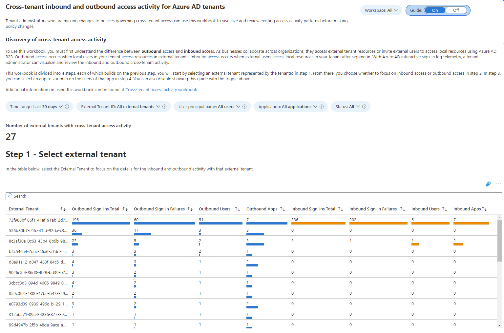
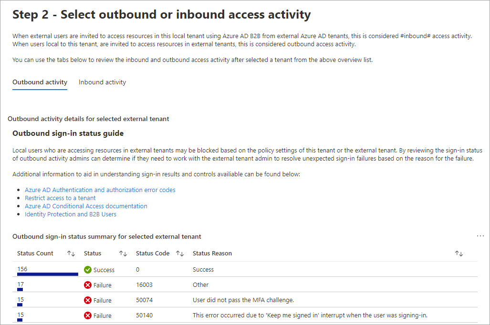
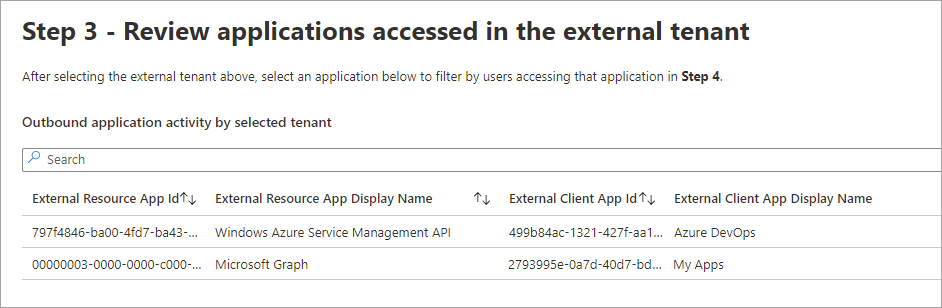
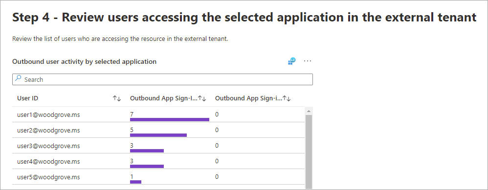
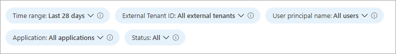

---

title: Cross-tenant access activity workbook in Microsoft Entra ID
description: Learn how to use the cross-tenant access activity workbook.
services: active-directory
author: shlipsey3
manager: amycolannino
ms.service: active-directory
ms.topic: reference
ms.workload: identity
ms.subservice: report-monitor
ms.date: 11/01/2022
ms.author: sarahlipsey

ms.collection: M365-identity-device-management
---

# Cross-tenant access activity workbook

As an IT administrator, you want insights into how your users are collaborating with other organizations. The cross-tenant access activity workbook helps you understand which external users are accessing resources in your organization, and which organizations’ resources your users are accessing. This workbook combines all your organization’s inbound and outbound collaboration into a single view.

This article provides you with an overview of this workbook.

## Description

Tenant administrators who are making changes to policies governing cross-tenant access can use this workbook to visualize and review existing access activity patterns before making policy changes. For example, you can identify the apps your users are accessing in external organizations so that you don't inadvertently block critical business processes. Understanding how external users access resources in your tenant (inbound access) and how users in your tenant access resources in external tenants (outbound access) will help ensure you have the right cross-tenant policies in place.

For more information, see the [Microsoft Entra External ID documentation](../external-identities/index.yml).

## Sections

This workbook has four sections:  

- All inbound and outbound activity by tenant ID

- Sign-in status summary by tenant ID for inbound and outbound collaboration

- Applications accessed for inbound and outbound collaboration by tenant ID

- Individual users for inbound and outbound collaboration by tenant ID

The total number of external tenants that have had cross-tenant access activity with your tenant is shown at the top of the workbook. 

Under **Step 1**, the external tenant list shows all the tenants that have had inbound or outbound activity with your tenant. When you select an external tenant in the table, the remaining sections update with information about outbound and inbound activity for that tenant.

The table under **Step 2** summarizes all outbound and inbound sign-in activity for the selected tenant, including the number of successful sign-ins and the reasons for failed sign-ins. You can select **Outbound activity** or **Inbound activity** to update the remaining sections of the workbook with the type of activity you want to view.

Under **Step 3**, the table lists the applications that are being accessed across tenants. If you selected **Outbound activity** in the previous section, the table shows the applications in external tenants that are being accessed by your users. If you selected **Inbound activity**, you'll see the list of your applications that are being accessed by external users. You can select a row to find out which users are accessing that application.

The table in **Step 4** displays the list of users who are accessing the application you selected.

## Filters

This workbook supports multiple filters:

- Time range (up to 90 days)

- External tenant ID

- User principal name

- Application

- Status of the sign-in (success or failure)

## Best practices

Use this workbook to:

- Get the information you need to manage your cross-tenant access settings effectively, without breaking legitimate collaborations

- Identify all inbound sign-ins from external Microsoft Entra organizations

- Identify all outbound sign-ins by your users to external Microsoft Entra organizations

## Next steps

- [How to use Microsoft Entra workbooks](howto-use-azure-monitor-workbooks.md)
