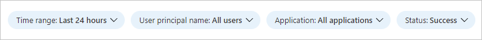

---

title: Sign-ins using legacy authentication workbook in Azure AD | Microsoft Docs
description: Learn how to use the sign-ins using legacy authentication workbook.
services: active-directory
documentationcenter: ''
author: MarkusVi
manager: karenho
editor: ''

ms.service: active-directory
ms.topic: reference
ms.workload: identity
ms.subservice: report-monitor
ms.date: 03/16/2022
ms.author: markvi
ms.reviewer: besiler 

ms.collection: M365-identity-device-management
---

# Sign-ins using legacy authentication workbook

Have you ever wondered how you can determine whether it is safe to turn off legacy authentication in your tenant? The sign-ins using legacy authentication workbook helps you to answer this question.

This article gives you an overview of this workbook.

## Description

Azure AD supports several of the most widely used authentication and authorization protocols including legacy authentication. Legacy authentication refers to basic authentication, which was once a widely used industry-standard method for passing user name and password information through a client to an identity provider.

Examples of applications that commonly or only use legacy authentication are:

- Microsoft Office 2013 or older.

- Apps using legacy auth with mail protocols like POP, IMAP, and SMTP AUTH.

Single-factor authentication (for example, username and password) doesn’t provide the required level of protection for today’s computing environments. Passwords are bad as they are easy to guess and humans are bad at choosing good passwords. 

Unfortunately, legacy authentication:

- Does not support multi-factor authentication (MFA) or other strong authentication methods.

- Makes it impossible for your organization to move to passwordless authentication. 

To improve the security of your Azure AD tenant and experience of your users, you should disable legacy authentication. However, important user experiences in your tenant might depend on legacy authentication. Before shutting off legacy authentication, you may want to find those cases so you can migrate them to more secure authentication. 

The sign-ins using legacy authentication workbook lets you see all legacy authentication sign-ins in your environment so you can find and migrate critical workflows to more secure authentication methods before you shut off legacy authentication.

 
 

## Sections

With this workbook, you can distinguish between interactive and non-interactive sign-ins. This workbook highlights which legacy authentication protocols are used throughout your tenant. 

The data collection consists of three steps:

1. Select a legacy authentication protocol, and then select an application to filter by users accessing that application.

2. Select a user to see all their legacy authentication sign-ins to the selected app.

3. View all legacy authentication sign-ins for the user to understand how legacy authentication is being used.

 

## Filters

This workbook supports multiple filters:

- Time range (up to 90 days)

- User principal name

- Application

- Status of the sign-in (success or failure)

## Best practices

- **[Enable risky sign-in policies](../identity-protection/concept-identity-protection-policies.md)** - To prompt for multi-factor authentication (MFA) on medium risk or above. Enabling the policy reduces the proportion of active real-time risk detections by allowing legitimate users to self-remediate the risk detections with MFA.

- **[Enable a risky user policy](../identity-protection/howto-identity-protection-configure-risk-policies.md#user-risk-with-conditional-access)** - To enable users to securely remediate their accounts when they are high risk. Enabling the policy reduces the number of active at-risk users in your organization by returning the user’s credentials to a safe state.

## Next steps

- To learn more about identity protection, see [What is identity protection](../identity-protection/overview-identity-protection.md). 

- For more information about Azure AD workbooks, see [How to use Azure AD workbooks](howto-use-azure-monitor-workbooks.md).

