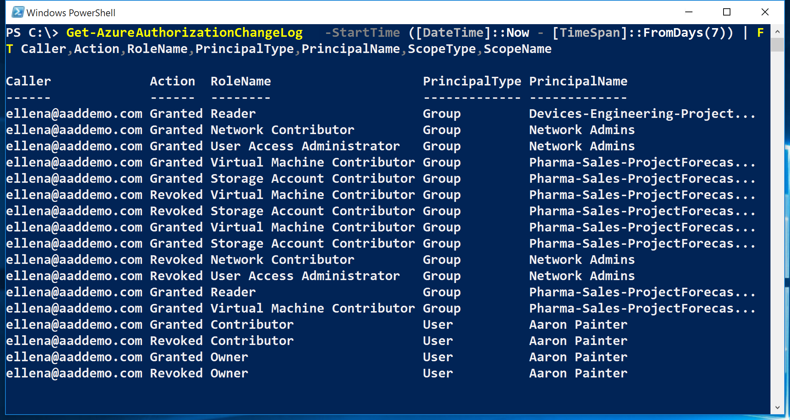

<properties
	pageTitle="Create an access change history report | Microsoft Azure"
	description="Generate a report that lists all changes in access to your Azure subscriptions with Role-Based Access Control over the past 90 days."
	services="active-directory"
	documentationCenter=""
	authors="kgremban"
	manager="femila"
	editor=""/>

<tags
	ms.service="active-directory"
	ms.devlang="na"
	ms.topic="article"
	ms.tgt_pltfrm="na"
	ms.workload="identity"
	ms.date="08/03/2016"
	ms.author="kgremban"/>

# Create an access change history report

Any time someone grants or revokes access within your subscriptions, the changes get logged in Azure events. You can create access change history reports to see all changes for the past 90 days.

## Create a report with Azure PowerShell
To create an access change history report in PowerShell, use the `Get-AzureRMAuthorizationChangeLog` command. More details about this cmdlet are available in the [PowerShell Gallery](https://www.powershellgallery.com/packages/AzureRM.Storage/1.0.6/Content/ResourceManagerStartup.ps1).

When you call this command, you can specify which property of the assignments you want listed, including the following:

| Property | Description |
| -------- | ----------- |
| **Action** | Whether access was granted or revoked |
| **Caller** | The owner responsible for the access change |
| **Date** | The date and time that access was changed |
| **DirectoryName** | The Azure Active Directory directory |
| **PrincipalName** | The name of the user, group, or application |
| **PrincipalType** | Whether the assignment was for a user, group, or application |
| **RoleId** | The GUID of the role that was granted or revoked |
| **RoleName** | The role that was granted or revoked |
| **ScopeName** | The name of the subscription, resource group, or resource |
| **ScopeType** | Whether the assignment was at the subscription, resource group, or resource scope |
| **SubscriptionId** | The GUID of the Azure subscription |
| **SubscriptionName** | The name of the Azure subscription |

This example command lists all access changes in the subscription for the past seven days:

```
Get-AzureRMAuthorizationChangeLog -StartTime ([DateTime]::Now - [TimeSpan]::FromDays(7)) | FT Caller,Action,RoleName,PrincipalType,PrincipalName,ScopeType,ScopeName
```



## Create a report with Azure CLI
To create an access change history report in the Azure command-line interface (CLI), use the `azure role assignment changelog list` command.

## Export to a spreadsheet
To save the report, or manipulate the data, export the access changes into a .csv file. You can then view the report in a spreadsheet for review.


## See also
- Get started with [Azure Role-Based Access Control](role-based-access-control-configure.md)
- Work with [Custom roles in Azure RBAC](role-based-access-control-custom-roles.md)
