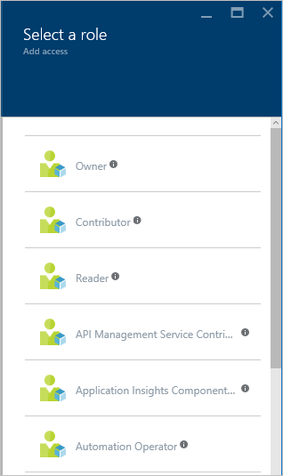

<properties
	pageTitle="Azure Active Directory Role-based Access Control | Microsoft Azure"
	description="Get started in access management with Azure role-based access control in the Azure Portal. Use role assignments to assign permissions in your directory."
	services="active-directory"
	documentationCenter=""
	authors="kgremban"
	manager="stevenpo"
	editor=""/>

<tags
	ms.service="active-directory"
	ms.devlang="na"
	ms.topic="get-started-article"
	ms.tgt_pltfrm="na"
	ms.workload="identity"
	ms.date="03/30/2016"
	ms.author="kgremban"/>

# Azure Role-Based Access Control

## Role-Based Access Control
Azure Role-Based Access Control (RBAC) enables fine-grained access management for Azure. Using RBAC, you can segregate duties within your DevOps team and grant only the amount of access to users that they need to perform their jobs. This article introduces the basics of access management, then helps you get up and running with RBAC in the Azure portal.

### Basics of access management in Azure
Each Azure subscription is associated with one Azure Active Directory (AD) directory. Users, groups, and applications from that directory can manage resources in the Azure subscription. These access rights are granted using the Azure portal, Azure command-line tools, and Azure Management APIs.

Access is granted by assigning the appropriate RBAC role to users, groups, and applications at a certain scope. The scope of a role assignment can be a subscription, a resource group, or a single resource. A role assigned at a parent scope also grants access to the children contained within it. For example, a user with access to a resource group can manage all the resources it contains, like websites, virtual machines, and subnets.

The RBAC role that you assign dictates what resources the user, group, or application can manage within that scope.

### Built-in roles
Azure RBAC has three basic roles that apply to all resource types:

- **Owner** has full access to all resources including the right to delegate access to others.
- **Contributor** can create and manage all types of Azure resources but can’t grant access to others.
- **Reader** can view existing Azure resources.

The rest of the RBAC roles in Azure allow management of specific Azure resources. For example, the Virtual Machine Contributor role allows the user to create and manage virtual machines. It does not give them access to the virtual network or the subnet that the virtual machine connects to.

[RBAC built-in roles](role-based-access-built-in-roles.md) lists the roles available in Azure. It specifies the operations and scope that each built-in role grants to users. If you're looking to define your own roles for even more control, see how to build [Custom roles in Azure RBAC](role-based-access-control-custom-roles.md).

### Resource hierarchy and access inheritance
- Each **subscription** in Azure belongs to only one directory.
- Each **resource group** belongs to only one subscription.
- Each **resource** belongs to only one resource group.

Access that you grant at parent scopes is inherited at child scopes. For example:

- You assign the Reader role to an Azure AD group at the subscription scope. The members of that group can view every resource group and resource in the subscription.  
- You assign the Contributor role to an application at the resource group scope. It can manage resources of all types in that resource group, but not other resource groups in the subscription.

### Azure RBAC vs. classic subscription administrators
Classic subscription administrators and co-admins have full access to the Azure subscription. They can manage resources using the [Azure portal](https://portal.azure.com) with Azure Resource Manager APIs, or the [Azure classic portal](https://manage.windowsazure.com) and Azure Service Management APIs. In the RBAC model, classic administrators are assigned the Owner role at the subscription scope.

Only the Azure portal and the new Azure Resource Manager APIs support Azure RBAC. Users and applications that are assigned RBAC roles cannot use the classic management portal and the Azure Service Management APIs.

### Authorization for management vs. data operations
Azure RBAC only supports management operations of the Azure resources in the Azure portal and Azure Resource Manager APIs. Not all data level operations for Azure resources can be authorized via RBAC. For example, Storage Accounts can be managed with RBAC, but the blobs or tables within a Storage Account cannot. Similarly, a SQL database can be managed, but not the tables within it.

## Manage access using the Azure portal
### View access
You can see who has access to a resource, resource group, or subscription from its main blade in the [Azure portal](https://portal.azure.com). For example, we want to see who has access to one of our resource groups:

1. Select the **Resource group** icon in the navigation bar on the left.
2. Select the name of the resource group you want to examine from the **Resource groups** blade.
3. Select the **Users** icon on the top right of the resource group blade.
4. The **Users** blade lists all users, groups, and applications that have been granted access to the resource group.

Notice that some users were **Assigned** access while others **Inherited** it. Access is either assigned specifically to the resource group or inherited from an assignment to the parent subscription.

> [AZURE.NOTE] Classic subscription admins and co-admins are considered owners of the subscription in the new RBAC model.

### Add Access
You grant access from within the resource, resource group, or subscription that is the scope of the role assignment.

1. Select the **Add** icon on the **Users** blade. 
2. Select the role that you wish to assign.
3. Select the user, group, or application in your directory that you wish to grant access to. You can search the directory with display names, email addresses, and object identifiers.

### Remove Access

1. In the **Users** blade, select the role assignment that you wish to remove.
2. Click the **Remove** icon in the assignment details blade.
3. Click **yes** to confirm removal.

Inherited assignments cannot be removed from child scopes. Go to the parent scope to remove the role assignment.

## Other tools to manage access
You can assign roles and manage access with Azure RBAC commands in tools other than the Azure portal.  Follow the links to learn more about the prerequisites and get started with the Azure RBAC commands.

- [Azure PowerShell](role-based-access-control-manage-access-powershell.md)
- [Azure Command-Line Interface](role-based-access-control-manage-access-azure-cli.md)
- [REST API](role-based-access-control-manage-access-rest.md)

## Next Steps
- [Create an access change history report](role-based-access-control-access-change-history-report.md)
- See the [RBAC built-in roles](role-based-access-built-in-roles.md)
- Define your own [Custom roles in Azure RBAC](role-based-access-control-custom-roles.md)
