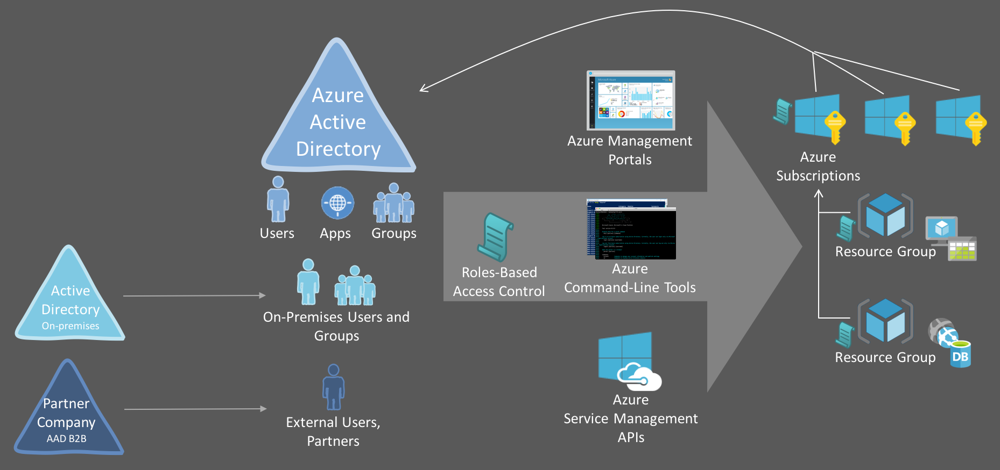

<properties
	pageTitle="Role-based access control in the Microsoft Azure portal"
	description="Describes how role based access control works and how to set it up"
	services="active-directory"
	documentationCenter=""
	authors="IHenkel"
	manager="stevenpo"
	editor=""/>

<tags
	ms.service="active-directory"
	ms.devlang="na"
	ms.topic="article"
	ms.tgt_pltfrm="na"
	ms.workload="identity"
	ms.date="10/07/2015"
	ms.author="inhenk"/>

# Role-based Access Control

## Role-based Access Control
Azure Roles-Based Access Control (RBAC) enables fine-grained access control for Azure IaaS and PaaS management. Using RBAC, you can grant only the amount of access to your co-workers that they need to perform their jobs.

## Basics of access management in Azure
Each Azure subscription is homed to an Azure Active Directory. Only users, groups, and applications from that directory can be granted access to manage resources in the Azure subscription, using Azure Management Portal, Azure Command-Line tools and Azure Management APIs.

Access is granted by assigning the appropriate RBAC role to users, groups, and applications, at the right scope. To grant access to the entire subscription, assign a role at the subscription scope. To grant access to a specific resource group within a subscription, assign a role at the resource group scope. You may assign roles at specific resources too, like websites, virtual machines and subnets, to grant access only to a resource.

The RBAC role that you assign to users, groups, and applications, dictates what resources the user (or application) can manage within that scope.

## Azure RBAC Built-In Roles
Azure RBAC has three basic roles that apply to all resource types: Owner, Contributor and Reader. Owner has full access to all resources including the right to delegate access to others. Contributor can create and manage all types of Azure resources but can’t grant access to others. Reader can only view existing Azure resources. The rest of the RBAC roles in Azure allow management of specific Azure resources. For instance, the Virtual Machine Contributor role allows creation and management of virtual machines but does not allow management of the virtual network or the subnet that the virtual machine connects to.

LINK HERE lists the built-in RBAC roles available in Azure. For each role it specifies the operations to which a built-in role grants access.

## Azure Resource Hierarchy and Access Inheritance
Each subscription in Azure belongs to one and only one directory, each resource group belongs to one and only one subscription, and each resource belongs to one and only one resource group. Access that you grant at parent scopes is inherited at child scopes. If you grant reader role to an Azure AD group at the subscription scope, the members of that group will be able to view every resource groups and every resource in the subscription. If you grant the contributor role to an application at the resource group scope, it will be able to manage resources of all types in that resource group but not other resource groups in the subscription.

## Azure RBAC vs. Classic Subscription Administrator and Co-Admins
Classic subscription administrator and co-admins have full access to the Azure subscription. They can manage resources using both the classic portal (https://manage.windowsazure.com), and Azure Service Manager APIs, as well as the new management portal (https://portal.azure.com), and new Azure Resource Manager APIs. In the RBAC model, classic administrators are assigned the Owner role at the subscription scope.

The finer-grained authorization model (Azure RBAC) is supported only by the new management portal (https://portal.azure.com) and Azure Resource Manager APIs. Users and applications that are assigned RBAC roles (at subscription/resource group/resource scope) cannot use the classic management portal (http://manage.windowsazure.com) and the Azure Service Management APIs.

## Authorization for Management vs Data Operations
The finer-grained authorization model (Azure RBAC) is supported only for management operations of the Azure resources in Azure portal and Azure Resource Manager APIs. Not all data level operations for Azure resources can be authorized via RBAC. For instance, create/read/update/delete of Storage Accounts can be controlled via RBAC, but create/read/update/delete of blobs or tables within the Storage Account cannot yet be controlled via RBAC. Similarly, create/read/update/delete of a SQL DB can be controlled via RBAC but create/read/update/delete of SQL tables within the DB cannot yet be controlled via RBAC.

## Manage access using Azure Management Portal
[Manage access using Azure Management Portal](role-based-access-control-manage-access-azure-portal)
## Manage access using Azure PowerShell
[Manage access using Azure Management Portal](role-based-access-control-manage-access-powershell)
## Manage access using Azure Command-Line Interface
[Manage access using Azure Managment Portal](role-based-access-control-manage-access-azure-cli)
## Using the Access Change History Report
[Using the Access Change History Report](role-based-access-control-using-access-change-history-report)
