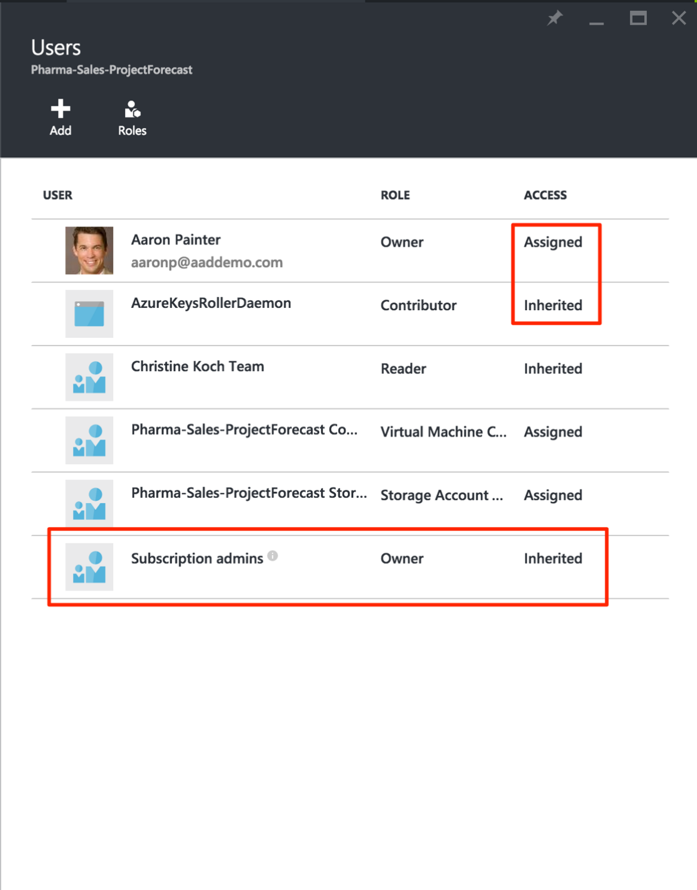
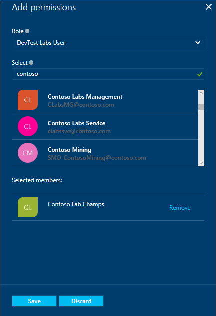
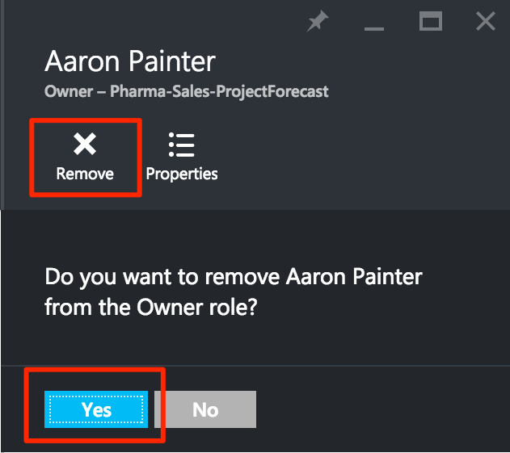

<properties
	pageTitle="Use Role-Based Access control in the Azure portal | Microsoft Azure"
	description="Get started in access management with Role-Based Access Control in the Azure Portal. Use role assignments to assign permissions to your resources."
	services="active-directory"
	documentationCenter=""
	authors="kgremban"
	manager="femila"
	editor=""/>

<tags
	ms.service="active-directory"
	ms.devlang="na"
	ms.topic="get-started-article"
	ms.tgt_pltfrm="na"
	ms.workload="identity"
	ms.date="07/21/2016"
	ms.author="kgremban"/>

# Use role assignments to manage access to your Azure subscription resources

Azure Role-Based Access Control (RBAC) enables fine-grained access management for Azure. Using RBAC, you can grant only the amount of access that users need to perform their jobs. This article helps you get up and running with RBAC in the Azure portal. If you want more details about how RBAC helps you manage access, see [What is Role-Based Access Control](role-based-access-control-what-is.md).

## View access
You can see who has access to a resource, resource group, or subscription from its main blade in the [Azure portal](https://portal.azure.com). For example, we want to see who has access to one of our resource groups:

1. Select **Resource groups** in the navigation bar on the left.  
	
2. Select the name of the resource group from the **Resource groups** blade.
3. Select **Users** on the top right of the resource group blade.  
	
4. The **Users** blade lists all users, groups, and applications that have been granted access to the resource group.  

	

Notice that some users were **Assigned** access while others **Inherited** it. Access is either assigned specifically to the resource group or inherited from an assignment to the parent subscription.

> [AZURE.NOTE] Classic subscription admins and co-admins are considered owners of the subscription in the new RBAC model.

## Add Access
You grant access from within the resource, resource group, or subscription that is the scope of the role assignment.

1. Select **Add** on the **Users** blade.  
	  
2. Select the role that you wish to assign from the **Select a role** blade.
3. Select the user, group, or application in your directory that you wish to grant access to. You can search the directory with display names, email addresses, and object identifiers.  

	

4. Select **OK** to create the assignment. The **Adding user** popup tracks the progress.  
	

After successfully adding a role assignment, it will appear on the **Users** blade.

## Remove Access

1. Select the role assignment on the **Users** blade.
2. Select **Remove** in the assignment details blade.  
	
3. Select **yes** to confirm removal.  
	

Inherited assignments cannot be removed. Notice in the image below that the remove button is grayed out. Instead, look at the **Assigned At** detail. Go to the resource listed there to remove the role assignment.

## Other tools to manage access
You can assign roles and manage access with Azure RBAC commands in tools other than the Azure portal.  Follow the links to learn more about the prerequisites and get started with the Azure RBAC commands.

- [Azure PowerShell](role-based-access-control-manage-access-powershell.md)
- [Azure Command-Line Interface](role-based-access-control-manage-access-azure-cli.md)
- [REST API](role-based-access-control-manage-access-rest.md)

## Next Steps
- [Create an access change history report](role-based-access-control-access-change-history-report.md)
- See the [RBAC built-in roles](role-based-access-built-in-roles.md)
- Define your own [Custom roles in Azure RBAC](role-based-access-control-custom-roles.md)
