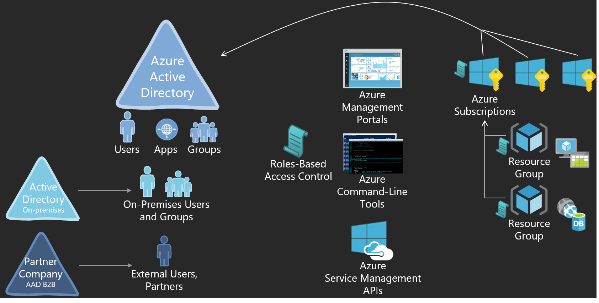

<properties
	pageTitle="Azure Active Directory AD Role-based Access Control | Microsoft Azure"
	description="This article describes Azure role-based access control."
	services="active-directory"
	documentationCenter=""
	authors="IHenkel"
	manager="stevenpo"
	editor=""/>

<tags
	ms.service="active-directory"
	ms.devlang="na"
	ms.topic="article"
	ms.tgt_pltfrm="na"
	ms.workload="identity"
	ms.date="10/07/2015"
	ms.author="inhenk"/>

# Azure Active Directory AD Role-based Access Control

## Role-based Access Control
Azure Roles-Based Access Control (RBAC) enables fine-grained access management for Azure. Using RBAC, you can segregate duties within your devops team and grant only the amount of access to users that they need to perform their jobs.

### Basics of access management in Azure
Each Azure subscription is homed to an Azure Active Directory. Only users, groups, and applications from that directory can be granted access to manage resources in the Azure subscription, using Azure Management Portal, Azure Command-Line tools and Azure Management APIs.

Access is granted by assigning the appropriate RBAC role to users, groups, and applications, at the right scope. To grant access to the entire subscription, assign a role at the subscription scope. To grant access to a specific resource group within a subscription, assign a role at the resource group scope. You may assign roles at specific resources too, like websites, virtual machines and subnets, to grant access only to a resource.

The RBAC role that you assign to users, groups, and applications, dictates what resources the user (or application) can manage within that scope.

### Azure RBAC Built-In Roles
Azure RBAC has three basic roles that apply to all resource types: Owner, Contributor and Reader. Owner has full access to all resources including the right to delegate access to others. Contributor can create and manage all types of Azure resources but can’t grant access to others. Reader can only view existing Azure resources. The rest of the RBAC roles in Azure allow management of specific Azure resources. For instance, the Virtual Machine Contributor role allows creation and management of virtual machines but does not allow management of the virtual network or the subnet that the virtual machine connects to.

[RBAC Built in Roles](role-based-access-built-in-roles.md) lists the built-in RBAC roles available in Azure. For each role it specifies the operations to which a built-in role grants access.

### Azure Resource Hierarchy and Access Inheritance
Each subscription in Azure belongs to one and only one directory, each resource group belongs to one and only one subscription, and each resource belongs to one and only one resource group. Access that you grant at parent scopes is inherited at child scopes. If you grant reader role to an Azure AD group at the subscription scope, the members of that group will be able to view every resource groups and every resource in the subscription. If you grant the contributor role to an application at the resource group scope, it will be able to manage resources of all types in that resource group but not other resource groups in the subscription.

### Azure RBAC vs. Classic Subscription Administrator and Co-Admins
Classic subscription administrator and co-admins have full access to the Azure subscription. They can manage resources using both the classic portal (https://manage.windowsazure.com), and Azure Service Manager APIs, as well as the new management portal (https://portal.azure.com), and new Azure Resource Manager APIs. In the RBAC model, classic administrators are assigned the Owner role at the subscription scope.

The finer-grained authorization model (Azure RBAC) is supported only by the new management portal (https://portal.azure.com) and Azure Resource Manager APIs. Users and applications that are assigned RBAC roles (at subscription/resource group/resource scope) cannot use the classic management portal (http://manage.windowsazure.com) and the Azure Service Management APIs.

### Authorization for Management vs Data Operations
The finer-grained authorization model (Azure RBAC) is supported only for management operations of the Azure resources in Azure portal and Azure Resource Manager APIs. Not all data level operations for Azure resources can be authorized via RBAC. For instance, create/read/update/delete of Storage Accounts can be controlled via RBAC, but create/read/update/delete of blobs or tables within the Storage Account cannot yet be controlled via RBAC. Similarly, create/read/update/delete of a SQL DB can be controlled via RBAC but create/read/update/delete of SQL tables within the DB cannot yet be controlled via RBAC.

## Manage access using the Azure Management Portal
### View Access
Select access settings in the essentials section of the resource group blade. The **Users** blade lists all users, groups and applications that have been granted access to the resource group. Access is either assigned on the resource group or inherited from an assignment on the parent subscription.

> [AZURE.NOTE] Classic subscription admins and co-admins are in effect owners of the subscription in the new RBAC model.

### Add Access
1. Click the **Add** icon on the **Users** blade. 
2. Select the role that you wish to assign.
3. Search for and select the user, or group, or application that you wish to grant access to.
4. Search the directory for users, groups, and applications using display names, email addresses, and object identifiers.

### Remove Access
1. In the **Users** blade, select the role assignment that you wish to remove.
2. Click the **Remove** icon in the assignment details blade.
3. Click **yes** to confirm removal.

> [AZURE.NOTE] Inherited assignments can not be removed from child scopes. Navigate to the parent scope and remove such assignments.

## Manage access using Azure PowerShell
Access can be managed used Azure RBAC commands in the Azure PowerShell tools.

-	Use `Get-AzureRoleDefinition` to list RBAC roles available for assignment and to inspect the operations to which they grant access.

-	Use `Get-AzureRoleAssignment` to list RBAC access assignments effective at the specified subscription or resource group or resource. Use the `ExpandPrincipalGroups` parameter to list access assignments to the specified user as well as to the groups of which the user is member. Use the `IncludeClassicAdministrators` parameter to also list classic Subscription Administrator and Co-Administrators.

-	Use `New-AzureRoleAssignment` to grant access to users, groups and applications.

-	Use `Remove-AzureRoleAssignment` to remove access.

See [Manage access using Azure PowerShell](role-based-access-control-manage-access-powershell.md) for more detailed examples of managing access using Azure PowerShell.

## Manage access using the Azure Command-Line Interface
Access can be managed used Azure RBAC commands in the Azure Command-Line Interface.

-	Use `azure role list` to list RBAC roles available for assignment. Use azure role show to inspect the operations to which they grant access.

-	Use `azure role assignment list` to list RBAC access assignments effective at the specified subscription or resource group or resource. Use the `expandPrincipalGroups` option to list access assignments to the specified user as well as to the groups of which the user is member. Use the  `includeClassicAdministrators` parameter to also list classic Subscription Administrator and Co-Administrators.

-	Use `azure role assignment create` to grant access to users, groups and applications.

-	Use `azure role assignment delete` to remove access.

See [Manage access using the Azure CLI](role-based-access-control-manage-access-azure-cli.md) for more detailed examples of managing access using the Azure CLI.

## Using the Access Change History Report
All access changes happening in your Azure subscriptions get logged in Azure events.

### Create a report with Azure PowerShell
To create a report of who granted/revoked what kind of access to/from whom on what scope within your Azure subscirptions use the following PowerShell command:

    Get-AzureAuthorizationChangeLog

### Create a report with Azure CLI
To create a report of who granted/revoked what kind of access to/from whom on what scope within your Azure subscirptions use the Azure command line interface (CLI) command:

    azure authorization changelog

> [AZURE.NOTE] Access changes can be queried for the past 90 days (in 15 day batches).

The following example lists all access changes in the subscription for the past 7 days.

### Export Access Change to a Spreadsheet
It is convenient to export access changes into a spreadsheet for review.

