## Intro on role-based access control

Role-based access control is an Azure portal only feature allowing the owners of a subscription to assign granular roles to other users who can manage specific resource scopes in their environment.

RBAC allows better security management for large organizations and for SMBs working with external collaborators, vendors or freelancers which need access to specific resources in your environment but not necessarily to the entire infrastructure or any billing-related scopes. RBAC allows the flexibility of owning one Azure subscription managed by the administrator account (service administrator role at a subscription level) and have multiple users invited to work under the same subscription but without any administrative rights for it. From a management and billing perspective, the RBAC feature proves to be a time and management efficient option for using Azure in various scenarios.

## Prerequisites
Using RBAC in the Azure environment requires:

* Having a standalone Azure subscription assigned to the user as owner (subscription role)
* Have the Owner role of the Azure subscription
* Have access to the [Azure portal](https://portal.azure.com)
* Make sure to have the following Resource Providers registered for the user subscription: **Microsoft.Authorization**. For more information on how to register the resource providers, see [Resource Manager providers, regions, API versions and schemas](/azure-resource-manager/resource-manager-supported-services.md).

> [!NOTE]
> Office 365 subscriptions or Azure Active Directory licenses (for example: Access to Azure Active Directory) provisioned from the O365 portal don't quality for using RBAC.

## How can RBAC be used
RBAC can be applied at three different scopes in Azure. From the highest scope to the lowest one, they are as follows:

* Subscription (highest)
* Resource group
* Resource scope (the lowest access level offering targeted permissions to an individual Azure resource scope)

## Assign RBAC roles at the subscription scope
There are two common examples when RBAC is used (but not limited to):

* Having external users from the organizations (not part of the admin user's Azure Active Directory tenant) invited to manage certain resources or the whole subscription
* Working with users inside the organization (they are part of the user's Azure Active Directory tenant) but part of different teams or groups which need granular access either to the whole subscription or to certain resource groups or resource scopes in the environment

## Grant access at a subscription level for a user outside of Azure Active Directory
RBAC roles can be granted only by **Owners** of the subscription therefore the admin user must be logged with a username which has this role pre-assigned or has created the Azure subscription.

From the Azure portal, after you sign-in as admin, select “Subscriptions” and chose the desired one.
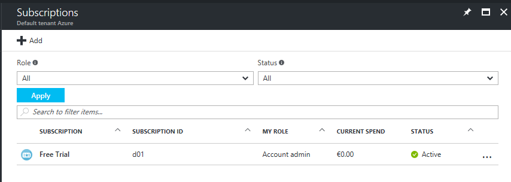
By default, if the admin user has purchased the Azure subscription, the user will show up as **Account Admin**, this being the subscription role. For more details on the Azure subscription roles, see [Add or change Azure administrator roles that manage the subscription or services](/billing/billing-add-change-azure-subscription-administrator.md).

In this example, the user "alflanigan@outlook.com" is the **Owner** of the "Free Trial" subscription in the AAD tenant "Default tenant Azure". Since this user is the creator of the Azure subscription with the initial Microsoft Account “Outlook” (Microsoft Account = Outlook, Live etc.) the default domain name for all other users added in this tenant will be **"@alflaniganuoutlook.onmicrosoft.com"**. By design, the syntax of the new domain is formed by putting together the username and domain name of the user who created the tenant and adding the extension **".onmicrosoft.com"**.
Furthermore, users can sign-in with a custom domain name in the tenant after adding and verifying it for the new tenant. For more details on how to verify a custom domain name in an Azure Active Directory tenant, see [Add a custom domain name to your directory](/active-directory/active-directory-add-domain).

In this example, the "Default tenant Azure" directory contains only users with the domain name "@alflanigan.onmicrosoft.com".

After selecting the subscription, the admin user must click **Access Control (IAM)** and then **Add a new role**.


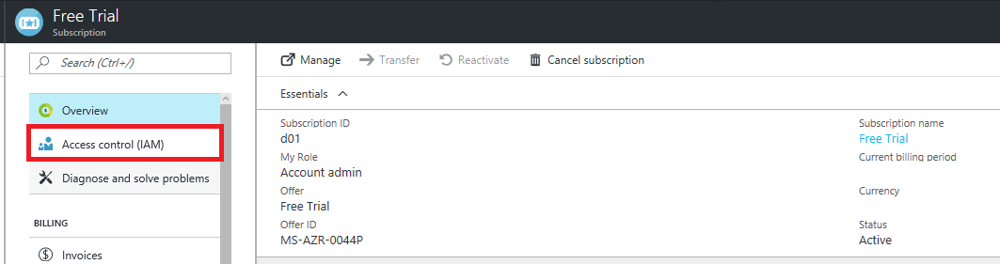


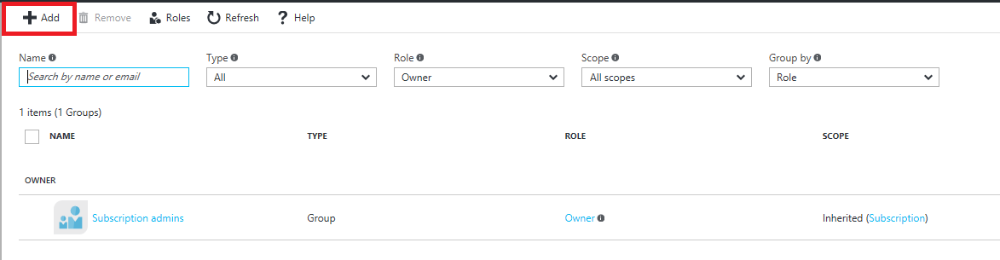

The next step is to select the role to be assigned and the user whom the RBAC role will be assigned to. In the **Role** dropdown menu the admin user sees only the built-in RBAC roles which are available in Azure. For more detailed explanations of each role and their assignable scopes, see [Built-in roles for Azure Role-Based Access Control](/active-directory/role-based-access-built-in-roles.md).

The admin user then needs to add the email address of the external user. The expected behavior is for the external user to not show up in the existing tenant. After the external user has been invited, he will be visible under **Subscriptions > Access Control (IAM)** with all the current users which are currently assigned an RBAC role at the Subscription scope.


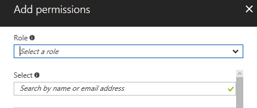


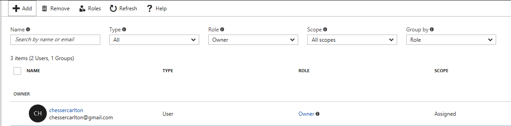

The user "chessercarlton@gmail.com" has been invited to be an **Owner** for the “Free Trial” subscription. After sending the invitation, the external user will receive an email confirmation with an activation link.
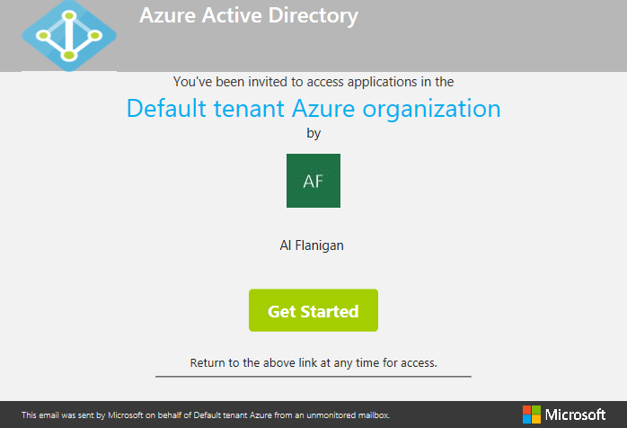

Being external to the organization, the new user does not have any existing attributes in the "Default tenant Azure" directory. They will be created after the external user has given consent to be recorded in the directory which is associated with the subscription which he has been assigned a role to.


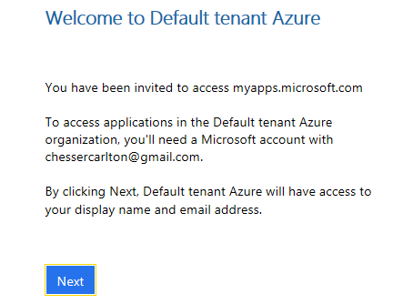

The external user shows in the Azure Active Directory tenant from now on as external user and this can be viewed both in the Azure portal and in the classic portal.


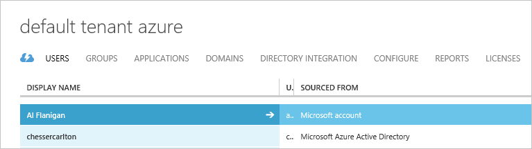

In the **Users** view in both portals the external users can be recognized by:

* The different icon type in the Azure portal
* The different sourcing point in the classic portal

However, granting **Owner** or **Contributor** access to an external user at the **Subscription** scope, does not allow the access to the admin user's directory, unless the **Global Admin** allows it. In the user proprieties,  the **User Type** which has two common parameters, **Member** and **Guest** can be identified. A member is a user which is registered in the directory while a guest is a user invited to the directory from an external source. For more information, see [How do Azure Active Directory admins add B2B collaboration users](/active-directory/active-directory-b2b-admin-add-users).

> [!NOTE]
> Make sure that after entering the credentials in the portal, the external user selects the correct directory to sign-in to. The same user can have access to multiple directories and can select either one of  them by clicking the username in the top right-hand side in the Azure portal and then choose the appropriate directory from the dropdown list.

While being a guest in the directory, the external user can manage all resources for the Azure subscription, but can't access the directory.


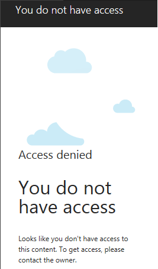

Azure Active Directory and an Azure subscription don't have a child-parent relation like other Azure resources (for example: virtual machines, virtual networks, web apps, storage etc.) have with an Azure subscription. All the latter is created, managed and billed under an Azure subscription while an Azure subscription is used to manage the access to an Azure directory. For more details, see [How an Azure subscription is related to Azure AD](/active-directory/active-directory-how-subscriptions-associated-directory).

From all the built-in RBAC roles, **Owner** and **Contributor** offer full management access to all resources in the environment, the difference being that a Contributor can't create and delete new RBAC roles. The other built-in roles like **Virtual Machine Contributor** offer full management access only to the resources indicated by the name, regardless of the **Resource Group** they are being created into.

Assigning the built-in RBAC role of **Virtual Machine Contributor** at a subscription level, means that the user assigned the role:

* Can view all virtual machines regardless their deployment date and the resource groups they are part of
* Has full management access to the virtual machines in the subscription
* Can't view any other resource types in the subscription
* Can't operate any changes from a billing perspective

> [!NOTE]
> RBAC being an Azure portal only feature, it doesn't grant access to the classic portal.

## Assign a built-in RBAC role to an external user
For a different scenario in this test, the external user "alflanigan@gmail.com" is added as a **Virtual Machine Contributor**.


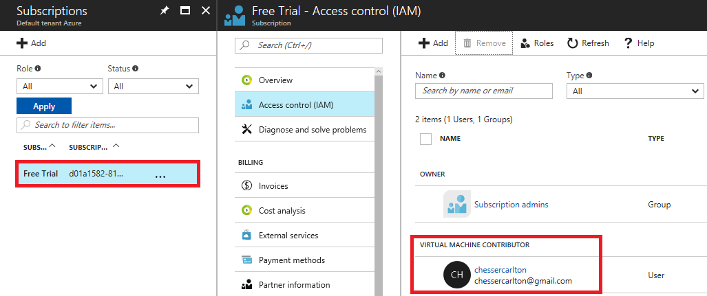

The normal behavior for this external user with this built-in role is to see and manage only virtual machines and their adjacent Resource Manager only resources necessary while deploying. By design, these limited roles offer access only to their correspondent resources created in the Azure portal, regardless some can still be deployed in the classic portal as well (for example: virtual machines).


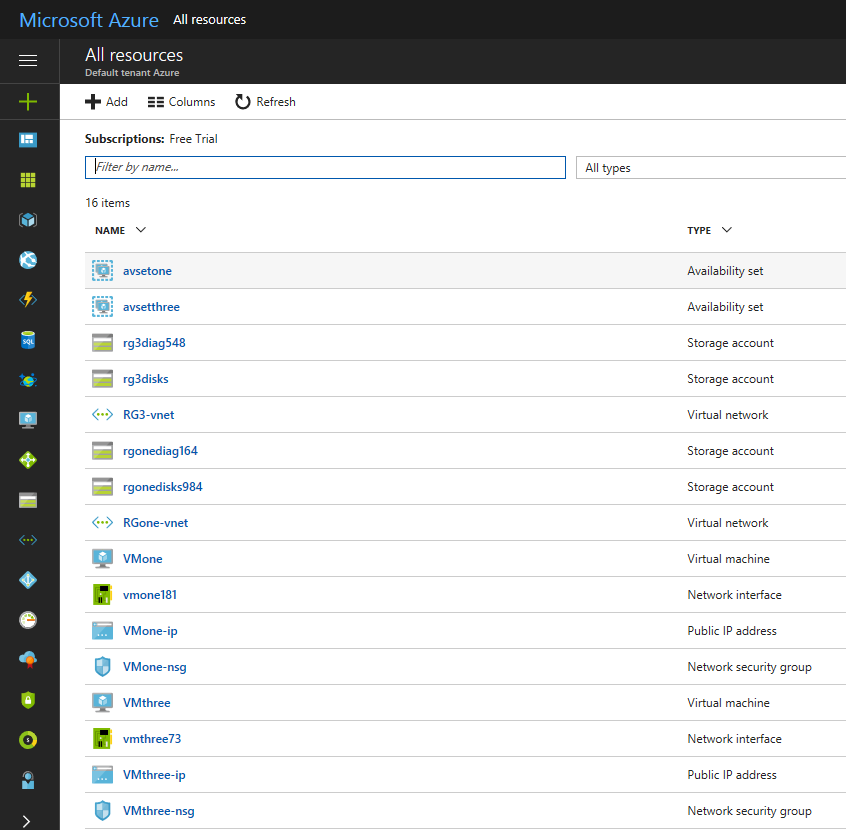

## Grant access at a subscription level for a user in the same directory
The process flow is identical to adding an external user, both from the admin perspective granting the RBAC role as well as the user being granted access to the role. The difference here is that the invited user will not receive any email invitations as all the resource scopes within the subscription will be available in the dashboard after signing in.

## Assign RBAC roles at the resource group scope
Assigning an RBAC role at a **Resource Group** scope has an identical process for assigning the role at the subscription level, for both types of users - either external or internal (part of the same directory). The users which are assigned the RBAC role is to see in their environment only the resource group they have been assigned access from the **Resource Groups** icon in the Azure portal.

## Assign RBAC roles at the resource scope
Assigning an RBAC role at a resource scope in Azure has an identical process for assigning the role at the subscription level or at the resource group level, following the same workflow for both scenarios. Again, the users which are assigned the RBAC role can see only the items that they have been assigned access to, either in the **All Resources** tab or directly in their dashboard.

An important aspect for RBAC both at resource group scope or resource scope is for the users to make sure to sign-in to the correct directory.


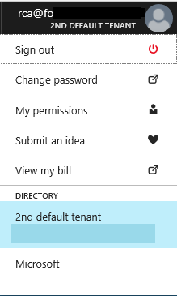

## Assign RBAC roles for an Azure Active Directory group
All the scenarios using RBAC at the three different scopes in Azure offer the privilege of managing, deploying and administering various resources as an assigned user without the need of managing a personal subscription. Regardless the RBAC role is assigned for a subscription, resource group or resource scope, all the resources created further on by the assigned users are billed under the one Azure subscription where the users have access to. This way, the users who have billing administrator permissions for that entire Azure subscription has a complete overview on the consumption, regardless who is managing the resources.

For larger organizations, RBAC roles can be applied in the same way for Azure Active Directory groups considering the perspective that the admin user wants to grant the granular access for teams or entire departments, not individually for each user, thus considering it as an extremely time and management efficient option. To illustrate this example, the **Contributor** role has been added to one of the groups in the tenant at the subscription level.


These groups are security groups which are provisioned and managed only within Azure Active Directory.

## Create a custom RBAC role to open support requests using PowerShell
The built-in RBAC roles which are available in Azure ensure certain permission levels based on the available resources in the environment. However, if none of these roles suit the admin user's needs, there is the option to limit access even more by creating custom RBAC roles.

Creating custom RBAC roles requires to take one built-in role, edit it and then import it back in the environment. The download and upload of the role are managed using either PowerShell or CLI.

It is important to understand the prerequisites of creating a custom role which can grant granular access at the subscription level and also allow the invited user the flexibility of opening support requests.

For this example the built-in role **Reader** which allows users access to view all the resource scopes but not to edit them or create new ones has been customized to allow the user the option of opening support requests.

The first action of exporting the **Reader** role needs to be completed in PowerShell ran with elevated permissions as administrator.

```
Login-AzureRMAccount

Get-AzureRMRoleDefinition -Name "Reader"

Get-AzureRMRoleDefinition -Name "Reader" | ConvertTo-Json | Out-File C:\rbacrole2.json

```


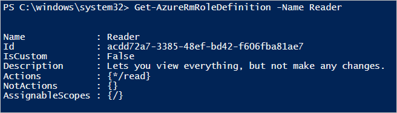

Then you need to extract the JSON template of the role.


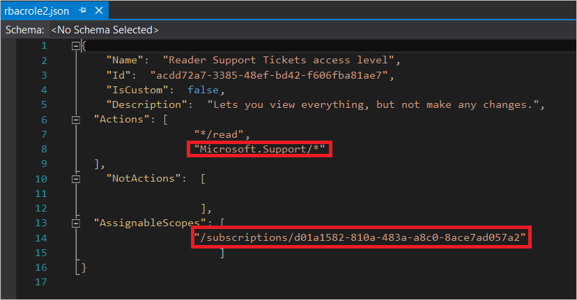

A typical RBAC role is composed out of three main sections, **Actions**, **NotActions** and **AssignableScopes**.

In the **Action** section are listed all the permitted operations for this role. It's important to understand that each action is assigned from a resource provider. In this case, for creating support tickets the **Microsoft.Support** resource provider must be listed.

To be able to see all the resource providers available and registered in your subscription, you can use PowerShell.
```
Get-AzureRMResourceProvider

```
Additionally, you can check for the all the available PowerShell cmdlets to manage the resource providers.
    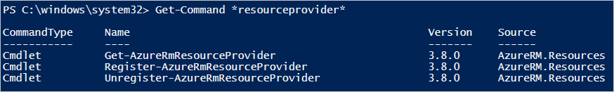

To restrict all the actions for a particular RBAC role, resource providers are listed under the section **NotActions**.
Last, it's mandatory that the RBAC role contains the explicit subscription IDs where it is used. The subscription IDs are listed under the **AssignableScopes**, otherwise you will not be allowed to import the role in your subscription.

After creating and customizing the RBAC role, it needs to be imported back the environment.

```
New-AzureRMRoleDefinition -InputFile "C:\rbacrole2.json"

```

In this example, the custom name for this RBAC role is "Reader support tickets access level" allowing the user to view everything in the subscription and also to open support requests.

> [!NOTE]
> The only two built-in RBAC roles allowing the action of opening of support requests are **Owner** and **Contributor**. For a user to be able to open support requests, he must be assigned an RBAC role only at the subscription scope, because all support requests are created based on an Azure subscription.

This new custom role has been assigned to an user from the same directory.


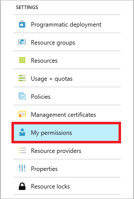

The example has been further detailed to emphasize the limits of this custom RBAC role as follows:
* Can create new support requests
* Can't create new resource scopes (for example: virtual machine)
* Can't create new resource groups


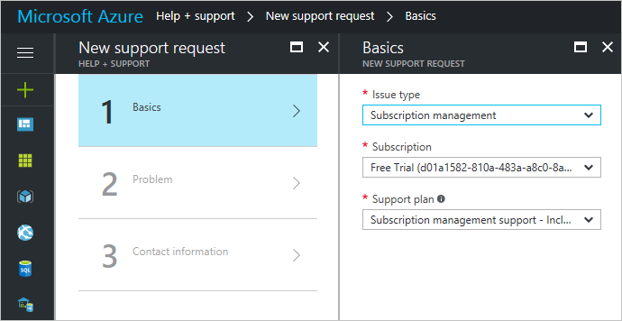


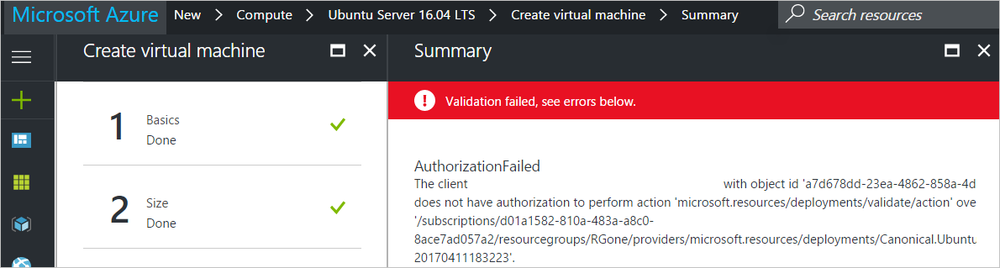


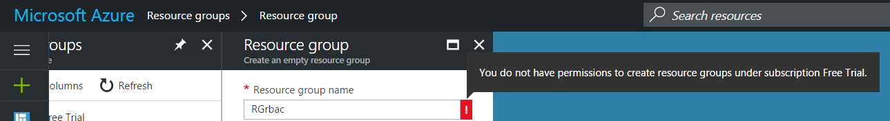

## Create a custom RBAC role to open support requests using Azure CLI
Running on a Mac and without having access to PowerShell, Azure CLI is the way to go.

The steps to create a custom role are the same, with the sole exception that using CLI the role can't be downloaded in a JSON template, but it can be viewed in the CLI.

For this example I have chosen the built-in role of **Backup Reader**.

```

azure role show "backup reader" --json

```


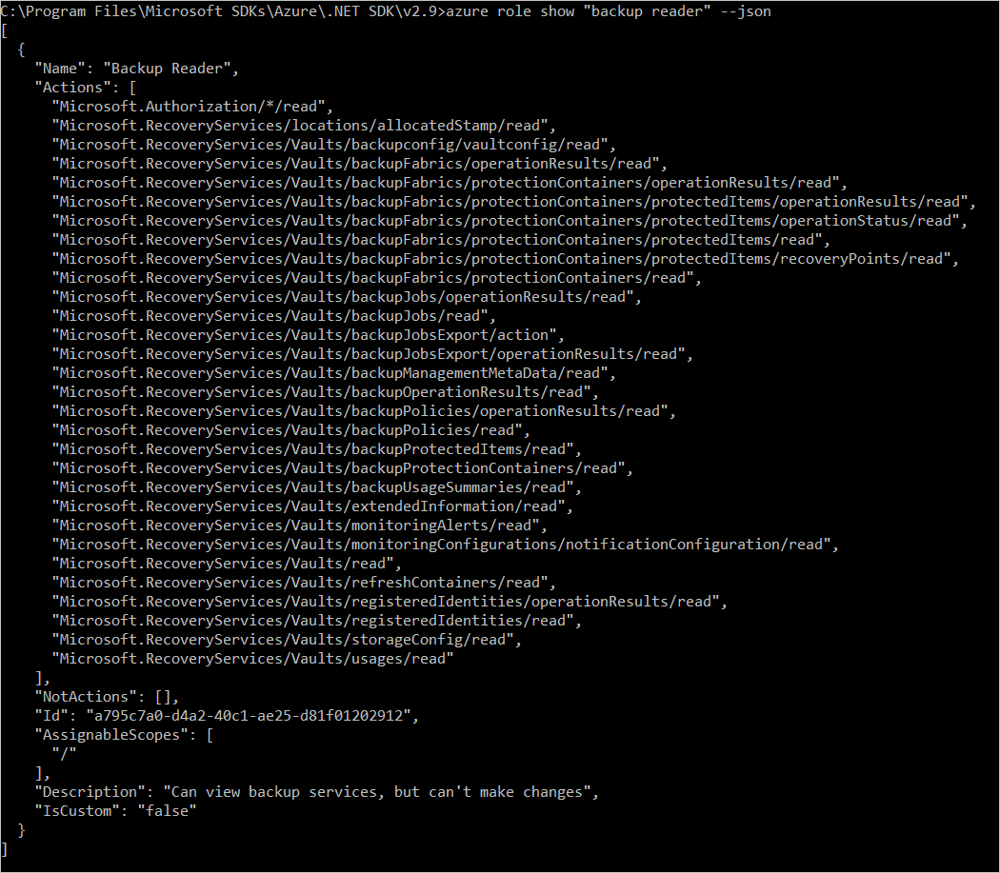

Editing the role in Visual Studio after copying the proprieties in a JSON template, the **Microsoft.Support** resource provider has been added in the **Actions** sections so that this user can open support requests while continuing to be a reader for the backup vaults. Again it is necessary to add the subscription ID where this role will be used in the **AssignableScopes** section.

```

azure role create --inputfile <path>

```


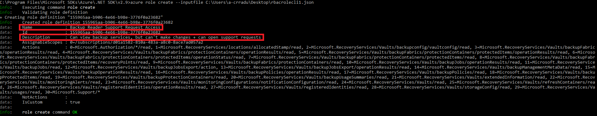

The new role is now available in the Azure portal and the assignation process is the same as in the previous examples.


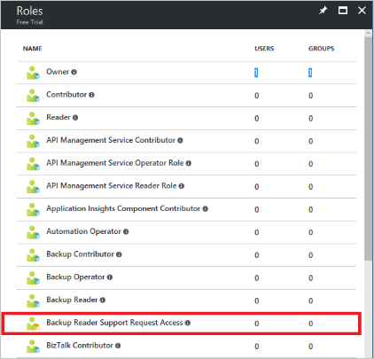

As of the latest Build 2017, the Azure Cloud Shell is generally available. Azure Cloud Shell is a complement to IDE and the Azure Portal. With this service, you get a browser-based shell that is authenticated and hosted within Azure and you can use it instead of CLI installed on your machine.


