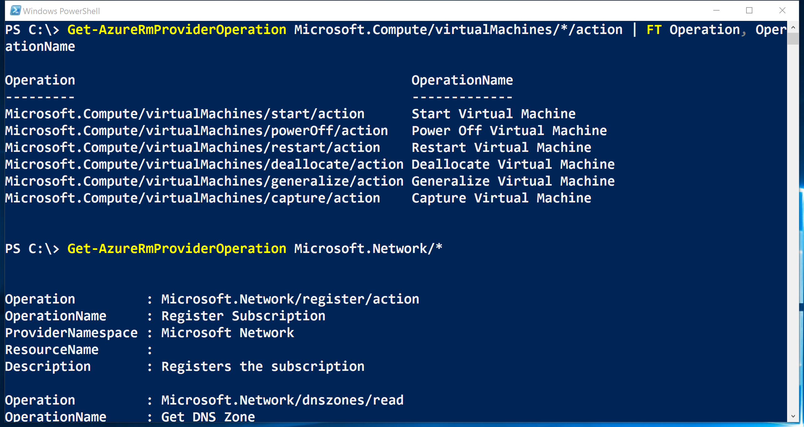
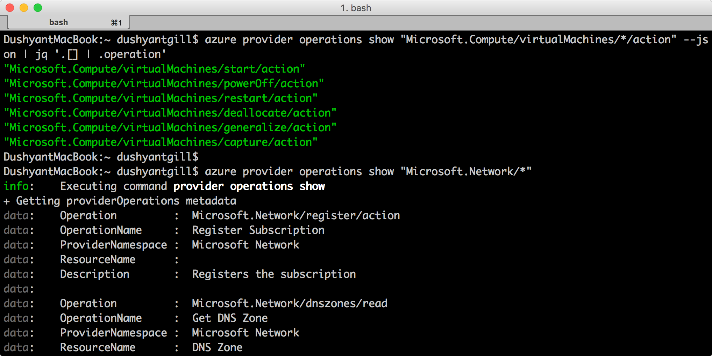

<properties
	pageTitle="Custom Roles in Azure RBAC | Microsoft Azure"
	description="Learn how to define custom roles with Azure Role-Based Access Control for more precise identity management in your Azure subscription."
	services="active-directory"
	documentationCenter=""
	authors="kgremban"
	manager="kgremban"
	editor=""/>

<tags
	ms.service="active-directory"
	ms.devlang="na"
	ms.topic="article"
	ms.tgt_pltfrm="na"
	ms.workload="identity"
	ms.date="07/25/2016"
	ms.author="kgremban"/>


# Custom Roles in Azure RBAC


Create a custom role in Azure Role-Based Access Control (RBAC) if none of the built-in roles meet your specific access needs. Custom roles can be created using [Azure PowerShell](role-based-access-control-manage-access-powershell.md), [Azure Command-Line Interface](role-based-access-control-manage-access-azure-cli.md) (CLI), and the [REST API](role-based-access-control-manage-access-rest.md). Just like built-in roles, custom roles can be assigned to users, groups, and applications at subscription, resource group, and resource scopes. Custom roles are stored in an Azure AD tenant and can be shared across all subscriptions that use that tenant as the Azure AD directory for the subsciption.

The following is an example of a custom role for monitoring and restarting virtual machines:

```
{
  "Name": "Virtual Machine Operator",
  "Id": "cadb4a5a-4e7a-47be-84db-05cad13b6769",
  "IsCustom": true,
  "Description": "Can monitor and restart virtual machines.",
  "Actions": [
    "Microsoft.Storage/*/read",
    "Microsoft.Network/*/read",
    "Microsoft.Compute/*/read",
    "Microsoft.Compute/virtualMachines/start/action",
    "Microsoft.Compute/virtualMachines/restart/action",
    "Microsoft.Authorization/*/read",
    "Microsoft.Resources/subscriptions/resourceGroups/read",
    "Microsoft.Insights/alertRules/*",
    "Microsoft.Insights/diagnosticSettings/*",
    "Microsoft.Support/*"
  ],
  "NotActions": [

  ],
  "AssignableScopes": [
    "/subscriptions/c276fc76-9cd4-44c9-99a7-4fd71546436e",
    "/subscriptions/e91d47c4-76f3-4271-a796-21b4ecfe3624",
    "/subscriptions/34370e90-ac4a-4bf9-821f-85eeedeae1a2"
  ]
}
```
## Actions
The **Actions** property of a custom role specifies the Azure operations to which the role grants access. It is a collection of operation strings that identify securable operations of Azure resource providers. Operation strings that contain wildcards (\*) grant access to all operations that match the operation string. For instance:

-	`*/read` grants access to read operations for all resource types of all Azure resource providers.
-	`Microsoft.Network/*/read` grants access to read operations for all resource types in the Microsoft.Network resource provider of Azure.
-	`Microsoft.Compute/virtualMachines/*` grants access to all operations of virtual machines and its child resource types.
-	`Microsoft.Web/sites/restart/Action` grants access to restart websites.

Use `Get-AzureRmProviderOperation` (in PowerShell) or `azure provider operations show` (in Azure CLI) to list operations of Azure resource providers. You may also use these commands to verify that an operation string is valid, and to expand wildcard operation strings.

```
Get-AzureRMProviderOperation Microsoft.Computer/virtualMachines/*/action | FT Operation, OperationName

Get-AzureRMProviderOperation Microsoft.Network/*
```



```
azure provider operations show "Microsoft.Compute/virtualMachines/*/action" --js on | jq '.[] | .operation'

azure provider operations show "Microsoft.Network/*"
```



## NotActions
Use the **NotActions** property if the set of operations that you wish to allow is more easily defined by excluding restricted operations. The access granted by a custom role is computed by subtracting the **NotActions** operations from the **Actions** operations.

> [AZURE.NOTE] If a user is assigned a role that excludes an operation in **NotActions**, and is assigned a second role that grants access to the same operation, the user will be allowed to perform that operation. **NotActions** is not a deny rule – it is simply a convenient way to create a set of allowed operations when specific operations need to be excluded.

## AssignableScopes
The **AssignableScopes** property of the custom role specifies the scopes (subscriptions, resource groups, or resources) within which the custom role is available for assignment. You can make the custom role available for assignment in only the subscriptions or resource groups that require it, and not clutter user experience for the rest of the subscriptions or resource groups.

Examples of valid assignable scopes include:

-	“/subscriptions/c276fc76-9cd4-44c9-99a7-4fd71546436e”, “/subscriptions/e91d47c4-76f3-4271-a796-21b4ecfe3624” - makes the role available for assignment in two subscriptions.
-	“/subscriptions/c276fc76-9cd4-44c9-99a7-4fd71546436e” - makes the role available for assignment in a single subscription.
-  “/subscriptions/c276fc76-9cd4-44c9-99a7-4fd71546436e/resourceGroups/Network” - makes the role available for assignment only in the Network resource group.

> [AZURE.NOTE] You must use at least one subscription, resource group, or resource ID.

## Custom roles access control
The **AssignableScopes** property of the custom role also controls who can view, modify, and delete the role.

- Who can create a custom role?
	Owners (and User Access Administrators) of subscriptions, resource groups, and resources can create custom roles for use in those scopes.
	The user creating the role needs to be able to perform `Microsoft.Authorization/roleDefinition/write` operation on all the **AssignableScopes** of the role.

- Who can modify a custom role?
	Owners (and User Access Administrators) of subscriptions, resource groups, and resources can modify custom roles in those scopes. Users need to be able to perform the `Microsoft.Authorization/roleDefinition/write` operation on all the **AssignableScopes** of a custom role.

- Who can view custom roles?
	All built-in roles in Azure RBAC allow viewing of roles that are available for assignment. Users who can perform the `Microsoft.Authorization/roleDefinition/read` operation at a scope can view the RBAC roles that are available for assignment at that scope.

## See also
- [Role Based Access Control](role-based-access-control-configure.md): Get started with RBAC in the Azure portal.
- Learn how to manage access with:
	- [PowerShell](role-based-access-control-manage-access-powershell.md)
	- [Azure CLI](role-based-access-control-manage-access-azure-cli.md)
	- [REST API](role-based-access-control-manage-access-rest.md)
- [Built-in roles](role-based-access-built-in-roles.md): Get details about the roles that come standard in RBAC.
