<properties
	pageTitle="Manage Role-Based Access Control (RBAC) with Azure CLI | Microsoft Azure"
	description="Learn how to manage Role-Based Access Control (RBAC) with the Azure command-line interface by listing roles and role actions and by assigning roles to the subscription and application scopes."
	services="active-directory"
	documentationCenter=""
	authors="kgremban"
	manager="femila"
	editor=""/>

<tags
	ms.service="active-directory"
	ms.devlang="na"
	ms.topic="article"
	ms.tgt_pltfrm="na"
	ms.workload="identity"
	ms.date="07/22/2016"
	ms.author="kgremban"/>

# Manage Role-Based Access Control with the Azure command-line interface

> [AZURE.SELECTOR]
- [PowerShell](role-based-access-control-manage-access-powershell.md)
- [Azure CLI](role-based-access-control-manage-access-azure-cli.md)
- [REST API](role-based-access-control-manage-access-rest.md)

You can use Role-Based Access Control (RBAC) in the Azure portal and Azure Resource Manager API to manage access to your subscription and resources at a fine-grained level. With this feature, you can grant access for Active Directory users, groups, or service principals by assigning some roles to them at a particular scope.

Before you can use the Azure command-line-interface (CLI) to manage RBAC, you must have the following:

- Azure CLI version 0.8.8 or later. To install the latest version and associate it with your Azure subscription, see [Install and Configure the Azure CLI](../xplat-cli-install.md).
- Azure Resource Manager in Azure CLI. Go to [Using the Azure CLI with the Resource Manager](../xplat-cli-azure-resource-manager.md) for more details.

## List roles

###	List all available roles
To list all available roles, use:

		azure role list

The following example shows the list of *all available roles*.

```
azure role list --json | jq '.[] | {"roleName":.properties.roleName, "description":.properties.description}'
```

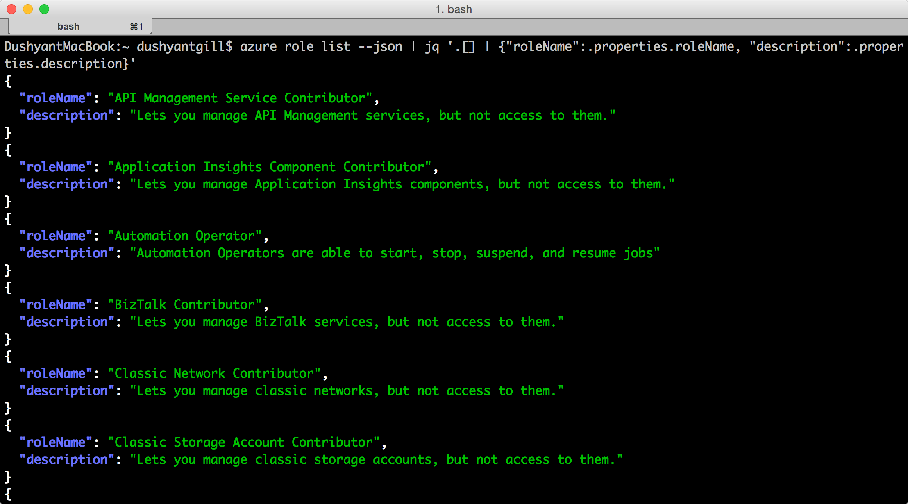

###	List actions of a role
To list the actions of a role, use:

    azure role show "<role name>"

The following example shows the actions of the *Contributor* and *Virtual Machine Contributor* roles.

```
azure role show "contributor" --json | jq '.[] | {"Actions":.properties.permissions[0].actions,"NotActions":properties.permissions[0].notActions}'

azure role show "virtual machine contributor" --json | jq '.[] | .properties.permissions[0].actions'
```

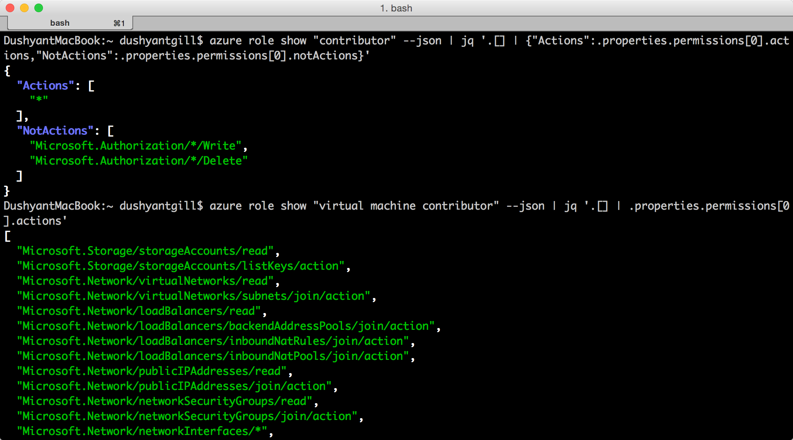

##	List access
###	List role assignments effective on a resource group
To list the role assignments that exist in a resource group, use:

    azure role assignment list --resource-group <resource group name>

The following example shows the role assignments in the *pharma-sales-projecforcast* group.

```
azure role assignment list --resource-group pharma-sales-projecforcast --json | jq '.[] | {"DisplayName":.properties.aADObject.displayName,"RoleDefinitionName":.properties.roleName,"Scope":.properties.scope}'
```

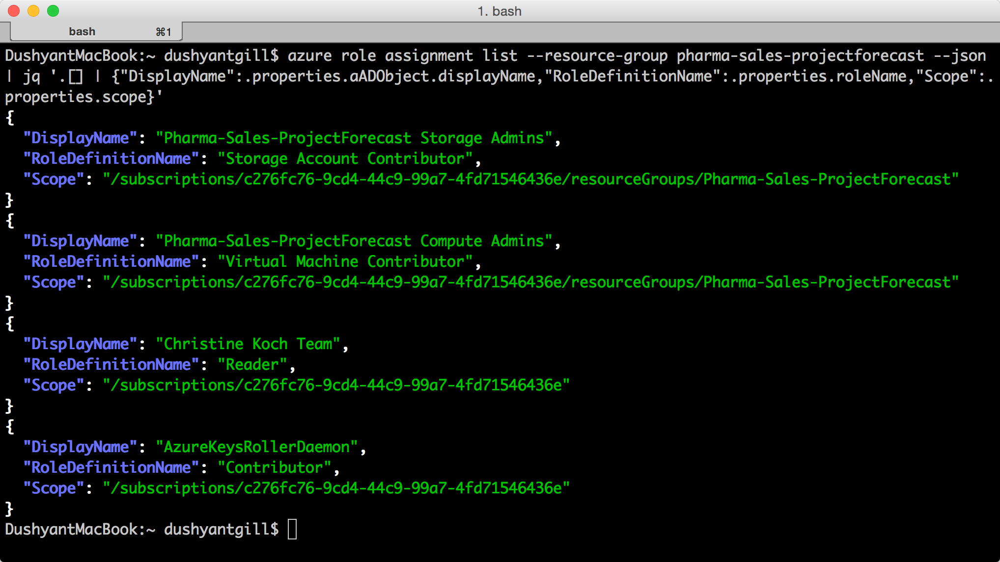

###	List role assignments for a user
To list the role assignments for a specific user and the assignments that are assigned to a user's groups, use:

	azure role assignment list --signInName <user email>

You can also see role assignments that are inherited from groups by modifying the command:

	azure role assignment list --expandPrincipalGroups --signInName <user email>

The following example shows the role assignments that are granted to the *sameert@aaddemo.com* user. This includes roles that are assigned directly to the user and roles that are inherited from groups.

```
azure role assignment list --signInName sameert@aaddemo.com --json | jq '.[] | {"DisplayName":.properties.aADObject.DisplayName,"RoleDefinitionName":.properties.roleName,"Scope":.properties.scope}'

azure role assignment list --expandPrincipalGroups --signInName sameert@aaddemo.com --json | jq '.[] | {"DisplayName":.properties.aADObject.DisplayName,"RoleDefinitionName":.properties.roleName,"Scope":.properties.scope}'
```

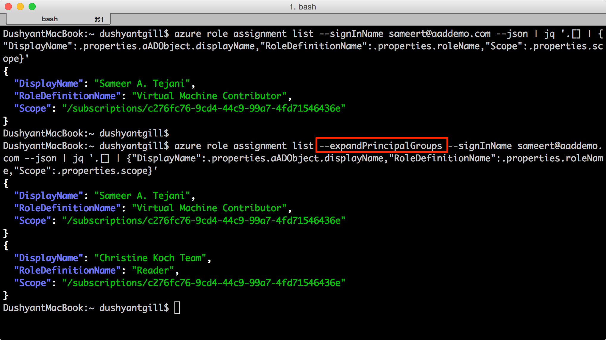

##	Grant access
To grant access after you have identified the role that you want to assign, use:

    azure role assignment create

###	Assign a role to group at the subscription scope
To assign a role to a group at the subscription scope, use:

	azure role assignment create --objectId  <group object id> --roleName <name of role> --subscription <subscription> --scope <subscription/subscription id>

The following example assigns the *Reader* role to *Christine Koch's Team* at the *subscription* scope.


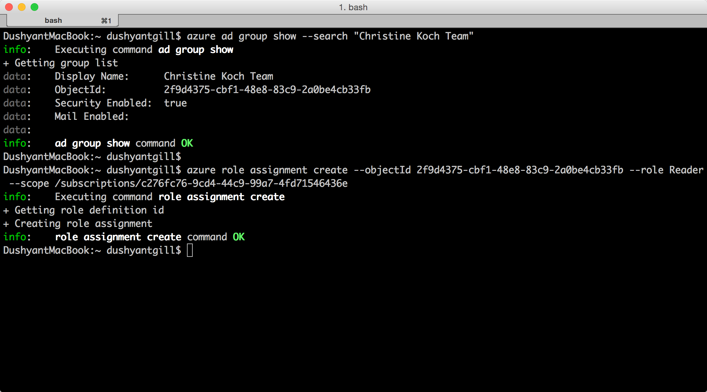

###	Assign a role to an application at the subscription scope
To assign a role to an application at the subscription scope, use:

    azure role assignment create --objectId  <applications object id> --roleName <name of role> --subscription <subscription> --scope <subscription/subscription id>

The following example grants the *Contributor* role to an *Azure AD* application on the selected subscription.

 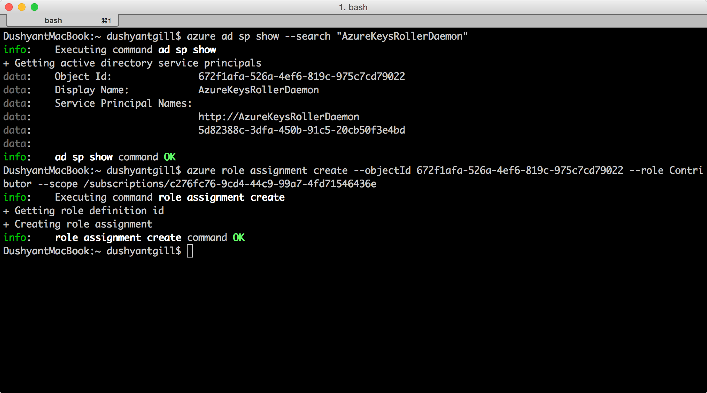

###	Assign a role to a user at the resource group scope
To assign a role to a user at the resource group scope, use:

	azure role assignment create --signInName  <user email address> --roleName "<name of role>" --resourceGroup <resource group name>

The following example grants the *Virtual Machine Contributor* role to *samert@aaddemo.com* user at the *Pharma-Sales-ProjectForcast* resource group scope.

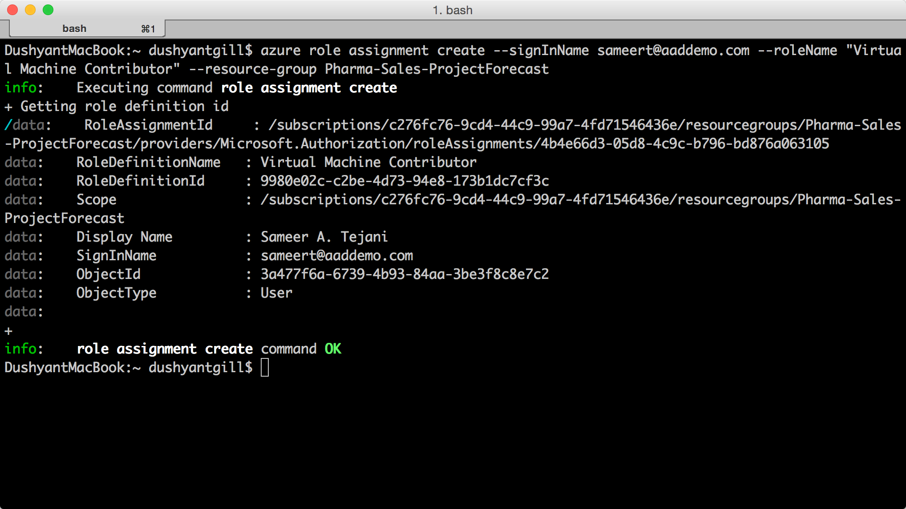

###	Assign a role to a group at the resource scope
To assign a role to a group at the resource scope, use:

    azure role assignment create --objectId <group id> --role "<name of role>" --resource-name <resource group name> --resource-type <resource group type> --parent <resource group parent> --resource-group <resource group>

The following example grants the *Virtual Machine Contributor* role to an *Azure AD* group on a *subnet*.

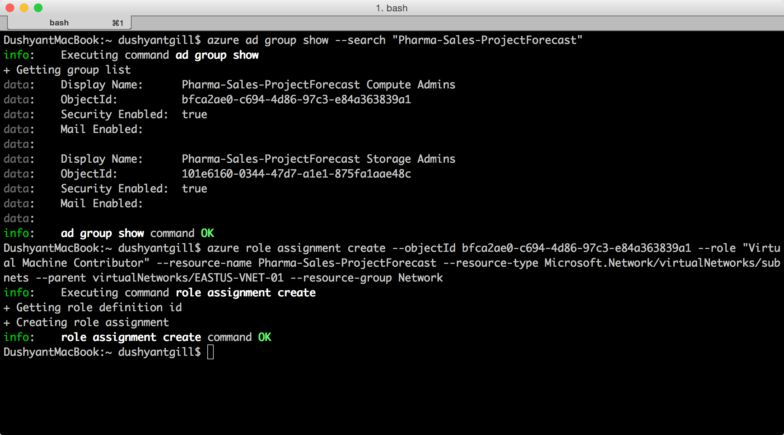

##	Remove access
To remove a role assignment, use:

    azure role assignment delete --objectId <object id to from which to remove role> --roleName "<role name>"

The following example removes the *Virtual Machine Contributor* role assignment from the *sammert@aaddemo.com* user on the *Pharma-Sales-ProjectForcast* resource group.
The example then removes the role assignment from a group on the subscription.

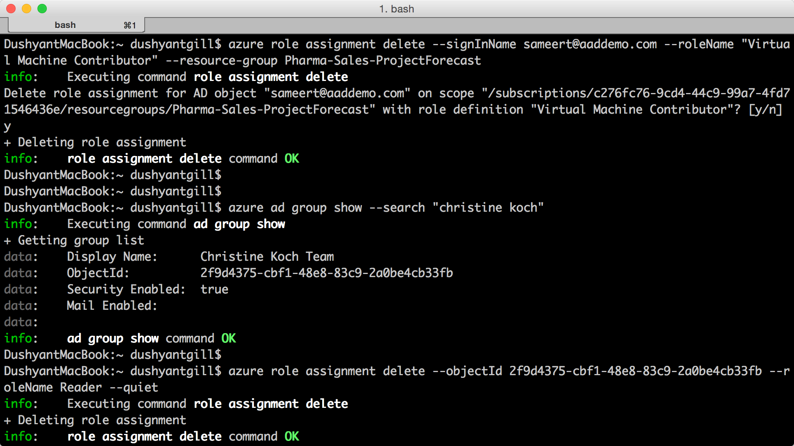

## Create a custom role
To create a custom role, use:

	azure role create --inputfile <file path>

The following example creates a custom role called *Virtual Machine Operator*. The custom role grants access to all read operations of *Microsoft.Compute*, *Microsoft.Storage*, and *Microsoft.Network* resource providers and grants access to start, restart, and monitor virtual machines. The custom role can be used in two subscriptions. This example uses a JSON file as an input.


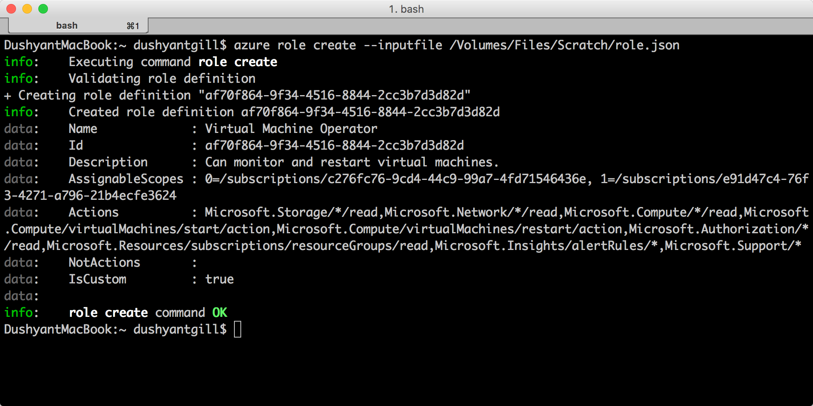

## Modify a custom role

To modify a custom role, first use the `azure role show` command to retrieve role definition. Second, make the desired changes to the role definition file. Finally, use `azure role set` to save the modified role definition.

	azure role set --inputfile <file path>

The following example adds the *Microsoft.Insights/diagnosticSettings/* operation to the **Actions**, and an Azure subscription to the **AssignableScopes** of the Virtual Machine Operator custom role.

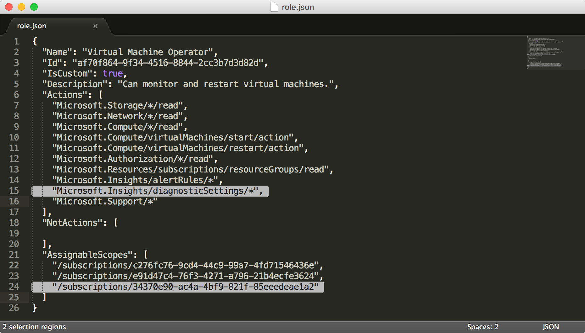

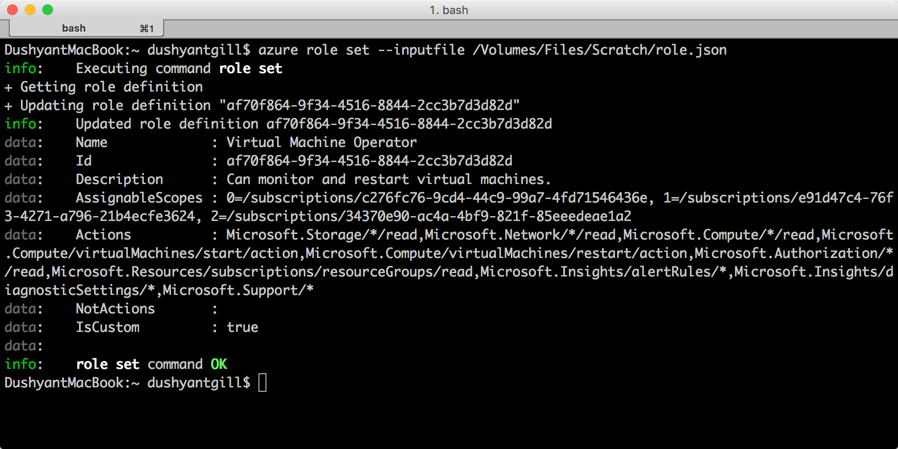

## Delete a custom role

To delete a custom role, first use the `azure role show` command to determine the **ID** of the role. Then, use the `azure role delete` command to delete the role by specifying the **ID**.

The following example removes the *Virtual Machine Operator* custom role.

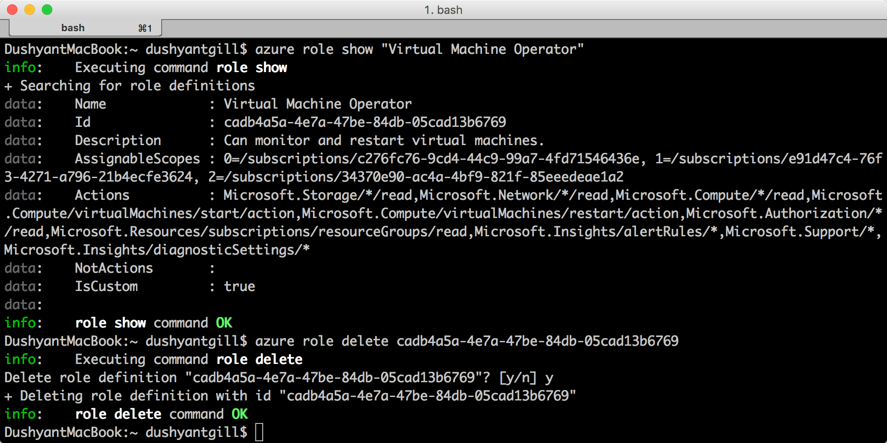

## List custom roles

To list the roles that are available for assignment at a scope, use the `azure role list` command.

The following example lists all role that are available for assignment in the selected subscription.

```
azure role list --json | jq '.[] | {"name":.properties.roleName, type:.properties.type}'
```

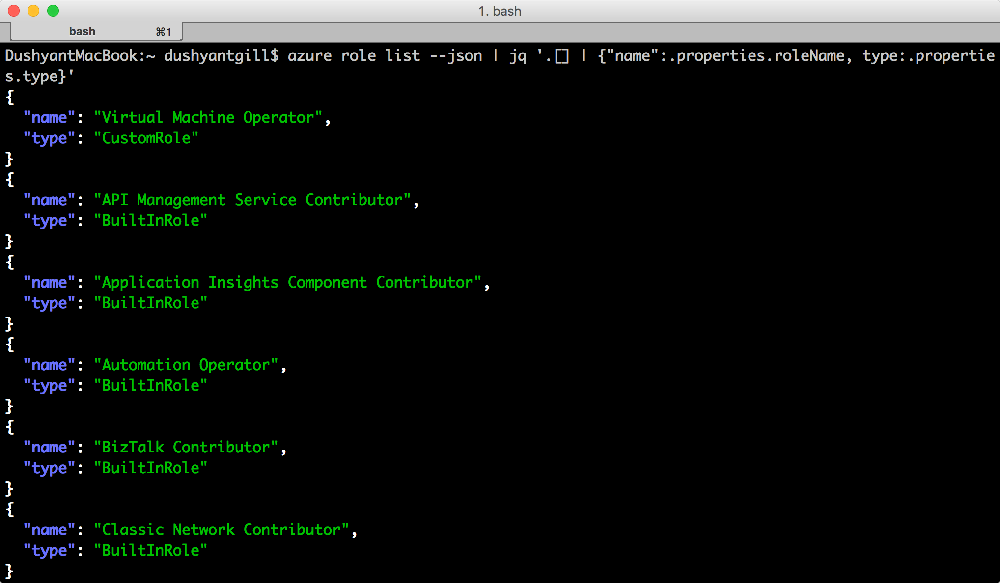

In the following example, the *Virtual Machine Operator* custom role isn’t available in the *Production4* subscription because that subscription isn’t in the **AssignableScopes** of the role.

```
azure role list --json | jq '.[] | if .properties.type == "CustomRole" then .properties.roleName else empty end'
```

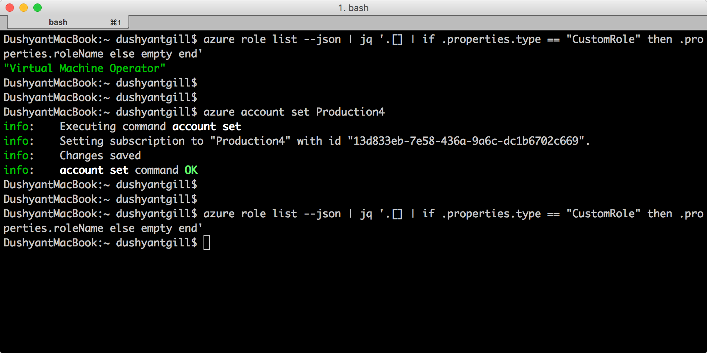


## RBAC Topics
[AZURE.INCLUDE [role-based-access-control-toc.md](../../includes/role-based-access-control-toc.md)]
