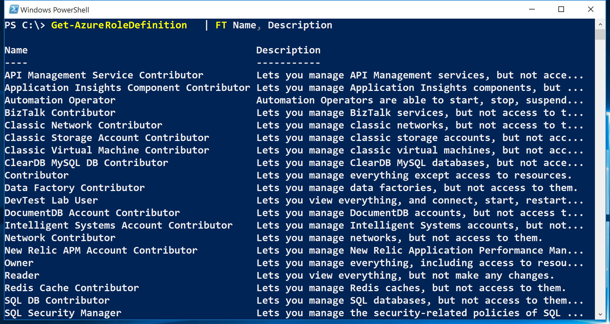
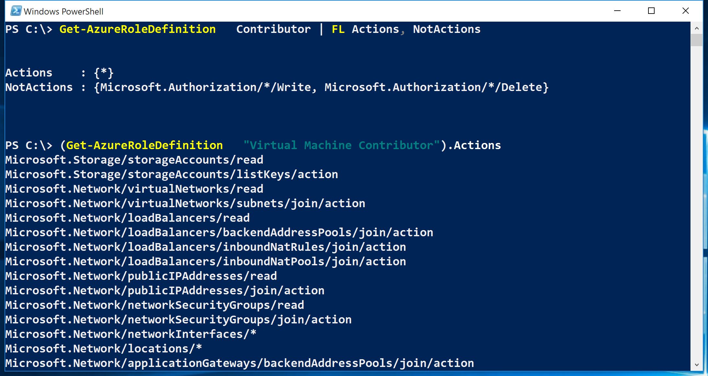
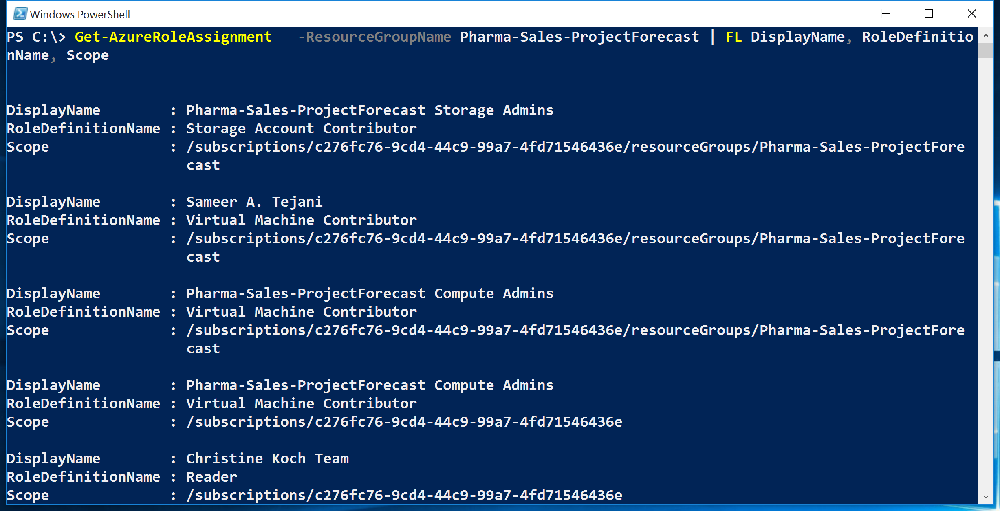
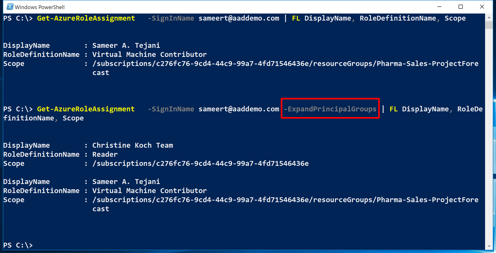
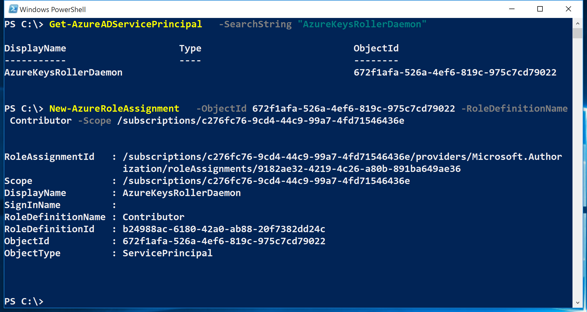
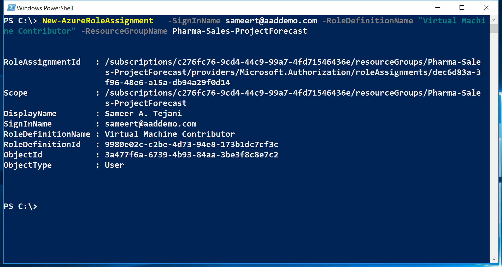
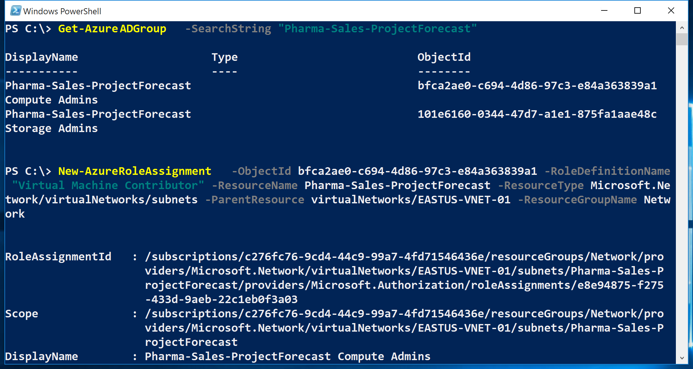
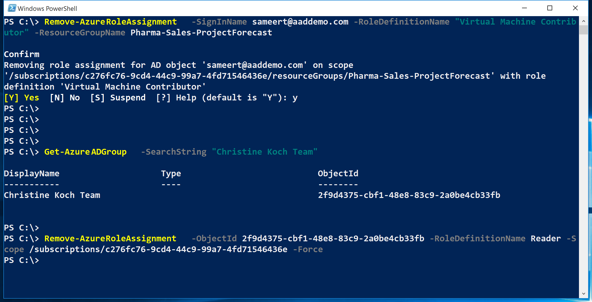
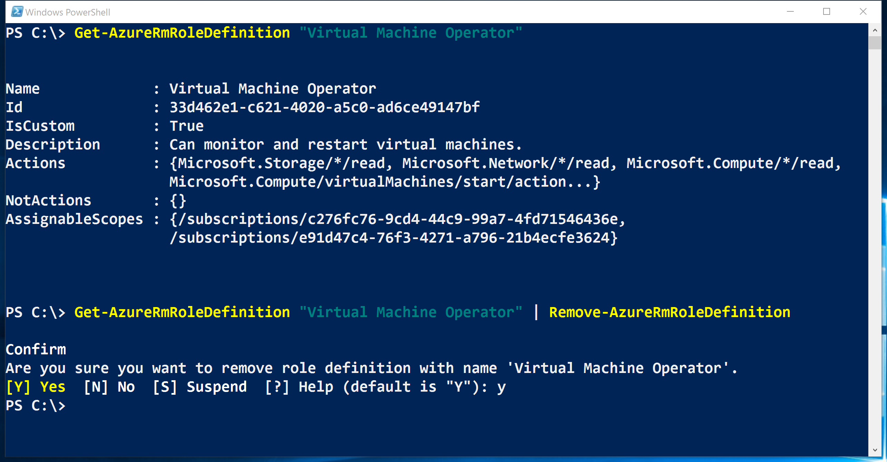
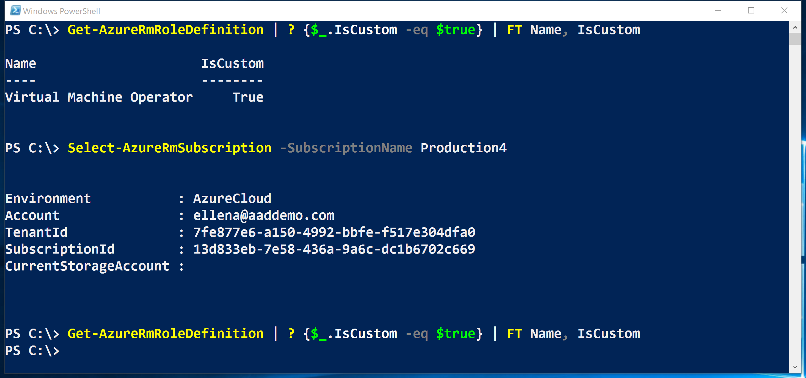

<properties
	pageTitle="Manage Role Based Access Control (RBAC) with Azure PowerShell | Microsoft Azure"
	description="How to manage RBAC with Azure PowerShell including listing roles, assigning roles, and deleting role assignments."
	services="active-directory"
	documentationCenter=""
	authors="kgremban"
	manager="femila"
	editor=""/>

<tags
	ms.service="active-directory"
	ms.devlang="na"
	ms.topic="article"
	ms.tgt_pltfrm="na"
	ms.workload="identity"
	ms.date="07/22/2016"
	ms.author="kgremban"/>

# Manage Role-Based Access Control with Azure PowerShell

> [AZURE.SELECTOR]
- [PowerShell](role-based-access-control-manage-access-powershell.md)
- [Azure CLI](role-based-access-control-manage-access-azure-cli.md)
- [REST API](role-based-access-control-manage-access-rest.md)


Role-Based Access Control (RBAC) in the Azure Portal and Azure Resource Management API allows you to manage access to your subscription at a fine-grained level. With this feature, you can grant access for Active Directory users, groups, or service principals by assigning some roles to them at a particular scope.

Before you can use PowerShell to manage RBAC, you must have the following:

- Azure PowerShell version 0.8.8 or later. To install the latest version and associate it with your Azure subscription, see [How to install and configure Azure PowerShell](../powershell-install-configure.md).

- Azure Resource Manager cmdlets. Install the [Azure Resource Manager cmdlets](https://msdn.microsoft.com/library/mt125356.aspx) in PowerShell.

## List roles

### List all available roles
To list RBAC roles available for assignment and to inspect the operations to which they grant access use `Get-AzureRmRoleDefinition`.

```
Get-AzureRmRoleDefinition | FT Name, Description
```



### List actions of a role
To list the actions for a specific role use `Get-AzureRmRoleDefinition <role name>`.

```
Get-AzureRmRoleDefinition Contributor | FL Actions, NotActions

(Get-AzureRmRoleDefinition "Virtual Machine Contributor").Actions
```



## See who has access
To list RBAC access assignments use `Get-AzureRmRoleAssignment`.

###	List role assignments at a specific scope
You can see all the access assignments for a specified subscription, resource group, or resource. For example, to see the all the active assignments for a resource group use `Get-AzureRmRoleAssignment -ResourceGroupName <resource group name>`.

```
Get-AzureRmRoleAssignment -ResourceGroupName Pharma-Sales-ProjectForcast | FL DisplayName, RoleDefinitionName, Scope
```



### List roles assigned to a user
To list all the roles assigned to a specified user, including the roles assigned to the groups he belongs to, use `Get-AzureRmRoleAssignment -SignInName <User email> -ExpandPrincipalGroups`.

```
Get-AzureRmRoleAssignment -SignInName sameert@aaddemo.com | FL DisplayName, RoleDefinitionName, Scope

Get-AzureRmRoleAssignment -SignInName sameert@aaddemo.com -ExpandPrincipalGroups | FL DisplayName, RoleDefinitionName, Scope
```



### List classic service administrator and co-admin role assignments
To list access assignments for the classic subscription administrator and co-administrators use:

    Get-AzureRmRoleAssignment -IncludeClassicAdministrators

## Grant access
### Search for object IDs
In order to assign a role, you need to identify both the object (user, group, or application) and the scope.

If you don't know the subscription ID, you can find it in the **Subscriptions** blade on the Azure portal. Or, learn how to query for it with [Get-AzureSubscription](https://msdn.microsoft.com/library/dn495302.aspx) on MSDN.

To get the object ID for an Azure AD Group use:

    Get-AzureRmADGroup -SearchString <group name in quotes>

To get the object ID for an Azure AD Service Principal, or application, use:

    Get-AzureRmADServicePrincipal -SearchString <service name in quotes>

### Assign role to application at subscription scope
To grant access to an application at subscription scope use:

    New-AzureRmRoleAssignment -ObjectId <application id> -RoleDefinitionName <role name> -Scope <subscription id>



### Assign role to user at resource group scope
To grant access to a user at resource group scope:

    New-AzureRmRoleAssignment -SignInName <email of user> -RoleDefinitionName <role name in quotes> -ResourceGroupName <resource group name>



### Assign role to group at resource scope
To grant access to a group at the resource scope use:

    New-AzureRmRoleAssignment -ObjectId <object id> -RoleDefinitionName <role name in quotes> -ResourceName <resource name> -ResourceType <resource type> -ParentResource <parent resource> -ResourceGroupName <resource group name>



## Remove access
To remove access for users, groups and applications use:

    Remove-AzureRmRoleAssignment -ObjectId <object id> -RoleDefinitionName <role name> -Scope <scope such as subscription id>



## Create custom role
To create a custom role, use the `New-AzureRmRoleDefinition` command.

When you create a custom role in PowerShell, you need to start with one of the [built-in roles](role-based-access-built-in-roles.md). Edit the attributes and add whatever Actions, notActions, or scopes you want, and then save the changes as a new role.

The following example starts with the role *Virtual Machine Contributor* and uses that to create a custom role called *Virtual Machine Operator*. The new role grants access to all read operations of *Microsoft.Compute*, *Microsoft.Storage*, and *Microsoft.Network* resource providers, and grants access to start, restart, and monitor virtual machines. The custom role can be used in two subscriptions.

```
$role = Get-AzureRmRoleDefinition "Virtual Machine Contributor"
$role.Id = $null
$role.Name = "Virtual Machine Operator"
$role.Description = "Can monitor and restart virtual machines."
$role.Actions.Clear()
$role.Actions.Add("Microsoft.Storage/*/read")
$role.Actions.Add("Microsoft.Network/*/read")
$role.Actions.Add("Microsoft.Compute/*/read")
$role.Actions.Add("Microsoft.Compute/virtualMachines/start/action")
$role.Actions.Add("Microsoft.Compute/virtualMachines/restart/action")
$role.Actions.Add("Microsoft.Authorization/*/read")
$role.Actions.Add("Microsoft.Resources/subscriptions/resourceGroups/read")
$role.Actions.Add("Microsoft.Insights/alertRules/*")
$role.Actions.Add("Microsoft.Support/*")
$role.AssignableScopes.Clear()
$role.AssignableScopes.Add("/subscriptions/c276fc76-9cd4-44c9-99a7-4fd71546436e")
$role.AssignableScopes.Add("/subscriptions/e91d47c4-76f3-4271-a796-21b4ecfe3624")
New-AzureRmRoleDefinition -Role $role
```


## Modify a custom role
To modify a custom role first, use the `Get-AzureRmRoleDefinition` command to retrieve role definition. Then, make desired changes to the role definition. Finally, use `Set-AzureRmRoleDefinition` command to save the modified role definition.

The following example adds the `Microsoft.Insights/diagnosticSettings/*` operation to the *Virtual Machine Operator* custom role.

```
$role = Get-AzureRmRoleDefinition "Virtual Machine Operator"
$role.Actions.Add("Microsoft.Insights/diagnosticSettings/*")
Set-AzureRmRoleDefinition -Role $role
```


The following example adds an Azure subscription to the assignable scopes of the Virtual Machine Operator custom role.

```
Get-AzureRmSubscription - SubscriptionName Production3

$role = Get-AzureRmRoleDefinition "Virtual Machine Operator"
$role.AssignableScopes.Add("/subscriptions/34370e90-ac4a-4bf9-821f-85eeedead1a2"
Set-AzureRmRoleDefinition -Role $role)
```


## Delete a custom role

To delete a custom role, use the `Remove-AzureRmRoleDefinition` command.

The following example removes the *Virtual Machine Operator* custom role.

```
Get-AzureRmRoleDefinition "Virtual Machine Operator"

Get-AzureRmRoleDefinition "Virtual Machine Operator" | Remove-AzureRmRoleDefinition
```



## List custom roles
To list the roles that are available for assignment at a scope, use the `Get-AzureRmRoleDefinition` command.

The following example lists all role available for assignment in the selected subscription.

```
Get-AzureRmRoleDefinition | FT Name, IsCustom
```


In the following example, the *Virtual Machine Operator* custom role isn’t available in the *Production4* subscription because that subscription isn’t in the **AssignableScopes** of the role.



## See also
- [Using Azure PowerShell with Azure Resource Manager](../powershell-azure-resource-manager.md)
[AZURE.INCLUDE [role-based-access-control-toc.md](../../includes/role-based-access-control-toc.md)]
