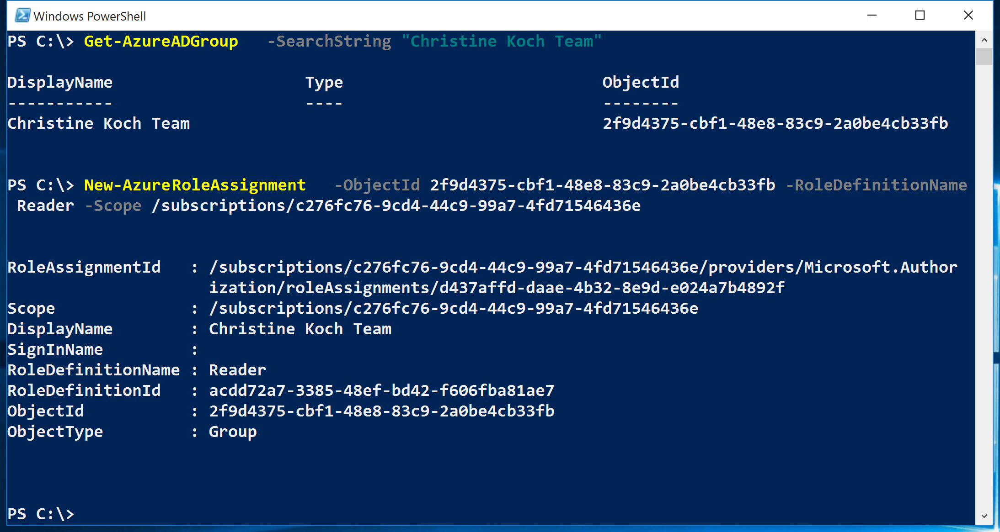

<properties
	pageTitle="Manage Role Based Access Control (RBAC) with Azure PowerShell"
	description="How to manage RBAC with Azure PowerShell"
	services="active-directory"
	documentationCenter=""
	authors="IHenkel"
	manager="stevenpo"
	editor=""/>

<tags
	ms.service="active-directory"
	ms.devlang="na"
	ms.topic="article"
	ms.tgt_pltfrm="na"
	ms.workload="identity"
	ms.date="10/07/2015"
	ms.author="inhenk"/>

# Manage Role Based Access Control (RBAC) with Azure PowerShell
<!-- Azure Selector -->
> [AZURE.SELECTOR]
- [Azure Managment Portal](role-based-access-control-manage-access-azure-portal.md)
- [PowerShell](role-based-access-control-manage-access-powershell.md)
- [Azure CLI](role-based-access-control-manage-access-azure-cli.md)

## List and view RBAC available roles
To list RBAC roles available for assignment and to inspect the operations to which they grant access use:

		Get-AzureRMRoleDefinition

## List Actions for a Specific Role
To list the actions for a specific role use:

    Get-AzureRMRoleDefinition <role name>

## List RBAC access assignments
To list RBAC access assignments effective at the specified subscription, resource, or resource group use:

    Get-AzureRMRoleAssignment

## List RBAC access assignments for a resource group
To list the access assignments for a resource group use:

    Get-AzureRMRoleAssignment --ResourceGroupName <resource group name>

## List RBAC access assignments for user and user group membership
To list access assignments to the specified user as well as to the groups of which the user is member use:

    Get-AzureRMRoleAssignment ExpandPrincipalGroups

## List RBAC access assignments to list classic subscription administrator and co-administrators
To list access assignments for the classic subscription administrator and co-administrators use:

    Get-AzureRMRoleAssignment IncludeClassicAdministrators

## Grant RBAC access to an Azure AD Group
To grant access to an Azure AD group use:

    New-AzureRMRoleAssignment --ObjId <object id> --RoleDefinitionName <role name in quotes> --Scope <scope such as subscription/subscription id>

## Grant RBAC access to an AD Service Principal
To grant access to an Azure AD group use:

    New-AzureRMRoleAssignment --ObjId <object id> --RoleDefinitionName <role name in quotes> --Scope <scope such as subscription/subscription id>

## Grant RBAC Resource Management Access to a User
To grant resource managment access to a user:

    New-AzureRMRoleAssignment --SignInName <email of user> --RoleDefinitionName <role name in quotes> --ResourceGroupName <resource group name>

## Grant RBAC Resource Managment Access to a Group at Resource Scope
To grant RBAC resource managment access to a group at the resource scope use:

    New-AzureRMRoleAssignment --ObjId <object id> --RoleDefinitionName <role name in quotes> --ResourceName <resource name> --ResourceType <resource type> --ParentResource <parent resource> --ResourceGroupName <resource group name>

## Remove access for users, groups and applications
To remove access for users, groups and applications use:

    Remove-AzureRMRoleAssignment --ObjId <object id> --RoleDefinitionName <role name> --Scope <scope such as subscription/subscription id>

## RBAC Topics
[AZURE.INCLUDE [role-based-access-control-toc.md](../includes/role-based-access-control-toc.md)]
