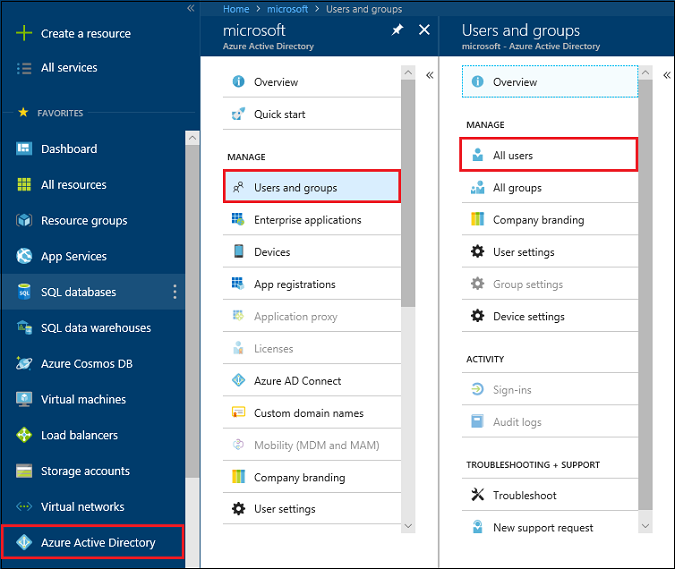
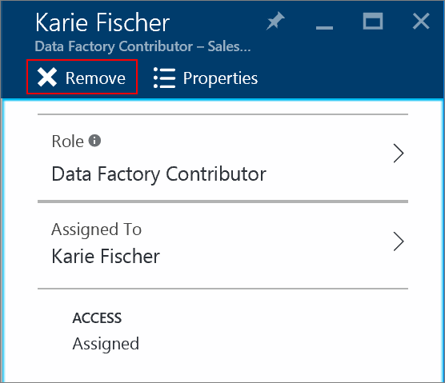

---

title: View Azure resource access assignments | Microsoft Docs
description: View and manage all the Role-Based Access Control assignments for any user or group in the Azure portal
services: active-directory
documentationcenter: ''
author: kgremban
manager: femila
editor: jeffsta

ms.assetid: e6f9e657-8ee3-4eec-a21c-78fe1b52a005
ms.service: active-directory
ms.devlang: na
ms.topic: article
ms.tgt_pltfrm: na
ms.workload: identity
ms.date: 05/04/2017
ms.author: kgremban

---
# View access assignments for users and groups in the Azure portal
> [!div class="op_single_selector"]
> * [Manage access by user or group](role-based-access-control-manage-assignments.md)
> * [Manage access by resource](role-based-access-control-configure.md)

With role-based access control (RBAC) in the Azure Active Directory (Azure AD), you can manage access to your Azure resources. 

Access assigned with RBAC is fine-grained because there are two ways you can restrict the permissions:

* **Scope:** RBAC role assignments are scoped to a specific subscription, resource group, or resource. A user given access to a single resource cannot access any other resources in the same subscription.
* **Role:** Within the scope of the assignment, access is narrowed even further by assigning a role. Roles can be high-level, like owner, or specific, like virtual machine reader.

Roles can only be assigned from within the subscription, resource group, or resource that is the scope for the assignment. But you can view all the access assignments for a given user or group in a single place. You can have up to 2000 role assignments in each subscription. 

Get more information about how to [Use role assignments to manage access to your Azure subscription resources](role-based-access-control-configure.md).

## View access assignments
To look up the access assignments for a single user or group, start in Azure Active Directory in the [Azure portal](http://portal.azure.com).

1. Select **Azure Active Directory**. If this option is not visible on your navigation list, select **More Services** and then scroll down to find **Azure Active Directory**.
2. Select **Users and Groups**, and then either **All users** or **All groups**. For this example, we focus on individual users.
    
3. Search for the user by name or username.
4. Select **Azure resources** on the user blade. All the access assignments for that user appear.

### Read permissions to view assignments
This page only shows the access assignments that you have permission to read. For example, you have read access to subscription A and go to the Azure resources blade to check a user's assignments. You can see her access assignments for subscription A, but can't see that she also has access assignments on subscription B.

## Delete access assignments
From this blade, you can delete access assignments that were assigned directly to a user or group. If the access assignment was inherited from a parent group, you need to go to the resource or subscription and manage the assignment there.

1. From the list of all the access assignments for a user or group, select the one you want to delete.
2. Select **Remove** and then **Yes** to confirm.
    

## Next steps

* Get started with Role-Based Access Control to [Use role assignments to manage access to your Azure subscription resources](role-based-access-control-configure.md)
* See the [RBAC built-in roles](role-based-access-built-in-roles.md)

