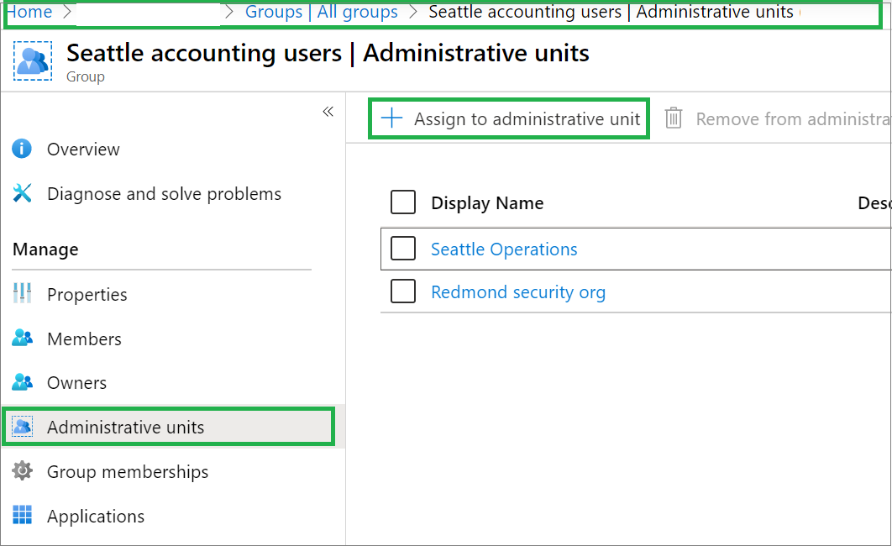
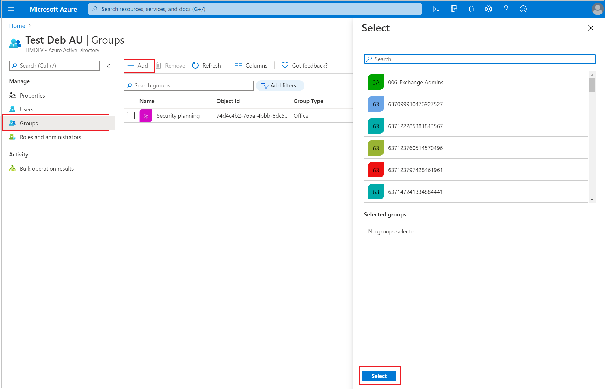
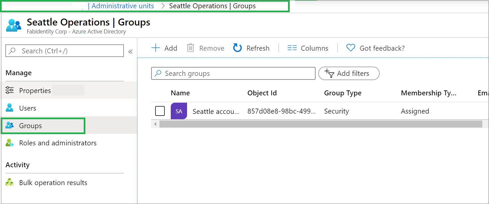
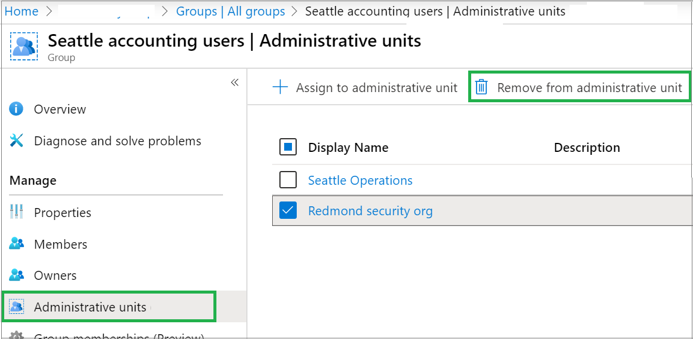

# Add and manage groups in an administrative unit in Azure Active Directory

In Azure Active Directory (Azure AD), you can add groups to an administrative unit for a more granular administrative scope of control.

## Prerequisites

- Azure AD Premium P1 or P2 license for each administrative unit administrator
- Azure AD Free licenses for administrative unit members
- Privileged Role Administrator or Global Administrator
- AzureAD module when using PowerShell
- Admin consent when using Graph explorer for Microsoft Graph API

For more information, see [Prerequisites to use PowerShell or Graph Explorer](prerequisites.md).

## Add groups to an administrative unit

You can add groups to an administrative unit by using the Azure portal, PowerShell, or Microsoft Graph.

### Azure portal

You can assign only individual groups to an administrative unit. There is no option to assign groups as a bulk operation. In the Azure portal, you can assign a group to an administrative unit in either of two ways:

* From the **Groups** pane:

  1. In the Azure portal, go to **Azure AD**.
  1. Select **Groups**, and then select the group that you want to assign to the administrative unit. 
  1. On the left pane, select **Administrative units** to display a list of the administrative units that the group is assigned to. 

     

  1. Select **Assign to administrative unit**.
  1. On the right pane, select the administrative unit.

* From the **Administrative units** > **All Groups** pane:

  1. In the Azure portal, go to **Azure AD**.
  
  1. On the left pane, select **Administrative units**, and then select **All Groups**. 
     Any groups that are already assigned to the administrative unit are displayed on the right pane. 

  1. On the **Groups** pane, select **Add**.
    The right pane lists all available groups in your Azure AD organization. 

     

  1. Select one or more groups to be assigned to the administrative unit, and then select the **Select** button.

### PowerShell

In the following example, use the `Add-AzureADMSAdministrativeUnitMember` cmdlet to add the group to the administrative unit. The object ID of the administrative unit and the object ID of the group to be added are taken as arguments. Change the highlighted section as required for your specific environment.


```powershell
$adminUnitObj = Get-AzureADMSAdministrativeUnit -Filter "displayname eq 'Test administrative unit 2'"
$GroupObj = Get-AzureADGroup -Filter "displayname eq 'TestGroup'"
Add-AzureADMSAdministrativeUnitMember -Id $adminUnitObj.Id -RefObjectId $GroupObj.ObjectId
```

### Microsoft Graph API

Run the following commands:

Request

```http
POST /administrativeUnits/{admin-unit-id}/members/$ref
```

Body

```http
{
"@odata.id":"https://graph.microsoft.com/v1.0/groups/{group-id}"
}
```

Example

```http
{
"@odata.id":"https://graph.microsoft.com/v1.0/groups/871d21ab-6b4e-4d56-b257-ba27827628f3"
}
```

## View a list of groups in an administrative unit

### Azure portal

1. In the Azure portal, go to **Azure AD**.

1. On the left pane, select **Administrative units**, and then select the administrative unit whose groups you want to view. By default, **All users** is selected on the left pane. 

1. On the left pane, select **Groups**. The right pane displays a list of groups that are members of the selected administrative unit.

   

### PowerShell

To display a list of all the members of the administrative unit, run the following command: 

```powershell
$adminUnitObj = Get-AzureADMSAdministrativeUnit -Filter "displayname eq 'Test administrative unit 2'"
Get-AzureADMSAdministrativeUnitMember -Id $adminUnitObj.Id
```

To display all the groups that are members of the administrative unit, use the following code snippet:

```powershell
foreach ($member in (Get-AzureADMSAdministrativeUnitMember -Id $adminUnitObj.Id)) 
{
if($member.ObjectType -eq "Group")
{
Get-AzureADGroup -ObjectId $member.ObjectId
}
}
```

### Microsoft Graph API

Run the following command:

Request

```http
GET /directory/administrativeUnits/{admin-unit-id}/members/$/microsoft.graph.group
```

Body

```http
{}
```

## View a list of administrative units for a group

### Azure portal

1. In the Azure portal, go to **Azure AD**.

1. On the left pane, select **Groups** to display a list of groups.

1. Select a group to open the group's profile. 

1. On the left pane, select **Administrative units** to list all the administrative units where the group is a member.

   

### PowerShell

Run the following command:

```powershell
Get-AzureADMSAdministrativeUnit | where { Get-AzureADMSAdministrativeUnitMember -ObjectId $_.ObjectId | where {$_.ObjectId -eq $groupObjId} }
```

### Microsoft Graph API

Run the following command:

```http
https://graph.microsoft.com/v1.0/groups/{group-id}/memberOf/$/Microsoft.Graph.AdministrativeUnit
```

## Remove a group from an administrative unit

### Azure portal

You can remove a group from an administrative unit in the Azure portal in either of two ways:

- Remove it from a group overview:

  1. In the Azure portal, go to **Azure AD**.
  1. On the left pane, select **Groups**, and then open the profile for the group you want to remove from an administrative unit.
  1. On the left pane, select **Administrative units** to list all the administrative units that the group is assigned to. 
  1. Select the administrative unit that you want to remove the group from, and then select **Remove from administrative unit**.

     

- Remove it from an administrative unit:

  1. In the Azure portal, go to **Azure AD**.
  1. On the left pane, select **Administrative units**, and then select the administrative unit that the group is assigned to.
  1. On the left pane, select **Groups** to list all the groups that are assigned to the administrative unit.
  1. Select the group that you want to remove, and then select **Remove groups**.

    

### PowerShell

Run the following command:

```powershell
Remove-AzureADMSAdministrativeUnitMember -ObjectId $adminUnitId -MemberId $memberGroupObjId
```

### Microsoft Graph API

Run the following command:

```http
https://graph.microsoft.com/v1.0/directory/administrativeUnits/{admin-unit-id}/members/{group-id}/$ref
```

## Next steps

- [Assign a role to an administrative unit](admin-units-assign-roles.md)
- [Manage users in an administrative unit](admin-units-add-manage-users.md)
