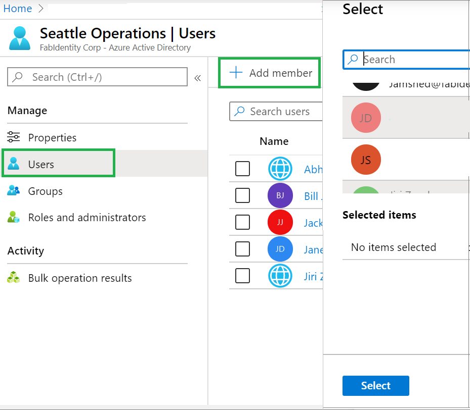
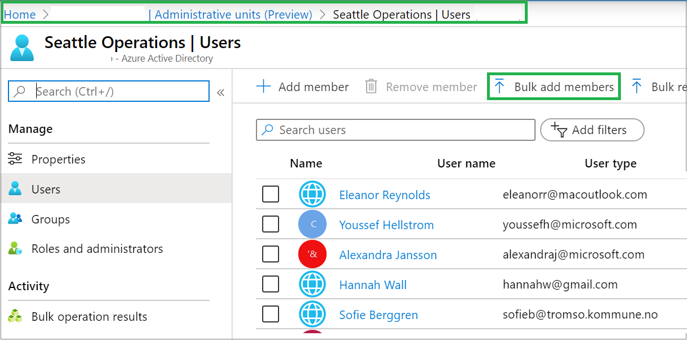
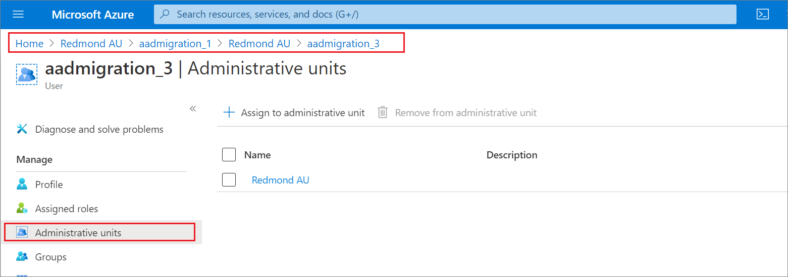
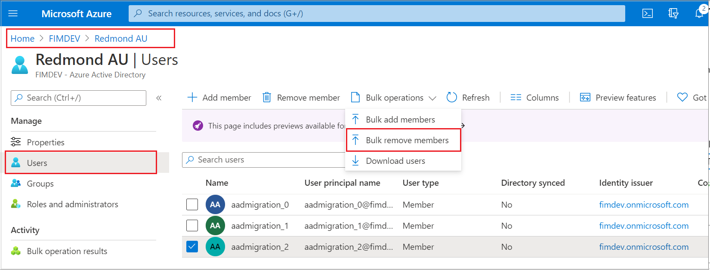

# Add and manage users in an administrative unit in Azure Active Directory

In Azure Active Directory (Azure AD), you can add users to an administrative unit for a more granular administrative scope of control.

To prepare to use PowerShell and Microsoft Graph for administrative unit management, see [Get started](admin-units-manage.md#get-started).

## Add users to an administrative unit

### Use the Azure portal

You can assign users to administrative units individually or as a bulk operation.

- Assign individual users from a user profile:

   1. Sign in to the [Azure AD admin center](https://portal.azure.com) with Privileged Role Administrator permissions.

   1. Select **Users** and then, to open the user's profile, select the user to be assigned to an administrative unit.
   
   1. Select **Administrative units**. 
   
   1. To assign the user to one or more administrative units, select **Assign to administrative unit** and then, on the right pane, select the administrative units to which you want to assign the user.

       

- Assign individual users from an administrative unit:

   1. Sign in to the [Azure AD admin center](https://portal.azure.com) with Privileged Role Administrator permissions.
   1. Select **Administrative units**, and then select the administrative unit where the user is to be assigned.
   1. Select **All users**, select **Add member** and then, on the **Add member** pane, select one or more users that you want to assign to the administrative unit.

        

- Assign users as a bulk operation:

   1. Sign in to the [Azure AD admin center](https://portal.azure.com) with Privileged Role Administrator permissions.

   1. Select **Administrative units**.

   1. Select the administrative unit to which you want to add users.

   1. Select **Users** > **Bulk activities** > **Bulk add members**. You can then download the comma-separated values (CSV) template and edit the file. The format is simple and needs a single user principal name to be added on each line. After the file is ready, save it to an appropriate location, and then upload it as part of this step.

      

### Use PowerShell

In PowerShell, use the `Add-AzureADAdministrativeUnitMember` cmdlet in the following example to add the user to the administrative unit. The object ID of the administrative unit to which you want to add the user and the object ID of the user you want to add are taken as arguments. Change the highlighted section as required for your specific environment.

```powershell
$adminUnitObj = Get-AzureADMSAdministrativeUnit -Filter "displayname eq 'Test administrative unit 2'"
$userObj = Get-AzureADUser -Filter "UserPrincipalName eq 'bill@example.onmicrosoft.com'"
Add-AzureADMSAdministrativeUnitMember -Id $adminUnitObj.ObjectId -RefObjectId $userObj.ObjectId
```


### Use Microsoft Graph

Replace the placeholder with test information and run the following command:

Request

```http
POST /administrativeUnits/{admin-unit-id}/members/$ref
```

Body

```http
{
  "@odata.id":"https://graph.microsoft.com/v1.0/users/{user-id}"
}
```

Example

```http
{
  "@odata.id":"https://graph.microsoft.com/v1.0/users/john@example.com"
}
```

## View a list of administrative units for a user

### Use the Azure portal

In the Azure portal, you can open a user's profile by doing the following:

1. Go to **Azure AD**, and then select **Users**.

1. Select the user whose profile you want to view.

1. Select **Administrative units** to display the list of administrative units to which the user has been assigned.

   

### Use PowerShell

Run the following command:

```powershell
Get-AzureADMSAdministrativeUnit | where { Get-AzureADMSAdministrativeUnitMember -Id $_.ObjectId | where {$_.RefObjectId -eq $userObjId} }
```

> [!NOTE]
> By default, `Get-AzureADAdministrativeUnitMember` returns only 100 members of an administrative unit. To retrieve more members, you can add `"-All $true"`.

### Use Microsoft Graph

Replace the placeholder with test information and run the following command:

```http
https://graph.microsoft.com/v1.0/users/{user-id}/memberOf/$/Microsoft.Graph.AdministrativeUnit
```

## Remove a single user from an administrative unit

### Use the Azure portal

You can remove a user from an administrative unit in either of two ways: 

* In the Azure portal, go to **Azure AD**, and then select **Users**. 
  1. Select the user to open the user's profile. 
  1. Select the administrative unit you want to remove the user from, and then select **Remove from administrative unit**.

     

* In the Azure portal, go to **Azure AD**, and then select **Administrative units**.
  1. Select the administrative unit you want to remove the user from. 
  1. Select the user, and then select **Remove member**.
  
     

### Use PowerShell

Run the following command:

```powershell
Remove-AzureADMSAdministrativeUnitMember -Id $adminUnitId -MemberId $memberUserObjId
```

### Use Microsoft Graph

Replace the placeholders with test information and run the following command:

```http
https://graph.microsoft.com/v1.0/directory/administrativeUnits/{admin-unit-id}/members/{user-id}/$ref
```

## Remove multiple users as a bulk operation

To remove multiple users from an administrative unit, do the following:

1. In the Azure portal, go to **Azure AD**.

1. Select **Administrative units**, and then select the administrative unit you want to remove users from. 

1. Select **Bulk remove members**, and then download the CSV template you'll use to list the users you want to remove.

   

1. Edit the downloaded CSV template with the relevant user entries. Don't remove the first two rows of the template. Add one user principal name (UPN) in each row.

   

1. Save your changes, upload the file, and then select **Submit**.

## Next steps

- [Assign a role to an administrative unit](admin-units-assign-roles.md)
- [Add groups to an administrative unit](admin-units-add-manage-groups.md)
