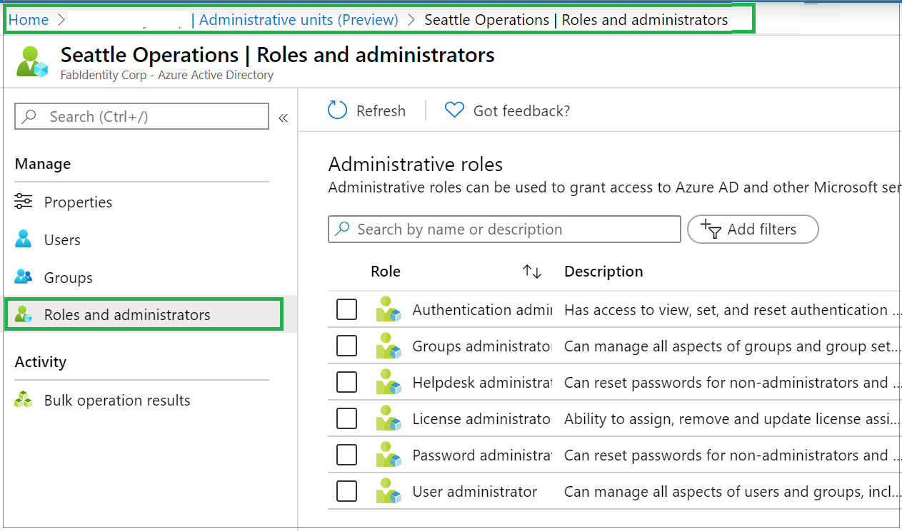
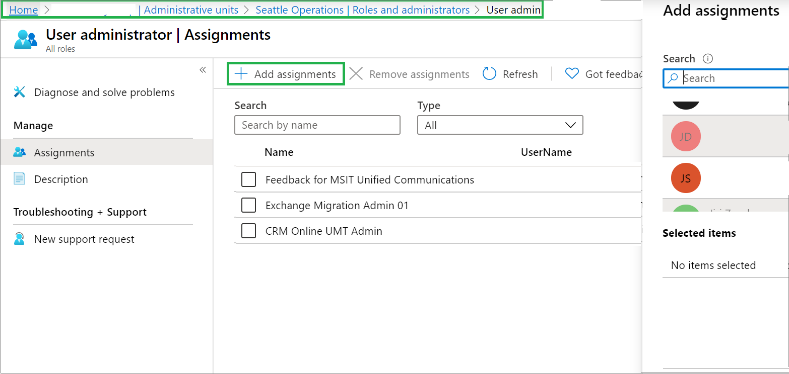

# Assign Azure AD roles with administrative unit scope

In Azure Active Directory (Azure AD), for more granular administrative control, you can assign an Azure AD role with a scope that's limited to one or more administrative units. When an Azure AD role is assigned at the scope of an administrative unit, role permissions apply only when managing members of the administrative unit itself, and do not apply to tenant-wide settings or configurations.

For example, an administrator who is assigned the Groups Administrator role at the scope of an administrative unit can manage groups that are members of the administrative unit, but they cannot manage other groups in the tenant. They also cannot manage tenant-level settings related to groups, such as expiration or group naming policies.

This article describes how to assign Azure AD roles with administrative unit scope.

## Prerequisites

- Azure AD Premium P1 or P2 license for each administrative unit administrator
- Azure AD Free licenses for administrative unit members
- Privileged Role Administrator or Global Administrator
- AzureAD module when using PowerShell
- Admin consent when using Graph explorer for Microsoft Graph API

For more information, see [Prerequisites to use PowerShell or Graph Explorer](prerequisites.md).

## Roles that can be assigned with administrative unit scope

The following Azure AD roles can be assigned with administrative unit scope. Additionally, any [custom role](custom-create.md) can be assigned with administrative unit scope as long as the custom role's permissions include at least one permission relevant to users, groups, or devices.

| Role | Description |
| -----| ----------- |
| [Authentication Administrator](permissions-reference.md#authentication-administrator) | Has access to view, set, and reset authentication method information for any non-admin user in the assigned administrative unit only. |
| [Cloud Device Administrator](permissions-reference.md#cloud-device-administrator) | Limited access to manage devices in Azure AD. |
| [Groups Administrator](permissions-reference.md#groups-administrator) | Can manage all aspects of groups in the assigned administrative unit only. |
| [Helpdesk Administrator](permissions-reference.md#helpdesk-administrator) | Can reset passwords for non-administrators in the assigned administrative unit only. |
| [License Administrator](permissions-reference.md#license-administrator) | Can assign, remove, and update license assignments within the administrative unit only. |
| [Password Administrator](permissions-reference.md#password-administrator) | Can reset passwords for non-administrators within the assigned administrative unit only. |
| [Printer Administrator](permissions-reference.md#printer-administrator) | Can manage printers and printer connectors. For more information, see [Delegate administration of printers in Universal Print](/universal-print/portal/delegated-admin#scoped-admin-vs-tenant-printer-admin). |
| [SharePoint Administrator](permissions-reference.md#sharepoint-administrator) | Can manage Microsoft 365 groups in the assigned administrative unit only. For SharePoint sites associated with Microsoft 365 groups in an administrative unit, can also update site properties (site name, URL, and external sharing policy) using the Microsoft 365 admin center. Cannot use the SharePoint admin center or SharePoint APIs to manage sites. |
| [Teams Administrator](permissions-reference.md#teams-administrator) | Can manage Microsoft 365 groups in the assigned administrative unit only.  Can manage team members in the Microsoft 365 admin center for teams associated with groups in the assigned administrative unit only.  Cannot use the Teams admin center. |
| [Teams Devices Administrator](permissions-reference.md#teams-devices-administrator) | Can perform management related tasks on Teams certified devices. |
| [User Administrator](permissions-reference.md#user-administrator) | Can manage all aspects of users and groups, including resetting passwords for limited admins within the assigned administrative unit only. Cannot currently manage users' profile photographs. |
| [&lt;Custom role&gt;](custom-create.md) | Can perform actions that apply to users, groups, or devices, according to the definition of the custom role. |

Certain role permissions apply only to non-administrator users when assigned with the scope of an administrative unit. In other words, administrative unit scoped [Helpdesk Administrators](permissions-reference.md#helpdesk-administrator) can reset passwords for users in the administrative unit only if those users do not have administrator roles. The following list of permissions are restricted when the target of an action is another administrator:

-	Read and modify user authentication methods, or reset user passwords
-	Modify sensitive user properties such as telephone numbers, alternate email addresses, or OAuth secret keys
- Delete or restore user accounts

## Security principals that can be assigned with administrative unit scope

The following security principals can be assigned to a role with an administrative unit scope:

* Users
* Azure AD role-assignable groups
* Service principals

## Service principals and guest users

Service principals and guest users will not be able to use a role assignment scoped to an administrative unit unless they are also assigned corresponding permissions to read the objects. This is because service principals and guest users do not receive directory read permissions by default, which are required to perform administrative actions. To enable a service principal or guest user to use a role assignment scoped to an administrative unit, you must assign the [Directory Readers](permissions-reference.md#directory-readers) role (or another role that includes read permissions) at a tenant scope.

It is not currently possible to assign directory read permissions scoped to an administrative unit. For more information about default permissions for users, see [default user permissions](../fundamentals/users-default-permissions.md). 

## Assign a role with an administrative unit scope

You can assign an Azure AD role with an administrative unit scope by using the Azure portal, PowerShell, or Microsoft Graph.

### Azure portal

[!INCLUDE [portal updates](~/articles/active-directory/includes/portal-update.md)]

1. Sign in to the [Azure portal](https://portal.azure.com).

1. Select **Azure Active Directory** > **Administrative units** and then select the administrative unit that you want to assign a user role scope to. 

1. On the left pane, select **Roles and administrators** to list all the available roles.

   

1. Select the role to be assigned, and then select **Add assignments**. 

1. On the **Add assignments** pane, select one or more users to be assigned to the role.

   

> [!Note]
> To assign a role on an administrative unit by using Azure AD Privileged Identity Management (PIM), see [Assign Azure AD roles in PIM](../privileged-identity-management/pim-how-to-add-role-to-user.md?tabs=new#assign-a-role-with-restricted-scope).

### PowerShell

Use the [New-AzureADMSRoleAssignment](/powershell/module/azuread/new-azureadmsroleassignment) command and the `DirectoryScopeId` parameter to assign a role with administrative unit scope.

```powershell
$user = Get-AzureADUser -Filter "userPrincipalName eq 'Example_UPN'"
$roleDefinition = Get-AzureADMSRoleDefinition -Filter "displayName eq 'Example_role_name'"
$adminUnit = Get-AzureADMSAdministrativeUnit -Filter "displayName eq 'Example_admin_unit_name'"
$directoryScope = '/administrativeUnits/' + $adminUnit.Id
$roleAssignment = New-AzureADMSRoleAssignment -DirectoryScopeId $directoryScope -RoleDefinitionId $roleDefinition.Id -PrincipalId $user.objectId
```

### Microsoft Graph API

Use the [Add a scopedRoleMember](/graph/api/administrativeunit-post-scopedrolemembers) API to assign a role with administrative unit scope.

Request

```http
POST /directory/administrativeUnits/{admin-unit-id}/scopedRoleMembers
```
    
Body

```http
{
  "roleId": "roleId-value",
  "roleMemberInfo": {
    "id": "id-value"
  }
}
```

## List role assignments with administrative unit scope

You can view a list of Azure AD role assignments with administrative unit scope by using the Azure portal, PowerShell, or Microsoft Graph.

### Azure portal

You can view all the role assignments created with an administrative unit scope in the [Administrative units section of Azure AD](https://portal.azure.com/?microsoft_aad_iam_adminunitprivatepreview=true&microsoft_aad_iam_rbacv2=true#blade/Microsoft_AAD_IAM/ActiveDirectoryMenuBlade/AdminUnit). 

1. Sign in to the [Azure portal](https://portal.azure.com).

1. Select **Azure Active Directory** > **Administrative units** and then select the administrative unit for the list of role assignments you want to view. 

1. Select **Roles and administrators**, and then open a role to view the assignments in the administrative unit.

### PowerShell

Use the [Get-AzureADMSScopedRoleMembership](/powershell/module/azuread/get-azureadmsscopedrolemembership) command to list role assignments with administrative unit scope.

```powershell
$adminUnit = Get-AzureADMSAdministrativeUnit -Filter "displayname eq 'Example_admin_unit_name'"
Get-AzureADMSScopedRoleMembership -Id $adminUnit.Id | fl *
```

### Microsoft Graph API

Use the [List scopedRoleMembers](/graph/api/administrativeunit-list-scopedrolemembers) API to list role assignments with administrative unit scope.

Request

```http
GET /directory/administrativeUnits/{admin-unit-id}/scopedRoleMembers
```

Body

```http
{}
```

## Next steps

- [Use Azure AD groups to manage role assignments](groups-concept.md)
- [Troubleshoot Azure AD roles assigned to groups](groups-faq-troubleshooting.yml)
