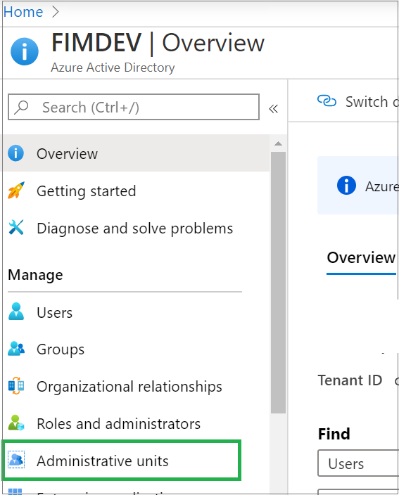
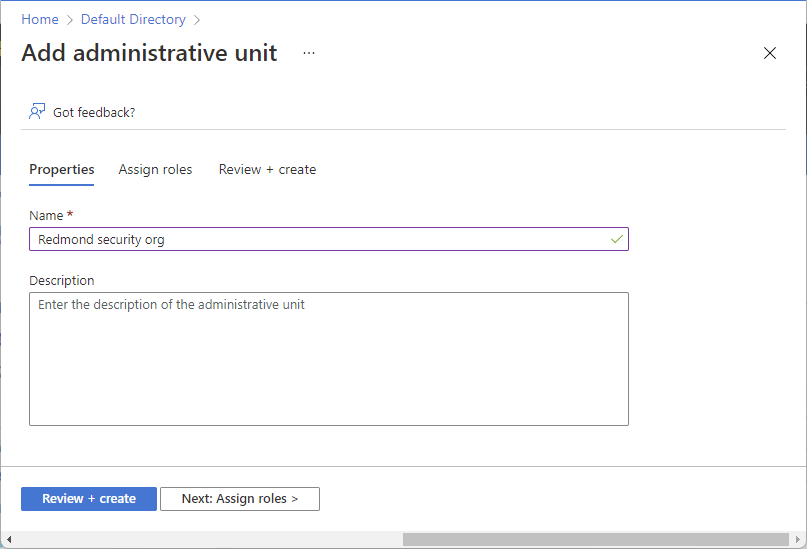
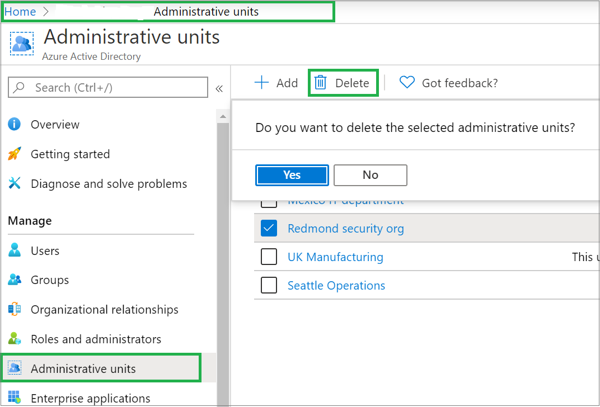

# Create or delete administrative units

> [!IMPORTANT]
> Restricted management administrative units are currently in PREVIEW.
> See the [Product Terms](https://aka.ms/EntraPreviewsTermsOfUse) for legal terms that apply to Azure features that are in beta, preview, or otherwise not yet released into general availability.

Administrative units let you subdivide your organization into any unit that you want, and then assign specific administrators that can manage only the members of that unit. For example, you could use administrative units to delegate permissions to administrators of each school at a large university, so they could control access, manage users, and set policies only in the School of Engineering.

This article describes how to create or delete administrative units to restrict the scope of role permissions in Microsoft Entra ID.

## Prerequisites

- Microsoft Entra ID P1 or P2 license for each administrative unit administrator
- Microsoft Entra ID Free licenses for administrative unit members
- Privileged Role Administrator role
- Microsoft.Graph module when using [Microsoft Graph PowerShell](/powershell/microsoftgraph/installation)
- Azure AD PowerShell module when using PowerShell
- AzureADPreview module when using PowerShell and restricted management administrative units
- Admin consent when using Graph explorer for Microsoft Graph API

For more information, see [Prerequisites to use PowerShell or Graph Explorer](prerequisites.md).

## Create an administrative unit

You can create a new administrative unit by using either the Microsoft Entra admin center, PowerShell or Microsoft Graph.

### Microsoft Entra admin center

[!INCLUDE [portal updates](~/articles/active-directory/includes/portal-update.md)]

1. Sign in to the [Microsoft Entra admin center](https://entra.microsoft.com) as at least a [Privileged Role Administrator](../roles/permissions-reference.md#privileged-role-administrator).

1. Browse to **Identity** > **Roles & admins** > **Admin units**.

    

1. Select **Add**.

1. In the **Name** box, enter the name of the administrative unit. Optionally, add a description of the administrative unit.

1. If you don't want tenant-level administrators to be able to access this administrative unit, set the **Restricted management administrative unit** toggle to **Yes**. For more information, see [Restricted management administrative units](admin-units-restricted-management.md).

    

1. Optionally, on the **Assign roles** tab, select a role and then select the users to assign the role to with this administrative unit scope.

    

1. On the **Review + create** tab, review the administrative unit and any role assignments.

1. Select the **Create** button.

### PowerShell

# [Microsoft Graph PowerShell](#tab/ms-powershell)

Use the [Connect-MgGraph](/powershell/microsoftgraph/authentication-commands?branch=main#using-connect-mggraph) command to sign in to your tenant and consent to the required permissions.

```powershell
Connect-MgGraph -Scopes "AdministrativeUnit.ReadWrite.All"
```

Use the [New-MgDirectoryAdministrativeUnit](/powershell/module/microsoft.graph.identity.directorymanagement/new-mgdirectoryadministrativeunit?branch=main) command to create a new administrative unit.

```powershell
$params = @{
    DisplayName = "Seattle District Technical Schools"
    Description = "Seattle district technical schools administration"
    Visibility = "HiddenMembership"
}
$adminUnitObj = New-MgDirectoryAdministrativeUnit -BodyParameter $params
```

Use the [New-MgBetaDirectoryAdministrativeUnit](/powershell/module/microsoft.graph.beta.identity.directorymanagement/new-mgbetadirectoryadministrativeunit) command to create a new restricted management administrative unit. Set the `IsMemberManagementRestricted` property to `$true`.

```powershell
Select-MgProfile -Name beta
$params = @{
    DisplayName = "Contoso Executive Division"
    Description = "Contoso Executive Division administration"
    Visibility = "HiddenMembership"
    IsMemberManagementRestricted = $true
}
$restrictedAU = New-MgDirectoryAdministrativeUnit -BodyParameter $params
```

# [Azure AD PowerShell](#tab/aad-powershell)

[!INCLUDE [Azure AD PowerShell migration](../includes/aad-powershell-migration-include.md)]

Use the [New-AzureADMSAdministrativeUnit](/powershell/module/azuread/new-azureadmsadministrativeunit?branch=main) command to create a new administrative unit.

```powershell
$adminUnitObj = New-AzureADMSAdministrativeUnit -Description "West Coast region" -DisplayName "West Coast"
```

Use the [New-AzureADMSAdministrativeUnit (preview)](/powershell/module/azuread/new-azureadmsadministrativeunit?view=azureadps-2.0-preview&preserve-view=true&branch=main) command to create a new restricted management administrative unit. Set the `IsMemberManagementRestricted` parameter to `$true`.

```powershell
$restrictedAU = New-AzureADMSAdministrativeUnit -DisplayName "Contoso Executive Division" -IsMemberManagementRestricted $true
```

---

### Microsoft Graph API

Use the [Create administrativeUnit](/graph/api/directory-post-administrativeunits?branch=main) API to create a new administrative unit.

Request

```http
POST https://graph.microsoft.com/v1.0/directory/administrativeUnits
```

Body

```http
{
  "displayName": "North America Operations",
  "description": "North America Operations administration"
}
```

Use the [Create administrativeUnit (beta)](/graph/api/directory-post-administrativeunits?view=graph-rest-beta&preserve-view=true&branch=main) API to create a new restricted management administrative unit. Set the `isMemberManagementRestricted` property to `true`.

Request

```http
POST https://graph.microsoft.com/beta/administrativeUnits
```

Body

```http
{ 
  "displayName": "Contoso Executive Division",
  "description": "This administrative unit contains executive accounts of Contoso Corp.", 
  "isMemberManagementRestricted": true
}
```

## Delete an administrative unit

In Microsoft Entra ID, you can delete an administrative unit that you no longer need as a unit of scope for administrative roles. Before you delete the administrative unit, you should remove any role assignments with that administrative unit scope.

### Microsoft Entra admin center

1. Sign in to the [Microsoft Entra admin center](https://entra.microsoft.com) as at least a [Privileged Role Administrator](../roles/permissions-reference.md#privileged-role-administrator).

1. Browse to **Identity** > **Roles & admins** > **Admin units**.

1. Select the administrative unit you want to delete.

1. Select **Roles and administrators**, and then open a role to view the role assignments.

1. Remove all the role assignments with the administrative unit scope.

1. Browse to **Identity** > **Roles & admins** > **Admin units**.

1. Add a check mark next to the administrative unit you want to delete.

1. Select **Delete**.

    

1. To confirm that you want to delete the administrative unit, select **Yes**.

### PowerShell

# [Microsoft Graph PowerShell](#tab/ms-powershell)

Use the [Remove-MgDirectoryAdministrativeUnit](/powershell/module/microsoft.graph.identity.directorymanagement/remove-mgdirectoryadministrativeunit?branch=main) command to delete an administrative unit.

```powershell
$adminUnitObj = Get-MgDirectoryAdministrativeUnit -Filter "DisplayName eq 'Seattle District Technical Schools'"
Remove-MgDirectoryAdministrativeUnit -AdministrativeUnitId $adminUnitObj.Id
```

# [Azure AD PowerShell](#tab/aad-powershell)

[!INCLUDE [Azure AD PowerShell migration](../includes/aad-powershell-migration-include.md)]

Use the [Remove-AzureADMSAdministrativeUnit](/powershell/module/azuread/remove-azureadmsadministrativeunit?branch=main) command to delete an administrative unit.

```powershell
$adminUnitObj = Get-AzureADMSAdministrativeUnit -Filter "DisplayName eq 'Seattle District Technical Schools'"
Remove-AzureADMSAdministrativeUnit -Id $adminUnitObj.Id
```

---

### Microsoft Graph API

Use the [Delete administrativeUnit](/graph/api/administrativeunit-delete) API to delete an administrative unit.

```http
DELETE https://graph.microsoft.com/v1.0/directory/administrativeUnits/{admin-unit-id}
```

## Next steps

- [Add users, groups, or devices to an administrative unit](admin-units-members-add.md)
- [Assign Microsoft Entra roles with administrative unit scope](admin-units-assign-roles.md)
- [Microsoft Entra administrative units: Troubleshooting and FAQ](admin-units-faq-troubleshoot.yml)
