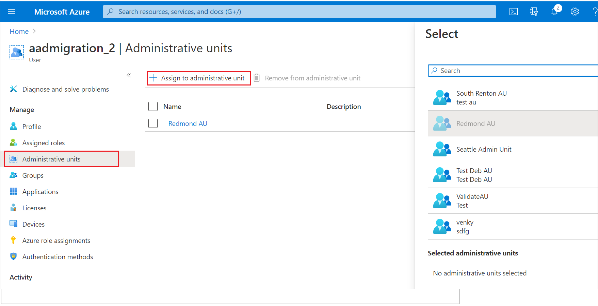
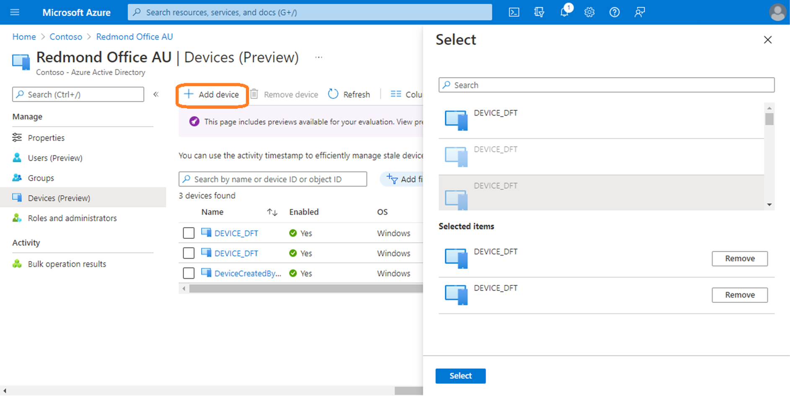
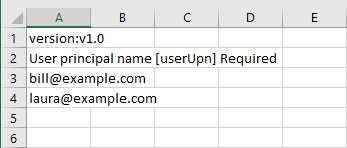
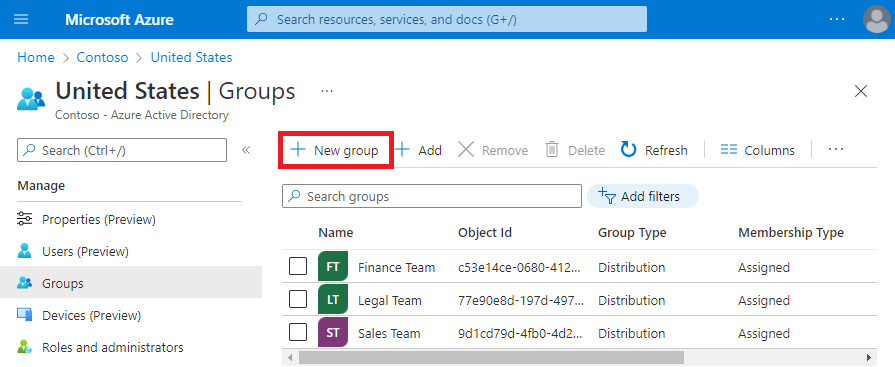

# Add users, groups, or devices to an administrative unit

In Azure Active Directory (Azure AD), you can add users, groups, or devices to an administrative unit to limit the scope of role permissions. Adding a group to an administrative unit brings the group itself into the management scope of the administrative unit, but **not** the members of the group. For additional details on what scoped administrators can do, see [Administrative units in Azure Active Directory](administrative-units.md).

This article describes how to add users, groups, or devices to administrative units manually. For information about how to add users or devices to administrative units dynamically using rules, see [Manage users or devices for an administrative unit with dynamic membership rules](admin-units-members-dynamic.md).

## Prerequisites

- Azure AD Premium P1 or P2 license for each administrative unit administrator
- Azure AD Free licenses for administrative unit members
- To add existing users, groups, or devices:
    - Privileged Role Administrator or Global Administrator
- To create new groups:
    - Groups Administrator (scoped to the administrative unit or entire directory) or Global Administrator
- Microsoft Graph PowerShell
- Admin consent when using Graph explorer for Microsoft Graph API

For more information, see [Prerequisites to use PowerShell or Graph Explorer](prerequisites.md).

## Azure portal

You can add users, groups, or devices to administrative units using the Azure portal. You can also add users in a bulk operation or create a new group in an administrative unit.

### Add a single user, group, or device to administrative units

[!INCLUDE [portal updates](~/articles/active-directory/includes/portal-update.md)]

1. Sign in to the [Azure portal](https://portal.azure.com).

1. Select **Azure Active Directory**.

1. Select one of the following:

    - **Users**
    - **Groups**
    - **Devices** > **All devices**
  
1. Select the user, group, or device you want to add to administrative units.

1. Select **Administrative units**. 

1. Select **Assign to administrative unit**.

1. In the **Select** pane, select the administrative units and then select **Select**.

    

### Add users, groups, or devices to a single administrative unit

1. Sign in to the [Azure portal](https://portal.azure.com).

1. Select **Azure Active Directory**.

1. Select **Administrative units** and then select the administrative unit you want to add users, groups, or devices to.

1. Select one of the following:

    - **Users**
    - **Groups**
    - **Devices**

1. Select **Add member**, **Add**, or **Add device**.

1. In the **Select** pane, select the users, groups, or devices you want to add to the administrative unit and then select **Select**.

    

### Add users to an administrative unit in a bulk operation

1. Sign in to the [Azure portal](https://portal.azure.com).

1. Select **Azure Active Directory**.

1. Select **Administrative units** and then select the administrative unit you want to add users to.

1. Select the administrative unit to which you want to add users.

1. Select **Users** > **Bulk operations** > **Bulk add members**.

   

1. In the **Bulk add members** pane, download the comma-separated values (CSV) template.

1. Edit the downloaded CSV template with the list of users you want to add.

    Add one user principal name (UPN) in each row. Don't remove the first two rows of the template.

1. Save your changes and upload the CSV file.

   

1. Select **Submit**.

### Create a new group in an administrative unit

1. Sign in to the [Azure portal](https://portal.azure.com).

1. Select **Azure Active Directory**.

1. Select **Administrative units** and then select the administrative unit you want to create a new group in.

1. Select **Groups**.

1. Select **New group** and complete the steps to create a new group.

    

## PowerShell

Use the [Invoke-MgGraphRequest](/powershell/microsoftgraph/authentication-commands#using-invoke-mggraphrequest) command to add user, groups, or devices to an administrative unit or create a new group in an administrative unit.

### Add users to an administrative unit

```powershell
Invoke-MgGraphRequest -Method POST -Uri https://graph.microsoft.com/v1.0/directory/administrativeUnits/{ADMIN_UNIT_ID}/members/ -Body '{
         "@odata.id": "https://graph.microsoft.com/v1.0/users/{USER_ID}"
       }'
```

### Add groups to an administrative unit

```powershell
Invoke-MgGraphRequest -Method POST -Uri https://graph.microsoft.com/v1.0/directory/administrativeUnits/{ADMIN_UNIT_ID}/members/ -Body '{
         "@odata.id": https://graph.microsoft.com/v1.0/groups/{GROUP_ID}
       }'
```

### Add devices to an administrative unit

```powershell
Invoke-MgGraphRequest -Method POST -Uri https://graph.microsoft.com/v1.0/directory/administrativeUnits/{ADMIN_UNIT_ID}/members/ -Body '{
         "@odata.id": https://graph.microsoft.com/v1.0/devices/{DEVICE_ID}
       }'
```

### Create a new group in an administrative unit

```powershell
$exampleGroup = Invoke-MgGraphRequest -Method POST -Uri https://graph.microsoft.com/v1.0/directory/administrativeUnits/{ADMIN_UNIT_ID}/members/ -Body '{
         "@odata.type": "#Microsoft.Graph.Group",
         "description": "{Example group description}",
         "displayName": "{Example group name}",
         "groupTypes": [
              "Unified"
          ],
         "mailEnabled": true,
          "mailNickname": "{exampleGroup}",
          "securityEnabled": false
       }'
```

## Microsoft Graph API

Use the [Add a member](/graph/api/administrativeunit-post-members) API to add users, groups, or devices to an administrative unit or create a new group in an administrative unit.

### Add users to an administrative unit

Request

```http
POST https://graph.microsoft.com/v1.0/directory/administrativeUnits/{admin-unit-id}/members/$ref
```

Body

```http
{
    "@odata.id":"https://graph.microsoft.com/v1.0/users/{user-id}"
}
```

Example

```http
{
    "@odata.id":"https://graph.microsoft.com/v1.0/users/john@example.com"
}
```

### Add groups to an administrative unit

Request

```http
POST https://graph.microsoft.com/v1.0/directory/administrativeUnits/{admin-unit-id}/members/$ref
```

Body

```http
{
    "@odata.id":"https://graph.microsoft.com/v1.0/groups/{group-id}"
}
```

Example

```http
{
    "@odata.id":"https://graph.microsoft.com/v1.0/groups/871d21ab-6b4e-4d56-b257-ba27827628f3"
}
```

### Add devices to an administrative unit

Request

```http
POST https://graph.microsoft.com/v1.0/directory/administrativeUnits/{admin-unit-id}/members/$ref
```

Body

```http
{
    "@odata.id":"https://graph.microsoft.com/v1.0/devices/{device-id}"
}
```

### Create a new group in an administrative unit

Request

```http
POST https://graph.microsoft.com/v1.0/directory/administrativeUnits/{admin-unit-id}/members/
```

Body

```http
{
    "@odata.type": "#Microsoft.Graph.Group",
    "description": "{Example group description}",
    "displayName": "{Example group name}",
    "groupTypes": [
        "Unified"
    ],
    "mailEnabled": true,
    "mailNickname": "{examplegroup}",
    "securityEnabled": false
}
```

## Next steps

- [Administrative units in Azure Active Directory](administrative-units.md)
- [Assign Azure AD roles with administrative unit scope](admin-units-assign-roles.md)
- [Manage users or devices for an administrative unit with dynamic membership rules](admin-units-members-dynamic.md)
- [Remove users, groups, or devices from an administrative unit](admin-units-members-remove.md)
