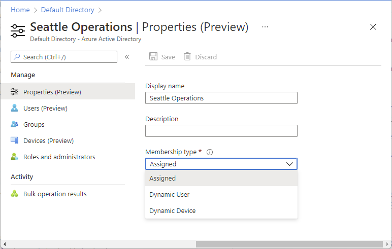
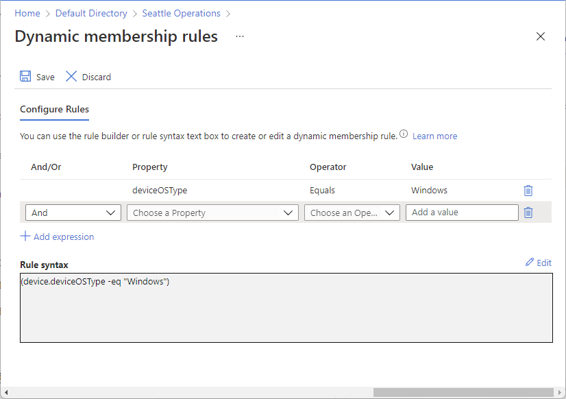
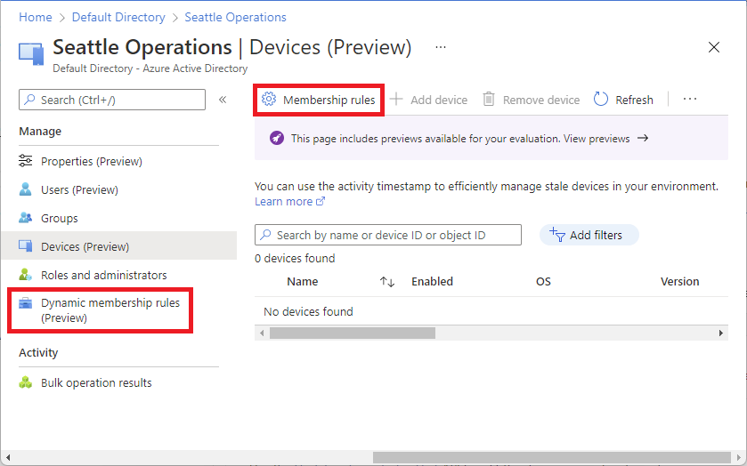

# Manage users or devices for an administrative unit with dynamic membership rules (Preview)

> [!IMPORTANT]
> Dynamic membership rules for administrative units are currently in PREVIEW.
> See the [Supplemental Terms of Use for Microsoft Azure Previews](https://azure.microsoft.com/support/legal/preview-supplemental-terms/) for legal terms that apply to Azure features that are in beta, preview, or otherwise not yet released into general availability.

You can add or remove users or devices for administrative units manually. With this preview, you can add or remove users or devices for administrative units dynamically using rules. This article describes how to create administrative units with dynamic membership rules using the Azure portal, PowerShell, or Microsoft Graph API.

> [!NOTE]
> Dynamic membership rules for administrative units can be created using the same attributes available for dynamic groups. For more information about the specific attributes available and examples on how to use them, see [Dynamic membership rules for groups in Azure Active Directory](../enterprise-users/groups-dynamic-membership.md).

Although administrative units with members assigned manually support multiple object types, such as user, group, and devices, it is currently not possible to create an administrative unit with dynamic membership rules that includes more than one object type. For example, you can create administrative units with dynamic membership rules for users or devices, but not both. Administrative units with dynamic membership rules for groups are currently not supported.

## Prerequisites

- Azure AD Premium P1 or P2 license for each administrative unit administrator
- Azure AD Premium P1 or P2 license for each administrative unit member
- Privileged Role Administrator or Global Administrator
- AzureADPreview module when using PowerShell
- Admin consent when using Graph explorer for Microsoft Graph API
- Global Azure cloud (not available in specialized clouds, such as Azure Government or Microsoft Azure operated by 21Vianet)

> [!NOTE]
> Dynamic membership rules for administrative units requires an Azure AD Premium P1 license for each unique user that is a member of one or more dynamic administrative units. You don't have to assign licenses to users for them to be members of dynamic administrative units, but you must have the minimum number of licenses in the Azure AD organization to cover all such users. For example, if you had a total of 1,000 unique users in all dynamic administrative units in your organization, you would need at least 1,000 licenses for Azure AD Premium P1 to meet the license requirement. No license is required for devices that are members of a dynamic device administrative unit.

For more information, see [Prerequisites to use PowerShell or Graph Explorer](prerequisites.md).

## Add dynamic membership rules

Follow these steps to create administrative units with dynamic membership rules for users or devices.

### Azure portal

[!INCLUDE [portal updates](~/articles/active-directory/includes/portal-update.md)]

1. Sign in to the [Azure portal](https://portal.azure.com).

1. Select **Azure Active Directory**.

1. Select **Administrative units** and then select the administrative unit that you want to add users or devices to.

1. Select **Properties**.

1. In the **Membership type** list, select **Dynamic User** or **Dynamic Device**, depending on the type of rule you want to add.

    
    
1. Select **Add dynamic query**.

1. Use the rule builder to specify the dynamic membership rule. For more information, see [Rule builder in the Azure portal](../enterprise-users/groups-dynamic-membership.md#rule-builder-in-the-azure-portal).

    

1. When finished, select **Save** to save the dynamic membership rule.

1. On the **Properties** page, select **Save** to save the membership type and query.

    The following message is displayed:

    After changing the administrative unit type, the existing membership may change based on the dynamic membership rule you provide.

1. Select **Yes** to continue.

For steps on how to edit your rule, see the following [Edit dynamic membership rules](#edit-dynamic-membership-rules) section.

### PowerShell

1. Create a dynamic membership rule. For more information, see [Dynamic membership rules for groups in Azure Active Directory](../enterprise-users/groups-dynamic-membership.md).

1. Use the [Connect-AzureAD](/powershell/module/azuread/connect-azuread) command to connect with Azure Active Directory with a user that has been assigned the Privileged Role Administrator or Global Administrator role.

    ```powershell
    # Connect to Azure AD
    Connect-AzureAD
    ```
  
1. Use the [New-AzureADMSAdministrativeUnit](/powershell/module/azuread/new-azureadmsadministrativeunit) command to create a new administrative unit with a dynamic membership rule using the following parameters:

    - `MembershipType`: `Dynamic` or `Assigned`
    - `MembershipRule`: Dynamic membership rule you created in a previous step
    - `MembershipRuleProcessingState`: `On` or `Paused`
    
    ```powershell
    # Create an administrative unit for users in the United States
    $adminUnit = New-AzureADMSAdministrativeUnit -DisplayName "Example Admin Unit" -Description "Example Dynamic Membership Admin Unit" -MembershipType "Dynamic" -MembershipRuleProcessingState "On" -MembershipRule '(user.country -eq "United States")' 
    ```

### Microsoft Graph API

1. Create a dynamic membership rule. For more information, see [Dynamic membership rules for groups in Azure Active Directory](../enterprise-users/groups-dynamic-membership.md).

1. Use the [Create administrativeUnit](/graph/api/administrativeunit-post-administrativeunits?view=graph-rest-beta&preserve-view=true) API to create a new administrative unit with a dynamic membership rule.
    
    The following shows an example of a dynamic membership rule that applies to Windows devices.

    Request
    
    ```http
    POST https://graph.microsoft.com/beta/administrativeUnits
    ```
    
    Body
    
    ```http
    {
      "displayName": "Windows Devices",
      "description": "All Contoso devices running Windows",
      "membershipType": "Dynamic",
      "membershipRule": "(deviceOSType -eq 'Windows')",
      "membershipRuleProcessingState": "On"
    }
    ```
    
## Edit dynamic membership rules

When an administrative unit has been configured for dynamic membership, the usual commands to add or remove members for the administrative unit are disabled as the dynamic membership engine retains the sole ownership of adding or removing members. To make changes to the membership, you can edit the dynamic membership rules.

### Azure portal

1. Sign in to the [Azure portal](https://portal.azure.com).

1. Select **Azure Active Directory**.

1. Select **Administrative units** and then select the administrative unit that has the dynamic membership rules you want to edit.

1. Select **Membership rules** to edit the dynamic membership rules using the rule builder.

    

    You can also open the rule builder by selecting **Dynamic membership rules** in the left navigation.

1. When finished, select **Save** to save the dynamic membership rule changes.

### PowerShell

Use the [Set-AzureADMSAdministrativeUnit](/powershell/module/azuread/set-azureadmsadministrativeunit) command to edit the dynamic membership rule.
 
```powershell
# Set a new dynamic membership rule for an administrative unit
Set-AzureADMSAdministrativeUnit -Id $adminUnit.Id -MembershipRule '(user.country -eq "Germany")'
```

### Microsoft Graph API

Use the [Update administrativeUnit](/graph/api/administrativeunit-update?view=graph-rest-beta&preserve-view=true) API to edit the dynamic membership rule.

Request

```http
PATCH https://graph.microsoft.com/beta/administrativeUnits/{id}
```

Body

```http
{
  "membershipRule": "(user.country -eq "Germany")"
}
```

## Change a dynamic administrative unit to assigned

Follow these steps to change an administrative unit with dynamic membership rules to an administrative unit where members are manually assigned.

### Azure portal

1. Sign in to the [Azure portal](https://portal.azure.com).

1. Select **Azure Active Directory**.

1. Select **Administrative units** and then select the administrative unit that you want to change to assigned.

1. Select **Properties**.

1. In the **Membership type** list, select **Assigned**.

    

1. Select **Save** to save the membership type.

    The following message is displayed:

    After changing the administrative unit type, the dynamic rule will no longer be processed. Current administrative unit members will remain in the administrative unit and the administrative unit will have assigned membership.

1. Select **Yes** to continue.

    When the membership type setting is changed from dynamic to assigned, the current members remain intact in the administrative unit. Additionally, the ability to add groups to the administrative unit is enabled. 

### PowerShell

Use the [Set-AzureADMSAdministrativeUnit](/powershell/module/azuread/set-azureadmsadministrativeunit) command to change the membership type setting.
 
```powershell
# Change an administrative unit to assigned
Set-AzureADMSAdministrativeUnit -Id $adminUnit.Id -MembershipType "Assigned" -MembershipRuleProcessingState "Paused"
```

### Microsoft Graph API

Use the [Update administrativeUnit](/graph/api/administrativeunit-update?view=graph-rest-beta&preserve-view=true) API to change the membership type setting.

Request

```http
PATCH https://graph.microsoft.com/beta/administrativeUnits/{id}
```

Body

```http
{
  "membershipType": "Assigned"
}
```

## Next steps

- [Assign Azure AD roles with administrative unit scope](admin-units-assign-roles.md)
- [Add users or groups to an administrative unit](admin-units-members-add.md)
- [Azure AD administrative units: Troubleshooting and FAQ](admin-units-faq-troubleshoot.yml)
