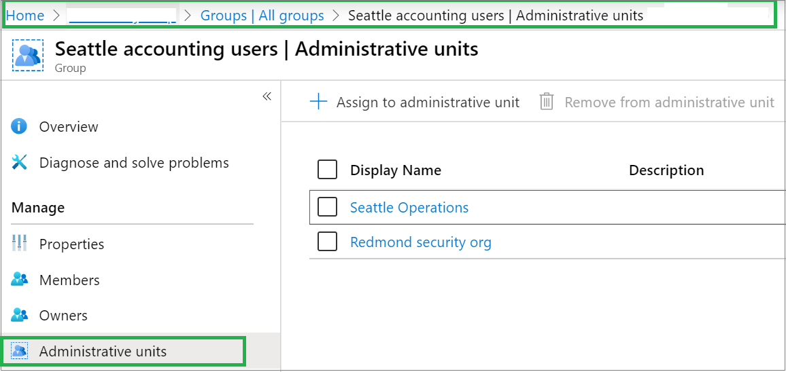
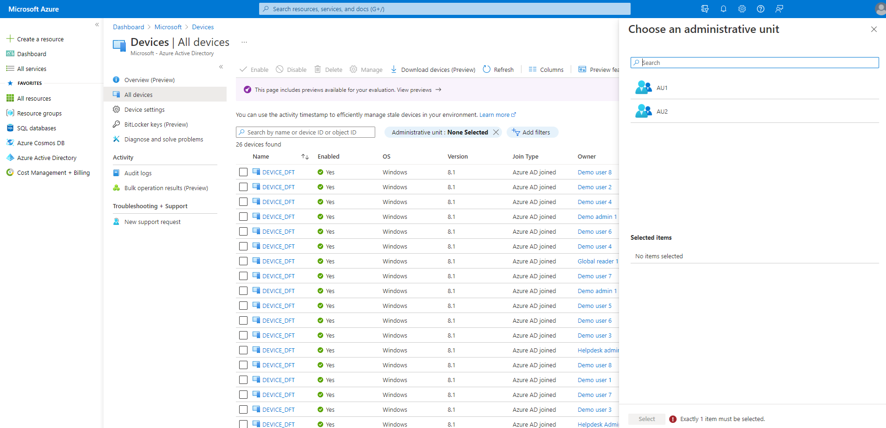
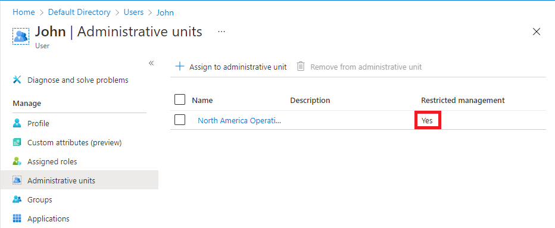

# List users, groups, or devices in an administrative unit

In Azure Active Directory (Azure AD), you can list the users, groups, or devices in administrative units.

## Prerequisites

- Azure AD Premium P1 or P2 license for each administrative unit administrator
- Azure AD Free licenses for administrative unit members
- AzureAD module when using PowerShell
- AzureADPreview module when using PowerShell for devices
- Admin consent when using Graph explorer for Microsoft Graph API

For more information, see [Prerequisites to use PowerShell or Graph Explorer](prerequisites.md).

## Azure portal

You can list the users, groups, or devices in administrative units using the Azure portal.

### List the administrative units for a single user, group, or device

[!INCLUDE [portal updates](~/articles/active-directory/includes/portal-update.md)]

1. Sign in to the [Azure portal](https://portal.azure.com).

1. Select **Azure Active Directory**.

1. Select one of the following:

    - **Users**
    - **Groups**
    - **Devices** > **All devices**

1. Select the user, group, or device you want to list their administrative units.

1. Select **Administrative units** to list all the administrative units where the user, group, or device is a member. 

    

### List the users, groups, or devices for a single administrative unit

1. Sign in to the [Azure portal](https://portal.azure.com).

1. Select **Azure Active Directory**.

1. Select **Administrative units** and then select the administrative unit that you want to list the users, groups, or devices for.

1. Select one of the following:

    - **Users**
    - **Groups**
    - **Devices**

   

### List the devices for an administrative unit by using the All devices page

1. Sign in to the [Azure portal](https://portal.azure.com).

1. Select **Azure Active Directory**.

1. Select **Devices** > **All devices**.

1. Select the filter for administrative unit.

1. Select the administrative unit whose devices you want to list.

    

### List the restricted management administrative units for a single user or group

1. Sign in to the [Azure portal](https://portal.azure.com).

1. Select **Azure Active Directory**.

1. Select **Users** or **Groups** and then select the user or group you want to list their restricted management administrative units.

1. Select **Administrative units** to list all the administrative units where the user or group is a member.

1. In the **Restricted management** column, look for administrative units that are set to **Yes**.

    

## PowerShell

Use the [Get-AzureADMSAdministrativeUnit](/powershell/module/azuread/get-azureadmsadministrativeunit) and [Get-AzureADMSAdministrativeUnitMember](/powershell/module/azuread/get-azureadmsadministrativeunitmember) commands to list users or groups for an administrative unit.

Use the [Get-AzureADMSAdministrativeUnit (Preview)](/powershell/module/azuread/get-azureadmsadministrativeunit?view=azureadps-2.0-preview&preserve-view=true) and [Get-AzureADMSAdministrativeUnitMember (Preview)](/powershell/module/azuread/get-azureadmsadministrativeunitmember?view=azureadps-2.0-preview&preserve-view=true) commands to list devices for an administrative unit.

> [!NOTE]
> By default, [Get-AzureADMSAdministrativeUnitMember](/powershell/module/azuread/get-azureadmsadministrativeunitmember) returns only top members of an administrative unit. To retrieve all members, add the `-All $true` parameter.

### List the administrative units for a user

```powershell
$userObj = Get-AzureADUser -Filter "UserPrincipalName eq 'bill@example.com'"
Get-AzureADMSAdministrativeUnit | where { Get-AzureADMSAdministrativeUnitMember -Id $_.Id | where {$_.Id -eq $userObj.ObjectId} }
```

### List the administrative units for a group

```powershell
$groupObj = Get-AzureADGroup -Filter "displayname eq 'TestGroup'"
Get-AzureADMSAdministrativeUnit | where { Get-AzureADMSAdministrativeUnitMember -Id $_.Id | where {$_.Id -eq $groupObj.ObjectId} }
```

### List the administrative units for a device

```powershell
Get-AzureADMSAdministrativeUnit | where { Get-AzureADMSAdministrativeUnitMember -ObjectId $_.ObjectId | where {$_.ObjectId -eq $deviceObjId} }
```

### List the users, groups, and devices for an administrative unit

```powershell
$adminUnitObj = Get-AzureADMSAdministrativeUnit -Filter "displayname eq 'Test administrative unit 2'"
Get-AzureADMSAdministrativeUnitMember -Id $adminUnitObj.Id
```

### List the groups for an administrative unit

```powershell
$adminUnitObj = Get-AzureADMSAdministrativeUnit -Filter "displayname eq 'Test administrative unit 2'"
foreach ($member in (Get-AzureADMSAdministrativeUnitMember -Id $adminUnitObj.Id)) 
{
    if($member.OdataType -eq "#microsoft.graph.group")
    {
        Get-AzureADGroup -ObjectId $member.Id
    }
}
```

### List the devices for an administrative unit

```powershell
$adminUnitObj = Get-AzureADMSAdministrativeUnit -Filter "displayname eq 'Test administrative unit 2'"
foreach ($member in (Get-AzureADMSAdministrativeUnitMember -Id $adminUnitObj.Id)) 
{
    if($member.ObjectType -eq "Device")
    {
        Get-AzureADDevice -ObjectId $member.ObjectId
    }
}
```

## Microsoft Graph API

### List the administrative units for a user

Use the user [List memberOf](/graph/api/user-list-memberof) API to list the administrative units a user is a direct member of.

```http
GET https://graph.microsoft.com/v1.0/users/{user-id}/memberOf/$/Microsoft.Graph.AdministrativeUnit
```

### List the administrative units for a group

Use the group [List memberOf](/graph/api/group-list-memberof) API to list the administrative units a group is a direct member of.

```http
GET https://graph.microsoft.com/v1.0/groups/{group-id}/memberOf/$/Microsoft.Graph.AdministrativeUnit
```

### List the administrative units for a device

Use the [List device memberships](/graph/api/device-list-memberof) API to list the administrative units a device is a direct member of.

```http
GET https://graph.microsoft.com/v1.0/devices/{device-id}/memberOf/$/Microsoft.Graph.AdministrativeUnit
```

### List the users, groups, or devices for an administrative unit

Use the [List members](/graph/api/administrativeunit-list-members) API to list the users, groups, or devices for an administrative unit. For member type, specify `microsoft.graph.user`, `microsoft.graph.group`, or `microsoft.graph.device`.

```http
GET https://graph.microsoft.com/v1.0/directory/administrativeUnits/{admin-unit-id}/members/$/microsoft.graph.group
```

### List whether a single user is in a restricted management administrative unit

Use the [Get a user (beta)](/graph/api/user-get?view=graph-rest-beta&preserve-view=true) API to determine whether a user is in a restricted management administrative unit. Look at the value of the `isManagementRestricted` property. If the property is `true`, it is in a restricted management administrative unit. If the property is `false`, empty, or null, it is not in a restricted management administrative unit.

```http
GET https://graph.microsoft.com/beta/users/{user-id}
```

Response

```
{ 
  "displayName": "John",
  "isManagementRestricted": true,
  "userPrincipalName": "john@contoso.com", 
}
```

## Next steps

- [Add users, groups, or devices to an administrative unit](admin-units-members-add.md)
- [Assign Azure AD roles with administrative unit scope](admin-units-assign-roles.md)
