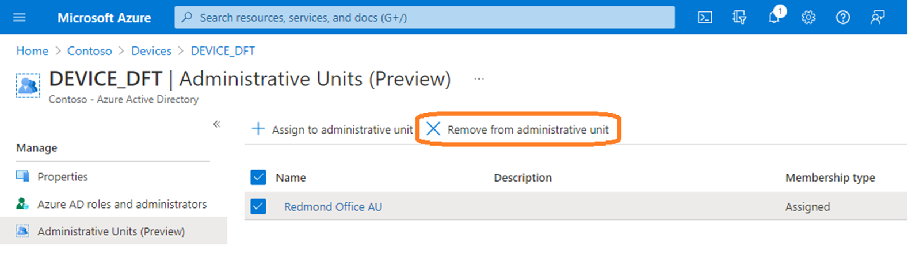
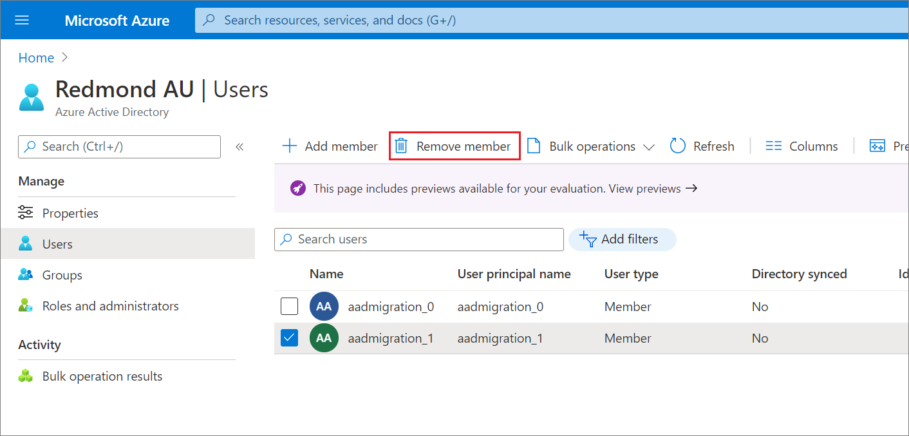

# Remove users, groups, or devices from an administrative unit

When users, groups, or devices in an administrative unit no longer need access, you can remove them.

## Prerequisites

- Microsoft Entra ID P1 or P2 license for each administrative unit administrator
- Microsoft Entra ID Free licenses for administrative unit members
- Privileged Role Administrator or Global Administrator
- Azure AD PowerShell module when using PowerShell
- AzureADPreview module when using PowerShell for devices
- Admin consent when using Graph explorer for Microsoft Graph API

For more information, see [Prerequisites to use PowerShell or Graph Explorer](prerequisites.md).

## Microsoft Entra admin center

You can remove users, groups, or devices from administrative units individually using the Microsoft Entra admin center. You can also remove users in a bulk operation.

### Remove a single user, group, or device from administrative units

[!INCLUDE [portal updates](~/articles/active-directory/includes/portal-update.md)]

1. Sign in to the [Microsoft Entra admin center](https://entra.microsoft.com) as at least a [Privileged Role Administrator](../roles/permissions-reference.md#privileged-role-administrator).

1. Browse to **Identity**.

1. Browse to one of the following:

    - **Users** > **All users**
    - **Groups** > **All groups**
    - **Devices** > **All devices**

1. Select the user, group, or device you want to remove from an administrative unit.

1. Select **Administrative units**.

1. Add check marks next to the administrative units you want to remove the user, group, or device from.

1. Select **Remove from administrative unit**.

    

### Remove users, groups, or devices from a single administrative unit

1. Sign in to the [Microsoft Entra admin center](https://entra.microsoft.com) as at least a [Privileged Role Administrator](../roles/permissions-reference.md#privileged-role-administrator).

1. Browse to **Identity** > **Roles & admins** > **Admin units**.

1. Select the administrative unit that you want to remove users, groups, or devices from.

1. Select one of the following:

    - **Users**
    - **Groups**
    - **Devices**

1. Add check marks next to the users, groups, or devices you want to remove.

1. Select **Remove member**, **Remove**, or **Remove device**.

    

### Remove users from an administrative unit in a bulk operation

1. Sign in to the [Microsoft Entra admin center](https://entra.microsoft.com) as at least a [Privileged Role Administrator](../roles/permissions-reference.md#privileged-role-administrator).

1. Browse to **Identity** > **Roles & admins** > **Admin units**.

1. Select the administrative unit that you want to remove users from.

1. Select **Users** > **Bulk operations** > **Bulk remove members**.

   

1. In the **Bulk remove members** pane, download the comma-separated values (CSV) template.

1. Edit the downloaded CSV template with the list of users you want to remove.

    Add one user principal name (UPN) in each row. Don't remove the first two rows of the template.

1. Save your changes and upload the CSV file.

1. Select **Submit**.

## PowerShell

Use the [Remove-AzureADMSAdministrativeUnitMember](/powershell/module/azuread/remove-azureadmsadministrativeunitmember) command to remove users or groups from an administrative unit.

Use the [Remove-AzureADMSAdministrativeUnitMember (Preview)](/powershell/module/azuread/remove-azureadmsadministrativeunitmember?view=azureadps-2.0-preview&preserve-view=true) command to remove devices from an administrative unit.

### Remove users from an administrative unit

```powershell
$adminUnitObj = Get-AzureADMSAdministrativeUnit -Filter "displayname eq 'Test administrative unit 2'"
$userObj = Get-AzureADUser -Filter "UserPrincipalName eq 'bill@example.com'"
Remove-AzureADMSAdministrativeUnitMember -Id $adminUnitObj.Id -MemberId $userObj.ObjectId
```

### Remove groups from an administrative unit

```powershell
$adminUnitObj = Get-AzureADMSAdministrativeUnit -Filter "displayname eq 'Test administrative unit 2'"
$groupObj = Get-AzureADGroup -Filter "displayname eq 'TestGroup'"
Remove-AzureADMSAdministrativeUnitMember -Id $adminUnitObj.Id -MemberId $groupObj.ObjectId
```

### Remove devices from an administrative unit

```powershell
Remove-AzureADMSAdministrativeUnitMember -ObjectId $adminUnitId -MemberId $deviceObjId
```
## Microsoft Graph API

Use the [Remove a member](/graph/api/administrativeunit-delete-members) API to remove users, groups, or devices from an administrative unit. For `{member-id}`, specify the user, group, or device ID.

### Remove users, groups, or devices from an administrative unit

```http
DELETE https://graph.microsoft.com/v1.0/directory/administrativeUnits/{admin-unit-id}/members/{member-id}/$ref
```

## Next steps

- [Add users, groups, or devices to an administrative unit](admin-units-members-add.md)
- [Assign Microsoft Entra roles with administrative unit scope](admin-units-assign-roles.md)
