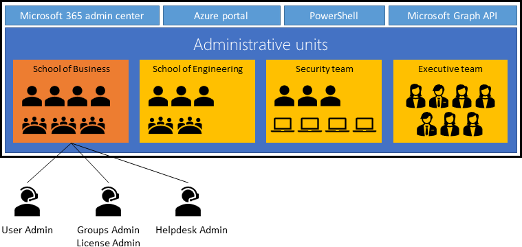

# Administrative units in Microsoft Entra ID

This article describes administrative units in Microsoft Entra ID. An administrative unit is a Microsoft Entra resource that can be a container for other Microsoft Entra resources. An administrative unit can contain only users, groups, or devices.

Administrative units restrict permissions in a role to any portion of your organization that you define. You could, for example, use administrative units to delegate the [Helpdesk Administrator](permissions-reference.md#helpdesk-administrator) role to regional support specialists, so they can manage users only in the region that they support.

Users can be members of multiple administrative units. For example, you might add users to administrative units by geography and division; Megan Bowen might be in the "Seattle" and "Marketing" administrative units.

## Deployment scenario

It can be useful to restrict administrative scope by using administrative units in organizations that are made up of independent divisions of any kind. Consider the example of a large university that's made up of many autonomous schools (School of Business, School of Engineering, and so on). Each school has a team of IT admins who control access, manage users, and set policies for their school.

A central administrator could:

- Create an administrative unit for the School of Business.
- Populate the administrative unit with only students and staff within the School of Business.
- Create a role with administrative permissions over only Microsoft Entra users in the School of Business administrative unit.
- Add the business school IT team to the role, along with its scope.

## Constraints

Here are some of the constraints for administrative units.

- Administrative units can't be nested.
- Administrative units are currently not available in [Microsoft Entra ID Governance](../governance/identity-governance-overview.md).

## Groups

Adding a group to an administrative unit brings the group itself into the management scope of the administrative unit, but **not** the members of the group. In other words, an administrator scoped to the administrative unit can manage properties of the group, such as group name or membership, but they cannot manage properties of the users or devices within that group (unless those users and devices are separately added as members of the administrative unit).

For example, a [User Administrator](permissions-reference.md#user-administrator) scoped to an administrative unit that contains a group can and can't do the following:

| Permissions | Can do |
| --- | --- |
| Manage the name of the group | :heavy_check_mark: |
| Manage the membership of the group | :heavy_check_mark: |
| Manage the user properties for individual **members** of the group | :x: |
| Manage the user authentication methods of individual **members** of the group | :x: |
| Reset the passwords of individual **members** of the group | :x: |

In order for the [User Administrator](permissions-reference.md#user-administrator) to manage the user properties or user authentication methods of individual members of the group, the group members (users) must be added directly as members of the administrative unit.

## License requirements

Using administrative units requires a Microsoft Entra ID P1 license for each administrative unit administrator who is assigned directory roles over the scope of the administrative unit, and a Microsoft Entra ID Free license for each administrative unit member. Creating administrative units is available with a Microsoft Entra ID Free license. If you are using dynamic membership rules for administrative units, each administrative unit member requires a Microsoft Entra ID P1 license. To find the right license for your requirements, see [Comparing generally available features of the Free and Premium editions](https://www.microsoft.com/security/business/identity-access-management/azure-ad-pricing).

## Manage administrative units

You can manage administrative units by using the Microsoft Entra admin center, PowerShell cmdlets and scripts, or Microsoft Graph API. For more information, see:

- [Create or delete administrative units](admin-units-manage.md)
- [Add users, groups, or devices to an administrative unit](admin-units-members-add.md)
- [Manage users or devices for an administrative unit with dynamic membership rules (Preview)](admin-units-members-dynamic.md)
- [Assign Microsoft Entra roles with administrative unit scope](admin-units-assign-roles.md)
- [Work with administrative units](/powershell/azure/active-directory/working-with-administrative-units): Covers how to work with administrative units by using PowerShell.
- [Administrative unit Graph support](/graph/api/resources/administrativeunit): Provides detailed documentation on Microsoft Graph for administrative units.

### Plan your administrative units

You can use administrative units to logically group Microsoft Entra resources. An organization whose IT department is scattered globally might create administrative units that define relevant geographical boundaries. In another scenario, where a global organization has suborganizations that are semi-autonomous in their operations, administrative units could represent the suborganizations.

The criteria on which administrative units are created are guided by the unique requirements of an organization. Administrative units are a common way to define structure across Microsoft 365 services. We recommend that you prepare your administrative units with their use across Microsoft 365 services in mind. You can get maximum value out of administrative units when you can associate common resources across Microsoft 365 under an administrative unit.

You can expect the creation of administrative units in the organization to go through the following stages:

1. **Initial adoption**: Your organization will start creating administrative units based on initial criteria, and the number of administrative units will increase as the criteria are refined.
1. **Pruning**: After the criteria are defined, administrative units that are no longer required will be deleted.
1. **Stabilization**: Your organizational structure is defined, and the number of administrative units isn't going to change significantly in the short term.

## Currently supported scenarios

As a Global Administrator or a Privileged Role Administrator, you can use the Microsoft Entra admin center to:

- Create administrative units
- Add users, groups, or devices as members of administrative units
- Manage users or devices for an administrative unit with dynamic membership rules (Preview)
- Assign IT staff to administrative unit-scoped administrator roles.

Administrative unit-scoped admins can use the Microsoft 365 admin center for basic management of users in their administrative units. A group administrator with administrative unit scope can manage groups by using PowerShell, Microsoft Graph, and the Microsoft 365 admin centers.

Administrative units apply scope only to management permissions. They don't prevent members or administrators from using their [default user permissions](../fundamentals/users-default-permissions.md) to browse other users, groups, or resources outside the administrative unit. In the Microsoft 365 admin center, users outside a scoped admin's administrative units are filtered out. But you can browse other users in the Microsoft Entra admin center, PowerShell, and other Microsoft services.

>[!Note]
>Only the features described in this section are available in the Microsoft 365 admin center. No organization-level features are available for a Microsoft Entra role with administrative unit scope.

The following sections describe current support for administrative unit scenarios.

### Administrative unit management

| Permissions | Microsoft Graph/PowerShell | Microsoft Entra admin center | Microsoft 365 admin center |
| --- | :---: | :---: | :---: |
| Create or delete administrative units | :heavy_check_mark: | :heavy_check_mark: | :heavy_check_mark: |
| Add or remove members | :heavy_check_mark: | :heavy_check_mark: | :heavy_check_mark: |
| Assign administrative unit-scoped administrators | :heavy_check_mark: | :heavy_check_mark: | :heavy_check_mark: |
| Add or remove users or devices dynamically based on rules (Preview) | :heavy_check_mark: | :heavy_check_mark: | :x: |
| Add or remove groups dynamically based on rules | :x: | :x: | :x: |

### User management

| Permissions | Microsoft Graph/PowerShell | Microsoft Entra admin center | Microsoft 365 admin center |
| --- | :---: | :---: | :---: |
| Administrative unit-scoped management of user properties, passwords | :heavy_check_mark: | :heavy_check_mark: | :heavy_check_mark: |
| Administrative unit-scoped management of user licenses | :heavy_check_mark: | :heavy_check_mark: | :heavy_check_mark: |
| Administrative unit-scoped blocking and unblocking of user sign-ins | :heavy_check_mark: | :heavy_check_mark: | :heavy_check_mark: |
| Administrative unit-scoped management of user multi-factor authentication credentials | :heavy_check_mark: | :heavy_check_mark: | :x: |

### Group management

| Permissions | Microsoft Graph/PowerShell | Microsoft Entra admin center | Microsoft 365 admin center |
| --- | :---: | :---: | :---: |
| Administrative unit-scoped creation and deletion of groups | :heavy_check_mark: | :heavy_check_mark: | :heavy_check_mark: |
| Administrative unit-scoped management of group properties and membership for Microsoft 365 groups | :heavy_check_mark: | :heavy_check_mark: | :heavy_check_mark: |
| Administrative unit-scoped management of group properties and membership for all other groups | :heavy_check_mark: | :heavy_check_mark: | :x: |
| Administrative unit-scoped management of group licensing | :heavy_check_mark: | :heavy_check_mark: | :x: |

### Device management

| Permissions | Microsoft Graph/PowerShell | Microsoft Entra admin center | Microsoft 365 admin center |
| --- | :---: | :---: | :---: |
| Enable, disable, or delete devices | :heavy_check_mark: | :heavy_check_mark: | :x: |
| Read BitLocker recovery keys | :heavy_check_mark: | :heavy_check_mark: | :x: |

Managing devices in Intune is *not* supported at this time.

## Next steps

- [Create or delete administrative units](admin-units-manage.md)
- [Restricted management administrative units](admin-units-restricted-management.md)
- [Administrative unit limits](../enterprise-users/directory-service-limits-restrictions.md?context=%2fazure%2factive-directory%2froles%2fcontext%2fugr-context)
