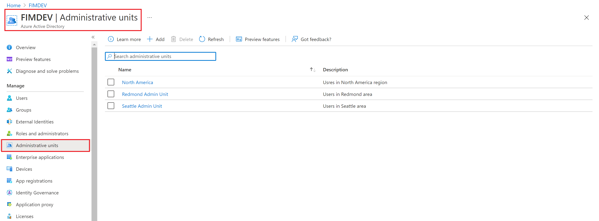
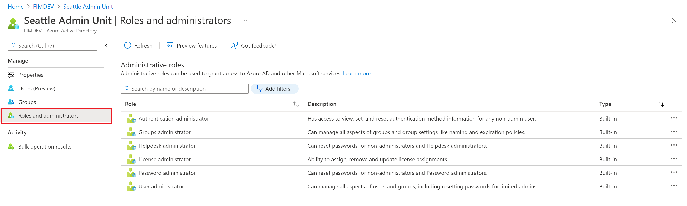
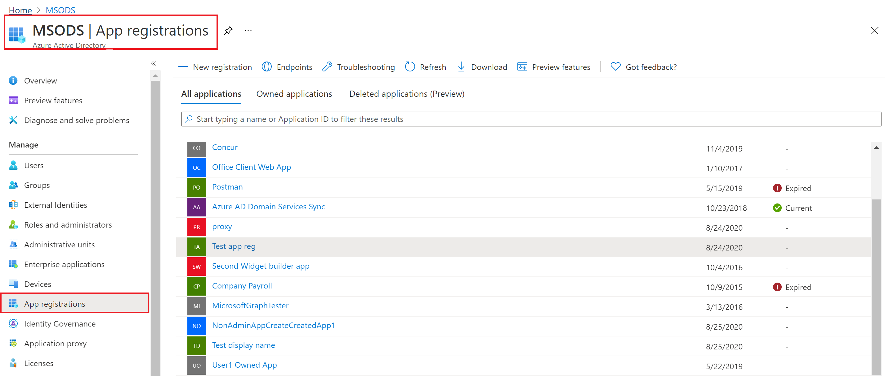
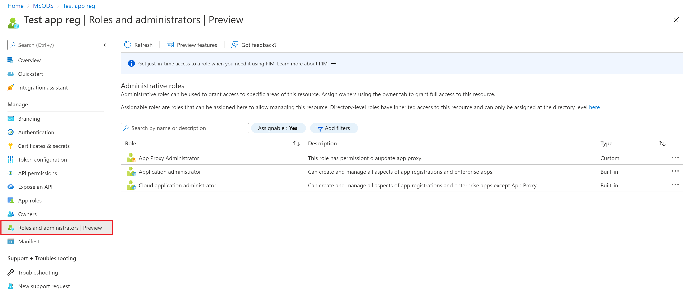
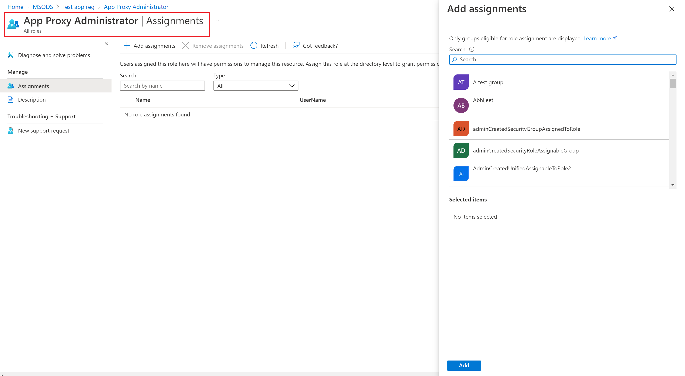
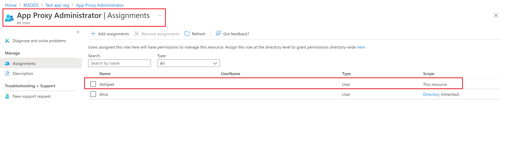
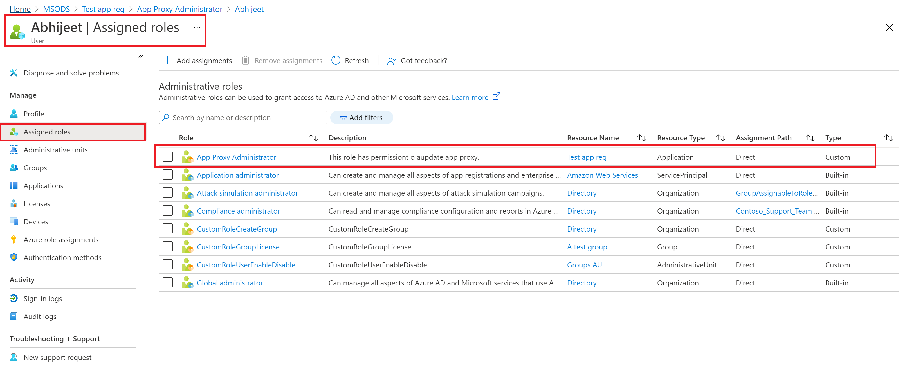

# Assign Microsoft Entra roles at different scopes

In Microsoft Entra ID, you typically assign Microsoft Entra roles so that they apply to the entire tenant. However, you can also assign Microsoft Entra roles for different resources, such as administrative units or application registrations. For example, you could assign the Helpdesk Administrator role so that it just applies to a particular administrative unit and not the entire tenant. The resources that a role assignment applies to is also called the scope. This article describes how to assign Microsoft Entra roles at tenant, administrative unit, and application registration scopes. For more information about scope, see [Overview of RBAC in Microsoft Entra ID](custom-overview.md#scope).

## Prerequisites

- Privileged Role Administrator or Global Administrator.
- AzureADPreview module when using PowerShell.
- Admin consent when using Graph explorer for Microsoft Graph API.

For more information, see [Prerequisites to use PowerShell or Graph Explorer](prerequisites.md).

## Assign roles scoped to the tenant

This section describes how to assign roles at the tenant scope.

### Microsoft Entra admin center

[!INCLUDE [portal updates](~/articles/active-directory/includes/portal-update.md)]

1. Sign in to the [Microsoft Entra admin center](https://entra.microsoft.com) as at least a [Privileged Role Administrator](../roles/permissions-reference.md#privileged-role-administrator).

1. Browse to **Identity** > **Roles & admins** > **Roles & admins**.

    

1. Select a role to see its assignments. To help you find the role you need, use **Add filters** to filter the roles.

1. Select **Add assignments** and then select the users you want to assign to this role.

    

1. Select **Add** to assign the role.

### PowerShell

Follow these steps to assign Microsoft Entra roles using PowerShell.

1. Open a PowerShell window and use [Import-Module](/powershell/module/microsoft.powershell.core/import-module) to import the AzureADPreview module. For more information, see [Prerequisites to use PowerShell or Graph Explorer](prerequisites.md).

    ```powershell
    Import-Module -Name AzureADPreview -Force
    ```

1. In a PowerShell window, use [Connect-AzureAD](/powershell/module/azuread/connect-azuread) to sign in to your tenant.

    ```powershell
    Connect-AzureAD
    ```

1. Use [Get-AzureADUser](/powershell/module/azuread/get-azureaduser) to get the user.

    ```powershell
    $user = Get-AzureADUser -Filter "userPrincipalName eq 'alice@contoso.com'"
    ```

1. Use [Get-AzureADMSRoleDefinition](/powershell/module/azuread/get-azureadmsroledefinition) to get the role you want to assign.

    ```powershell
    $roleDefinition = Get-AzureADMSRoleDefinition -Filter "displayName eq 'Billing Administrator'"
    ```

1. Set tenant as scope of role assignment.

    ```powershell
    $directoryScope = '/'
    ```

1. Use [New-AzureADMSRoleAssignment](/powershell/module/azuread/new-azureadmsroleassignment) to assign the role.

    ```powershell
    $roleAssignment = New-AzureADMSRoleAssignment -DirectoryScopeId $directoryScope -RoleDefinitionId $roleDefinition.Id -PrincipalId $user.objectId
    ```
 
### Microsoft Graph API

Follow these instructions to assign a role using the Microsoft Graph API in [Graph Explorer](https://aka.ms/ge).

1. Sign in to the [Graph Explorer](https://aka.ms/ge).

1. Use [List users](/graph/api/user-list) API to get the user.

    ```http
    GET https://graph.microsoft.com/v1.0/users?$filter=userPrincipalName eq 'alice@contoso.com'
    ```
    
1. Use the [List unifiedRoleDefinitions](/graph/api/rbacapplication-list-roledefinitions) API to get the role you want to assign.

    ```http
    GET https://graph.microsoft.com/v1.0/rolemanagement/directory/roleDefinitions?$filter=displayName eq 'Billing Administrator'
    ```
    
1. Use the [Create unifiedRoleAssignment](/graph/api/rbacapplication-post-roleassignments) API to assign the role.

    ```http
    POST https://graph.microsoft.com/v1.0/roleManagement/directory/roleAssignments
    {
        "@odata.type": "#microsoft.graph.unifiedRoleAssignment",
        "principalId": "<provide objectId of the user obtained above>",
        "roleDefinitionId": "<provide templateId of the role obtained above>",
        "directoryScopeId": "/"
    }
    ```

## Assign roles scoped to an administrative unit

This section describes how to assign roles at an [administrative unit](administrative-units.md) scope.

### Microsoft Entra admin center

1. Sign in to the [Microsoft Entra admin center](https://entra.microsoft.com) as at least a [Privileged Role Administrator](../roles/permissions-reference.md#privileged-role-administrator).

1. Browse to **Identity** > **Roles & admins** > **Admin units**.

1. Select an administrative unit.

    

1. Select **Roles and administrators** from the left nav menu to see the list of all roles available to be assigned over an administrative unit.

    

1. Select the desired role.

1. Select **Add assignments** and then select the users or group you want to assign this role to.

1. Select **Add** to assign the role scoped over the administrative unit.

>[!Note] 
>You will not see the entire list of Microsoft Entra built-in or custom roles here. This is expected. We show the roles which have permissions related to the objects that are supported within the administrative unit. Refer to [this documentation](administrative-units.md) to see the list of objects supported within an administrative unit.

### PowerShell

Follow these steps to assign Microsoft Entra roles at administrative unit scope using PowerShell.

1. Open a PowerShell window and use [Import-Module](/powershell/module/microsoft.powershell.core/import-module) to import the AzureADPreview module. For more information, see [Prerequisites to use PowerShell or Graph Explorer](prerequisites.md).

    ```powershell
    Import-Module -Name AzureADPreview -Force
    ```

1. In a PowerShell window, use [Connect-AzureAD](/powershell/module/azuread/connect-azuread) to sign in to your tenant.

    ```powershell
    Connect-AzureAD
    ```

1. Use [Get-AzureADUser](/powershell/module/azuread/get-azureaduser) to get the user.

    ```powershell
    $user = Get-AzureADUser -Filter "userPrincipalName eq 'alice@contoso.com'"
    ```

1. Use [Get-AzureADMSRoleDefinition](/powershell/module/azuread/get-azureadmsroledefinition) to get the role you want to assign.

    ```powershell
    $roleDefinition = Get-AzureADMSRoleDefinition -Filter "displayName eq 'User Administrator'"
    ```

1. Use [Get-AzureADMSAdministrativeUnit](/powershell/module/azuread/get-azureadmsadministrativeunit) to get the administrative unit you want the role assignment to be scoped to.

    ```powershell
    $adminUnit = Get-AzureADMSAdministrativeUnit -Filter "displayName eq 'Seattle Admin Unit'"
    $directoryScope = '/administrativeUnits/' + $adminUnit.Id
    ```

1. Use [New-AzureADMSRoleAssignment](/powershell/module/azuread/new-azureadmsroleassignment) to assign the role.

    ```powershell
    $roleAssignment = New-AzureADMSRoleAssignment -DirectoryScopeId $directoryScope -RoleDefinitionId $roleDefinition.Id -PrincipalId $user.objectId
    ```

### Microsoft Graph API

Follow these instructions to assign a role at administrative unit scope using the Microsoft Graph API in [Graph Explorer](https://aka.ms/ge).

1. Sign in to the [Graph Explorer](https://aka.ms/ge).

1. Use [List users](/graph/api/user-list) API to get the user.

    ```http
    GET https://graph.microsoft.com/v1.0/users?$filter=userPrincipalName eq 'alice@contoso.com'
    ```
    
1. Use the [List unifiedRoleDefinitions](/graph/api/rbacapplication-list-roledefinitions) API to get the role you want to assign.

    ```http
    GET https://graph.microsoft.com/v1.0/rolemanagement/directory/roleDefinitions?$filter=displayName eq 'User Administrator'
    ```
    
1. Use the [List administrativeUnits](/graph/api/administrativeunit-list) API to get the administrative unit you want the role assignment to be scoped to.

    ```http
    GET https://graph.microsoft.com/v1.0/directory/administrativeUnits?$filter=displayName eq 'Seattle Admin Unit'
    ```

1. Use the [Create unifiedRoleAssignment](/graph/api/rbacapplication-post-roleassignments) API to assign the role.

    ```http
    POST https://graph.microsoft.com/v1.0/roleManagement/directory/roleAssignments
    {
        "@odata.type": "#microsoft.graph.unifiedRoleAssignment",
        "principalId": "<provide objectId of the user obtained above>",
        "roleDefinitionId": "<provide templateId of the role obtained above>",
        "directoryScopeId": "/administrativeUnits/<provide objectId of the admin unit obtained above>"
    }
    ```
    
>[!Note] 
>Here directoryScopeId is specified as */administrativeUnits/foo*, instead of */foo*. It is by design. The scope */administrativeUnits/foo* means the principal can manage the members of the administrative unit (based on the role that she is assigned), not the administrative unit itself. The scope of */foo* means the principal can manage that Microsoft Entra object itself. In the subsequent section, you will see that the scope is */foo* because a role scoped over an app registration grants the privilege to manage the object itself.

## Assign roles scoped to an app registration

This section describes how to assign roles at an application registration scope.

### Microsoft Entra admin center

1. Sign in to the [Microsoft Entra admin center](https://entra.microsoft.com) as at least a [Privileged Role Administrator](../roles/permissions-reference.md#privileged-role-administrator).

1. Browse to **Identity** > **Applications** > **App registrations**.

1. Select an application. You can use search box to find the desired app.

    

1. Select **Roles and administrators** from the left nav menu to see the list of all roles available to be assigned over the app registration.

    

1. Select the desired role.

1. Select **Add assignments** and then select the users or group you want to assign this role to.

    

1. Select **Add** to assign the role scoped over the app registration. 

    
    
    
    

>[!Note] 
>You will not see the entire list of Microsoft Entra built-in or custom roles here. This is expected. We show the roles which have permissions related to managing app registrations only. 


### PowerShell

Follow these steps to assign Microsoft Entra roles at application scope using PowerShell.

1. Open a PowerShell window and use [Import-Module](/powershell/module/microsoft.powershell.core/import-module) to import the AzureADPreview module. For more information, see [Prerequisites to use PowerShell or Graph Explorer](prerequisites.md).

    ```powershell
    Import-Module -Name AzureADPreview -Force
    ```

1. In a PowerShell window, use [Connect-AzureAD](/powershell/module/azuread/connect-azuread) to sign in to your tenant.

    ```powershell
    Connect-AzureAD
    ```

1. Use [Get-AzureADUser](/powershell/module/azuread/get-azureaduser) to get the user.

    ```powershell
    $user = Get-AzureADUser -Filter "userPrincipalName eq 'alice@contoso.com'"
    ```

1. Use [Get-AzureADMSRoleDefinition](/powershell/module/azuread/get-azureadmsroledefinition) to get the role you want to assign.

    ```powershell
    $roleDefinition = Get-AzureADMSRoleDefinition -Filter "displayName eq 'Application Administrator'"
    ```

1. Use [Get-AzureADApplication](/powershell/module/azuread/get-azureadapplication) to get the app registration you want the role assignment to be scoped to.

    ```powershell
    $appRegistration = Get-AzureADApplication -Filter "displayName eq 'f/128 Filter Photos'"
    $directoryScope = '/' + $appRegistration.objectId
    ```

1. Use [New-AzureADMSRoleAssignment](/powershell/module/azuread/new-azureadmsroleassignment) to assign the role.

    ```powershell
    $roleAssignment = New-AzureADMSRoleAssignment -DirectoryScopeId $directoryScope -RoleDefinitionId $roleDefinition.Id -PrincipalId $user.objectId
    ```

### Microsoft Graph API

Follow these instructions to assign a role at application scope using the Microsoft Graph API in [Graph Explorer](https://aka.ms/ge).

1. Sign in to the [Graph Explorer](https://aka.ms/ge).

1. Use [List users](/graph/api/user-list) API to get the user.

    ```http
    GET https://graph.microsoft.com/v1.0/users?$filter=userPrincipalName eq 'alice@contoso.com'
    ```
    
1. Use the [List unifiedRoleDefinitions](/graph/api/rbacapplication-list-roledefinitions) API to get the role you want to assign.

    ```http
    GET https://graph.microsoft.com/v1.0/rolemanagement/directory/roleDefinitions?$filter=displayName eq 'Application Administrator'
    ```
    
1. Use the [List applications](/graph/api/application-list) API to get the administrative unit you want the role assignment to be scoped to.

    ```http
    GET https://graph.microsoft.com/v1.0/applications?$filter=displayName eq 'f/128 Filter Photos'
    ```

1. Use the [Create unifiedRoleAssignment](/graph/api/rbacapplication-post-roleassignments) API to assign the role.

    ```http
    POST https://graph.microsoft.com/v1.0/roleManagement/directory/roleAssignments

    {
        "@odata.type": "#microsoft.graph.unifiedRoleAssignment",
        "principalId": "<provide objectId of the user obtained above>",
        "roleDefinitionId": "<provide templateId of the role obtained above>",
        "directoryScopeId": "/<provide objectId of the app registration obtained above>"
    }
    ```

>[!Note] 
>Here directoryScopeId is specified as */foo*, unlike the section above. It is by design. The scope of */foo* means the principal can manage that Microsoft Entra object. The scope */administrativeUnits/foo* means the principal can manage the members of the administrative unit (based on the role that she is assigned), not the administrative unit itself.


## Next steps

* [List Microsoft Entra role assignments](view-assignments.md).
* [Assign Microsoft Entra roles to users](manage-roles-portal.md).
* [Assign Microsoft Entra roles to groups](groups-assign-role.md)
