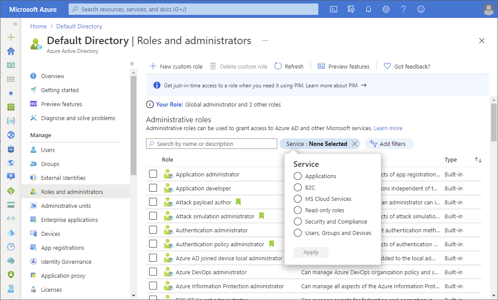
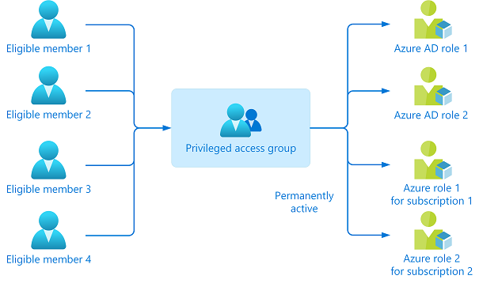

# Best practices for Azure AD roles

This article describes some of the best practices for using Azure Active Directory role-based access control (Azure AD RBAC). These best practices are derived from our experience with Azure AD RBAC and the experiences of customers like yourself. We encourage you to also read our detailed security guidance at [Securing privileged access for hybrid and cloud deployments in Azure AD](security-planning.md).

## 1. Manage to least privilege

When planning your access control strategy, it's a best practice to manage to least privilege. Least privilege means you grant your administrators exactly the permission they need to do their job. There are three aspects to consider when you assign a role to your administrators: a specific set of permissions, over a specific scope, for a specific period of time. Avoid assigning broader roles at broader scopes even if it initially seems more convenient to do so. By limiting roles and scopes, you limit what resources are at risk if the security principal is ever compromised. Azure AD RBAC supports over 65 [built-in roles](permissions-reference.md). There are Azure AD roles to manage directory objects like users, groups, and applications, and also to manage Microsoft 365 services like Exchange, SharePoint, and Intune. To better understand Azure AD built-in roles, see [Understand roles in Azure Active Directory](concept-understand-roles.md). If there isn't a built-in role that meets your need, you can create your own [custom roles](custom-create.md).  
 
### Finding the right roles

Follow these steps to help you find the right role.

1. Sign in to the [Azure portal](https://portal.azure.com) or [Azure AD admin center](https://aad.portal.azure.com).

1. Select **Azure Active Directory** > **Roles and administrators** to see the list of Azure AD roles.

1. Use the **Service** filter to narrow down the list of roles.

    

1. Refer to the [Azure AD built-in roles](permissions-reference.md) documentation. Permissions associated with each role are listed together for better readability. To understand the structure and meaning of role permissions, see [How to understand role permissions](permissions-reference.md#how-to-understand-role-permissions).

1. Refer to the [Least privileged role by task](delegate-by-task.md) documentation.

## 2. Use Privileged Identity Management to grant just-in-time access

One of the principles of least privilege is that access should be granted only for a specific period of time. [Azure AD Privileged Identity Management (PIM)](../privileged-identity-management/pim-configure.md) lets you grant just-in-time access to your administrators. Microsoft recommends that you enable PIM in Azure AD. Using PIM, a user can be made an eligible member of an Azure AD role where they can then activate the role for a limited time when needed. Privileged access is automatically removed when the timeframe expires. You can also [configure PIM settings](../privileged-identity-management/pim-how-to-change-default-settings.md) to require approval or receive notification emails when someone activates their role assignment. Notifications provide an alert when new users are added to highly privileged roles. 

## 3. Turn on multi-factor authentication for all your administrator accounts

[Based on our studies](https://techcommunity.microsoft.com/t5/azure-active-directory-identity/your-pa-word-doesn-t-matter/ba-p/731984), your account is 99.9% less likely to be compromised if you use multi-factor authentication (MFA). 
 
You can enable MFA on Azure AD roles using two methods:
- [Role settings](../privileged-identity-management/pim-how-to-change-default-settings.md) in Privileged Identity Management
- [Conditional Access](../conditional-access/howto-conditional-access-policy-admin-mfa.md)

## 4. Configure recurring access reviews to revoke unneeded permissions over time

Access reviews enable organizations to review administrator's access regularly to make sure only the right people have continued access. Regular auditing your administrators is crucial because of following reasons:
- A malicious actor can compromise an account.
- People move teams within a company. If there is no auditing, they can amass unnecessary access over time.
 
For information about access reviews for roles, see [Create an access review of Azure AD roles in PIM](../privileged-identity-management/pim-create-azure-ad-roles-and-resource-roles-review.md). For information about access reviews of groups that are assigned roles, see [Create an access review of groups and applications in Azure AD access reviews](../governance/create-access-review.md).

## 5. Limit the number of Global Administrators to less than 5

As a best practice, Microsoft recommends that you assign the Global Administrator role to **fewer than five** people in your organization. Global Administrators hold keys to the kingdom, and it is in your best interest to keep the attack surface low. As stated previously, all of these accounts should be protected with multi-factor authentication.

By default, when a user signs up for a Microsoft cloud service, an Azure AD tenant is created and the user is made a member of the Global Administrators role. Users who are assigned the Global Administrator role can read and modify every administrative setting in your Azure AD organization. With a few exceptions, Global Administrators can also read and modify all configuration settings in your Microsoft 365 organization. Global Administrators also have the ability to elevate their access to read data.

Microsoft recommends that you keep two break glass accounts that are permanently assigned to the Global Administrator role. Make sure that these accounts don't require the same multi-factor authentication mechanism as your normal administrative accounts to sign in, as described in [Manage emergency access accounts in Azure AD](../roles/security-emergency-access.md). 

## 6. Use groups for Azure AD role assignments and delegate the role assignment

If you have an external governance system that takes advantage of groups, then you should consider assigning roles to Azure AD groups, instead of individual users. You can also manage role-assignable groups in PIM to ensure that there are no standing owners or members in these privileged groups. For more information, see [Management capabilities for privileged access Azure AD groups](../privileged-identity-management/groups-features.md).

You can assign an owner to role-assignable groups. That owner decides who is added to or removed from the group, so indirectly, decides who gets the role assignment. In this way, a Global Administrator or Privileged Role Administrator can delegate role management on a per-role basis by using groups. For more information, see [Use Azure AD groups to manage role assignments](groups-concept.md).

## 7. Activate multiple roles at once using privileged access groups

It may be the case that an individual has five or six eligible assignments to Azure AD roles through PIM. They will have to activate each role individually, which can reduce productivity. Worse still, they can also have tens or hundreds of Azure resources assigned to them, which aggravates the problem.
 
In this case, you should use [privileged access groups](../privileged-identity-management/groups-features.md). Create a privileged access group and grant it permanent access to multiple roles (Azure AD and/or Azure). Make that user an eligible member or owner of this group. With just one activation, they will have access to all the linked resources.

## 8. Use cloud native accounts for Azure AD roles

Avoid using on-premises synced accounts for Azure AD role assignments. If your on-premises account is compromised, it can compromise your Azure AD resources as well.

## Next steps

- [Securing privileged access for hybrid and cloud deployments in Azure AD](security-planning.md)