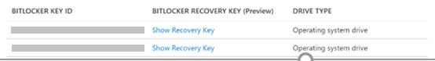
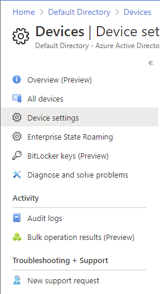

# Device management permissions for Azure AD custom roles

Device management permissions can be used in custom role definitions in Azure Active Directory (Azure AD) to grant fine-grained access such as the following:

- Enable or disable devices
- Delete devices
- Read BitLocker recovery keys
- Read BitLocker metadata
- Read device registration policies
- Update device registration policies

This article lists the permissions you can use in your custom roles for different device management scenarios. For information about how to create custom roles, see [Create and assign a custom role](custom-create.md).

## Enable or disable devices

The following permissions are available to toggle device states.

- microsoft.directory/devices/enable
- microsoft.directory/devices/disable

## Read BitLocker recovery keys

The following permission is available to read BitLocker metadata and recovery keys. Note that this single permission provides read for both BitLocker metadata and recovery keys.

- microsoft.directory/bitlockerKeys/key/read

You can view the BitLocker recovery key by selecting a device from the **All Devices** page, and then selecting **Show Recovery Key**. For more information about reading BitLocker recovery keys, see [View or copy BitLocker keys](../devices/manage-device-identities.md#view-or-copy-bitlocker-keys).

## Read BitLocker metadata

The following permission is available to read the BitLocker metadata for all devices.

- microsoft.directory/bitlockerKeys/metadata/read

You can read the BitLocker metadata for all devices, but you can't read the BitLocker recovery key.

## Read device registration policies

The following permission is available to read tenant-wide device registration settings.

- microsoft.directory/deviceRegistrationPolicy/standard/read

You can read device settings in the Azure portal.

## Update device registration policies

The following permission is available to update tenant-wide device registration settings.

- microsoft.directory/deviceRegistrationPolicy/basic/update

## Full list of permissions

#### Read

> [!div class="mx-tableFixed"]
> | Permission | Description |
> | ---------- | ----------- |
> | microsoft.directory/devices/createdFrom/read | Read created from Internet of Things (IoT) device template links |
> | microsoft.directory/devices/registeredOwners/read | Read registered owners of devices |
> | microsoft.directory/devices/registeredUsers/read | Read registered users of devices |
> | microsoft.directory/devices/standard/read | Read basic properties on devices |
> | microsoft.directory/bitlockerKeys/key/read | Read bitlocker metadata and key on devices |
> | microsoft.directory/bitlockerKeys/metadata/read | Read bitlocker key metadata on devices |
> | microsoft.directory/deviceRegistrationPolicy/standard/read | Read standard properties on device registration policies |

#### Update

> [!div class="mx-tableFixed"]
> | Permission | Description |
> | ---------- | ----------- |
> | microsoft.directory/devices/registeredOwners/update | Update registered owners of devices |
> | microsoft.directory/devices/registeredUsers/update | Update registered users of devices |
> | microsoft.directory/devices/enable | Enable devices in Azure AD |
> | microsoft.directory/devices/disable | Disable devices in Azure AD |
> | microsoft.directory/deviceRegistrationPolicy/basic/update | Update basic properties on device registration policies |

#### Delete

> [!div class="mx-tableFixed"]
> | Permission | Description |
> | ---------- | ----------- |
> | microsoft.directory/devices/delete | Delete devices from Azure AD |

## Next steps

- [Create and assign a custom role in Azure Active Directory](custom-create.md)
- [List Azure AD role assignments](view-assignments.md)
