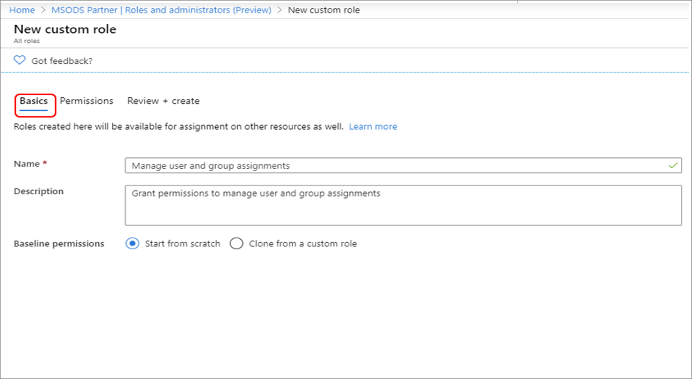
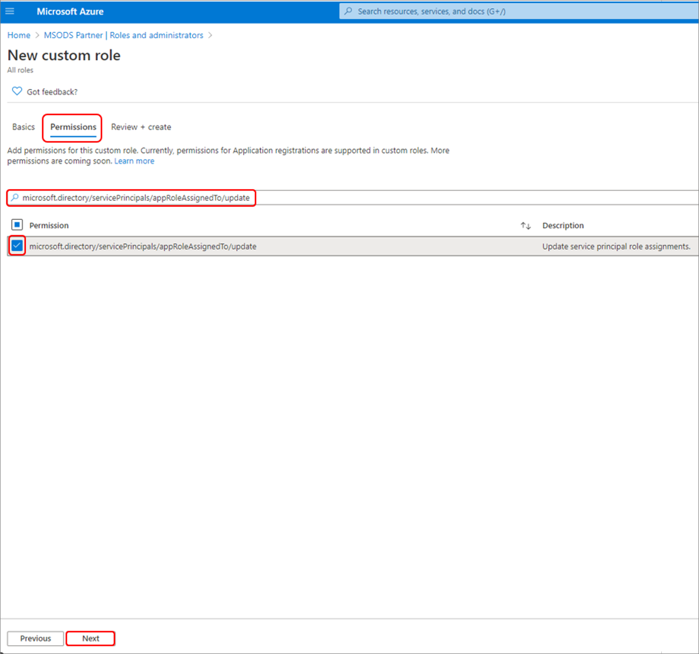
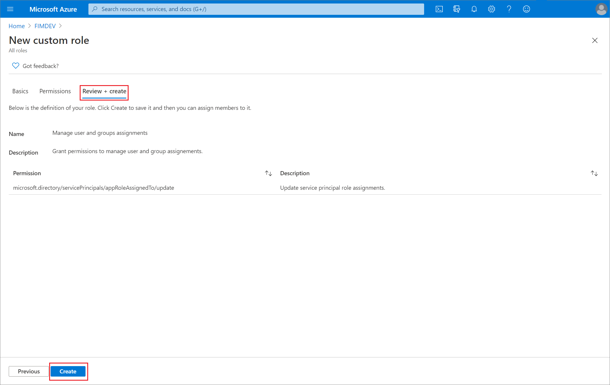
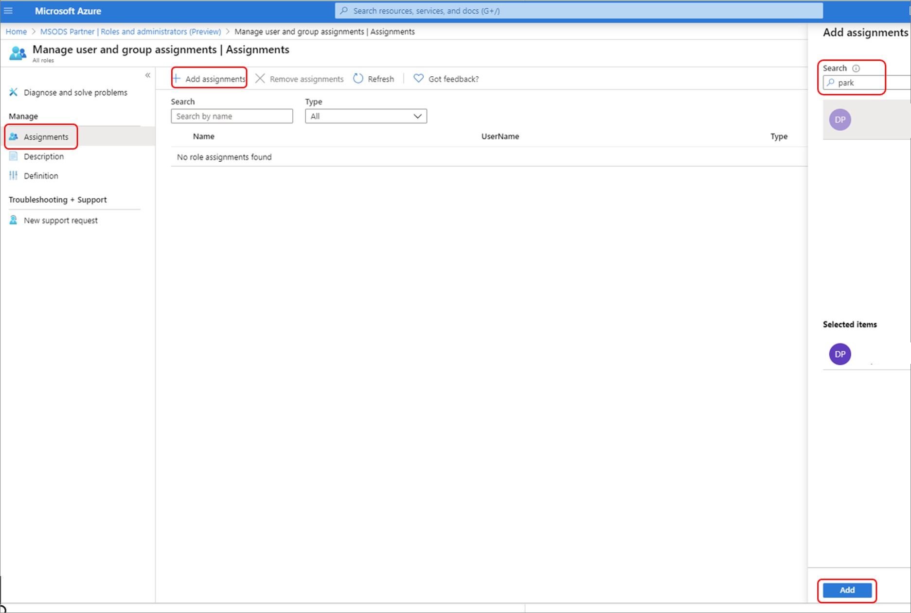
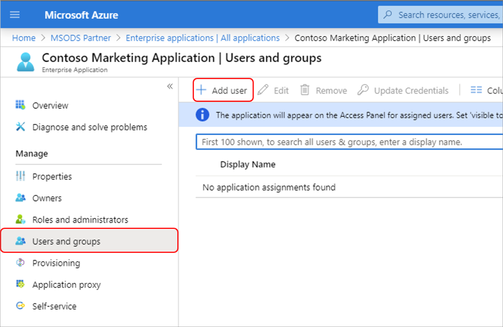

# Create custom roles to manage enterprise apps in Azure Active Directory

This article explains how to create a custom role with permissions to manage enterprise app assignments for users and groups in Azure Active Directory (Azure AD). For the elements of roles assignments and the meaning of terms such as subtype, permission, and property set, see the [custom roles overview](custom-overview.md).

## Prerequisites

- Azure AD Premium P1 or P2 license
- Privileged Role Administrator or Global Administrator
- AzureADPreview module when using PowerShell
- Admin consent when using Graph explorer for Microsoft Graph API

For more information, see [Prerequisites to use PowerShell or Graph Explorer](prerequisites.md).

## Enterprise app role permissions

There are two enterprise app permissions discussed in this article. All examples use the update permission.

* To read the user and group assignments at scope, grant the `microsoft.directory/servicePrincipals/appRoleAssignedTo/read` permission
* To manage the user and group assignments at scope, grant the `microsoft.directory/servicePrincipals/appRoleAssignedTo/update` permission

Granting the update permission results in the assignee being able to manage assignments of users and groups to enterprise apps. The scope of user and/or group assignments can be granted for a single application or granted for all applications. If granted at an organization-wide level, the assignee can manage assignments for all applications. If made at an application level, the assignee can manage assignments for only the specified application.

Granting the update permission is done in two steps:

1. Create a custom role with permission `microsoft.directory/servicePrincipals/appRoleAssignedTo/update`
1. Grant users or groups permissions to manage user and group assignments to enterprise apps. This is when you can set the scope to the organization-wide level or to a single application.

## Azure portal

### Create a new custom role

[!INCLUDE [portal updates](~/articles/active-directory/includes/portal-update.md)]

>[!NOTE]
> Custom roles are created and managed at an organization-wide level and are available only from the organization's Overview page.

1. Sign in to the [Azure portal](https://portal.azure.com).

1. Select **Azure Active Directory** > **Roles and administrators** and then select **New custom role**.

    

1. On the **Basics** tab, provide "Manage user and group assignments" for the name of the role and "Grant permissions to manage user and group assignments" for the role description, and then select **Next**.

    

1. On the **Permissions** tab, enter "microsoft.directory/servicePrincipals/appRoleAssignedTo/update" in the search box, and then select the checkboxes next to the desired permissions, and then select **Next**.

    

1. On the **Review + create** tab, review the permissions and select **Create**.

    

### Assign the role to a user using the Azure portal

1. Sign in to the [Azure portal](https://portal.azure.com).

1. Select **Azure Active Directory** > **Roles and administrators**.

1. Select the **Grant permissions to manage user and group assignments** role.

    

1. Select **Add assignment**, select the desired user, and then click **Select** to add role assignment to the user.

    

#### Assignment tips

* To grant permissions to assignees to manage users and group access for all enterprise apps organization-wide, start from the organization-wide **Roles and Administrators** list on the Azure AD **Overview** page for your organization.
* To grant permissions to assignees to manage users and group access for a specific enterprise app, go to that app in Azure AD and open in the **Roles and Administrators** list for that app. Select the new custom role and complete the user or group assignment. The assignees can manage users and group access only for the specific app.
* To test your custom role assignment, sign in as the assignee and open an application’s **Users and groups** page to verify that the **Add user** option is enabled.

    

## PowerShell

For more detail, see [Create and assign a custom role](custom-create.md) and [Assign custom roles with resource scope using PowerShell](custom-assign-powershell.md).

### Create a custom role

Create a new role using the following PowerShell script:

```PowerShell
# Basic role information
$description = "Manage user and group assignments"
$displayName = "Can manage user and group assignments for Applications"
$templateId = (New-Guid).Guid

# Set of permissions to grant
$allowedResourceAction = @("microsoft.directory/servicePrincipals/appRoleAssignedTo/update")
$resourceActions = @{'allowedResourceActions'= $allowedResourceAction}
$rolePermission = @{'resourceActions' = $resourceActions}
$rolePermissions = $rolePermission

# Create new custom admin role
$customRole = New-AzureADMSRoleDefinition -RolePermissions $rolePermissions -DisplayName $displayName -Description $description -TemplateId $templateId -IsEnabled $true
```

### Assign the custom role

Assign the role using this PowerShell script.

```powershell
# Get the user and role definition you want to link
$user = Get-AzureADUser -Filter "userPrincipalName eq 'chandra@example.com'"
$roleDefinition = Get-AzureADMSRoleDefinition -Filter "displayName eq 'Manage user and group assignments'"

# Get app registration and construct resource scope for assignment.
$appRegistration = Get-AzureADApplication -Filter "displayName eq 'My Filter Photos'"
$resourceScope = '/' + $appRegistration.objectId

# Create a scoped role assignment
$roleAssignment = New-AzureADMSRoleAssignment -ResourceScope $resourceScope -RoleDefinitionId $roleDefinition.Id -PrincipalId $user.objectId
```

## Microsoft Graph API

Use the [Create unifiedRoleDefinition](/graph/api/rbacapplication-post-roledefinitions) API to create a custom role. For more information, see [Create and assign a custom role](custom-create.md) and [Assign custom admin roles using the Microsoft Graph API](custom-assign-graph.md).

```http
POST https://graph.microsoft.com/v1.0/roleManagement/directory/roleDefinitions

{
    "description": "Can manage user and group assignments for Applications.",
    "displayName": "Manage user and group assignments",
    "isEnabled": true,
    "rolePermissions":
    [
        {
            "allowedResourceActions":
            [
                "microsoft.directory/servicePrincipals/appRoleAssignedTo/update"
            ]
        }
    ],
    "templateId": "<PROVIDE NEW GUID HERE>",
    "version": "1"
}
```

### Assign the custom role using the Microsoft Graph API

Use the [Create unifiedRoleAssignment](/graph/api/rbacapplication-post-roleassignments) API to assign the custom role. The role assignment combines a security principal ID (which can be a user or service principal), a role definition ID, and an Azure AD resource scope. For more information on the elements of a role assignment, see the [custom roles overview](custom-overview.md)

```http
POST https://graph.microsoft.com/v1.0/roleManagement/directory/roleAssignments

{
    "@odata.type": "#microsoft.graph.unifiedRoleAssignment",
    "principalId": "<PROVIDE OBJECTID OF USER TO ASSIGN HERE>",
    "roleDefinitionId": "<PROVIDE OBJECTID OF ROLE DEFINITION HERE>",
    "directoryScopeId": "/"
}
```

## Next steps

* [Explore the available custom role permissions for enterprise apps](custom-enterprise-app-permissions.md)
