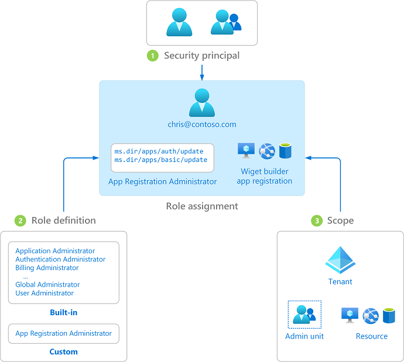

# Overview of role-based access control in Microsoft Entra ID

This article describes how to understand Microsoft Entra role-based access control. Microsoft Entra roles allow you to grant granular permissions to your admins, abiding by the principle of least privilege. Microsoft Entra built-in and custom roles operate on concepts similar to those you find in [the role-based access control system for Azure resources](/azure/role-based-access-control/overview) (Azure roles). The [difference between these two role-based access control systems](/azure/role-based-access-control/rbac-and-directory-admin-roles) is:

- Microsoft Entra roles control access to Microsoft Entra resources such as users, groups, and applications using the Microsoft Graph API
- Azure roles control access to Azure resources such as virtual machines or storage using Azure Resource Management

Both systems contain similarly used role definitions and role assignments. However, Microsoft Entra role permissions can't be used in Azure custom roles and vice versa.

## Understand Microsoft Entra role-based access control

Microsoft Entra ID supports two types of roles definitions:

* [Built-in roles](./permissions-reference.md)
* [Custom roles](./custom-create.md)

Built-in roles are out of box roles that have a fixed set of permissions. These role definitions cannot be modified. There are many [built-in roles](./permissions-reference.md) that Microsoft Entra ID supports, and the list is growing. To round off the edges and meet your sophisticated requirements, Microsoft Entra ID also supports [custom roles](./custom-create.md). Granting permission using custom Microsoft Entra roles is a two-step process that involves creating a custom role definition and then assigning it using a role assignment. A custom role definition is a collection of permissions that you add from a preset list. These permissions are the same permissions used in the built-in roles.  

Once you’ve created your custom role definition (or using a built-in role), you can assign it to a user by creating a role assignment. A role assignment grants the user the permissions in a role definition at a specified scope. This two-step process allows you to create a single role definition and assign it many times at different scopes. A scope defines the set of Microsoft Entra resources the role member has access to. The most common scope is organization-wide (org-wide) scope. A custom role can be assigned at org-wide scope, meaning the role member has the role permissions over all resources in the organization. A custom role can also be assigned at an object scope. An example of an object scope would be a single application. The same role can be assigned to one user over all applications in the organization and then to another user with a scope of only the Contoso Expense Reports app.  

### How Microsoft Entra ID determines if a user has access to a resource

The following are the high-level steps that Microsoft Entra ID uses to determine if you have access to a management resource. Use this information to troubleshoot access issues.

1. A user (or service principal) acquires a token to the Microsoft Graph endpoint.
1. The user makes an API call to Microsoft Entra ID via Microsoft Graph using the issued token.
1. Depending on the circumstance, Microsoft Entra ID takes one of the following actions:
   - Evaluates the user’s role memberships based on the [wids claim](../develop/access-tokens.md) in the user’s access token.
   - Retrieves all the role assignments that apply for the user, either directly or via group membership, to the resource on which the action is being taken.
1. Microsoft Entra ID determines if the action in the API call is included in the roles the user has for this resource.
1. If the user doesn't have a role with the action at the requested scope, access is not granted. Otherwise access is granted.

## Role assignment

A role assignment is a Microsoft Entra resource that attaches a *role definition* to a *security principal* at a particular *scope* to grant access to Microsoft Entra resources. Access is granted by creating a role assignment, and access is revoked by removing a role assignment. At its core, a role assignment consists of three elements:

- Security principal - An identity that gets the permissions. It could be a user, group, or a service principal. 
- Role definition - A collection of permissions. 
- Scope - A way to constrain where those permissions are applicable.

You can [create role assignments](manage-roles-portal.md) and [list the role assignments](view-assignments.md) using the Microsoft Entra admin center, Azure AD PowerShell, or Microsoft Graph API. Azure CLI is not supported for Microsoft Entra role assignments.

The following diagram shows an example of a role assignment. In this example, Chris has been assigned the App Registration Administrator custom role at the scope of the Contoso Widget Builder app registration. The assignment grants Chris the permissions of the App Registration Administrator role for only this specific app registration.

### Security principal

A security principal represents a user, group, or service principal that is assigned access to Microsoft Entra resources. A user is an individual who has a user profile in Microsoft Entra ID. A group is a new Microsoft 365 or security group that has been set as a [role-assignable group](groups-concept.md). A service principal is an identity created for use with applications, hosted services, and automated tools to access Microsoft Entra resources.

### Role definition

A role definition, or role, is a collection of permissions. A role definition lists the operations that can be performed on Microsoft Entra resources, such as create, read, update, and delete. There are two types of roles in Microsoft Entra ID:

- Built-in roles created by Microsoft that can't be changed.
- Custom roles created and managed by your organization.

### Scope

A scope is a way to limit the permitted actions to a particular set of resources as part of a role assignment. For example, if you want to assign a custom role to a developer, but only to manage a specific application registration, you can include the specific application registration as a scope in the role assignment.

When you assign a role, you specify one of the following types of scope:

- Tenant
- [Administrative unit](administrative-units.md)
- Microsoft Entra resource

If you specify a Microsoft Entra resource as a scope, it can be one of the following:

- Microsoft Entra groups
- Enterprise applications
- Application registrations

For more information, see [Assign Microsoft Entra roles at different scopes](assign-roles-different-scopes.md).

## Role assignment options

Microsoft Entra ID provides multiple options for assigning roles:

- You can assign roles to users directly, which is the default way to assign roles. Both built-in and custom Microsoft Entra roles can be assigned to users, based on access requirements. For more information, see [Assign Microsoft Entra roles to users](manage-roles-portal.md).
- With Microsoft Entra ID P1, you can create role-assignable groups and assign roles to these groups. Assigning roles to a group instead of individuals allows for easy addition or removal of users from a role and creates consistent permissions for all members of the group. For more information, see [Assign Microsoft Entra roles to groups](groups-assign-role.md).
- With Microsoft Entra ID P2, you can use Microsoft Entra Privileged Identity Management (Microsoft Entra PIM) to provide just-in-time access to roles. This feature allows you to grant time-limited access to a role to users who require it, rather than granting permanent access. It also provides detailed reporting and auditing capabilities. For more information, see [Assign Microsoft Entra roles in Privileged Identity Management](../privileged-identity-management/pim-how-to-add-role-to-user.md).

## License requirements

Using built-in roles in Microsoft Entra ID is free. Using custom roles require a Microsoft Entra ID P1 license for every user with a custom role assignment. To find the right license for your requirements, see [Comparing generally available features of the Free and Premium editions](https://www.microsoft.com/security/business/identity-access-management/azure-ad-pricing).

## Next steps

- [Understand Microsoft Entra roles](concept-understand-roles.md)
- [Assign Microsoft Entra roles to users](manage-roles-portal.md)
- [Create and assign a custom role in Microsoft Entra ID](custom-create.md)
