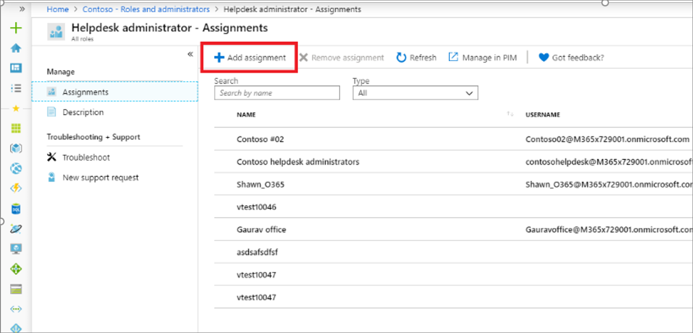

# Assign Azure AD roles to groups

This section describes how an IT admin can assign Azure Active Directory (Azure AD) role to an Azure AD group.

## Prerequisites

- Azure AD Premium P1 or P2 license
- Privileged Role Administrator or Global Administrator
- AzureAD module when using PowerShell
- Admin consent when using Graph explorer for Microsoft Graph API

For more information, see [Prerequisites to use PowerShell or Graph Explorer](prerequisites.md).

## Azure portal

Assigning a group to an Azure AD role is similar to assigning users and service principals except that only groups that are role-assignable can be used. In the Azure portal, only groups that are role-assignable are displayed.

1. Sign in to the [Azure portal](https://portal.azure.com) or [Azure AD admin center](https://aad.portal.azure.com).

1. Select **Azure Active Directory** > **Roles and administrators** and select the role you want to assign.

1. On the ***role name*** page, select > **Add assignment**.

   

1. Select the group. Only the groups that can be assigned to Azure AD roles are displayed.

    [](./media/groups-assign-role/eligible-groups.png#lightbox)

1. Select **Add**.

For more information on assigning role permissions, see [Assign administrator and non-administrator roles to users](../fundamentals/active-directory-users-assign-role-azure-portal.md).

## PowerShell

### Create a group that can be assigned to role

```powershell
$group = New-AzureADMSGroup -DisplayName "Contoso_Helpdesk_Administrators" -Description "This group is assigned to Helpdesk Administrator built-in role in Azure AD." -MailEnabled $false -SecurityEnabled $true -MailNickName "contosohelpdeskadministrators" -IsAssignableToRole $true 
```

### Get the role definition for the role you want to assign

```powershell
$roleDefinition = Get-AzureADMSRoleDefinition -Filter "displayName eq 'Helpdesk Administrator'" 
```

### Create a role assignment

```powershell
$roleAssignment = New-AzureADMSRoleAssignment -DirectoryScopeId '/' -RoleDefinitionId $roleDefinition.Id -PrincipalId $group.Id 
```

## Microsoft Graph API

### Create a group that can be assigned Azure AD role

Use the [Create group](/graph/api/group-post-groups) API to create a group.

```http
POST https://graph.microsoft.com/v1.0/groups

{
    "description": "This group is assigned to Helpdesk Administrator built-in role of Azure AD.",
    "displayName": "Contoso_Helpdesk_Administrators",
    "groupTypes": [
        "Unified"
    ],
    "isAssignableToRole": true,
    "mailEnabled": true,
    "mailNickname": "contosohelpdeskadministrators",
    "securityEnabled": true
}
```

### Get the role definition

Use the [List unifiedRoleDefinitions](/graph/api/rbacapplication-list-roledefinitions) API to get a role definition.

```http
GET https://graph.microsoft.com/v1.0/roleManagement/directory/roleDefinitions?$filter = displayName eq 'Helpdesk Administrator'
```

### Create the role assignment

Use the [Create unifiedRoleAssignment](/graph/api/rbacapplication-post-roleassignments) API to assign the role.

```http
POST https://graph.microsoft.com/v1.0/roleManagement/directory/roleAssignments

{
    "@odata.type": "#microsoft.graph.unifiedRoleAssignment",
    "principalId": "<Object Id of Group>",
    "roleDefinitionId": "<ID of role definition>",
    "directoryScopeId": "/"
}
```
## Next steps

- [Use Azure AD groups to manage role assignments](groups-concept.md)
- [Troubleshoot Azure AD roles assigned to groups](groups-faq-troubleshooting.yml)
