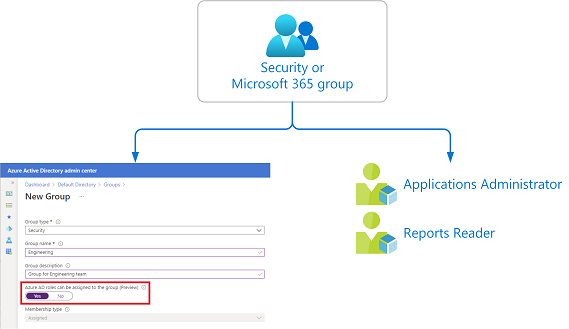

# Use Azure AD groups to manage role assignments

Azure Active Directory (Azure AD) lets you target Azure AD groups for role assignments. Assigning roles to groups can simplify the management of role assignments in Azure AD with minimal effort from your Global Administrators and Privileged Role Administrators.

## Why assign roles to groups?

Consider the example where the Contoso company has hired people across geographies to manage and reset passwords for employees in its Azure AD organization. Instead of asking a Privileged Role Administrator or Global Administrator to assign the Helpdesk Administrator role to each person individually, they can create a Contoso_Helpdesk_Administrators group and assign the role to the group. When people join the group, they are assigned the role indirectly. Your existing governance workflow can then take care of the approval process and auditing of the group's membership to ensure that only legitimate users are members of the group and are thus assigned the Helpdesk Administrator role.

## How role assignments to groups work

To assign a role to a group, you must create a new security or Microsoft 365 group with the `isAssignableToRole` property set to `true`. In the Azure portal, you set the **Azure AD roles can be assigned to the group** option to **Yes**. Either way, you can then assign one or more Azure AD roles to the group in the same way as you assign roles to users.

## Restrictions for role-assignable groups

Role-assignable groups have the following restrictions:

- You can only set the `isAssignableToRole` property or the **Azure AD roles can be assigned to the group** option for new groups.
- The `isAssignableToRole` property is **immutable**. Once a group is created with this property set, it can't be changed.
- You can't make an existing group a role-assignable group.
- A maximum of 500 role-assignable groups can be created in a single Azure AD organization (tenant).

## How are role-assignable groups protected?

If a group is assigned a role, any IT administrator who can manage group membership could also indirectly manage the membership of that role. For example, assume that a group named Contoso_User_Administrators is assigned the User Administrator role. An Exchange administrator who can modify group membership could add themselves to the Contoso_User_Administrators group and in that way become a User Administrator. As you can see, an administrator could elevate their privilege in a way you did not intend.

Only groups that have the `isAssignableToRole` property set to `true` at creation time can be assigned a role. This property is immutable. Once a group is created with this property set, it can't be changed. You can't set the property on an existing group.

Role-assignable groups are designed to help prevent potential breaches by having the following restrictions:

- Only Global Administrators and Privileged Role Administrators can create a role-assignable group.
- The membership type for role-assignable groups must be Assigned and can't be an Azure AD dynamic group. Automated population of dynamic groups could lead to an unwanted account being added to the group and thus assigned to the role.
- By default, only Global Administrators and Privileged Role Administrators can manage the membership of a role-assignable group, but you can delegate the management of role-assignable groups by adding group owners.
- For Microsoft Graph, the *RoleManagement.ReadWrite.Directory* permission is required to be able to manage the membership of role-assignable groups. The *Group.ReadWrite.All* permission won't work.
- To prevent elevation of privilege, only a Privileged Authentication Administrator or a Global Administrator can change the credentials or reset MFA or modify sensitive attributes for members and owners of a role-assignable group.
- Group nesting is not supported. A group can't be added as a member of a role-assignable group.

## Use PIM to make a group eligible for a role assignment

If you do not want members of the group to have standing access to a role, you can use [Azure AD Privileged Identity Management (PIM)](../privileged-identity-management/pim-configure.md) to make a group eligible for a role assignment. Each member of the group is then eligible to activate the role assignment for a fixed time duration.

> [!NOTE]
> For privileged access groups that are used to elevate into Azure AD roles, we recommend that you require an approval process for eligible member assignments. Assignments that can be activated without approval might create a security risk from administrators who have a lower level of permissions. For example, the Helpdesk Administrator has permissions to reset an eligible user's password.

## Scenarios not supported

The following scenarios are not supported:  

- Assign Azure AD roles (built-in or custom) to on-premises groups.

## Known issues

The following are known issues with role-assignable groups:

- *Azure AD P2 licensed customers only*: Even after deleting the group, it is still shown an eligible member of the role in PIM UI. Functionally there's no problem; it's just a cache issue in the Azure portal.  
- Use the new [Exchange admin center](/exchange/exchange-admin-center) for role assignments via group membership. The old Exchange admin center doesn't support this feature. If accessing the old Exchange admin center is required, assign the eligible role directly to the user (not via role-assignable groups). Exchange PowerShell cmdlets will work as expected.
- If an administrator role is assigned to a role-assignable group instead of individual users, members of the group will not be able to access Rules, Organization, or Public Folders in the new [Exchange admin center](/exchange/exchange-admin-center). The workaround is to assign the role directly to users instead of the group.
- Azure Information Protection Portal (the classic portal) doesn't recognize role membership via group yet. You can [migrate to the unified sensitivity labeling platform](/azure/information-protection/configure-policy-migrate-labels) and then use the Office 365 Security & Compliance center to use group assignments to manage roles.
- [Apps admin center](https://config.office.com/) doesn't support this feature yet. Assign the Office Apps Administrator role directly to users.

## License requirements

Using this feature requires an Azure AD Premium P1 license. To also use Privileged Identity Management for just-in-time role activation, requires an Azure AD Premium P2 license. To find the right license for your requirements, see [Comparing generally available features of the Free and Premium editions](https://www.microsoft.com/security/business/identity-access-management/azure-ad-pricing).

## Next steps

- [Create a role-assignable group](groups-create-eligible.md)
- [Assign Azure AD roles to groups](groups-assign-role.md)
