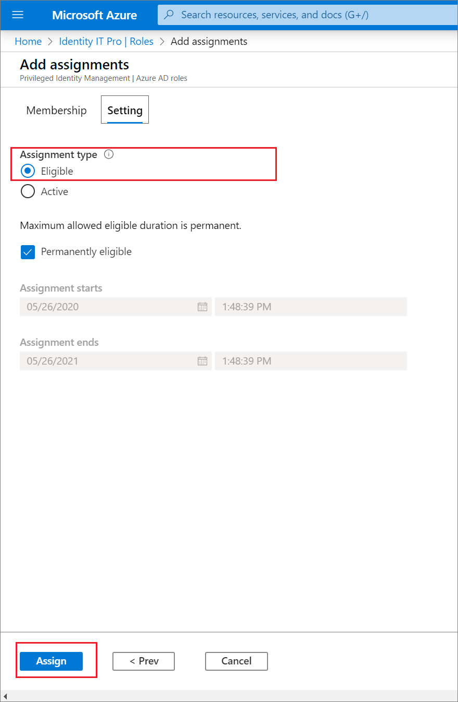

# Assign a role to a group using Privileged Identity Management

This article describes how you can assign an Azure Active Directory (Azure AD) role to a group using Azure AD Privileged Identity Management (PIM).

> [!NOTE]
> You must be using the updated version of Privileged Identity Management to be able to assign a group to an Azure AD role using PIM. You might be on older version of PIM if your Azure AD organization leverages the Privileged Identity Management API. If so, please reach out to the alias pim_preview@microsoft.com to move your organization and update your API. Learn more at [Azure AD roles and features in PIM](../privileged-identity-management/azure-ad-roles-features.md).

## Using Azure AD admin center

1. Sign in to [Azure AD Privileged Identity Management](https://ms.portal.azure.com/?Microsoft_AAD_IAM_GroupRoles=true&Microsoft_AAD_IAM_userRolesV2=true&Microsoft_AAD_IAM_enablePimIntegration=true#blade/Microsoft_Azure_PIMCommon/CommonMenuBlade/quickStart) as a Privileged role administrator or Global administrator in your organization.

1. Select **Privileged Identity Management** > **Azure AD roles** > **Roles** > **Add assignments**

1. Select a role, and then select a group. Only groups that are eligible for role assignment (role-assignable groups) are displayed, not all groups.

    

1. Select the desired membership setting. For roles requiring activation, choose **eligible**. By default, the user would be permanently eligible, but you could also set a start and end time for the user's eligibility. Once you are complete, hit Save and Add to complete the role assignment.

    

## Using PowerShell

### Download the Azure AD Preview PowerShell module

To install the Azure AD #PowerShell module, use the following cmdlets:

```powershell
Install-Module -Name AzureADPreview
Import-Module -Name AzureADPreview
```

To verify that the module is ready to use, use the following cmdlet:

```powershell
Get-Module -Name AzureADPreview
```

### Assign a group as an eligible member of a role

```powershell
$schedule = New-Object Microsoft.Open.MSGraph.Model.AzureADMSPrivilegedSchedule
$schedule.Type = "Once"
$schedule.StartDateTime = "2019-04-26T20:49:11.770Z"
$schedule.endDateTime = "2019-07-25T20:49:11.770Z"
Open-AzureADMSPrivilegedRoleAssignmentRequest -ProviderId aadRoles -Schedule $schedule -ResourceId "[YOUR TENANT ID]" -RoleDefinitionId "9f8c1837-f885-4dfd-9a75-990f9222b21d" -SubjectId "[YOUR GROUP ID]" -AssignmentState "Eligible" -Type "AdminAdd"
```

## Using Microsoft Graph API

```http
POST
https://graph.microsoft.com/beta/privilegedAccess/aadroles/roleAssignmentRequests
{
 "roleDefinitionId": {roleDefinitionId},
 "resourceId": {tenantId},
 "subjectId": {GroupId},
 "assignmentState": "Eligible",
 "type": "AdminAdd",
 "reason": "reason string",
 "schedule": {
   "startDateTime": {DateTime},
   "endDateTime": {DateTime},
   "type": "Once"
 }
}
```

## Next steps

- [Use cloud groups to manage role assignments](groups-concept.md)
- [Troubleshooting roles assigned to cloud groups](groups-faq-troubleshooting.md)
- [Configure Azure AD admin role settings in Privileged Identity Management](../privileged-identity-management/pim-how-to-change-default-settings.md)
- [Assign Azure resource roles in Privileged Identity Management](../privileged-identity-management/pim-resource-roles-assign-roles.md)
