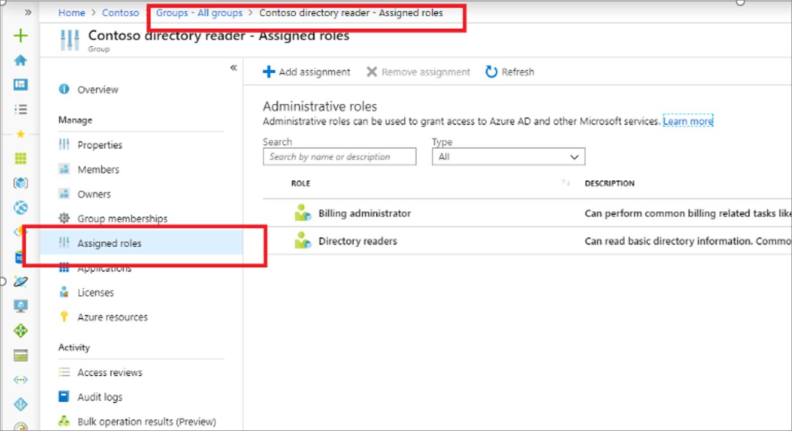

# View roles assigned to a group in Azure Active Directory

This section describes how the roles assigned to a group can be viewed using the Azure portal. Viewing groups and assigned roles are default user permissions.

## Prerequisites

- AzureAD module when using PowerShell
- Admin consent when using Graph explorer for Microsoft Graph API

For more information, see [Prerequisites to use PowerShell or Graph Explorer](prerequisites.md).

## Azure portal

[!INCLUDE [portal updates](~/articles/active-directory/includes/portal-update.md)]

1. Sign in to the [Azure portal](https://portal.azure.com).

1. Select **Azure Active Directory** > **Groups**.

1. Select a role-assignable group that you are interested in.

1. Select **Assigned roles**. You can now see all the Azure AD roles assigned to this group.

   

## PowerShell

### Get object ID of the group

```powershell
Get-AzureADMSGroup -SearchString "Contoso_Helpdesk_Administrators"
```

### View role assignment to a group

```powershell
Get-AzureADMSRoleAssignment -Filter "principalId eq '<object id of group>" 
```

## Microsoft Graph API

### Get object ID of the group

Use the [Get group](/graph/api/group-get) API to get a group.

```http
GET https://graph.microsoft.com/v1.0/groups?$filter=displayName+eq+'Contoso_Helpdesk_Administrator'
```

### Get role assignments to a group

Use the [List unifiedRoleAssignments](/graph/api/rbacapplication-list-roleassignments) API to get the role assignment.

```http
GET https://graph.microsoft.com/v1.0/roleManagement/directory/roleAssignments?$filter=principalId eq
```

## Next steps

- [Use Azure AD groups to manage role assignments](groups-concept.md)
- [Troubleshoot Azure AD roles assigned to groups](groups-faq-troubleshooting.yml)
