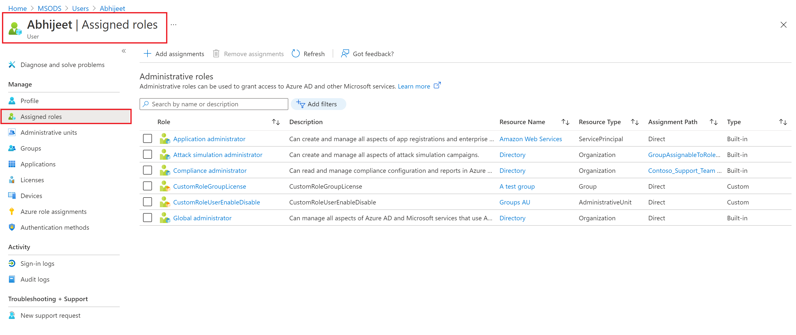
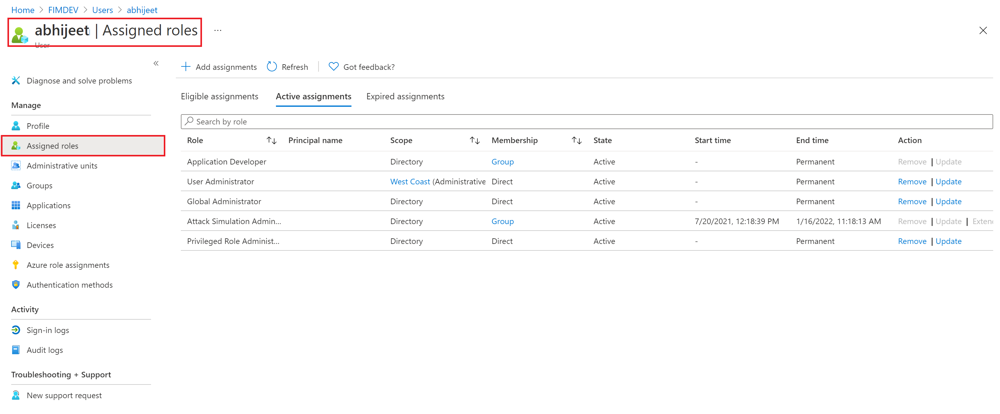

# List Microsoft Entra role assignments for a user

A role can be assigned to a user directly or transitively via a group. This article describes how to list the Microsoft Entra roles assigned to a user. For information about assigning roles to groups, see [Use Microsoft Entra groups to manage role assignments](groups-concept.md).

## Prerequisites

- AzureADPreview module when using PowerShell
- Microsoft.Graph module when using PowerShell
- Admin consent when using Graph Explorer for Microsoft Graph API

For more information, see [Prerequisites to use PowerShell or Graph Explorer](prerequisites.md).

## Microsoft Entra admin center

[!INCLUDE [portal updates](~/articles/active-directory/includes/portal-update.md)]

Follow these steps to list Microsoft Entra roles for a user using the Microsoft Entra admin center. Your experience will be different depending on whether you have [Microsoft Entra Privileged Identity Management (PIM)](../privileged-identity-management/pim-configure.md) enabled.

1. Sign in to the [Microsoft Entra admin center](https://entra.microsoft.com).

1. Browse to **Identity** > **Users** > **All users**.

1. Select *user name* > **Assigned roles**.

    You can see the list of roles assigned to the user at different scopes. Additionally, you can see whether the role has been assigned directly or via group.
    
    

    If you have a Premium P2 license, you will see the PIM experience, which has eligible, active, and expired role assignment details.

    

## PowerShell

Follow these steps to list Microsoft Entra roles assigned to a user using PowerShell.

1. Install Microsoft.Graph module using [Install-module](/powershell/azure/active-directory/install-adv2).
  
    ```powershell
    Install-module -name Microsoft.Graph
    ```

3. In a PowerShell window, Use [Connect-MgGraph](/powershell/microsoftgraph/get-started) to sign into and use Microsoft Graph PowerShell cmdlets.
  
      ```powershell
      Connect-MgGraph
      ```

4. Use the [List transitiveRoleAssignments](/graph/api/rbacapplication-list-transitiveroleassignments) API to get roles assigned directly and transitively to a user.

      ```powershell
      $response = $null
      $uri = "https://graph.microsoft.com/beta/roleManagement/directory/transitiveRoleAssignments?`$count=true&`$filter=principalId eq '6b937a9d-c731-465b-a844-2d5b5368c161'"
      $method = 'GET'
      $headers = @{'ConsistencyLevel' = 'eventual'}
      
      $response = (Invoke-MgGraphRequest -Uri $uri -Headers $headers -Method $method -Body $null).value
      ```

## Microsoft Graph API

Follow these steps to list Microsoft Entra roles assigned to a user using the Microsoft Graph API in [Graph Explorer](https://aka.ms/ge).

1. Sign in to the [Graph Explorer](https://aka.ms/ge).

1. Use the [List transitiveRoleAssignments](/graph/api/rbacapplication-list-transitiveroleassignments) API to get roles assigned directly and transitively to a user. Add following query to the URL.

   ```http
   GET https://graph.microsoft.com/beta/rolemanagement/directory/transitiveRoleAssignments?$count=true&$filter=principalId eq '6b937a9d-c731-465b-a844-2d5b5368c161'
   ```
  
3. Navigate to **Request headers** tab. Add `ConsistencyLevel` as key and `Eventual` as its value. 

5. Select **Run query**.

## Next steps

* [List Microsoft Entra role assignments](view-assignments.md).
* [Assign Microsoft Entra roles to users](manage-roles-portal.md).
* [Assign Microsoft Entra roles to groups](groups-assign-role.md)
