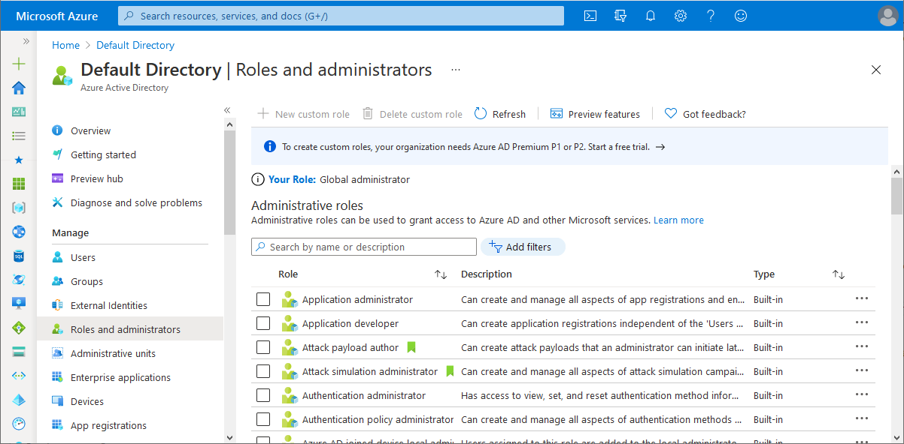
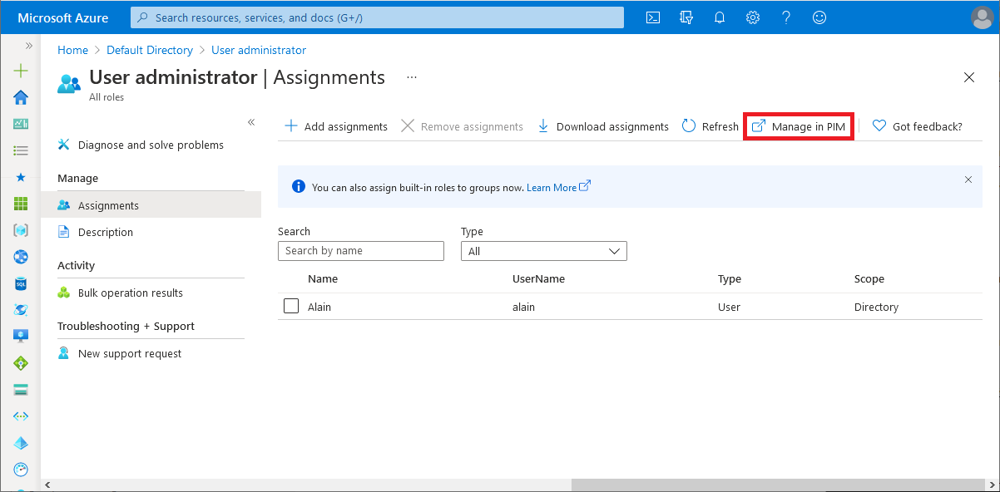

# Assign Azure AD roles to users

You can now see and manage all the members of the administrator roles in the Azure AD admin center. If you frequently manage role assignments, you will probably prefer this experience. This article describes how to assign Azure AD roles using the Azure AD admin center.

## Assign a role

1. Sign in to the [Azure AD admin center](https://aad.portal.azure.com) with Global Administrator or Privileged Role Administrator permissions.

1. Select **Azure Active Directory**.

1. Select **Roles and administrators** to see the list of all available roles.

    

1. Select a role to see its assignments.

    To help you find the role you need, Azure AD can show you subsets of the roles based on role categories. Check out the **Type** filter to show you only the roles in the selected type.

1. Select **Add assignments** and then select the users you want to assign to this role.

    If you see something different from the following picture, read the Note in [Privileged Identity Management (PIM)](#privileged-identity-management-pim) to verify whether you are using PIM.

    

1. Select **Add** to assign the role.

## Privileged Identity Management (PIM)

You can select **Manage in PIM** for additional management capabilities using [Azure AD Privileged Identity Management (PIM)](../privileged-identity-management/pim-configure.md). Privileged Role Administrators can change “Permanent” (always active in the role) assignments to “Eligible” (in the role only when elevated). If you don't have Privileged Identity Management, you can still select **Manage in PIM** to sign up for a trial. Privileged Identity Management requires an [Azure AD Premium P2 license plan](../privileged-identity-management/subscription-requirements.md).

If you are a Global Administrator or a Privileged Role Administrator, you can easily add or remove members, filter the list, or select a member to see their active assigned roles.

> [!Note]
> If you have an Azure AD premium P2 license and you already use Privileged Identity Management, all role management tasks are performed in Privilege Identity Management and not in Azure AD.
>
> 

## Next steps

* Feel free to share with us on the [Azure AD administrative roles forum](https://feedback.azure.com/forums/169401-azure-active-directory?category_id=166032).
* For more about roles, see [Azure AD built-in roles](permissions-reference.md).
* For default user permissions, see a [comparison of default guest and member user permissions](../fundamentals/users-default-permissions.md).
