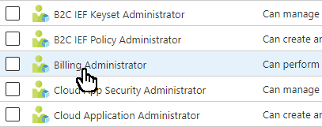
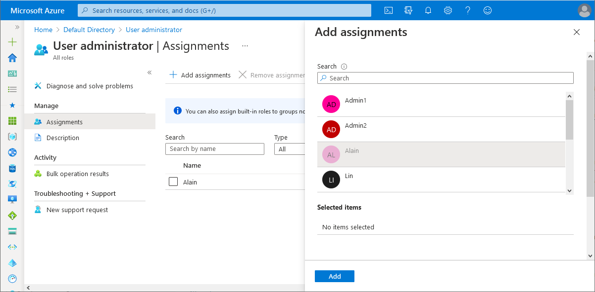
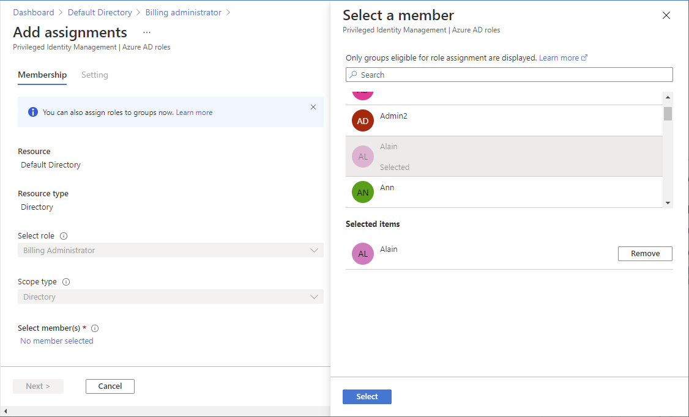
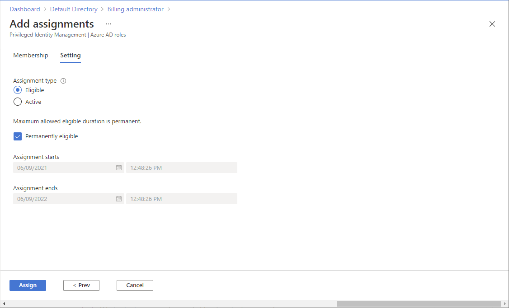

# Assign Microsoft Entra roles to users

To grant access to users in Microsoft Entra ID, you assign Microsoft Entra roles. A role is a collection of permissions. This article describes how to assign Microsoft Entra roles using the Microsoft Entra admin center and PowerShell.

## Prerequisites

- Privileged Role Administrator or Global Administrator. To know who your Privileged Role Administrator or Global Administrator is, see [List Microsoft Entra role assignments](view-assignments.md)
- Microsoft Entra ID P2 license when using Privileged Identity Management (PIM)
- AzureADPreview module when using PowerShell
- Admin consent when using Graph explorer for Microsoft Graph API

For more information, see [Prerequisites to use PowerShell or Graph Explorer](prerequisites.md).

## Microsoft Entra admin center

Follow these steps to assign Microsoft Entra roles using the Microsoft Entra admin center. Your experience will be different depending on whether you have [Microsoft Entra Privileged Identity Management (PIM)](../privileged-identity-management/pim-configure.md) enabled.

### Assign a role

[!INCLUDE [portal updates](~/articles/active-directory/includes/portal-update.md)]

1. Sign in to the [Microsoft Entra admin center](https://entra.microsoft.com) as at least a [Privileged Role Administrator](../roles/permissions-reference.md#privileged-role-administrator).

1. Browse to **Identity** > **Roles & admins** > **Roles & admins**.

    

1. Find the role you need. You can use the search box or **Add filters** to filter the roles.

1. Select the role name to open the role. Don't add a check mark next to the role.

    

1. Select **Add assignments** and then select the users you want to assign to this role.

    If you see something different from the following picture, you might have PIM enabled. See the next section.

    

1. Select **Add** to assign the role.

### Assign a role using PIM

If you have [Microsoft Entra Privileged Identity Management (PIM)](../privileged-identity-management/pim-configure.md) enabled, you have additional role assignment capabilities. For example, you can make a user eligible for a role or set the duration. When PIM is enabled, there are two ways that you can assign roles using the Microsoft Entra admin center. You can use the Roles and administrators page or the PIM experience. Either way uses the same PIM service.

Follow these steps to assign roles using the **Roles and administrators** page. If you want to assign roles using Privileged Identity Management, see [Assign Microsoft Entra roles in Privileged Identity Management](../privileged-identity-management/pim-how-to-add-role-to-user.md).

1. Sign in to the [Microsoft Entra admin center](https://entra.microsoft.com) as at least a [Privileged Role Administrator](../roles/permissions-reference.md#privileged-role-administrator).

1. Browse to **Identity** > **Roles & admins** > **Roles & admins**.

    

1. Find the role you need. You can use the search box or **Add filters** to filter the roles.

1. Select the role name to open the role and see its eligible, active, and expired role assignments. Don't add a check mark next to the role.

    

1. Select **Add assignments**.

1. Select **No member selected** and then select the users you want to assign to this role.

    

1. Select **Next**.

1. On the **Setting** tab, select whether you wan to make this role assignment **Eligible** or **Active**.

    An eligible role assignment means that the user must perform one or more actions to use the role. An active role assignment means that the user doesn't have to perform any action to use the role. For more information about what these settings mean, see [PIM terminology](../privileged-identity-management/pim-configure.md#terminology).

    

1. Use the remaining options to set the duration for the assignment.

1. Select **Assign** to assign the role.

## PowerShell

Follow these steps to assign Microsoft Entra roles using PowerShell.

### Setup

1. Open a PowerShell window and use [Import-Module](/powershell/module/microsoft.powershell.core/import-module) to import the AzureADPreview module. For more information, see [Prerequisites to use PowerShell or Graph Explorer](prerequisites.md).

    ```powershell
    Import-Module -Name Microsoft.Graph.Identity.Governance -Force
    ```

1. In a PowerShell window, use [Connect-MgGraph](/powershell/microsoftgraph/authentication-commands?view=graph-powershell-1.0&preserve-view=true) to sign in to your tenant.

    ```powershell
    Connect-MgGraph -Scopes "RoleManagement.ReadWrite.Directory"
    ```

1. Use [Get-MgUser](/powershell/module/microsoft.graph.users/get-mguser?view=graph-powershell-1.0&preserve-view=true) to get the user you want to assign a role to.

    ```powershell
    $user = Get-MgUser -Filter "userPrincipalName eq 'johndoe@contoso.com'"
    ```

### Assign a role

1. Use [Get-MgRoleManagementDirectoryRoleDefinition](/powershell/module/microsoft.graph.identity.governance/get-mgrolemanagementdirectoryroledefinition?view=graph-powershell-1.0&preserve-view=true) to get the role you want to assign.

    ```powershell
    $roledefinition = Get-MgRoleManagementDirectoryRoleDefinition -Filter "DisplayName eq 'Billing Administrator'"
    ```

1. Use [New-MgRoleManagementDirectoryRoleAssignment](/powershell/module/microsoft.graph.identity.governance/new-mgrolemanagementdirectoryroleassignment?view=graph-powershell-1.0&preserve-view=true) to assign the role.

    ```powershell
    $roleassignment = New-MgRoleManagementDirectoryRoleAssignment -DirectoryScopeId '/' -RoleDefinitionId $roledefinition.Id -PrincipalId $user.Id
    ```

### Assign a role as eligible using PIM

If PIM is enabled, you have additional capabilities, such as making a user eligible for a role assignment or defining the start and end time for a role assignment. These capabilities use a different set of PowerShell commands. For more information about using PowerShell and PIM, see [PowerShell for Microsoft Entra roles in Privileged Identity Management](/powershell/microsoftgraph/tutorial-pim?view=graph-powershell-1.0).


1. Use [Get-MgRoleManagementDirectoryRoleDefinition](/powershell/module/microsoft.graph.identity.governance/get-mgrolemanagementdirectoryroledefinition?view=graph-powershell-1.0&preserve-view=true) to get the role you want to assign.

    ```powershell
    $roledefinition = Get-MgRoleManagementDirectoryRoleDefinition -Filter "DisplayName eq 'Billing Administrator'"
    ```

1. Use the following command to create a hash table to store all the necessary attributes required to assign the role to the user. The Principal ID will be the user id to which you want to assign the role. In this example, the assignment will be valid only for **10 hours**.

    ```powershell
    $params = @{
      "PrincipalId" = "053a6a7e-4a75-48bc-8324-d70f50ec0d91"
      "RoleDefinitionId" = "b0f54661-2d74-4c50-afa3-1ec803f12efe"
      "Justification" = "Add eligible assignment"
      "DirectoryScopeId" = "/"
      "Action" = "AdminAssign"
      "ScheduleInfo" = @{
        "StartDateTime" = Get-Date
        "Expiration" = @{
          "Type" = "AfterDuration"
          "Duration" = "PT10H"
          }
        }
       }
    ```

1. Use [New-MgRoleManagementDirectoryRoleEligibilityScheduleRequest](/powershell/module/microsoft.graph.identity.governance/new-mgrolemanagementdirectoryroleeligibilityschedulerequest?view=graph-powershell-1.0&preserve-view=true) to assign the role as eligible. Once the role has been assigned, it will reflect in the Microsoft Entra admin center under **Identity governance** > **Privileged Identity Management** > **Microsoft Entra roles** > **Assignments** > **Eligible Assignments** section.

    ```powershell
    New-MgRoleManagementDirectoryRoleEligibilityScheduleRequest -BodyParameter $params | Format-List Id, Status, Action, AppScopeId, DirectoryScopeId, RoleDefinitionId, IsValidationOnly, Justification, PrincipalId, CompletedDateTime, CreatedDateTime
    ```

## Microsoft Graph API

Follow these instructions to assign a role using the Microsoft Graph API.

### Assign a role

In this example, a security principal with objectID `f8ca5a85-489a-49a0-b555-0a6d81e56f0d` is assigned the Billing Administrator role (role definition ID `b0f54661-2d74-4c50-afa3-1ec803f12efe`) at tenant scope. To see the list of immutable role template IDs of all built-in roles, see [Microsoft Entra built-in roles](permissions-reference.md).

```http
POST https://graph.microsoft.com/v1.0/roleManagement/directory/roleAssignments
Content-type: application/json

{ 
    "@odata.type": "#microsoft.graph.unifiedRoleAssignment",
    "roleDefinitionId": "b0f54661-2d74-4c50-afa3-1ec803f12efe",
    "principalId": "f8ca5a85-489a-49a0-b555-0a6d81e56f0d",
    "directoryScopeId": "/"
}
```

### Assign a role using PIM

#### Assign a time-bound eligible role assignment

In this example, a security principal with objectID `f8ca5a85-489a-49a0-b555-0a6d81e56f0d` is assigned a time-bound eligible role assignment to Billing Administrator (role definition ID `b0f54661-2d74-4c50-afa3-1ec803f12efe`) for 180 days.

```http
POST https://graph.microsoft.com/v1.0/rolemanagement/directory/roleEligibilityScheduleRequests
Content-type: application/json

{
    "action": "adminAssign",
    "justification": "for managing admin tasks",
    "directoryScopeId": "/",
    "principalId": "f8ca5a85-489a-49a0-b555-0a6d81e56f0d",
    "roleDefinitionId": "b0f54661-2d74-4c50-afa3-1ec803f12efe",
    "scheduleInfo": {
        "startDateTime": "2021-07-15T19:15:08.941Z",
        "expiration": {
            "type": "afterDuration",
            "duration": "PT180D"
        }
    }
}
```

#### Assign a permanent eligible role assignment

In the following example, a security principal is assigned a permanent eligible role assignment to Billing Administrator.

```http
POST https://graph.microsoft.com/v1.0/rolemanagement/directory/roleEligibilityScheduleRequests
Content-type: application/json

{
    "action": "adminAssign",
    "justification": "for managing admin tasks",
    "directoryScopeId": "/",
    "principalId": "f8ca5a85-489a-49a0-b555-0a6d81e56f0d",
    "roleDefinitionId": "b0f54661-2d74-4c50-afa3-1ec803f12efe",
    "scheduleInfo": {
        "startDateTime": "2021-07-15T19:15:08.941Z",
        "expiration": {
            "type": "noExpiration"
        }
    }
}
```

#### Activate a role assignment

To activate the role assignment, use the [Create roleAssignmentScheduleRequests](/graph/api/rbacapplication-post-roleeligibilityschedulerequests) API.

```http
POST https://graph.microsoft.com/v1.0/roleManagement/directory/roleAssignmentScheduleRequests
Content-type: application/json

{
    "action": "selfActivate",
    "justification": "activating role assignment for admin privileges",
    "roleDefinitionId": "b0f54661-2d74-4c50-afa3-1ec803f12efe",
    "directoryScopeId": "/",
    "principalId": "f8ca5a85-489a-49a0-b555-0a6d81e56f0d"
}
```

For more information about managing Microsoft Entra roles through the PIM API in Microsoft Graph, see [Overview of role management through the privileged identity management (PIM) API](/graph/api/resources/privilegedidentitymanagementv3-overview).

## Next steps

- [List Microsoft Entra role assignments](view-assignments.md)
- [Assign custom roles with resource scope using PowerShell](custom-assign-powershell.md)
- [Microsoft Entra built-in roles](permissions-reference.md)
