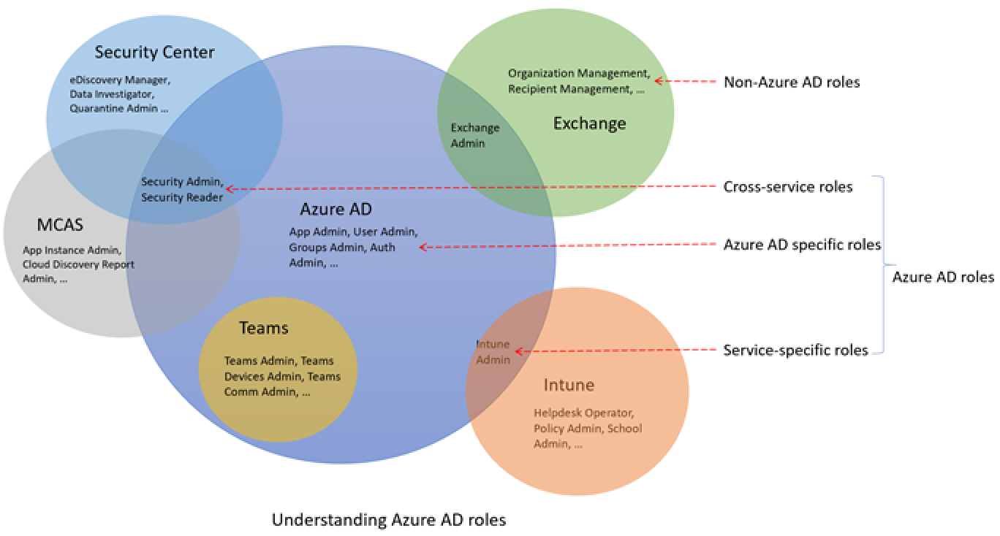

# Understand roles in Azure Active Directory

This article describes how to understand roles-based access control (RBAC) in Azure Active Directory (Azure AD). Azure AD roles allow you to grant granular permissions to your admins, abiding by the principle of least privilege. Azure AD built-in and custom roles operate on concepts similar to those you will find in [the role-based access control system for Azure resources](../../role-based-access-control/overview.md) (Azure roles). The [difference between these two role-based access control systems](../../role-based-access-control/rbac-and-directory-admin-roles.md) is:

- Azure AD roles control access to Azure AD resources such as users, groups, and applications using Graph API
- Azure roles control access to Azure resources such as virtual machines or storage using Azure Resource Management

Both systems contain similarly used role definitions and role assignments. However, Azure AD role permissions can't be used in Azure custom roles and vice versa.

## How Azure AD determines if a user has access to a resource

The following are the high-level steps that Azure AD uses to determine if you have access to a management resource. Use this information to troubleshoot access issues.

1. A user (or service principal) acquires a token to the Microsoft Graph or Azure AD Graph endpoint.
1. The user makes an API call to Azure Active Directory (Azure AD) via Microsoft Graph or Azure AD Graph using the issued token.
1. Depending on the circumstance, Azure AD takes one of the following actions:
   - Evaluates the user’s role memberships based on the [wids claim](../../active-directory-b2c/access-tokens.md) in the user’s access token.
   - Retrieves all the role assignments that apply for the user, either directly or via group membership, to the resource on which the action is being taken.
1. Azure AD determines if the action in the API call is included in the roles the user has for this resource.
1. If the user doesn't have a role with the action at the requested scope, access is not granted. Otherwise access is granted.

## Role assignment

A role assignment is an Azure AD resource that attaches a *role definition* to a *user* at a particular *scope* to grant access to Azure AD resources. Access is granted by creating a role assignment, and access is revoked by removing a role assignment. At its core, a role assignment consists of three elements:

- Azure AD user
- Role definition
- Resource scope

You can [create role assignments](custom-create.md) using the Azure portal, Azure AD PowerShell, or Graph API. You can also [view the assignments for a custom role](custom-view-assignments.md#view-the-assignments-of-a-role).

The following diagram shows an example of a role assignment. In this example, Chris Green has been assigned the App registration administrator custom role at the scope of the Contoso Widget Builder app registration. The assignment grants Chris the permissions of the App registration administrator role for only this specific app registration.

### Security principal

A security principal represents the user that is to be assigned access to Azure AD resources. A user is an individual who has a user profile in Azure Active Directory.

### Role

A role definition, or role, is a collection of permissions. A role definition lists the operations that can be performed on Azure AD resources, such as create, read, update, and delete. There are two types of roles in Azure AD:

- Built-in roles created by Microsoft that can't be changed.
- Custom roles created and managed by your organization.

### Scope

A scope is the restriction of permitted actions to a particular Azure AD resource as part of a role assignment. When you assign a role, you can specify a scope that limits the administrator's access to a specific resource. For example, if you want to grant a developer a custom role, but only to manage a specific application registration, you can include the specific application registration as a scope in the role assignment.

2.	Understanding Azure AD roles
There are about 60 Azure AD built-in roles right now and it is increasing. To round off the edges, Azure AD also supports custom roles capability using which you can cherry pick permissions to manage certain Azure AD objects (like applications, service principals) and bundle them into a your own custom role.
- Azure AD built-in roles
- Azure AD custom roles
 
This article explains what are Azure AD roles and how should you use them.
 
2.1.	How are Azure AD roles different from other M365 roles (like Exchange, Intune)
There are different services within M365 suite, Azure AD being one of them. Some of these services have their own RBAC, while others don't. Azure AD, Exchange, Intune, Security Center, Compliance Center, Microsoft Cloud App Security and Commerce have their own RBAC. Other services like Teams, SharePoint, Managed Desktop etc. leverage Azure AD roles for their administrative needs; they don’t have their own RBAC. Azure RBAC is also different from Azure AD RBAC, but Azure is not part of M365 suite so it was not mentioned above. What is the meaning of having different RBAC? It means there is a different data store where role definitions and role assignments are stored. Similarly, there is a different policy decision point (PDP) where access check happens.
 
2.2.	Is there an overlap?
Yes, there is. Identity is new control plane. So, our customers wanted to grant permissions only through Azure AD. This pushed us to build roles some service-specific roles in Azure AD. For example, Exchange Administrator role in Azure AD. This role is equivalent to Organization Management role group in Exchange RBAC. It can manage all aspects of Exchange. Similarly, we created Intune Admin, Teams Admin , SharePoint Admin and so on.
 
2.3.	How to understand Azure AD roles
In general, there are 3 categories of built-in roles in Azure AD - 
i.	Azure AD specific roles - These roles grant permissions to manage resources within Azure AD only. For example, User Administrator, Application Administrator, Groups Administrator etc. grant permissions to manage resources that live in Azure AD.

ii.	Service specific roles - For major M365 services (non-Azure AD), we have built service-specific roles which grant permissions to manage all functionalities within that service.  For example, Exchange Admin, Intune Admin, SharePoint Admin, Teams Admin etc. can manage functionalities with their respective services. Exchange Admin can manage mailboxes, Intune Admin can manage device policies, SharePoint Admin can manage site collections, Teams Admin can manage call qualities and so on. 

iii.	Cross-service roles - There are some roles that span across services. We have 2 'global' roles - Global Administrator and Global Reader. All M365 services honor these two roles. Then there are some security-related roles like Security Admin and Security Reader that grants access across multiple security services within M365. For example, using Security Admin roles in Azure AD, you can manage M365 Security Center, MDATP and MCAS. Similarly, using Compliance Admin, you can manage Compliance-related settings in M365 Compliance Center, Exchange and so on.
 

 
 
The table below captures which category each role falls under. Note that, this categorization could be subjective, so do not get hung up on any particular role.
Category	Roles
Azure AD specific role	Application Administrator
Azure AD specific role	Application Developer
Azure AD specific role	Authentication Administrator
Azure AD specific role	B2C IEF Keyset Administrator
Azure AD specific role	B2C IEF Policy Administrator
Azure AD specific role	Cloud Application Administrator
Azure AD specific role	Cloud Device Administrator
Azure AD specific role	Conditional Access Administrator
Azure AD specific role	Device Administrators
Azure AD specific role	Directory Readers
Azure AD specific role	Directory Synchronization Accounts
Azure AD specific role	Directory Writers
Azure AD specific role	External Id User flow Administrator
Azure AD specific role	External Id User Flow Attribute Administrator
Azure AD specific role	External Identity Provider Administrator
Azure AD specific role	Groups Administrator
Azure AD specific role	Guest Inviter
Azure AD specific role	Helpdesk Administrator
Azure AD specific role	Hybrid Identity Administrator
Azure AD specific role	License Administrator
Azure AD specific role	Partner Tier1 Support
Azure AD specific role	Partner Tier2 Support
Azure AD specific role	Password Administrator
Azure AD specific role	Privileged Authentication Administrator
Azure AD specific role	Privileged Role Administrator
Azure AD specific role	Reports Reader
Azure AD specific role	User Account Administrator
Cross-service role	Company Administrator
Cross-service role	Compliance Administrator
Cross-service role	Compliance Data Administrator
Cross-service role	Global Reader
Cross-service role	Security Administrator
Cross-service role	Security Operator
Cross-service role	Security Reader
Cross-service role	Service Support Administrator
Service-specific role	Azure DevOps Administrator
Service-specific role	Azure Information Protection Administrator
Service-specific role	Billing Administrator
Service-specific role	CRM Service Administrator
Service-specific role	Customer LockBox Access Approver
Service-specific role	Desktop Analytics Administrator
Service-specific role	Exchange Service Administrator
Service-specific role	Insights Administrator
Service-specific role	Insights Business Leader
Service-specific role	Intune Service Administrator
Service-specific role	Kaizala Administrator
Service-specific role	Lync Service Administrator
Service-specific role	Message Center Privacy Reader
Service-specific role	Message Center Reader
Service-specific role	Modern Commerce User
Service-specific role	Network Administrator
Service-specific role	Office Apps Administrator
Service-specific role	Power BI Service Administrator
Service-specific role	Power Platform Administrator
Service-specific role	Printer Administrator
Service-specific role	Printer Technician
Service-specific role	Search Administrator
Service-specific role	Search Editor
Service-specific role	SharePoint Service Administrator
Service-specific role	Teams Communications Administrator
Service-specific role	Teams Communications Support Engineer
Service-specific role	Teams Communications Support Specialist
Service-specific role	Teams Devices Administrator
Service-specific role	Teams Service Administrator
 
## Next steps

- Create custom role assignments using [the Azure portal, Azure AD PowerShell, and Graph API](custom-create.md)
- [View the assignments for a custom role](custom-view-assignments.md)
