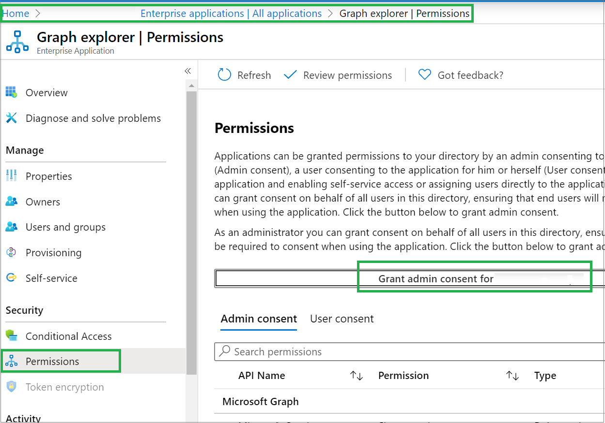

# Prerequisites to use PowerShell or Graph Explorer for Microsoft Entra roles

If you want to manage Microsoft Entra roles using PowerShell or Graph Explorer, you must have the required prerequisites. This article describes the PowerShell and Graph Explorer prerequisites for different Microsoft Entra role features.

## Microsoft Graph PowerShell

To use PowerShell commands to do the following:

- Add users, groups, or devices to an administrative unit
- Create a new group in an administrative unit

You must have the Microsoft Graph PowerShell SDK installed:

- [Microsoft Graph PowerShell SDK](/powershell/microsoftgraph/installation)

<a name='azuread-module'></a>

## Azure AD PowerShell module

To use PowerShell commands to do the following:

- List role assignments
- Create a role-assignable group
- Manage administrative units

You must have the following module installed:

- [Microsoft Entra ID](https://www.powershellgallery.com/packages/AzureAD) (current version)


<a name='check-azuread-version'></a>

#### Check Azure AD PowerShell version

To check which version of Azure AD PowerShell you have installed, use [Get-InstalledModule](/powershell/module/powershellget/get-installedmodule).

```powershell
Get-InstalledModule -Name AzureAD
```

You should see output similar to the following:

```powershell
Version    Name                                Repository           Description
-------    ----                                ----------           -----------
2.0.2.140  AzureAD                             PSGallery            Azure Active Directory V2 General Availability M...
```

<a name='install-azuread'></a>

#### Install Azure AD PowerShell

If you don't have Azure AD PowerShell installed, use [Install-Module](/powershell/module/powershellget/install-module) to install Azure AD PowerShell.

```powershell
Install-Module -Name AzureAD
```

<a name='update-azuread'></a>

#### Update Azure AD PowerShell

To update Azure AD PowerShell to the latest version, re-run [Install-Module](/powershell/module/powershellget/install-module).

```powershell
Install-Module -Name AzureAD
```

<a name='use-azuread'></a>

#### Use Azure AD PowerShell

To use Azure AD PowerShell, follow these steps to make sure it is imported into the current session.

1. Use [Get-Module](/powershell/module/microsoft.powershell.core/get-module) to check if Azure AD PowerShell is loaded into memory.

    ```powershell
    Get-Module -Name AzureAD
    ```

1. If you don't see any output in the previous step, use [Import-Module](/powershell/module/microsoft.powershell.core/import-module) to import Azure AD PowerShell. The `-Force` parameter removes the loaded module and then imports it again.

    ```powershell
    Import-Module -Name AzureAD -Force
    ```

1. Run [Get-Module](/powershell/module/microsoft.powershell.core/get-module) again.

    ```powershell
    Get-Module -Name AzureAD
    ```

    You should see output similar to the following:
    
    ```powershell
    ModuleType Version    Name                                ExportedCommands
    ---------- -------    ----                                ----------------
    Binary     2.0.2.140  AzureAD                             {Add-AzureADApplicationOwner, Add-AzureADDeviceRegisteredO...
    ```

## AzureADPreview module

To use PowerShell commands to do the following:

- Assign roles to users or groups
- Remove a role assignment
- Make a group eligible for a role using Privileged Identity Management
- Create custom roles

You must have the following module installed:

- [AzureADPreview](https://www.powershellgallery.com/packages/AzureADPreview) (current version)


#### Check AzureADPreview version

To check which version of AzureADPreview you have installed, use [Get-InstalledModule](/powershell/module/powershellget/get-installedmodule).

```powershell
Get-InstalledModule -Name AzureADPreview
```

You should see output similar to the following:

```powershell
Version    Name                                Repository           Description
-------    ----                                ----------           -----------
2.0.2.149  AzureADPreview                      PSGallery            Azure Active Directory V2 Preview Module. ...
```

#### Install AzureADPreview

If you don't have AzureADPreview installed, use [Install-Module](/powershell/module/powershellget/install-module) to install AzureADPreview.

```powershell
Install-Module -Name AzureADPreview
```

#### Update AzureADPreview

To update AzureADPreview to the latest version, re-run [Install-Module](/powershell/module/powershellget/install-module).

```powershell
Install-Module -Name AzureADPreview
```

#### Use AzureADPreview

To use AzureADPreview, follow these steps to make sure it is imported into the current session.

1. Use [Get-Module](/powershell/module/microsoft.powershell.core/get-module) to check if AzureADPreview is loaded into memory.

    ```powershell
    Get-Module -Name AzureADPreview
    ```

1. If you don't see any output in the previous step, use [Import-Module](/powershell/module/microsoft.powershell.core/import-module) to import AzureADPreview. The `-Force` parameter removes the loaded module and then imports it again.

    ```powershell
    Import-Module -Name AzureADPreview -Force
    ```

1. Run [Get-Module](/powershell/module/microsoft.powershell.core/get-module) again.

    ```powershell
    Get-Module -Name AzureADPreview
    ```

    You should see output similar to the following:
    
    ```powershell
    ModuleType Version    Name                                ExportedCommands
    ---------- -------    ----                                ----------------
    Binary     2.0.2.149  AzureADPreview                      {Add-AzureADAdministrativeUnitMember, Add-AzureADApplicati...
    ```

## Graph Explorer

[!INCLUDE [portal updates](~/articles/active-directory/includes/portal-update.md)]

To manage Microsoft Entra roles using the [Microsoft Graph API](/graph/overview) and [Graph Explorer](/graph/graph-explorer/graph-explorer-overview), you must do the following:

1. Sign in to the [Microsoft Entra admin center](https://entra.microsoft.com).

1. Browse to **Identity** > **Applications** > **Enterprise applications**.

1. In the applications list, find and select **Graph explorer**.

1. Select **Permissions**.

1. Select **Grant admin consent for Graph explorer**.

    

1. Use [Graph Explorer tool](https://aka.ms/ge).

## Next steps

- [Install Azure Active Directory PowerShell for Graph](/powershell/azure/active-directory/install-adv2)
- [Azure AD PowerShell module docs](/powershell/module/azuread/)
- [Graph Explorer](/graph/graph-explorer/graph-explorer-overview)
