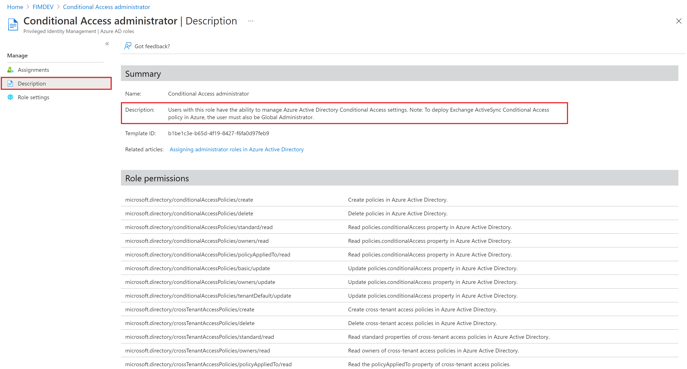

# List Azure AD role definitions

A role definition is a collection of permissions that can be performed, such as read, write, and delete. It's typically just called a role. Azure Active Directory has over 60 built-in roles or you can create your own custom roles. If you ever wondered "What the do these roles really do?", you can see a detailed list of permissions for each of the roles.

This article describes how to list the Azure AD built-in and custom roles along with their permissions.

## Prerequisites

- AzureADPreview module when using PowerShell
- Admin consent when using Graph explorer for Microsoft Graph API

For more information, see [Prerequisites to use PowerShell or Graph Explorer](prerequisites.md).

## Azure portal

[!INCLUDE [portal updates](~/articles/active-directory/includes/portal-update.md)]

1. Sign in to the [Azure portal](https://portal.azure.com).

1. Select **Azure Active Directory** > **Roles and administrators** to see the list of all available roles.

    

1. On the right, select the ellipsis and then **Description** to see the complete list of permissions for a role.

    The page includes links to relevant documentation to help guide you through managing roles.

    

## PowerShell

Follow these steps to list Azure AD roles using PowerShell.

1. Open a PowerShell window and use [Import-Module](/powershell/module/microsoft.powershell.core/import-module) to import the AzureADPreview module. For more information, see [Prerequisites to use PowerShell or Graph Explorer](prerequisites.md).

    ```powershell
    Import-Module -Name AzureADPreview -Force
    ```

2. In a PowerShell window, use [Connect-AzureAD](/powershell/module/azuread/connect-azuread) to sign in to your tenant.

    ```powershell
    Connect-AzureAD
    ```
3. Use [Get-AzureADMSRoleDefinition](/powershell/module/azuread/get-azureadmsroledefinition) to get all roles.

    ```powershell
    Get-AzureADMSRoleDefinition
    ```

4. To view the list of permissions of a role, use the following cmdlet.
    
    ```powershell
    # Do this avoid truncation of the list of permissions
    $FormatEnumerationLimit = -1
    
    (Get-AzureADMSRoleDefinition -Filter "displayName eq 'Conditional Access Administrator'").RolePermissions | Format-list
    ```

## Microsoft Graph API

Follow these instructions to list Azure AD roles using the Microsoft Graph API in [Graph Explorer](https://aka.ms/ge).

1. Sign in to the [Graph Explorer](https://aka.ms/ge).
2. Select **GET** as the HTTP method from the dropdown. 
3. Select the API version to **v1.0**.
4. Add the following query to use the [List unifiedRoleDefinitions](/graph/api/rbacapplication-list-roledefinitions) API.

   ```http
   GET https://graph.microsoft.com/v1.0/roleManagement/directory/roleDefinitions
   ```

5. Select **Run query** to list the roles.
6. To view permissions of a role, use the following API.

   ```http
   GET https://graph.microsoft.com/v1.0/roleManagement/directory/roleDefinitions?$filter=DisplayName eq 'Conditional Access Administrator'&$select=rolePermissions
   ```

## Next steps

* [List Azure AD role assignments](view-assignments.md).
* [Assign Azure AD roles to users](manage-roles-portal.md).
* [Azure AD built-in roles](permissions-reference.md).
