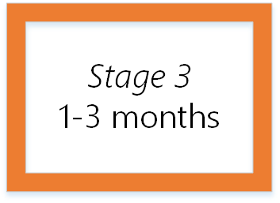
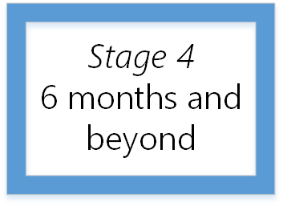

---

title: Secure access practices for administrators in Microsoft Entra ID
description: Ensure that your organization's administrative access and administrator accounts are secure. For system architects and IT pros who configure Microsoft Entra ID, Azure, and Microsoft Online Services. 
services: active-directory 
keywords: 
author: rolyon
manager: amycolannino
ms.author: rolyon
ms.date: 04/19/2022
ms.topic: conceptual
ms.service: active-directory
ms.workload: identity
ms.subservice: roles
ms.custom: it-pro, has-azure-ad-ps-ref
ms.reviewer: "martincoetzer; MarkMorow"
ms.collection: M365-identity-device-management
---

# Securing privileged access for hybrid and cloud deployments in Microsoft Entra ID

The security of business assets depends on the integrity of the privileged accounts that administer your IT systems. Cyber-attackers use credential theft attacks to target administrator accounts and other privileged access to try to gain access to sensitive data.

For cloud services, prevention and response are the joint responsibilities of the cloud service provider and the customer. For more information about the latest threats to endpoints and the cloud, see the [Microsoft Security Intelligence Report](https://www.microsoft.com/security/operations/security-intelligence-report). This article can help you develop a roadmap toward closing the gaps between your current plans and the guidance described here.

> [!NOTE]
> Microsoft is committed to the highest levels of trust, transparency, standards conformance, and regulatory compliance. Learn more about how the Microsoft global incident response team mitigates the effects of attacks against cloud services, and how security is built into Microsoft business products and cloud services at [Microsoft Trust Center - Security](https://www.microsoft.com/trustcenter/security) and Microsoft compliance targets at [Microsoft Trust Center - Compliance](https://www.microsoft.com/trust-center/compliance/compliance-overview).

Traditionally, organizational security was focused on the entry and exit points of a network as the security perimeter. However, SaaS apps and personal devices on the Internet have made this approach less effective. In Microsoft Entra ID, we replace the network security perimeter with authentication in your organization's identity layer, with users assigned to privileged administrative roles in control. Their access must be protected, whether the environment is on-premises, cloud, or a hybrid.

Securing privileged access requires changes to:

* Processes, administrative practices, and knowledge management
* Technical components such as host defenses, account protections, and identity management

Secure your privileged access in a way that is managed and reported in the Microsoft services you care about. If you have on-premises administrator accounts, see the guidance for on-premises and hybrid privileged access in Active Directory at [Securing Privileged Access](/windows-server/identity/securing-privileged-access/securing-privileged-access).

> [!NOTE]
> The guidance in this article refers primarily to features of Microsoft Entra ID that are included in Microsoft Entra ID P1 and P2. Microsoft Entra ID P2 is included in the EMS E5 suite and Microsoft 365 E5 suite. This guidance assumes your organization already has Microsoft Entra ID P2 licenses purchased for your users. If you do not have these licenses, some of the guidance might not apply to your organization. Also, throughout this article, the term Global Administrator means the same thing as "company administrator" or "tenant administrator."

## Develop a roadmap

Microsoft recommends that you develop and follow a roadmap to secure privileged access against cyber attackers. You can always adjust your roadmap to accommodate your existing capabilities and specific requirements within your organization. Each stage of the roadmap should raise the cost and difficulty for adversaries to attack privileged access for your on-premises, cloud, and hybrid assets. Microsoft recommends the following four roadmap stages. Schedule the most effective and the quickest implementations first. This article can be your guide, based on Microsoft's experiences with cyber-attack incident and response implementation. The timelines for this roadmap are approximations.

* Stage 1 (24-48 hours): Critical items that we recommend you do right away

* Stage 2 (2-4 weeks): Mitigate the most frequently used attack techniques

* Stage 3 (1-3 months): Build visibility and build full control of administrator activity

* Stage 4 (six months and beyond): Continue building defenses to further harden your security platform

This roadmap framework is designed to maximize the use of Microsoft technologies that you may have already deployed. Consider tying in to any security tools from other vendors that you have already deployed or are considering deploying.

## Stage 1: Critical items to do right now

Stage 1 of the roadmap is focused on critical tasks that are fast and easy to implement. We recommend that you do these few items right away within the first 24-48 hours to ensure a basic level of secure privileged access. This stage of the Secured Privileged Access roadmap includes the following actions:

### General preparation

#### Use Microsoft Entra Privileged Identity Management

We recommend that you start using Microsoft Entra Privileged Identity Management (PIM) in your Microsoft Entra production environment. After you start using PIM, you'll receive notification email messages for privileged access role changes. Notifications provide early warning when additional users are added to highly privileged roles.

Microsoft Entra Privileged Identity Management is included in Microsoft Entra ID P2 or EMS E5. To help you protect access to applications and resources on-premises and in the cloud, sign up for the [Enterprise Mobility + Security free 90-day trial](https://www.microsoft.com/cloud-platform/enterprise-mobility-security-trial). Microsoft Entra Privileged Identity Management and Microsoft Entra ID Protection monitor security activity using Microsoft Entra ID reporting, auditing, and alerts.

After you start using Microsoft Entra Privileged Identity Management:

1. Sign in to the [Microsoft Entra admin center](https://entra.microsoft.com) as a [Global Administrator](../roles/permissions-reference.md#global-administrator).

1. To switch directories where you want to use Privileged Identity Management, select your user name in the upper right corner of the Microsoft Entra admin center.

1. Browse to **Identity governance** > **Privileged Identity Management**.

Make sure the first person to use PIM in your organization is assigned to the [Security Administrator](../roles/permissions-reference.md#security-administrator) and [Privileged Role Administrator](../roles/permissions-reference.md#privileged-role-administrator) roles. Only Privileged Role Administrators can manage the Microsoft Entra directory role assignments of users. The PIM security wizard walks you through the initial discovery and assignment experience. You can exit the wizard without making any additional changes at this time.

#### Identify and categorize accounts that are in highly privileged roles

After starting to use Microsoft Entra Privileged Identity Management, view the users who are in the following Microsoft Entra roles:

* Global Administrator
* Privileged Role Administrator
* Exchange Administrator
* SharePoint Administrator

If you don't have Microsoft Entra Privileged Identity Management in your organization, you can use the [PowerShell API](/powershell/module/azuread/get-azureaddirectoryrolemember). Start with the Global Administrator role because a Global Administrator has the same permissions across all cloud services for which your organization has subscribed. These permissions are granted no matter where they were assigned: in the Microsoft 365 admin center, the Microsoft Entra admin center, or by the Azure AD PowerShell module.

Remove any accounts that are no longer needed in those roles. Then, categorize the remaining accounts that are assigned to administrator roles:

* Assigned to administrative users, but also used for non-administrative purposes (for example, personal email)
* Assigned to administrative users and used for administrative purposes only
* Shared across multiple users
* For break-glass emergency access scenarios
* For automated scripts
* For external users

#### Define at least two emergency access accounts

It's possible for a user to be accidentally locked out of their role. For example, if a federated on-premises identity provider isn't available, users can't sign in or activate an existing administrator account. You can prepare for accidental lack of access by storing two or more emergency access accounts.

Emergency access accounts help restrict privileged access within a Microsoft Entra organization. These accounts are highly privileged and aren't assigned to specific individuals. Emergency access accounts are limited to emergency for "break glass" scenarios where normal administrative accounts can't be used. Ensure that you control and reduce the emergency account's usage to only that time for which it's necessary.

Evaluate the accounts that are assigned or eligible for the Global Administrator role. If you don't see any cloud-only accounts using the \*.onmicrosoft.com domain (for "break glass" emergency access), create them. For more information, see [Managing emergency access administrative accounts in Microsoft Entra ID](security-emergency-access.md).

#### Turn on multifactor authentication and register all other highly privileged single-user non-federated administrator accounts

Require Microsoft Entra multifactor authentication at sign-in for all individual users who are permanently assigned to one or more of the Microsoft Entra administrator roles: Global Administrator, Privileged Role Administrator, Exchange Administrator, and SharePoint Administrator. Use the guidance at [Enforce multifactor authentication on your administrators](../authentication/how-to-authentication-find-coverage-gaps.md#enforce-multifactor-authentication-on-your-administrators) and ensure that all those users have registered at [https://aka.ms/mfasetup](https://aka.ms/mfasetup). More information can be found under step 2 and step 3 of the guide [Protect user and device access in Microsoft 365](/microsoft-365/compliance/protect-access-to-data-and-services). 

## Stage 2: Mitigate frequently used attacks

Stage 2 of the roadmap focuses on mitigating the most frequently used attack techniques of credential theft and abuse and can be implemented in approximately 2-4 weeks. This stage of the Secured Privileged Access roadmap includes the following actions.

### General preparation

#### Conduct an inventory of services, owners, and administrators

The increase in "bring your own device" and work from home policies and the growth of wireless connectivity make it critical to monitor who is connecting to your network. A security audit can reveal devices, applications, and programs on your network that your organization doesn't support and that represent high risk. For more information, see [Azure security management and monitoring overview](../../security/fundamentals/management-monitoring-overview.md). Ensure that you include all of the following tasks in your inventory process.

* Identify the users who have administrative roles and the services where they can manage.
* Use Microsoft Entra PIM to find out which users in your organization have administrator access to Microsoft Entra ID.
* Beyond the roles defined in Microsoft Entra ID, Microsoft 365 comes with a set of administrator roles that you can assign to users in your organization. Each administrator role maps to common business functions, and gives people in your organization permissions to do specific tasks in the [Microsoft 365 admin center](https://admin.microsoft.com). Use the Microsoft 365 admin center to find out which users in your organization have administrator access to Microsoft 365, including via roles not managed in Microsoft Entra ID. For more information, see [About Microsoft 365 administrator roles](https://support.office.com/article/About-Office-365-admin-roles-da585eea-f576-4f55-a1e0-87090b6aaa9d) and [Security practices for Office 365](/office365/servicedescriptions/office-365-platform-service-description/office-365-securitycompliance-center).
* Do the inventory in services your organization relies on, such as Azure, Intune, or Dynamics 365.
* Ensure that your accounts that are used for administration purposes:

  * Have working email addresses attached to them
  * Have registered for Microsoft Entra multifactor authentication or use MFA on-premises
* Ask users for their business justification for administrative access.
* Remove administrator access for those individuals and services that don't need it.

#### Identify Microsoft accounts in administrative roles that need to be switched to work or school accounts

If your initial Global Administrators reuse their existing Microsoft account credentials when they began using Microsoft Entra ID, replace the Microsoft accounts with individual cloud-based or synchronized accounts.

#### Ensure separate user accounts and mail forwarding for Global Administrator accounts

Personal email accounts are regularly phished by cyber attackers, a risk that makes personal email addresses unacceptable for Global Administrator accounts. To help separate internet risks from administrative privileges, create dedicated accounts for each user with administrative privileges.

* Be sure to create separate accounts for users to do Global Administrator tasks.
* Make sure that your Global Administrators don't accidentally open emails or run programs with their administrator accounts.
* Be sure those accounts have their email forwarded to a working mailbox.
* Global Administrator (and other privileged groups) accounts should be cloud-only accounts with no ties to on-premises Active Directory.

#### Ensure the passwords of administrative accounts have recently changed

Ensure all users have signed into their administrative accounts and changed their passwords at least once in the last 90 days. Also, verify that any shared accounts have had their passwords changed recently.

#### Turn on password hash synchronization

Microsoft Entra Connect synchronizes a hash of the hash of a user's password from on-premises Active Directory to a cloud-based Microsoft Entra organization. You can use password hash synchronization as a backup if you use federation with Active Directory Federation Services (AD FS). This backup can be useful if your on-premises Active Directory or AD FS servers are temporarily unavailable.

Password hash sync enables users to sign in to a service by using the same password they use to sign in to their on-premises Active Directory instance. Password hash sync allows Identity Protection to detect compromised credentials by comparing password hashes with passwords known to be compromised. For more information, see [Implement password hash synchronization with Microsoft Entra Connect Sync](../hybrid/connect/how-to-connect-password-hash-synchronization.md).

#### Require multifactor authentication for users in privileged roles and exposed users

Microsoft Entra ID recommends that you require multifactor authentication for all of your users. Be sure to consider users who would have a significant impact if their account were compromised (for example, financial officers). MFA reduces the risk of an attack because of a compromised password.

Turn on:

* [MFA using Conditional Access policies](../authentication/howto-mfa-getstarted.md) for all users in your organization.

If you use Windows Hello for Business, the MFA requirement can be met using the Windows Hello sign-in experience. For more information, see [Windows Hello](/windows/uwp/security/microsoft-passport).

#### Configure Identity Protection

Microsoft Entra ID Protection is an algorithm-based monitoring and reporting tool that detects potential vulnerabilities affecting your organization's identities. You can configure automated responses to those detected suspicious activities, and take appropriate action to resolve them. For more information, see [Microsoft Entra ID Protection](../identity-protection/overview-identity-protection.md).

#### Obtain your Microsoft 365 Secure Score (if using Microsoft 365)

Secure Score looks at your settings and activities for the Microsoft 365 services you're using and compares them to a baseline established by Microsoft. You'll get a score based on how aligned you are with security practices. Anyone who has the administrator permissions for a Microsoft 365 Business Standard or Enterprise subscription can access the Secure Score at `https://security.microsoft.com/securescore`.

#### Review the Microsoft 365 security and compliance guidance (if using Microsoft 365)

The [plan for security and compliance](https://support.office.com/article/Plan-for-security-and-compliance-in-Office-365-dc4f704c-6fcc-4cab-9a02-95a824e4fb57) outlines the approach for an Office 365 customer to configure Office 365 and enable other EMS capabilities. Then, review steps 3-6 of how to [Protect access to data and services in Microsoft 365](https://support.office.com/article/Protect-access-to-data-and-services-in-Office-365-a6ef28a4-2447-4b43-aae2-f5af6d53c68e) and the guide for how to [monitor security and compliance in Microsoft 365](https://support.office.com/article/Monitor-security-and-compliance-in-Office-365-b62f1722-fd39-44eb-8361-da61d21509b6).

#### Configure Microsoft 365 Activity Monitoring (if using Microsoft 365)

Monitor your organization for users who are using Microsoft 365 to identify staff who have an administrator account but might not need Microsoft 365 access because they don't sign in to those portals. For more information, see [Activity reports in the Microsoft 365 admin center](https://support.office.com/article/Activity-Reports-in-the-Office-365-admin-center-0d6dfb17-8582-4172-a9a9-aed798150263).

#### Establish incident/emergency response plan owners

Establishing a successful incident response capability requires considerable planning and resources. You must continually monitor for cyber-attacks and establish priorities for incident handling. Collect, analyze, and report incident data to build relationships and establish communication with other internal groups and plan owners. For more information, see [Microsoft Security Response Center](https://technet.microsoft.com/security/dn440717).

#### Secure on-premises privileged administrative accounts, if not already done

If your Microsoft Entra organization is synchronized with on-premises Active Directory, then follow the guidance in [Security Privileged Access Roadmap](/windows-server/identity/securing-privileged-access/securing-privileged-access): This stage includes:

* Creating separate administrator accounts for users who need to conduct on-premises administrative tasks
* Deploying Privileged Access Workstations for Active Directory administrators
* Creating unique local administrator passwords for workstations and servers

### Additional steps for organizations managing access to Azure

#### Complete an inventory of subscriptions

Use the Enterprise portal and the Azure portal to identify the subscriptions in your organization that host production applications.

#### Remove Microsoft accounts from administrator roles

Microsoft accounts from other programs, such as Xbox, Live, and Outlook, shouldn't be used as administrator accounts for your organization's subscriptions. Remove administrator status from all Microsoft accounts, and replace with Microsoft Entra ID (for example, chris@contoso.com) work or school accounts. For administrator purposes, depend on accounts that are authenticated in Microsoft Entra ID and not in other services.

#### Monitor Azure activity

The Azure Activity Log provides a history of subscription-level events in Azure. It offers information about who created, updated, and deleted what resources, and when these events occurred. For more information, see [Audit and receive notifications about important actions in your Azure subscription](../../azure-monitor/alerts/alerts-create-new-alert-rule.md).

### Additional steps for organizations managing access to other cloud apps via Microsoft Entra ID

#### Configure Conditional Access policies

Prepare Conditional Access policies for on-premises and cloud-hosted applications. If you have users workplace joined devices, get more information from [Setting up on-premises Conditional Access by using Microsoft Entra device registration](../../active-directory-b2c/overview.md).

## Stage 3: Take control of administrator activity

Stage 3 builds on the mitigations from Stage 2 and should be implemented in approximately 1-3 months. This stage of the Secured Privileged Access roadmap includes the following components.

### General preparation

#### Complete an access review of users in administrator roles

More corporate users are gaining privileged access through cloud services, which can lead to un-managed access. Users today can become Global Administrators for Microsoft 365, Azure subscription administrators, or have administrator access to VMs or via SaaS apps.

Your organization should have all employees handle ordinary business transactions as unprivileged users, and then grant administrator rights only as needed. Complete access reviews to identify and confirm the users who are eligible to activate administrator privileges.

We recommend that you:

1. Determine which users are Microsoft Entra administrators, enable on-demand, just-in-time administrator access, and role-based security controls.
2. Convert users who have no clear justification for administrator privileged access to a different role (if no eligible role, remove them).

#### Continue rollout of stronger authentication for all users

Require highly exposed users to have modern, strong authentication such as Microsoft Entra multifactor authentication or Windows Hello. Examples of highly exposed users include:

* C-suite executives
* High-level managers
* Critical IT and security personnel

#### Use dedicated workstations for administration for Microsoft Entra ID

Attackers might try to target privileged accounts so that they can disrupt the integrity and authenticity of data. They often use malicious code that alters the program logic or snoops the administrator entering a credential. Privileged Access Workstations (PAWs) provide a dedicated operating system for sensitive tasks that is protected from Internet attacks and threat vectors. Separating these sensitive tasks and accounts from the daily use workstations and devices provides strong protection from:

* Phishing attacks
* Application and operating system vulnerabilities
* Impersonation attacks
* Credential theft attacks such as keystroke logging, Pass-the-Hash, and Pass-The-Ticket

By deploying privileged access workstations, you can reduce the risk that administrators enter their credentials in a desktop environment that hasn't been hardened. For more information, see [Privileged Access Workstations](/security/compass/overview).

#### Review National Institute of Standards and Technology recommendations for handling incidents

The National Institute of Standards and Technology's (NIST) provides guidelines for incident handling, particularly for analyzing incident-related data and determining the appropriate response to each incident. For more information, see [The (NIST) Computer Security Incident Handling Guide (SP 800-61, Revision 2)](https://nvlpubs.nist.gov/nistpubs/SpecialPublications/NIST.SP.800-61r2.pdf).

#### Implement Privileged Identity Management (PIM) for JIT to additional administrative roles

For Microsoft Entra ID, use [Microsoft Entra Privileged Identity Management](../privileged-identity-management/pim-configure.md) capability. Time-limited activation of privileged roles works by enabling you to:

* Activate administrator privileges to do a specific task
* Enforce MFA during the activation process
* Use alerts to inform administrators about out-of-band changes
* Enable users to keep their privileged access for a pre-configured amount of time
* Allow security administrators to:

  * Discover all privileged identities
  * View audit reports
  * Create access reviews to identify every user who is eligible to activate administrator privileges

If you're already using Microsoft Entra Privileged Identity Management, adjust timeframes for time-bound privileges as necessary (for example, maintenance windows).

#### Determine exposure to password-based sign-in protocols (if using Exchange Online)

We recommend you identify every potential user who could be catastrophic to the organization if their credentials were compromised. For those users, put in place strong authentication requirements and use Microsoft Entra Conditional Access to keep them from signing in to their email using username and password. You can block [legacy authentication using Conditional Access](../conditional-access/block-legacy-authentication.md), and you can [block basic authentication](/exchange/clients-and-mobile-in-exchange-online/disable-basic-authentication-in-exchange-online) through Exchange online.

#### Complete a roles review assessment for Microsoft 365 roles (if using Microsoft 365)

Assess whether all administrators users are in the correct roles (delete and reassign according to this assessment).

#### Review the security incident management approach used in Microsoft 365 and compare with your own organization

You can download this report from [Security Incident Management in Microsoft 365](https://www.microsoft.com/download/details.aspx?id=54302).

#### Continue to secure on-premises privileged administrative accounts

If your Microsoft Entra ID is connected to on-premises Active Directory, then follow the guidance in the [Security Privileged Access Roadmap](/windows-server/identity/securing-privileged-access/securing-privileged-access): Stage 2. In this stage, you:

* Deploy Privileged Access Workstations for all administrators
* Require MFA
* Use Just Enough Admin for domain controller maintenance, lowering the attack surface of domains
* Deploy [Advanced Threat Analytics](/advanced-threat-analytics/) for attack detection

### Additional steps for organizations managing access to Azure

#### Establish integrated monitoring

The [Microsoft Defender for Cloud](../../defender-for-cloud/defender-for-cloud-introduction.md):

* Provides integrated security monitoring and policy management across your Azure subscriptions
* Helps detect threats that may otherwise go unnoticed
* Works with a broad array of security solutions

#### Inventory your privileged accounts within hosted Virtual Machines

You don't usually need to give users unrestricted permissions to all your Azure subscriptions or resources. Use Microsoft Entra administrator roles to grant only the access that your users who need to do their jobs. You can use Microsoft Entra administrator roles to let one administrator manage only VMs in a subscription, while another can manage SQL databases within the same subscription. For more information, see [What is Azure role-based access control](../../active-directory-b2c/overview.md).

#### Implement PIM for Microsoft Entra administrator roles

Use Privileged identity Management with Microsoft Entra administrator roles to manage, control, and monitor access to Azure resources. Using PIM protects by lowering the exposure time of privileges and increasing your visibility into their use through reports and alerts. For more information, see [What is Microsoft Entra Privileged Identity Management](../privileged-identity-management/pim-configure.md).

#### Use Azure log integrations to send relevant Azure logs to your SIEM systems

Azure log integration enables you to integrate raw logs from your Azure resources to your organization's existing Security Information and Event Management (SIEM) systems. [Azure log integration](/previous-versions/azure/security/fundamentals/azure-log-integration-overview) collects Windows events from Windows Event Viewer logs and Azure resources from:

* Azure activity Logs
* Microsoft Defender for Cloud alerts
* Azure resource logs

### Additional steps for organizations managing access to other cloud apps via Microsoft Entra ID

#### Implement user provisioning for connected apps

Microsoft Entra ID allows you to automate creating and maintaining user identities in cloud apps like Dropbox, Salesforce, and ServiceNow. For more information, see [Automate user provisioning and deprovisioning to SaaS applications with Microsoft Entra ID](../app-provisioning/user-provisioning.md).

#### Integrate information protection

Microsoft Defender for Cloud Apps allows you to investigate files and set policies based on Azure Information Protection classification labels, enabling greater visibility and control of your cloud data. Scan and classify files in the cloud and apply Azure information protection labels. For more information, see [Azure Information Protection integration](/cloud-app-security/azip-integration).

#### Configure Conditional Access

Configure Conditional Access based on a group, location, and application sensitivity for [SaaS apps](https://azure.microsoft.com/overview/what-is-saas/) and Microsoft Entra connected apps. 

#### Monitor activity in connected cloud apps

We recommend using [Microsoft Defender for Cloud Apps](/cloud-app-security/what-is-cloud-app-security) to ensure that user access is also protected in connected applications. This feature secures the enterprise access to cloud apps and secures your administrator accounts, allowing you to:

* Extend visibility and control to cloud apps
* Create policies for access, activities, and data sharing
* Automatically identify risky activities, abnormal behaviors, and threats
* Prevent data leakage
* Minimize risk and automated threat prevention and policy enforcement

The Defender for Cloud Apps SIEM agent integrates Defender for Cloud Apps with your SIEM server to enable centralized monitoring of Microsoft 365 alerts and activities. It runs on your server and pulls alerts and activities from Defender for Cloud Apps and streams them into the SIEM server. For more information, see [SIEM integration](/cloud-app-security/siem).

## Stage 4: Continue building defenses

Stage 4 of the roadmap should be implemented at six months and beyond. Complete your roadmap to strengthen your privileged access protections from potential attacks that are known today. For the security threats of tomorrow, we recommend viewing security as an ongoing process to raise the costs and reduce the success rate of adversaries targeting your environment.

Securing privileged access is important to establish security assurances for your business assets. However, it should be part of a complete security program that provides ongoing security assurances. This program should include elements such as:

* Policy
* Operations
* Information security
* Servers
* Applications
* PCs
* Devices
* Cloud fabric

We recommend the following practices when you're managing privileged access accounts:

* Ensure that administrators are doing their day-to-day business as unprivileged users
* Grant privileged access only when needed, and remove it afterward (just-in-time)
* Keep audit activity logs relating to privileged accounts

For more information on building a complete security roadmap, see [Microsoft cloud IT architecture resources](https://almbok.com/office365/microsoft_cloud_it_architecture_resources). To engage with Microsoft services to help you implement any part of your roadmap, contact your Microsoft representative or see [Build critical cyber defenses to protect your enterprise](https://www.microsoft.com/en-us/microsoftservices/campaigns/cybersecurity-protection.aspx).

This final ongoing stage of the Secured Privileged Access roadmap includes the following components.

### General preparation

#### Review administrator roles in Microsoft Entra ID

Determine if current built-in Microsoft Entra administrator roles are still up to date and ensure that users are in only the roles they need. With Microsoft Entra ID, you can assign separate administrators to serve different functions. For more information, see [Microsoft Entra built-in roles](permissions-reference.md).

#### Review users who have administration of Microsoft Entra joined devices

For more information, see [How to configure Microsoft Entra hybrid joined devices](../devices/hybrid-join-plan.md).

#### Review members of [built-in Microsoft 365 admin roles](https://support.office.com/article/About-Office-365-admin-roles-da585eea-f576-4f55-a1e0-87090b6aaa9d)
Skip this step if you're not using Microsoft 365.

#### Validate incident response plan

To improve upon your plan, Microsoft recommends you regularly validate that your plan operates as expected:

* Go through your existing road map to see what was missed
* Based on the postmortem analysis, revise existing or define new practices
* Ensure that your updated incident response plan and practices are distributed throughout your organization

### Additional steps for organizations managing access to Azure 

Determine if you need to [transfer ownership of an Azure subscription to another account](../../cost-management-billing/manage/billing-subscription-transfer.md).

## "Break glass": what to do in an emergency

1. Notify key managers and security officers with information about the incident.

2. Review your attack playbook.

3. Access your "break glass" account username and password combination to sign in to Microsoft Entra ID.

4. Get help from Microsoft by [opening an Azure support request](../../azure-portal/supportability/how-to-create-azure-support-request.md).

5. Look at the [Microsoft Entra sign-in reports](../reports-monitoring/overview-reports.md). There might be some time between an event occurring and when it's included in the report.

6. For hybrid environments, if your on-premises infrastructure federated and your AD FS server aren't available, you can temporarily switch from federated authentication to use password hash sync. This switch reverts the domain federation back to managed authentication until the AD FS server becomes available.

7. Monitor email for privileged accounts.

8. Make sure you save backups of relevant logs for potential forensic and legal investigation.

For more information about how Microsoft Office 365 handles security incidents, see [Security Incident Management in Microsoft Office 365](/compliance/assurance/assurance-security-incident-management).

## FAQ: Answers for securing privileged access  

**Q:** What do I do if I haven't implemented any secure access components yet?

**Answer:** Define at least two break-glass account, assign MFA to your privileged administrator accounts, and separate user accounts from Global Administrator accounts.

**Q:** After a breach, what is the top issue that needs to be addressed first?

**Answer:** Be sure you're requiring the strongest authentication for highly exposed individuals.

**Q:** What happens if our privileged administrators have been deactivated?

**Answer:** Create a Global Administrator account that is always kept up to date.

**Q:** What happens if there's only one Global Administrator left and they can't be reached?

**Answer:** Use one of your break-glass accounts to gain immediate privileged access.

**Q:** How can I protect administrators within my organization?

**Answer:** Have administrators always do their day-to-day business as standard "unprivileged" users.

**Q:** What are the best practices for creating administrator accounts within Microsoft Entra ID?

**Answer:** Reserve privileged access for specific administrator tasks.

**Q:** What tools exist for reducing persistent administrator access?

**Answer:** Privileged Identity Management (PIM) and Microsoft Entra administrator roles.

**Q:** What is the Microsoft position on synchronizing administrator accounts to Microsoft Entra ID?

**Answer:** Tier 0 administrator accounts are used only for on-premises AD accounts. Such accounts aren't typically synchronized with Microsoft Entra ID in the cloud. Tier 0 administrator accounts include accounts, groups, and other assets that have direct or indirect administrative control of the on-premises Active Directory forest, domains, domain controllers, and assets.

**Q:** How do we keep administrators from assigning random administrator access in the portal?

**Answer:** Use non-privileged accounts for all users and most administrators. Start by developing a footprint of the organization to determine which few administrator accounts should be privileged. And monitor for newly created administrative users.

## Next steps

* [Microsoft Trust Center for Product Security](https://www.microsoft.com/trustcenter/security) – Security features of Microsoft cloud products and services

* [Microsoft compliance offerings](/compliance/regulatory/offering-home) – Microsoft's comprehensive set of compliance offerings for cloud services

* [Guidance on how to do a risk assessment](https://www.microsoft.com/trustcenter/guidance/risk-assessment) - Manage security and compliance requirements for Microsoft cloud services

### Other Microsoft Online Services

* [Microsoft Intune Security](https://www.microsoft.com/trustcenter/security/intune-security) – Intune provides mobile device management, mobile application management, and PC management capabilities from the cloud.

* [Microsoft Dynamics 365 security](https://www.microsoft.com/trustcenter/security/dynamics365-security) – Dynamics 365 is the Microsoft cloud-based solution that unifies customer relationship management (CRM) and enterprise resource planning (ERP) capabilities.
