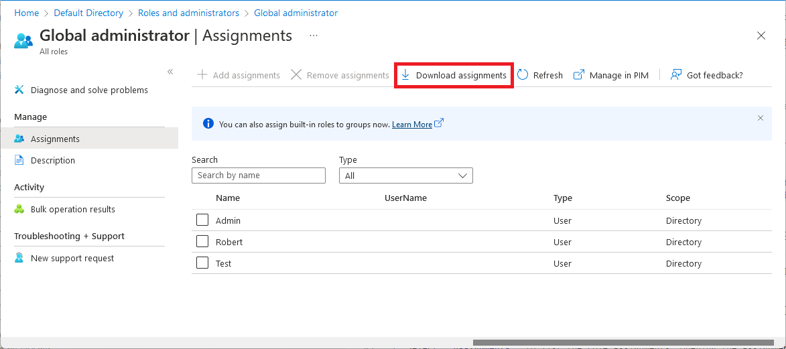

# List Azure AD role assignments

This article describes how to list roles you have assigned in Azure Active Directory (Azure AD). In Azure Active Directory (Azure AD), roles can be assigned at an organization-wide scope or with a single-application scope.

- Role assignments at the organization-wide scope are added to and can be seen in the list of single application role assignments.
- Role assignments at the single application scope aren't added to and can't be seen in the list of organization-wide scoped assignments.

## Prerequisites

- AzureADPreview module when using PowerShell
- Admin consent when using Graph explorer for Microsoft Graph API

For more information, see [Prerequisites to use PowerShell or Graph Explorer](prerequisites.md).

## Azure portal

This procedure describes how to list role assignments with organization-wide scope.

1. Sign in to the [Azure AD admin center](https://aad.portal.azure.com).
1. Select **Azure Active Directory**, select **Roles and administrators**, and then select a role to open it and view its properties.
1. Select **Assignments** to list the role assignments.

    

### List my role assignments

It's easy to list your own permissions as well. Select **Your Role** on the **Roles and administrators** page to see the roles that are currently assigned to you.

### Download role assignments

To download all assignments for a specific role, on the **Roles and administrators** page, select a role, and then select **Download role assignments**. A CSV file that lists assignments at all scopes for that role is downloaded.



### List role assignments with single-application scope

This section describes how to list role assignments with single-application scope. This feature is currently in public preview.

1. Sign in to the [Azure AD admin center](https://aad.portal.azure.com).
1. Select **App registrations**, and then select the app registration to view its properties. You might have to select **All applications** to see the complete list of app registrations in your Azure AD organization.

    

1. In the app registration, select **Roles and administrators**, and then select a role to view its properties.

    

1. Select **Assignments** to list the role assignments. Opening the assignments page from within the app registration shows you the role assignments that are scoped to this Azure AD resource.

    


## PowerShell

This section describes viewing assignments of a role with organization-wide scope. This article uses the [Azure Active Directory PowerShell Version 2](/powershell/module/azuread/#directory_roles) module. To view single-application scope assignments using PowerShell, you can use the cmdlets in [Assign custom roles with PowerShell](custom-assign-powershell.md).

Example of listing the role assignments.

``` PowerShell
# Fetch list of all directory roles with object ID
Get-AzureADDirectoryRole

# Fetch a specific directory role by ID
$role = Get-AzureADDirectoryRole -ObjectId "5b3fe201-fa8b-4144-b6f1-875829ff7543"

# Fetch role membership for a role
Get-AzureADDirectoryRoleMember -ObjectId $role.ObjectId | Get-AzureADUser
```

## Microsoft Graph API

This section describes how to list role assignments with organization-wide scope.  To list single-application scope role assignments using Graph API, you can use the operations in [Assign custom roles with Graph API](custom-assign-graph.md).

HTTP request to get a role assignment for a given role definition.

GET

``` HTTP
https://graph.microsoft.com/beta/roleManagement/directory/roleAssignments&$filter=roleDefinitionId eq ‘<object-id-or-template-id-of-role-definition>’
```

Response

``` HTTP
HTTP/1.1 200 OK
{
    "id":"CtRxNqwabEKgwaOCHr2CGJIiSDKQoTVJrLE9etXyrY0-1",
    "principalId":"ab2e1023-bddc-4038-9ac1-ad4843e7e539",
    "roleDefinitionId":"3671d40a-1aac-426c-a0c1-a3821ebd8218",
    "resourceScopes":["/"]
}
```

## Next steps

* Feel free to share with us on the [Azure AD administrative roles forum](https://feedback.azure.com/forums/169401-azure-active-directory?category_id=166032).
* For more about role permissions, see [Azure AD built-in roles](permissions-reference.md).
* For default user permissions, see a [comparison of default guest and member user permissions](../fundamentals/users-default-permissions.md).
