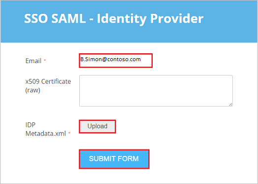
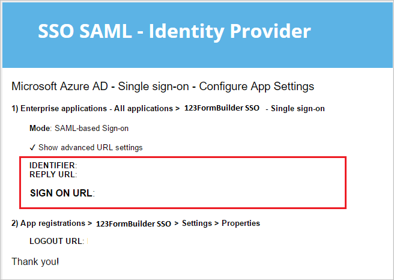

# Tutorial: Microsoft Entra single sign-on (SSO) integration with 123FormBuilder SSO

In this tutorial, you'll learn how to integrate 123FormBuilder SSO with Microsoft Entra ID. When you integrate 123FormBuilder SSO with Microsoft Entra ID, you can:

* Control in Microsoft Entra ID who has access to 123FormBuilder SSO.
* Enable your users to be automatically signed in to 123FormBuilder SSO with their Microsoft Entra accounts.
* Manage your accounts in one central location.

## Prerequisites

To get started, you need the following items:

* A Microsoft Entra subscription. If you don't have a subscription, you can get a [free account](https://azure.microsoft.com/free/).
* 123FormBuilder SSO single sign-on (SSO) enabled subscription.

## Scenario description

In this tutorial, you configure and test Microsoft Entra SSO in a test environment.

* 123FormBuilder SSO supports **SP and IDP** initiated SSO.
* 123FormBuilder SSO supports **Just In Time** user provisioning.

## Add 123FormBuilder SSO from the gallery

To configure the integration of 123FormBuilder SSO into Microsoft Entra ID, you need to add 123FormBuilder SSO from the gallery to your list of managed SaaS apps.

1. Sign in to the [Microsoft Entra admin center](https://entra.microsoft.com) as at least a [Cloud Application Administrator](../roles/permissions-reference.md#cloud-application-administrator).
1. Browse to **Identity** > **Applications** > **Enterprise applications** > **New application**.
1. In the **Add from the gallery** section, type **123FormBuilder SSO** in the search box.
1. Select **123FormBuilder SSO** from results panel and then add the app. Wait a few seconds while the app is added to your tenant.

 Alternatively, you can also use the [Enterprise App Configuration Wizard](https://portal.office.com/AdminPortal/home?Q=Docs#/azureadappintegration). In this wizard, you can add an application to your tenant, add users/groups to the app, assign roles, as well as walk through the SSO configuration as well. [Learn more about Microsoft 365 wizards.](/microsoft-365/admin/misc/azure-ad-setup-guides)

## Configure and test Microsoft Entra SSO for 123FormBuilder SSO

Configure and test Microsoft Entra SSO with 123FormBuilder SSO using a test user called **B.Simon**. For SSO to work, you need to establish a link relationship between a Microsoft Entra user and the related user in 123FormBuilder SSO.

To configure and test Microsoft Entra SSO with 123FormBuilder SSO, perform the following steps:

1. **[Configure Microsoft Entra SSO](#configure-azure-ad-sso)** - to enable your users to use this feature.
    1. **[Create a Microsoft Entra test user](#create-an-azure-ad-test-user)** - to test Microsoft Entra single sign-on with B.Simon.
    1. **[Assign the Microsoft Entra test user](#assign-the-azure-ad-test-user)** - to enable B.Simon to use Microsoft Entra single sign-on.
1. **[Configure 123FormBuilder SSO](#configure-123formbuilder-sso)** - to configure the single sign-on settings on application side.
    1. **[Create 123FormBuilder SSO test user](#create-123formbuilder-sso-test-user)** - to have a counterpart of B.Simon in 123FormBuilder SSO that is linked to the Microsoft Entra representation of user.
1. **[Test SSO](#test-sso)** - to verify whether the configuration works.

## Configure Microsoft Entra SSO

Follow these steps to enable Microsoft Entra SSO.

1. Sign in to the [Microsoft Entra admin center](https://entra.microsoft.com) as at least a [Cloud Application Administrator](../roles/permissions-reference.md#cloud-application-administrator).
1. Browse to **Identity** > **Applications** > **Enterprise applications** > **123FormBuilder SSO** > **Single sign-on**.
1. On the **Select a single sign-on method** page, select **SAML**.
1. On the **Set up single sign-on with SAML** page, click the pencil icon for **Basic SAML Configuration** to edit the settings.

   

1. On the **Basic SAML Configuration** section, If you wish to configure the application in **IDP** initiated mode, perform the following steps:

    a. In the **Identifier** text box, type a URL using the following pattern: `https://www.123formbuilder.com/saml/azure_ad/<TENANT_ID>/metadata`

    b. In the **Reply URL** text box, type a URL using the following pattern: `https://www.123formbuilder.com/saml/azure_ad/<TENANT_ID>/acs`

5. Click **Set additional URLs** and perform the following step if you wish to configure the application in **SP** initiated mode:

    In the **Sign-on URL** text box, type a URL using the following pattern: `https://www.123formbuilder.com/saml/azure_ad/<TENANT_ID>/sso`

	> [!NOTE]
	> These values are not real. You'll need to update these value from actual URLs and Identifier which is explained later in the tutorial.

1. On the **Setup single sign-on with SAML** page, in the **SAML Signing Certificate** section,  find **Federation Metadata XML** and select **Download** to download the certificate and save it on your computer.

	

1. On the **Set up 123FormBuilder SSO** section, copy the appropriate URL(s) based on your requirement.

	

### Create a Microsoft Entra test user

In this section, you'll create a test user called B.Simon.

1. Sign in to the [Microsoft Entra admin center](https://entra.microsoft.com) as at least a [User Administrator](../roles/permissions-reference.md#user-administrator).
1. Browse to **Identity** > **Users** > **All users**.
1. Select **New user** > **Create new user**, at the top of the screen.
1. In the **User** properties, follow these steps:
   1. In the **Display name** field, enter `B.Simon`.  
   1. In the **User principal name** field, enter the username@companydomain.extension. For example, `B.Simon@contoso.com`.
   1. Select the **Show password** check box, and then write down the value that's displayed in the **Password** box.
   1. Select **Review + create**.
1. Select **Create**.

### Assign the Microsoft Entra test user

In this section, you'll enable B.Simon to use single sign-on by granting access to 123FormBuilder SSO.

1. Sign in to the [Microsoft Entra admin center](https://entra.microsoft.com) as at least a [Cloud Application Administrator](../roles/permissions-reference.md#cloud-application-administrator).
1. Browse to **Identity** > **Applications** > **Enterprise applications** > **123FormBuilder SSO**.
1. In the app's overview page, select **Users and groups**.
1. Select **Add user/group**, then select **Users and groups** in the **Add Assignment** dialog.
   1. In the **Users and groups** dialog, select **B.Simon** from the Users list, then click the **Select** button at the bottom of the screen.
   1. If you are expecting a role to be assigned to the users, you can select it from the **Select a role** dropdown. If no role has been set up for this app, you see "Default Access" role selected.
   1. In the **Add Assignment** dialog, click the **Assign** button.

## Configure 123FormBuilder SSO

1. To configure single sign-on on **123FormBuilder SSO** side, go to [https://www.123formbuilder.com/form-2709121/](https://www.123formbuilder.com/form-2709121/) and perform the following steps:

	 

	a. In the **Email** textbox, type the email of the user like `B.Simon@Contoso.com`.

	b. Click **Upload** and browse the downloaded Metadata XML file, which you have downloaded previously.

	c. Click **SUBMIT FORM**.

2. On the **Microsoft Entra ID - Single sign-on - Configure App Settings** perform the following steps:

	

	a. If you wish to configure the application in **IDP initiated mode**, copy the **IDENTIFIER** value for your instance and paste it in **Identifier** textbox in **Basic SAML Configuration** section.

	b. If you wish to configure the application in **IDP initiated mode**, copy the **REPLY URL** value for your instance and paste it in **Reply URL** textbox in **Basic SAML Configuration** section.

	c. If you wish to configure the application in **SP initiated mode**, copy the **SIGN ON URL** value for your instance and paste it in **Sign On URL** textbox in **Basic SAML Configuration** section.

### Create 123FormBuilder SSO test user

In this section, a user called Britta Simon is created in 123FormBuilder SSO. 123FormBuilder SSO supports just-in-time user provisioning, which is enabled by default. There is no action item for you in this section. If a user doesn't already exist in 123FormBuilder SSO, a new one is created after authentication.

## Test SSO 

In this section, you test your Microsoft Entra single sign-on configuration with following options. 

#### SP initiated:

* Click on **Test this application**, this will redirect to 123FormBuilder SSO Sign on URL where you can initiate the login flow.  

* Go to 123FormBuilder SSO Sign-on URL directly and initiate the login flow from there.

#### IDP initiated:

* Click on **Test this application**, and you should be automatically signed in to the 123FormBuilder SSO for which you set up the SSO. 

You can also use Microsoft My Apps to test the application in any mode. When you click the 123FormBuilder SSO tile in the My Apps, if configured in SP mode you would be redirected to the application sign on page for initiating the login flow and if configured in IDP mode, you should be automatically signed in to the 123FormBuilder SSO for which you set up the SSO. For more information about the My Apps, see [Introduction to the My Apps](https://support.microsoft.com/account-billing/sign-in-and-start-apps-from-the-my-apps-portal-2f3b1bae-0e5a-4a86-a33e-876fbd2a4510).

## Next steps

Once you configure 123FormBuilder SSO you can enforce session control, which protects exfiltration and infiltration of your organization’s sensitive data in real time. Session control extends from Conditional Access. [Learn how to enforce session control with Microsoft Defender for Cloud Apps](/cloud-app-security/proxy-deployment-aad).
