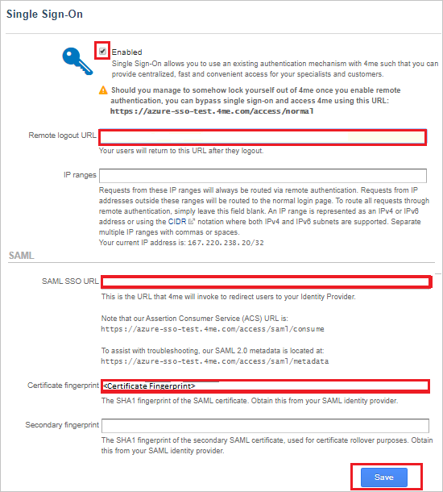

# Tutorial: Azure Active Directory single sign-on (SSO) integration with 4me

In this tutorial, you'll learn how to integrate 4me with Azure Active Directory (Azure AD). When you integrate 4me with Azure AD, you can:

* Control in Azure AD who has access to 4me.
* Enable your users to be automatically signed-in to 4me with their Azure AD accounts.
* Manage your accounts in one central location - the Azure portal.

## Prerequisites

To get started, you need the following items:

* An Azure AD subscription. If you don't have a subscription, you can get a [free account](https://azure.microsoft.com/free/).
* 4me single sign-on (SSO) enabled subscription.

## Scenario description

In this tutorial, you configure and test Azure AD SSO in a test environment.

* 4me supports **SP** initiated SSO.
* 4me supports **Just In Time** user provisioning.

## Add 4me from the gallery

To configure the integration of 4me into Azure AD, you need to add 4me from the gallery to your list of managed SaaS apps.

1. Sign in to the Azure portal using either a work or school account, or a personal Microsoft account.
1. On the left navigation pane, select the **Azure Active Directory** service.
1. Navigate to **Enterprise Applications** and then select **All Applications**.
1. To add new application, select **New application**.
1. In the **Add from the gallery** section, type **4me** in the search box.
1. Select **4me** from results panel and then add the app. Wait a few seconds while the app is added to your tenant.

## Configure and test Azure AD SSO for 4me

Configure and test Azure AD SSO with 4me using a test user called **B.Simon**. For SSO to work, you need to establish a link relationship between an Azure AD user and the related user in 4me.

To configure and test Azure AD SSO with 4me, complete the following building blocks:

1. **[Configure Azure AD SSO](#configure-azure-ad-sso)** - to enable your users to use this feature.
    1. **[Create an Azure AD test user](#create-an-azure-ad-test-user)** - to test Azure AD single sign-on with B.Simon.
    1. **[Assign the Azure AD test user](#assign-the-azure-ad-test-user)** - to enable B.Simon to use Azure AD single sign-on.
1. **[Configure 4me SSO](#configure-4me-sso)** - to configure the single sign-on settings on application side.
    1. **[Create 4me test user](#create-4me-test-user)** - to have a counterpart of B.Simon in 4me that is linked to the Azure AD representation of user.
1. **[Test SSO](#test-sso)** - to verify whether the configuration works.

## Configure Azure AD SSO

Follow these steps to enable Azure AD SSO in the Azure portal.

1. In the Azure portal, on the **4me** application integration page, find the **Manage** section and select **single sign-on**.
1. On the **Select a single sign-on method** page, select **SAML**.
1. On the **Set up single sign-on with SAML** page, click the pencil icon for **Basic SAML Configuration** to edit the settings.

   

1. On the **Basic SAML Configuration** section, enter the values for the following fields:

	a. In the **Sign on URL** text box, type a URL using one of the following patterns:

	| Environment| URL|
	|---|---|
	| PRODUCTION | `https://<SUBDOMAIN>.4me.com`|
	| QA| `https://<SUBDOMAIN>.4me.qa`|
	| | |

    b. In the **Identifier (Entity ID)** text box, type a URL using one of the following patterns:

	| Environment| URL|
	|---|---|
	| PRODUCTION | `https://<SUBDOMAIN>.4me.com`|
	| QA| `https://<SUBDOMAIN>.4me.qa`|
	| | |

	> [!NOTE]
	> These values are not real. Update these values with the actual Sign on URL and Identifier. Contact [4me Client support team](mailto:support@4me.com) to get these values. You can also refer to the patterns shown in the **Basic SAML Configuration** section in the Azure portal.

1. 4me application expects the SAML assertions in a specific format, which requires you to add custom attribute mappings to your SAML token attributes configuration. The following screenshot shows the list of default attributes.

	

1. In addition to above, 4me application expects few more attributes to be passed back in SAML response which are shown below. These attributes are also pre populated but you can review them as per your requirements.

	| Name | Source Attribute|
	| ---------------| --------------- |
	| first_name | user.givenname |
	| last_name | user.surname |

1. In the **SAML Signing Certificate** section, click **Edit** button to open **SAML Signing Certificate** dialog.

	

1. In the **SAML Signing Certificate** section, copy the **THUMBPRINT** and save it on your computer.

    

1. On the **Set up 4me** section, copy the appropriate URL(s) based on your requirement.

	

### Create an Azure AD test user

In this section, you'll create a test user in the Azure portal called B.Simon.

1. From the left pane in the Azure portal, select **Azure Active Directory**, select **Users**, and then select **All users**.
1. Select **New user** at the top of the screen.
1. In the **User** properties, follow these steps:
   1. In the **Name** field, enter `B.Simon`.  
   1. In the **User name** field, enter the username@companydomain.extension. For example, `B.Simon@contoso.com`.
   1. Select the **Show password** check box, and then write down the value that's displayed in the **Password** box.
   1. Click **Create**.

### Assign the Azure AD test user

In this section, you'll enable B.Simon to use Azure single sign-on by granting access to 4me.

1. In the Azure portal, select **Enterprise Applications**, and then select **All applications**.
1. In the applications list, select **4me**.
1. In the app's overview page, find the **Manage** section and select **Users and groups**.
1. Select **Add user**, then select **Users and groups** in the **Add Assignment** dialog.
1. In the **Users and groups** dialog, select **B.Simon** from the Users list, then click the **Select** button at the bottom of the screen.
1. If you are expecting a role to be assigned to the users, you can select it from the **Select a role** dropdown. If no role has been set up for this app, you see "Default Access" role selected.
1. In the **Add Assignment** dialog, click the **Assign** button.

## Configure 4me SSO

1. In a different web browser window, sign in to 4me as an Administrator.

1. On the top left, click on **Settings** logo and on the left side bar click **Single Sign-On**.

    

1. On the **Single Sign-On** page, perform the following steps:

	

	a. Select the **Enabled** option.

	b. In the **Remote logout URL** textbox, paste the value of **Logout URL**, which you have copied from the Azure portal.

	c. Under **SAML** section, in the **SAML SSO URL** textbox, paste the value of **Login URL**, which you have copied from the Azure portal.

	d. In the **Certificate fingerprint** textbox, paste the **THUMBPRINT** value separated by a colon in duplets order (AA:BB:CC:DD:EE:FF:GG:HH:II), which you have copied from the Azure portal.

	e. Click **Save**.

### Create 4me test user

In this section, a user called Britta Simon is created in 4me. 4me supports just-in-time user provisioning, which is enabled by default. There is no action item for you in this section. If a user doesn't already exist in 4me, a new one is created after authentication.

> [!Note]
> If you need to create a user manually, contact [4me support team](mailto:support@4me.com).

## Test SSO 

In this section, you test your Azure AD single sign-on configuration with following options. 

* Click on **Test this application** in Azure portal. This will redirect to 4me Sign-on URL where you can initiate the login flow. 

* Go to 4me Sign-on URL directly and initiate the login flow from there.

* You can use Microsoft My Apps. When you click the 4me tile in the My Apps, this will redirect to 4me Sign-on URL. For more information about the My Apps, see [Introduction to the My Apps](https://docs.microsoft.com/azure/active-directory/active-directory-saas-access-panel-introduction).

## Next steps

Once you configure 4me you can enforce session control, which protects exfiltration and infiltration of your organization’s sensitive data in real time. Session control extends from Conditional Access. [Learn how to enforce session control with Microsoft Cloud App Security](https://docs.microsoft.com/cloud-app-security/proxy-deployment-any-app).
