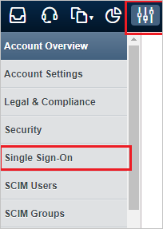
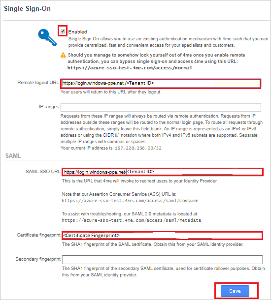

# Tutorial: Azure Active Directory integration with 4me

In this tutorial, you learn how to integrate 4me with Azure Active Directory (Azure AD).
Integrating 4me with Azure AD provides you with the following benefits:

* You can control in Azure AD who has access to 4me.
* You can enable your users to be automatically signed-in to 4me (Single Sign-On) with their Azure AD accounts.
* You can manage your accounts in one central location - the Azure portal.

If you want to know more details about SaaS app integration with Azure AD, see [What is application access and single sign-on with Azure Active Directory](https://docs.microsoft.com/azure/active-directory/active-directory-appssoaccess-whatis).
If you don't have an Azure subscription, [create a free account](https://azure.microsoft.com/free/) before you begin.

## Prerequisites

To configure Azure AD integration with 4me, you need the following items:

* An Azure AD subscription. If you don't have an Azure AD environment, you can get one-month trial [here](https://azure.microsoft.com/pricing/free-trial/)
* 4me single sign-on enabled subscription

## Scenario description

In this tutorial, you configure and test Azure AD single sign-on in a test environment.

* 4me supports **SP** initiated SSO
* 4me supports **Just In Time** user provisioning

## Adding 4me from the gallery

To configure the integration of 4me into Azure AD, you need to add 4me from the gallery to your list of managed SaaS apps.

**To add 4me from the gallery, perform the following steps:**

1. In the **[Azure portal](https://portal.azure.com)**, on the left navigation panel, click **Azure Active Directory** icon.

	

2. Navigate to **Enterprise Applications** and then select the **All Applications** option.

	

3. To add new application, click **New application** button on the top of dialog.

	

4. In the search box, type **4me**, select **4me** from result panel then click **Add** button to add the application.

	 

## Configure and test Azure AD single sign-on

In this section, you configure and test Azure AD single sign-on with 4me based on a test user called **Britta Simon**.
For single sign-on to work, a link relationship between an Azure AD user and the related user in 4me needs to be established.

To configure and test Azure AD single sign-on with 4me, you need to complete the following building blocks:

1. **[Configure Azure AD Single Sign-On](#configure-azure-ad-single-sign-on)** - to enable your users to use this feature.
2. **[Configure 4me Single Sign-On](#configure-4me-single-sign-on)** - to configure the Single Sign-On settings on application side.
3. **[Create an Azure AD test user](#create-an-azure-ad-test-user)** - to test Azure AD single sign-on with Britta Simon.
4. **[Assign the Azure AD test user](#assign-the-azure-ad-test-user)** - to enable Britta Simon to use Azure AD single sign-on.
5. **[Create 4me test user](#create-4me-test-user)** - to have a counterpart of Britta Simon in 4me that is linked to the Azure AD representation of user.
6. **[Test single sign-on](#test-single-sign-on)** - to verify whether the configuration works.

### Configure Azure AD single sign-on

In this section, you enable Azure AD single sign-on in the Azure portal.

To configure Azure AD single sign-on with 4me, perform the following steps:

1. In the [Azure portal](https://portal.azure.com/), on the **4me** application integration page, select **Single sign-on**.

    

2. On the **Select a Single sign-on method** dialog, select **SAML/WS-Fed** mode to enable single sign-on.

    

3. On the **Set up Single Sign-On with SAML** page, click **Edit** icon to open **Basic SAML Configuration** dialog.

	

4. On the **Basic SAML Configuration** section, perform the following steps:

    

	a. In the **Sign on URL** text box, type a URL using the following pattern:

	| Environment| URL|
	|---|---|
	| PRODUCTION | `https://<SUBDOMAIN>.4me.com`|
	| QA| `https://<SUBDOMAIN>.4me.qa`|
	| | |

    b. In the **Identifier (Entity ID)** text box, type a URL using the following pattern:

	| Environment| URL|
	|---|---|
	| PRODUCTION | `https://<SUBDOMAIN>.4me.com`|
	| QA| `https://<SUBDOMAIN>.4me.qa`|
	| | |

	> [!NOTE]
	> These values are not real. Update these values with the actual Sign on URL and Identifier. Contact [4me Client support team](mailto:support@4me.com) to get these values. You can also refer to the patterns shown in the **Basic SAML Configuration** section in the Azure portal.

5. 4me application expects the SAML assertions in a specific format. Configure the following claims for this application. You can manage the values of these attributes from the **User Attributes** section on application integration page. On the **Set up Single Sign-On with SAML** page, click **Edit** button to open **User Attributes** dialog.

	

6. In the **User Claims** section on the **User Attributes** dialog, edit the claims by using **Edit icon** or add the claims by using **Add new claim** to configure SAML token attribute as shown in the image above and perform the following steps:

	| Name | Source Attribute|
	| ---------------| --------------- |
	| first_name | user.givenname |
	| last_name | user.surname |
	| | |

	a. Click **Add new claim** to open the **Manage user claims** dialog.

	

	

	b. In the **Name** textbox, type the attribute name shown for that row.

	c. Leave the **Namespace** blank.

	d. Select Source as **Attribute**.

	e. From the **Source attribute** list, type the attribute value shown for that row.

	f. Click **Ok**

	g. Click **Save**.

7. In the **SAML Signing Certificate** section, click **Edit** button to open **SAML Signing Certificate** dialog.

	

8. In the **SAML Signing Certificate** section, copy the **THUMBPRINT** and save it on your computer.

    

9. On the **Set up 4me** section, copy the appropriate URL(s) as per your requirement.

	

	a. Login URL

	b. Azure Ad Identifier

	c. Logout URL

### Configure 4me Single Sign-On

1. In a different web browser window, login to 4me as an Administrator.

2. On the top left, click on **Settings** logo and on the left side bar click **Single Sign-On**.

    

3. On the **Single Sign-On** page, perform the following steps:

	

	a. Select the **Enabled** option.

	b. In the **Remote logout URL** textbox, paste the value of **Logout URL**, which you have copied from the Azure portal.

	c. Under **SAML** section, in the **SAML SSO URL** textbox, paste the value of **Login URL**, which you have copied from the Azure portal.

	d. In the **Certificate fingerprint** textbox, paste the **THUMBPRINT** value separated by a colon in duplets order (AA:BB:CC:DD:EE:FF:GG:HH:II), which you have copied from the Azure portal.

	e. Click **Save**.

### Create an Azure AD test user

The objective of this section is to create a test user in the Azure portal called Britta Simon.

1. In the Azure portal, in the left pane, select **Azure Active Directory**, select **Users**, and then select **All users**.

    

2. Select **New user** at the top of the screen.

    

3. In the User properties, perform the following steps.

    

    a. In the **Name** field enter **BrittaSimon**.
  
    b. In the **User name** field type **brittasimon\@yourcompanydomain.extension**  
    For example, BrittaSimon@contoso.com

    c. Select **Show password** check box, and then write down the value that's displayed in the Password box.

    d. Click **Create**.

### Assign the Azure AD test user

In this section, you enable Britta Simon to use Azure single sign-on by granting access to 4me.

1. In the Azure portal, select **Enterprise Applications**, select **All applications**, then select **4me**.

	

2. In the applications list, select **4me**.

	

3. In the menu on the left, select **Users and groups**.

    

4. Click the **Add user** button, then select **Users and groups** in the **Add Assignment** dialog.

    

5. In the **Users and groups** dialog select **Britta Simon** in the Users list, then click the **Select** button at the bottom of the screen.

6. If you are expecting any role value in the SAML assertion then in the **Select Role** dialog select the appropriate role for the user from the list, then click the **Select** button at the bottom of the screen.

7. In the **Add Assignment** dialog click the **Assign** button.

### Create 4me test user

In this section, a user called Britta Simon is created in 4me. 4me supports just-in-time user provisioning, which is enabled by default. There is no action item for you in this section. If a user doesn't already exist in 4me, a new one is created after authentication.

> [!Note]
> If you need to create a user manually, contact [4me support team](mailto:support@4me.com).

### Test single sign-on

In this section, you test your Azure AD single sign-on configuration using the Access Panel.

When you click the 4me tile in the Access Panel, you should be automatically signed in to the 4me for which you set up SSO. For more information about the Access Panel, see [Introduction to the Access Panel](https://docs.microsoft.com/azure/active-directory/active-directory-saas-access-panel-introduction).

## Additional Resources

- [List of Tutorials on How to Integrate SaaS Apps with Azure Active Directory](https://docs.microsoft.com/azure/active-directory/active-directory-saas-tutorial-list)

- [What is application access and single sign-on with Azure Active Directory?](https://docs.microsoft.com/azure/active-directory/active-directory-appssoaccess-whatis)

- [What is Conditional Access in Azure Active Directory?](https://docs.microsoft.com/azure/active-directory/conditional-access/overview)
